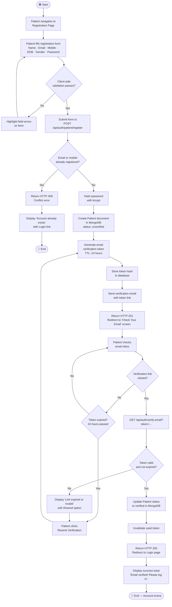
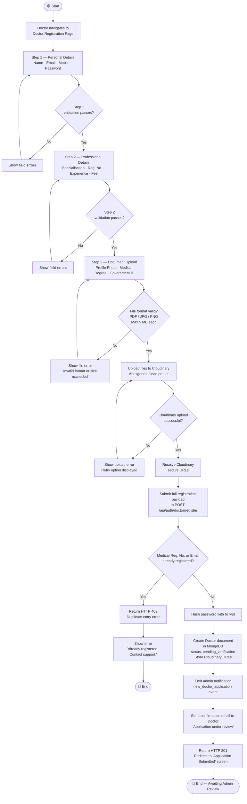
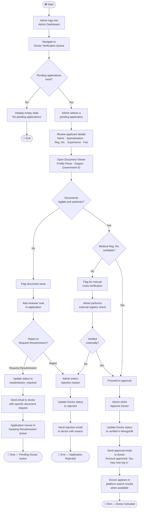
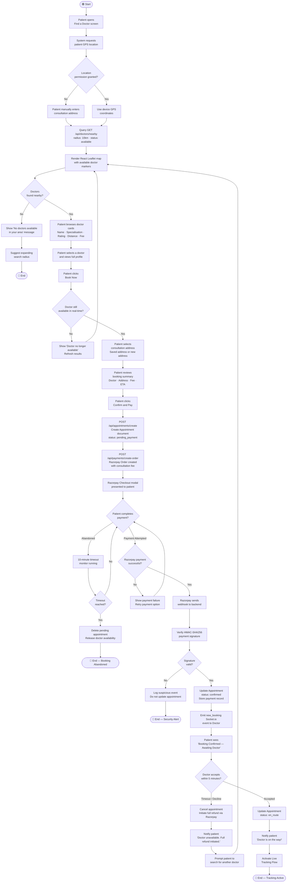
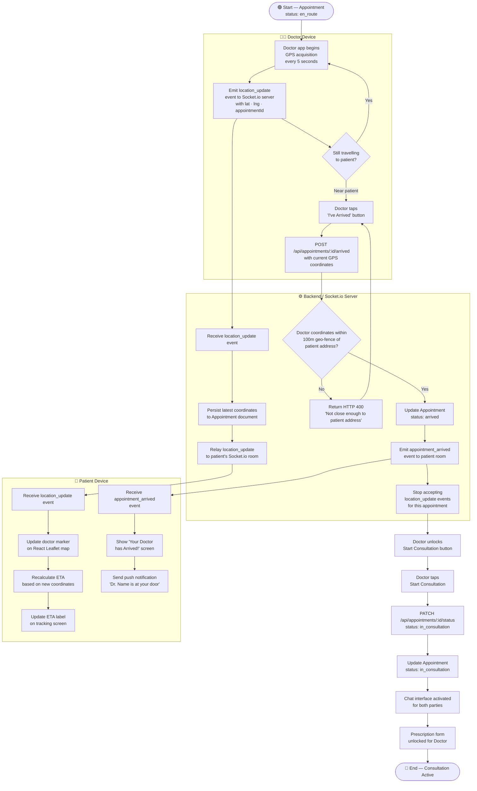
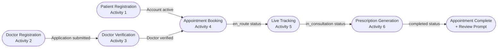

# DocDock — Activity Diagram Specification

---

## Table of Contents

1. [Introduction](#1-introduction)
2. [Notation Guide](#2-notation-guide)
3. [Activity 1 — Patient Registration](#3-activity-1--patient-registration)
4. [Activity 2 — Doctor Registration](#4-activity-2--doctor-registration)
5. [Activity 3 — Doctor Verification (Admin Flow)](#5-activity-3--doctor-verification-admin-flow)
6. [Activity 4 — Appointment Booking](#6-activity-4--appointment-booking)
7. [Activity 5 — Live Doctor Tracking](#7-activity-5--live-doctor-tracking)
8. [Activity 6 — Prescription Generation](#8-activity-6--prescription-generation)
9. [Cross-Flow Integration Summary](#9-cross-flow-integration-summary)

---

## 1. Introduction

This document specifies the activity flows for the DocDock platform using UML-compliant activity diagrams rendered in Mermaid. Each activity diagram models the behaviour of a key system process from initiation to completion, capturing decision nodes, parallel activities, swimlane responsibilities, and exception paths.

These diagrams serve as the primary reference for:

- Frontend interaction design and UX wireframing
- Backend API endpoint sequencing
- QA test case derivation
- Stakeholder walkthroughs and sprint planning

Each section contains a description of the flow, a swimlane responsibility table, a Mermaid diagram, and a step-by-step narrative.

---

## 2. Notation Guide

| Symbol | Mermaid Representation | Meaning |
|---|---|---|
| Filled circle | `([Start])` | Initial node — flow begins |
| Rounded rectangle | `[Action]` | Activity / action step |
| Diamond | `{Decision}` | Decision node — branching |
| Double bar | `==>` fork/join | Fork (parallel split) / Join (parallel merge) |
| Bold border circle | `([End])` | Final node — flow terminates |
| Swimlane | `subgraph` | Partition by responsible actor |

---

## 3. Activity 1 — Patient Registration

### 3.1 Overview

The Patient Registration flow governs the process by which a new user creates a verified DocDock patient account. The flow encompasses form submission, server-side validation, account creation, email verification, and final account activation. It is the entry point for all patient-facing features.

### 3.2 Swimlane Responsibilities

| Lane | Actor | Responsibility |
|---|---|---|
| Patient | A-01 | Form input, email verification action |
| Frontend | System (Next.js) | Client-side validation, routing, UI feedback |
| Backend API | System (Express.js) | Business logic, JWT issuance, database writes |
| Database | System (MongoDB) | Persistence of patient document |
| Email Service | System | Dispatch of verification email |

### 3.3 Activity Diagram

### 3.4 Flow Narrative

1. The patient opens the registration page and fills in all required fields.
2. The frontend validates fields client-side (format, required, password strength) before submission.
3. The backend checks for duplicate email or mobile number. If a duplicate is found, a 409 Conflict is returned and the patient is offered a login link.
4. The password is hashed using bcrypt (minimum 12 salt rounds). A Patient document is inserted into MongoDB with `status: unverified`.
5. A time-limited (24-hour) email verification token is generated, hashed, and stored. The raw token is embedded in a verification link sent to the patient.
6. The patient clicks the link in the email. The backend validates the token against the stored hash and expiry.
7. On success, the patient's status is updated to `verified`, the token is invalidated, and the patient is redirected to login.
8. If the link has expired, the patient can request a new one, restarting the token generation and email dispatch sub-flow.

---

## 4. Activity 2 — Doctor Registration

### 4.1 Overview

Doctor Registration is a multi-step flow requiring identity documentation upload and a mandatory admin verification gate before the doctor can access platform features. This flow is more complex than patient registration due to KYC requirements and Cloudinary document storage.

### 4.2 Swimlane Responsibilities

| Lane | Actor | Responsibility |
|---|---|---|
| Doctor | A-02 | Form input, document upload |
| Frontend | System (Next.js) | Multi-step form, file validation, progress UI |
| Backend API | System (Express.js) | Validation, document processing, DB write |
| Cloudinary | External Storage | Secure document storage, URL generation |
| Database | System (MongoDB) | Doctor document persistence |
| Admin | A-03 | Application review and decision |

### 4.3 Activity Diagram

### 4.4 Flow Narrative

1. The doctor completes a three-step registration wizard: personal details, professional credentials, and document uploads.
2. Each step is validated independently client-side before the next step is unlocked.
3. Documents (profile photo, medical degree, government ID) are uploaded directly to Cloudinary using a signed upload preset, returning secure URLs.
4. The backend checks for duplicate email or medical registration number. Duplicates are rejected with a 409 error.
5. The password is bcrypt-hashed, and a Doctor document is created in MongoDB with `status: pending_verification` and Cloudinary document URLs stored.
6. An admin notification event is emitted, and the doctor receives a confirmation email advising them that their application is under review.
7. The doctor's account remains locked until Admin completes verification (Activity 3).

---

## 5. Activity 3 — Doctor Verification (Admin Flow)

### 5.1 Overview

The Admin Verification flow is the gate-keeping process by which a DocDock administrator reviews a doctor's application, inspects uploaded credentials, and either approves or rejects the doctor's account. This flow directly determines whether a doctor gains platform access.

### 5.2 Swimlane Responsibilities

| Lane | Actor | Responsibility |
|---|---|---|
| Admin | A-03 | Application review, decision-making |
| Admin Dashboard | System (Next.js) | Verification UI, document viewer |
| Backend API | System (Express.js) | Status update, notification dispatch |
| Database | System (MongoDB) | Doctor status persistence |
| Email Service | System | Outcome notification to doctor |

### 5.3 Activity Diagram

### 5.4 Flow Narrative

1. Admin logs into the Dashboard and navigates to the verification queue, which lists all `pending_verification` and `resubmission_required` doctor applications.
2. Admin selects an application and reviews the doctor's professional details alongside their uploaded documents in an integrated document viewer.
3. If documents are unclear or insufficient, Admin can either request a resubmission (specific document re-upload) or outright reject with a mandatory reason.
4. If the medical registration number cannot be automatically verified, Admin performs an external check against a medical registry.
5. On approval, the doctor's status is updated to `verified`, an approval email is dispatched, and the doctor can now log in and appear in patient search results when they set themselves as available.
6. All admin decisions (approve, reject, request resubmission) are recorded in the Audit Log with the Admin's ID, timestamp, and rationale.

---

## 6. Activity 4 — Appointment Booking

### 6.1 Overview

The Appointment Booking flow is the central transactional flow of the DocDock platform. It covers doctor discovery, selection, address confirmation, Razorpay payment processing, and the post-payment doctor acceptance sequence. This flow involves the most actors and has the highest number of exception paths.

### 6.2 Swimlane Responsibilities

| Lane | Actor | Responsibility |
|---|---|---|
| Patient | A-01 | Doctor search, address selection, payment |
| Doctor | A-02 | Appointment acceptance or decline |
| Frontend | System (Next.js) | Map rendering, booking UI, payment modal |
| Backend API | System (Express.js) | Order creation, signature verification, status management |
| Razorpay | External Payment | Checkout, payment capture, webhook dispatch |
| Socket.io | System (Real-time) | Live availability updates, booking notification |
| Database | System (MongoDB) | Appointment document lifecycle |

### 6.3 Activity Diagram

### 6.4 Flow Narrative

1. The patient opens the Doctor Search screen. The system requests GPS access; if denied, the patient manually enters an address.
2. The backend queries doctors who are `available` and `verified` within a 10 km radius using MongoDB geo-queries. Results render on a React Leaflet map and as a list.
3. The patient selects a doctor, reviews their profile, and clicks Book Now. The system re-validates the doctor's availability in real time via Socket.io before proceeding.
4. The patient selects a consultation address and confirms the booking summary. An Appointment document is created in MongoDB with `status: pending_payment`.
5. A Razorpay Order is created server-side and the checkout modal is presented. A 10-minute timeout is started; the appointment is cancelled if payment is not completed.
6. On payment completion, Razorpay's webhook delivers the payment result to the backend. The backend verifies the HMAC-SHA256 signature. On verification success, the appointment is updated to `confirmed`.
7. A Socket.io event notifies the doctor of the new booking. The doctor has 5 minutes to accept or decline.
8. If accepted, the appointment moves to `en_route` and the Live Tracking flow is activated. If declined or timed out, a full refund is initiated and the patient is prompted to find another doctor.

---

## 7. Activity 5 — Live Doctor Tracking

### 7.1 Overview

The Live Tracking flow activates once a doctor accepts an appointment. It governs the real-time broadcast of the doctor's GPS location to the patient, the map rendering and ETA updates on the patient side, and the lifecycle transitions through `en_route` → `arrived` → `in_consultation`.

### 7.2 Swimlane Responsibilities

| Lane | Actor | Responsibility |
|---|---|---|
| Doctor | A-02 | Location broadcast, arrival confirmation, consultation start |
| Patient | A-01 | Passive map viewer, notification recipient |
| Socket.io Server | System | Location event relay, room management |
| Frontend (Doctor) | System (Next.js) | GPS acquisition, event emission |
| Frontend (Patient) | System (Next.js) | Map rendering, ETA display |
| Backend API | System (Express.js) | Geo-fence validation, status transitions |
| Database | System (MongoDB) | Status and location persistence |

### 7.3 Activity Diagram

### 7.4 Flow Narrative

1. Upon appointment acceptance, the doctor's app begins emitting GPS coordinates via Socket.io every 5 seconds, tagged with the appointment ID.
2. The Socket.io server relays each `location_update` event to the patient's dedicated room, persisting the latest coordinates to MongoDB.
3. The patient's map re-renders the doctor's marker and recalculates ETA with each received event.
4. When the doctor reaches the patient's vicinity, they tap the Arrived button. The backend validates that the doctor's current GPS coordinates fall within a 100-metre geo-fence of the appointment address.
5. If outside the geo-fence, the arrival is rejected and the doctor is prompted to move closer. This prevents premature arrival marking.
6. On successful geo-fence validation, the appointment status updates to `arrived`, location broadcasting stops, and the patient receives a push notification and screen update.
7. The doctor's UI unlocks the Start Consultation button. Tapping it transitions the appointment to `in_consultation`, activates the chat interface, and unlocks the prescription form for the doctor.

---

## 8. Activity 6 — Prescription Generation

### 8.1 Overview

The Prescription Generation flow enables a verified doctor to issue a structured digital prescription during or after a consultation. The flow covers form entry, PDF generation, Cloudinary storage, patient delivery, and prescription integrity verification via QR code.

### 8.2 Swimlane Responsibilities

| Lane | Actor | Responsibility |
|---|---|---|
| Doctor | A-02 | Prescription data entry, submission |
| Patient | A-01 | Prescription receipt, download |
| Frontend (Doctor) | System (Next.js) | Prescription form, preview rendering |
| Backend API | System (Express.js) | PDF generation, Cloudinary upload, DB write |
| Cloudinary | External Storage | PDF secure storage |
| Database | System (MongoDB) | Prescription document persistence |
| Email Service | System | Prescription notification to patient |

### 8.3 Activity Diagram

```mermaid
flowchart TD
    Start([🟢 Start — Appointment status: in_consultation]) --> A

    subgraph DOCTOR ["👨‍⚕️ Doctor — Prescription Form"]
        A[Doctor opens\nPrescription Form]
        A --> B[Auto-populate:\nPatient Name · DOB · Date · Doctor Details]
        B --> C[Doctor enters Diagnosis]
        C --> D[Doctor adds Medications\nName · Dosage · Frequency · Duration]
        D --> E{Add another\nmedication?}
        E -- Yes --> D
        E -- No --> F[Doctor enters\nAdditional Notes]
        F --> G[Doctor enters\nFollow-up Instructions]
        G --> H[Doctor previews\nprescription draft]
        H --> I{Prescription\ncontent correct?}
        I -- No --> J[Doctor edits\nrequired fields]
        J --> H
        I -- Yes --> K[Doctor clicks\nGenerate & Submit Prescription]
    end

    subgraph BACKEND ["⚙️ Backend API"]
        K --> L[POST /api/prescriptions/generate]
        L --> M[Validate prescription\npayload server-side]
        M --> N{Validation\npasses?}
        N -- No --> O[Return HTTP 422\nValidation errors]
        O --> J

        N -- Yes --> P[Generate unique\nPrescription ID — UUID v4]
        P --> Q[Generate QR Code\nlinking to verification URL]
        Q --> R[Compose prescription\nHTML template with all fields]
        R --> S[Convert HTML to PDF\nusing headless renderer]
        S --> T{PDF generated\nsuccessfully?}
        T -- No --> U[Log error\nReturn HTTP 500]
        U --> End1([🔴 End — Generation Failed])

        T -- Yes --> V[Upload PDF to Cloudinary\nSecure · Private bucket]
        V --> W{Cloudinary upload\nsuccessful?}
        W -- No --> X[Retry upload\nup to 3 times]
        X --> W
        W -- Yes --> Y[Receive Cloudinary\nsecure PDF URL]

        Y --> Z[Create Prescription document\nin MongoDB\nstatus: issued]
        Z --> AA[Update Appointment\nstatus: completed]
        AA --> AB[Mark prescription as\nimmutable — no further edits]
    end

    subgraph PATIENT ["🧑 Patient — Notification & Download"]
        AB --> AC[Send push notification\n'Your prescription is ready']
        AC --> AD[Send email to patient\nwith prescription PDF link]
        AD --> AE[Patient opens\nAppointment History]
        AE --> AF[Patient clicks\nDownload Prescription]
        AF --> AG[GET /api/prescriptions/:id/download\nFetch Cloudinary signed URL]
        AG --> AH{Patient\nauthenticated and\nappointment owner?}
        AH -- No --> AI[Return HTTP 403\nForbidden]
        AI --> End2([🔴 End — Unauthorised])
        AH -- Yes --> AJ[Signed Cloudinary URL\nreturned with 15-min expiry]
        AJ --> AK[PDF downloaded\nto patient's device]
        AK --> End3([🔴 End — Prescription Delivered])
    end

    subgraph VERIFY ["🔍 Third-Party Verification — Optional"]
        AK --> AL{Pharmacist scans\nQR code?}
        AL -- No --> End3
        AL -- Yes --> AM[GET /api/prescriptions/verify/:id]
        AM --> AN{Prescription\nfound and valid?}
        AN -- No --> AO[Return status: INVALID]
        AO --> End4([🔴 End — Invalid Prescription])
        AN -- Yes --> AP[Return: Doctor Name\nReg. No. · Patient · Date · Status: VALID]
        AP --> End5([🔴 End — Prescription Verified])
    end
```

### 8.4 Flow Narrative

1. The prescription form is accessible to the doctor once the appointment is in `in_consultation` status. Patient details (name, date of birth) and doctor details (name, registration number) are auto-populated from the database.
2. The doctor enters the diagnosis, adds one or more medications with dosage and frequency, and optionally adds clinical notes and follow-up instructions.
3. The doctor previews the prescription before submission. Edits are permitted at this stage.
4. On submission, the backend validates the payload, generates a UUID prescription ID, and creates a QR code pointing to the platform's verification endpoint.
5. An HTML prescription template is composed with all fields and the QR code, then rendered to PDF using a headless renderer. The PDF is uploaded to a private Cloudinary bucket.
6. A Prescription document is created in MongoDB. The Appointment status is updated to `completed`. The prescription is marked immutable — no further edits are permitted at the application layer.
7. The patient receives a push notification and email. They can download the prescription PDF via a signed, time-limited Cloudinary URL returned by the backend (authenticated, ownership-verified request).
8. Optionally, a pharmacist or third party can scan the QR code to verify the prescription's authenticity via the public verification endpoint, which returns the issuing doctor's details and a `VALID` or `INVALID` status without exposing sensitive clinical content.

---

## 9. Cross-Flow Integration Summary

The six activity flows do not operate in isolation. The table below maps the termination points of each flow to the entry points of dependent flows, illustrating the end-to-end patient journey through the DocDock platform.

### Integration Points

| From Flow | To Flow | Trigger |
|---|---|---|
| Patient Registration (1) | Appointment Booking (4) | Patient account `verified` |
| Doctor Registration (2) | Doctor Verification (3) | Application submitted |
| Doctor Verification (3) | Appointment Booking (4) | Doctor status set to `verified` |
| Appointment Booking (4) | Live Tracking (5) | Appointment status → `en_route` |
| Live Tracking (5) | Prescription Generation (6) | Appointment status → `in_consultation` |
| Prescription Generation (6) | Review System | Appointment status → `completed` |

### Shared System Dependencies

| Dependency | Used By Flows |
|---|---|
| MongoDB Atlas | All flows |
| Socket.io | Booking (4), Live Tracking (5) |
| Cloudinary | Doctor Registration (2), Prescription Generation (6) |
| Razorpay | Appointment Booking (4) |
| Email Service | Registration (1, 2), Verification (3), Prescription (6) |
| JWT / RBAC | All authenticated flows |

---

