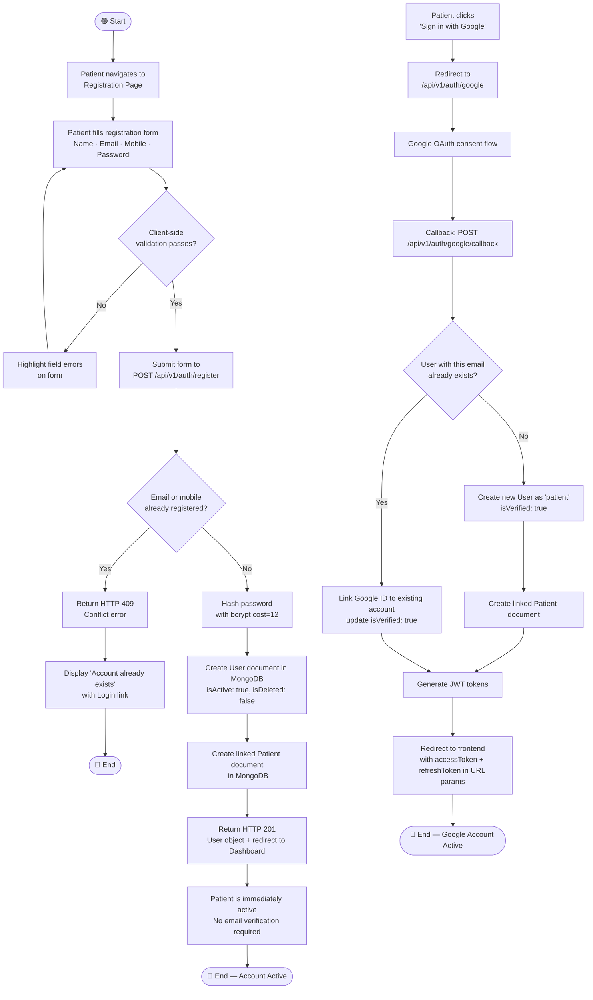
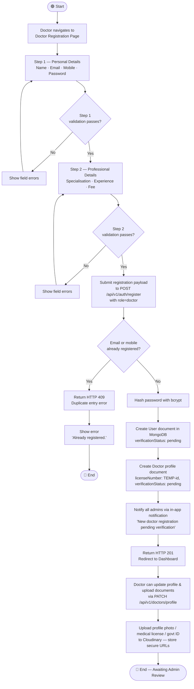
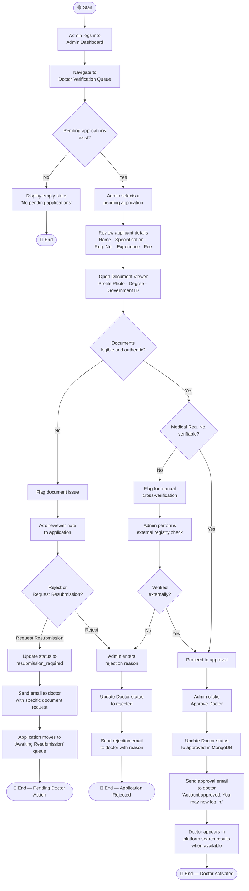
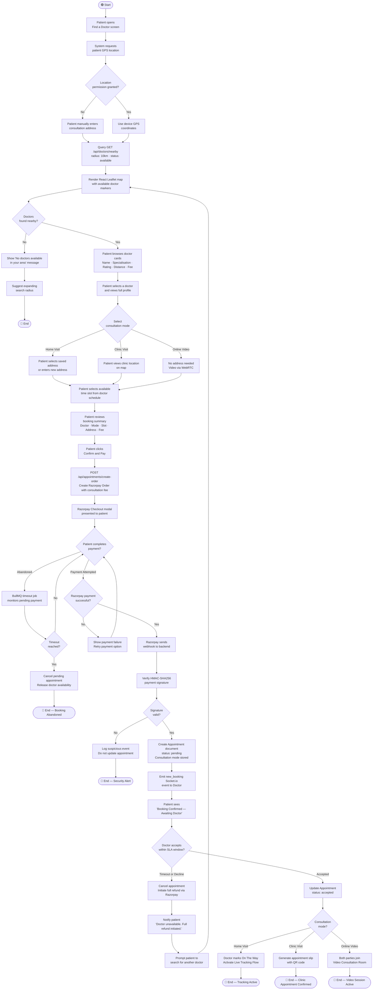
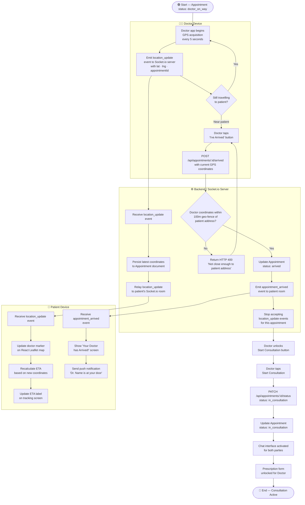
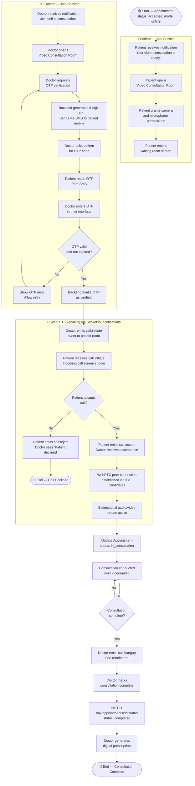
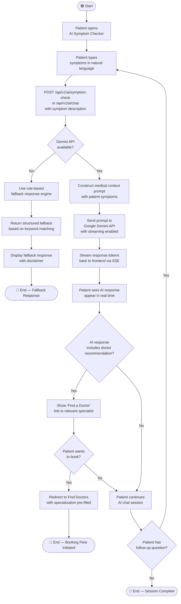
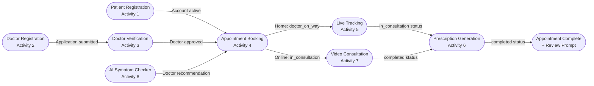

# DocDock — Activity Diagram Specification

---

## Table of Contents

1. [Introduction](#1-introduction)
2. [Notation Guide](#2-notation-guide)
3. [Activity 1 — Patient Registration](#3-activity-1--patient-registration)
4. [Activity 2 — Doctor Registration](#4-activity-2--doctor-registration)
5. [Activity 3 — Doctor Verification (Admin Flow)](#5-activity-3--doctor-verification-admin-flow)
6. [Activity 4 — Appointment Booking](#6-activity-4--appointment-booking)
7. [Activity 5 — Live Doctor Tracking](#7-activity-5--live-doctor-tracking)
8. [Activity 6 — Prescription Generation](#8-activity-6--prescription-generation)
9. [Activity 7 — Online Video Consultation](#9-activity-7--online-video-consultation)
10. [Activity 8 — AI Symptom Checker](#10-activity-8--ai-symptom-checker)
11. [Cross-Flow Integration Summary](#11-cross-flow-integration-summary)

---

## 1. Introduction

This document specifies the activity flows for the DocDock platform using UML-compliant activity diagrams rendered in Mermaid. Each activity diagram models the behaviour of a key system process from initiation to completion, capturing decision nodes, parallel activities, swimlane responsibilities, and exception paths.

These diagrams serve as the primary reference for:

- Frontend interaction design and UX wireframing
- Backend API endpoint sequencing
- QA test case derivation
- Stakeholder walkthroughs and sprint planning

Each section contains a description of the flow, a swimlane responsibility table, a Mermaid diagram, and a step-by-step narrative.

---

## 2. Notation Guide

| Symbol | Mermaid Representation | Meaning |
|---|---|---|
| Filled circle | `([Start])` | Initial node — flow begins |
| Rounded rectangle | `[Action]` | Activity / action step |
| Diamond | `{Decision}` | Decision node — branching |
| Double bar | `==>` fork/join | Fork (parallel split) / Join (parallel merge) |
| Bold border circle | `([End])` | Final node — flow terminates |
| Swimlane | `subgraph` | Partition by responsible actor |

---

## 3. Activity 1 — Patient Registration

### 3.1 Overview

The Patient Registration flow governs the process by which a new user creates a verified DocDock patient account. The flow encompasses form submission, server-side validation, account creation, and final account activation. It is the entry point for all patient-facing features.

### 3.2 Swimlane Responsibilities

| Lane | Actor | Responsibility |
|---|---|---|
| Patient | A-01 | Form input |
| Frontend | System (Next.js) | Client-side validation, routing, UI feedback |
| Backend API | System (Express.js) | Business logic, JWT issuance, database writes |
| Database | System (MongoDB) | Persistence of patient document |

### 3.3 Activity Diagram

```mermaid
flowchart TD
    Start([🟢 Start]) --> A[Patient navigates to\nRegistration Page]
    A --> B[Patient fills registration form\nName · Email · Mobile · Password]
    B --> C{Client-side\nvalidation passes?}
    C -- No --> D[Highlight field errors\non form]
    D --> B
    C -- Yes --> E[Submit form to\nPOST /api/v1/auth/register]

    E --> F{Email or mobile\nalready registered?}
    F -- Yes --> G[Return HTTP 409\nConflict error]
    G --> H[Display 'Account already exists'\nwith Login link]
    H --> End1([🔴 End])

    F -- No --> I[Hash password\nwith bcrypt cost=12]
    I --> J[Create User document in MongoDB\nisActive: true, isDeleted: false]
    J --> K[Create linked Patient document\n in MongoDB]
    K --> L[Return HTTP 201\nUser object + redirect to Dashboard]
    L --> M[Patient is immediately active\nNo email verification required]
    M --> End2([🔴 End — Account Active])

    A2[Patient clicks\n'Sign in with Google']
    A2 --> G2[Redirect to\n/api/v1/auth/google]
    G2 --> H2[Google OAuth consent flow]
    H2 --> I2[Callback: POST /api/v1/auth/google/callback]
    I2 --> J2{User with this email\nalready exists?}
    J2 -- No --> K2[Create new User as 'patient'\nisVerified: true]
    K2 --> L2[Create linked Patient document]
    J2 -- Yes --> M2[Link Google ID to existing account\nupdate isVerified: true]
    L2 --> N2[Generate JWT tokens]
    M2 --> N2
    N2 --> O2[Redirect to frontend\nwith accessToken + refreshToken in URL params]
    O2 --> End3([🔴 End — Google Account Active])
```

### 3.4 Flow Narrative

1. The patient opens the registration page and fills in the required fields: full name, email, mobile number, and password.
2. The frontend validates fields client-side (format, required, password strength) before submission.
3. The backend checks for duplicate email or mobile number. If a duplicate is found, a 409 Conflict is returned and the patient is offered a login link.
4. The password is hashed using bcrypt (cost factor 12). A User document is created in MongoDB as `isActive: true`, and a linked Patient document is immediately created.
5. **The patient is immediately active** — no email verification step is required. The API returns a 201 with the user object.
6. Alternatively, patients can sign in with **Google OAuth 2.0**: clicking 'Sign in with Google' redirects through the OAuth consent flow. On callback, if no account with that email exists a new patient account is auto-created with `isVerified: true`. JWT tokens are appended as URL query params and the user is redirected to the frontend callback page.

---

## 4. Activity 2 — Doctor Registration

### 4.1 Overview

Doctor Registration is a multi-step flow requiring identity documentation upload and a mandatory admin verification gate before the doctor can access platform features. This flow is more complex than patient registration due to KYC requirements and Cloudinary document storage.

### 4.2 Swimlane Responsibilities

| Lane | Actor | Responsibility |
|---|---|---|
| Doctor | A-02 | Form input, document upload |
| Frontend | System (Next.js) | Multi-step form, file validation, progress UI |
| Backend API | System (Express.js) | Validation, document processing, DB write |
| Cloudinary | External Storage | Secure document storage, URL generation |
| Database | System (MongoDB) | Doctor document persistence |
| Admin | A-03 | Application review and decision |

### 4.3 Activity Diagram

```mermaid
flowchart TD
    Start([🟢 Start]) --> A[Doctor navigates to\nDoctor Registration Page]

    A --> B[Step 1 — Personal Details\nName · Email · Mobile · Password]
    B --> C{Step 1\nvalidation passes?}
    C -- No --> D[Show field errors]
    D --> B
    C -- Yes --> E[Step 2 — Professional Details\nSpecialisation · Experience · Fee]

    E --> F{Step 2\nvalidation passes?}
    F -- No --> G[Show field errors]
    G --> E
    F -- Yes --> H[Submit registration payload\nto POST /api/v1/auth/register\nwith role=doctor]

    H --> I{Email or mobile\nalready registered?}
    I -- Yes --> J[Return HTTP 409\nDuplicate entry error]
    J --> K[Show error\n'Already registered.']
    K --> End1([🔴 End])

    I -- No --> L[Hash password with bcrypt]
    L --> M[Create User document in MongoDB\nverificationStatus: pending]
    M --> N[Create Doctor profile document\nlicenseNumber: TEMP-id, verificationStatus: pending]
    N --> O[Notify all admins via in-app notification\n'New doctor registration pending verification']
    O --> P[Return HTTP 201\nRedirect to Dashboard]
    P --> Q[Doctor can update profile & upload documents\nvia PATCH /api/v1/doctors/profile]
    Q --> R[Upload profile photo / medical license / govt ID\nto Cloudinary — store secure URLs]
    R --> End2([🔴 End — Awaiting Admin Review])
```

### 4.4 Flow Narrative

1. The doctor completes a two-step registration form: personal details and professional credentials.
2. Each step is validated independently client-side before the next step is unlocked.
3. The backend checks for duplicate email or mobile number. Duplicates are rejected with a 409 error.
4. The password is bcrypt-hashed, a User document is created with `verificationStatus: pending`, and a linked Doctor document is immediately created with a temporary license number placeholder.
5. All admins are notified via in-app notification that a new doctor has registered and is pending verification.
6. The doctor is redirected to their dashboard. They can then upload profile photo, medical license, and government ID documents via the Profile Settings page (PATCH `/api/v1/doctors/profile`), which sends files to Cloudinary and stores the URLs.
7. The doctor's account remains in `pending` status until Admin completes verification (Activity 3).

---

## 5. Activity 3 — Doctor Verification (Admin Flow)

### 5.1 Overview

The Admin Verification flow is the gate-keeping process by which a DocDock administrator reviews a doctor's application, inspects uploaded credentials, and either approves or rejects the doctor's account. This flow directly determines whether a doctor gains platform access.

### 5.2 Swimlane Responsibilities

| Lane | Actor | Responsibility |
|---|---|---|
| Admin | A-03 | Application review, decision-making |
| Admin Dashboard | System (Next.js) | Verification UI, document viewer |
| Backend API | System (Express.js) | Status update, notification dispatch |
| Database | System (MongoDB) | Doctor status persistence |
| Email Service | System | Outcome notification to doctor |

### 5.3 Activity Diagram

```mermaid
flowchart TD
    Start([🟢 Start]) --> A[Admin logs into\nAdmin Dashboard]
    A --> B[Navigate to\nDoctor Verification Queue]
    B --> C{Pending applications\nexist?}
    C -- No --> D[Display empty state\n'No pending applications']
    D --> End1([🔴 End])

    C -- Yes --> E[Admin selects a\npending application]
    E --> F[Review applicant details\nName · Specialisation · Reg. No. · Experience · Fee]
    F --> G[Open Document Viewer\nProfile Photo · Degree · Government ID]

    G --> H{Documents\nlegible and authentic?}
    H -- No --> I[Flag document issue]
    I --> J[Add reviewer note\nto application]
    J --> K{Reject or\nRequest Resubmission?}

    K -- Request Resubmission --> L[Update status to\nresubmission_required]
    L --> M[Send email to doctor\nwith specific document request]
    M --> N[Application moves to\n'Awaiting Resubmission' queue]
    N --> End2([🔴 End — Pending Doctor Action])

    K -- Reject --> O[Admin enters\nrejection reason]
    O --> P[Update Doctor status\nto rejected]
    P --> Q[Send rejection email\nto doctor with reason]
    Q --> End3([🔴 End — Application Rejected])

    H -- Yes --> R{Medical Reg. No.\nverifiable?}
    R -- No --> S[Flag for manual\ncross-verification]
    S --> T[Admin performs\nexternal registry check]
    T --> U{Verified\nexternally?}
    U -- No --> O
    U -- Yes --> V[Proceed to approval]

    R -- Yes --> V
    V --> W[Admin clicks\nApprove Doctor]
    W --> X[Update Doctor status\nto approved in MongoDB]
    X --> Y[Send approval email\nto doctor\n'Account approved. You may now log in.']
    Y --> Z[Doctor appears in\nplatform search results\nwhen available]
    Z --> End4([🔴 End — Doctor Activated])
```

### 5.4 Flow Narrative

1. Admin logs into the Dashboard and navigates to the verification queue, which lists all `pending` and `resubmission_required` doctor applications.
2. Admin selects an application and reviews the doctor's professional details alongside their uploaded documents in an integrated document viewer.
3. If documents are unclear or insufficient, Admin can either request a resubmission (specific document re-upload) or outright reject with a mandatory reason.
4. If the medical registration number cannot be automatically verified, Admin performs an external check against a medical registry.
5. On approval, the doctor's status is updated to `approved`, an approval email is dispatched, and the doctor can now log in and appear in patient search results when they set themselves as available.
6. All admin decisions (approve, reject, request resubmission) are recorded in the Audit Log with the Admin's ID, timestamp, and rationale.

---

## 6. Activity 4 — Appointment Booking

### 6.1 Overview

The Appointment Booking flow is the central transactional flow of the DocDock platform. It covers doctor discovery, consultation mode selection (Home Visit / Clinic / Online), slot selection, address confirmation, Razorpay payment processing, and the post-payment doctor acceptance sequence. DocDock supports **three consultation modes**, each with its own tailored workflow.

### 6.2 Swimlane Responsibilities

| Lane | Actor | Responsibility |
|---|---|---|
| Patient | A-01 | Doctor search, mode/slot selection, address selection, payment |
| Doctor | A-02 | Appointment acceptance or decline |
| Frontend | System (Next.js) | Map rendering, booking UI, slot picker, payment modal |
| Backend API | System (Express.js) | Slot generation, order creation, signature verification, status management |
| Razorpay | External Payment | Checkout, payment capture, webhook dispatch |
| Socket.io | System (Real-time) | Live availability updates, booking notification |
| BullMQ Worker | System (Background) | Appointment reminders, auto-rejection timeout |
| Database | System (MongoDB) | Appointment document lifecycle |

### 6.3 Activity Diagram

```mermaid
flowchart TD
    Start([🟢 Start]) --> A[Patient opens\nFind a Doctor screen]
    A --> B[System requests\npatient GPS location]
    B --> C{Location\npermission granted?}
    C -- No --> D[Patient manually enters\nconsultation address]
    C -- Yes --> E[Use device GPS\ncoordinates]

    D --> F
    E --> F[Query GET /api/doctors/nearby\nradius: 10km · status: available]
    F --> G[Render React Leaflet map\nwith available doctor markers]

    G --> H{Doctors\nfound nearby?}
    H -- No --> I[Show 'No doctors available\nin your area' message]
    I --> J[Suggest expanding\nsearch radius]
    J --> End1([🔴 End])

    H -- Yes --> K[Patient browses doctor cards\nName · Specialisation · Rating · Distance · Fee]
    K --> L[Patient selects a doctor\nand views full profile]
    L --> M{Select\nconsultation mode}

    M -- Home Visit --> N1[Patient selects saved address\nor enters new address]
    M -- Clinic Visit --> N2[Patient views clinic location\non map]
    M -- Online Video --> N3[No address needed\nVideo via WebRTC]

    N1 --> O[Patient selects available\ntime slot from doctor schedule]
    N2 --> O
    N3 --> O

    O --> P[Patient reviews\nbooking summary\nDoctor · Mode · Slot · Address · Fee]
    P --> Q[Patient clicks\nConfirm and Pay]

    Q --> R[POST /api/appointments/create-order\nCreate Razorpay Order with consultation fee]
    R --> S[Razorpay Checkout modal\npresented to patient]

    S --> T{Patient completes\npayment?}
    T -- Abandoned --> U[BullMQ timeout job\nmonitors pending payment]
    U --> V{Timeout\nreached?}
    V -- No --> T
    V -- Yes --> W[Cancel pending appointment\nRelease doctor availability]
    W --> End2([🔴 End — Booking Abandoned])

    T -- Payment Attempted --> X{Razorpay payment\nsuccessful?}
    X -- No --> Y[Show payment failure\nRetry payment option]
    Y --> T

    X -- Yes --> Z[Razorpay sends\nwebhook to backend]
    Z --> AA[Verify HMAC-SHA256\npayment signature]
    AA --> AB{Signature\nvalid?}
    AB -- No --> AC[Log suspicious event\nDo not update appointment]
    AC --> End3([🔴 End — Security Alert])

    AB -- Yes --> AD[Create Appointment document\nstatus: pending\nConsultation mode stored]
    AD --> AE[Emit new_booking Socket.io\nevent to Doctor]
    AE --> AF[Patient sees\n'Booking Confirmed — Awaiting Doctor']

    AF --> AG{Doctor accepts\nwithin SLA window?}
    AG -- Timeout or Decline --> AH[Cancel appointment\nInitiate full refund via Razorpay]
    AH --> AI[Notify patient\n'Doctor unavailable. Full refund initiated.']
    AI --> AJ[Prompt patient to\nsearch for another doctor]
    AJ --> G

    AG -- Accepted --> AK[Update Appointment\nstatus: accepted]
    AK --> AL{Consultation\nmode?}
    AL -- Home Visit --> AM[Doctor marks On The Way\nActivate Live Tracking Flow]
    AL -- Clinic Visit --> AN[Generate appointment slip\nwith QR code]
    AL -- Online Video --> AO[Both parties join\nVideo Consultation Room]
    AM --> End4([🔴 End — Tracking Active])
    AN --> End5([🔴 End — Clinic Appointment Confirmed])
    AO --> End6([🔴 End — Video Session Active])
```

### 6.4 Flow Narrative

1. The patient opens the Doctor Search screen. The system requests GPS access; if denied, the patient manually enters an address.
2. The backend queries doctors who are `approved` and available within a 10 km radius using MongoDB geo-queries. Results render on a React Leaflet map and as a list.
3. The patient selects a doctor, reviews their profile, and selects a **consultation mode**: Home Visit, Clinic Visit, or Online Video.
4. The patient selects an available time slot from the doctor's per-day schedule. Slots are generated server-side based on the doctor's configured schedule, break times, and already-booked slots.
5. A Razorpay Order is created server-side and the checkout modal is presented. A BullMQ background job monitors payment completion; the appointment is cancelled if payment is not completed within the timeout window.
6. On payment completion, Razorpay's webhook delivers the payment result to the backend. The backend verifies the HMAC-SHA256 signature. On verification success, the Appointment document is created with `status: pending`.
7. A Socket.io event notifies the doctor of the new booking. The doctor has a configured SLA window to accept or decline.
8. Based on the accepted consultation mode: Home Visit activates Live Tracking; Clinic Visit generates an appointment slip with QR code; Online activates the WebRTC video consultation room.

---

## 7. Activity 5 — Live Doctor Tracking

### 7.1 Overview

The Live Tracking flow activates once a doctor accepts a **Home Visit** appointment and marks themselves `doctor_on_way`. It governs the real-time broadcast of the doctor's GPS location to the patient, the map rendering and ETA updates on the patient side, and the lifecycle transitions through `doctor_on_way` → `arrived` → `in_consultation`.

### 7.2 Swimlane Responsibilities

| Lane | Actor | Responsibility |
|---|---|---|
| Doctor | A-02 | Location broadcast, arrival confirmation, consultation start |
| Patient | A-01 | Passive map viewer, notification recipient |
| Socket.io Server | System | Location event relay, room management |
| Frontend (Doctor) | System (Next.js) | GPS acquisition, event emission |
| Frontend (Patient) | System (Next.js) | Map rendering, ETA display |
| Backend API | System (Express.js) | Geo-fence validation, status transitions |
| Database | System (MongoDB) | Status and location persistence |

### 7.3 Activity Diagram

```mermaid
flowchart TD
    Start([🟢 Start — Appointment status: doctor_on_way]) --> A

    subgraph DOCTOR ["👨‍⚕️ Doctor Device"]
        A[Doctor app begins\nGPS acquisition\nevery 5 seconds]
        A --> B[Emit location_update\nevent to Socket.io server\nwith lat · lng · appointmentId]
        B --> C{Still travelling\nto patient?}
        C -- Yes --> A
        C -- Near patient --> D[Doctor taps\n'I've Arrived' button]
        D --> E[POST /api/appointments/:id/arrived\nwith current GPS coordinates]
    end

    subgraph SERVER ["⚙️ Backend / Socket.io Server"]
        F[Receive location_update event]
        F --> G[Persist latest coordinates\nto Appointment document]
        G --> H[Relay location_update\nto patient's Socket.io room]

        E --> I{Doctor coordinates within\n100m geo-fence of\npatient address?}
        I -- No --> J[Return HTTP 400\n'Not close enough to patient address']
        J --> D
        I -- Yes --> K[Update Appointment\nstatus: arrived]
        K --> L[Emit appointment_arrived\nevent to patient room]
        L --> M[Stop accepting\nlocation_update events\nfor this appointment]
    end

    subgraph PATIENT ["🧑 Patient Device"]
        N[Receive location_update event]
        N --> O[Update doctor marker\non React Leaflet map]
        O --> P[Recalculate ETA\nbased on new coordinates]
        P --> Q[Update ETA label\non tracking screen]

        L --> R[Receive appointment_arrived\nevent]
        R --> S[Show 'Your Doctor\nhas Arrived!' screen]
        S --> T[Send push notification\n'Dr. Name is at your door']
    end

    B --> F
    H --> N

    M --> U[Doctor unlocks\nStart Consultation button]
    U --> V[Doctor taps\nStart Consultation]
    V --> W[PATCH /api/appointments/:id/status\nstatus: in_consultation]
    W --> X[Update Appointment\nstatus: in_consultation]
    X --> Y[Chat interface activated\nfor both parties]
    Y --> Z[Prescription form\nunlocked for Doctor]
    Z --> End([🔴 End — Consultation Active])
```

### 7.4 Flow Narrative

1. Upon appointment acceptance, the doctor's app begins emitting GPS coordinates via Socket.io every 5 seconds, tagged with the appointment ID.
2. The Socket.io server relays each `location_update` event to the patient's dedicated room, persisting the latest coordinates to MongoDB.
3. The patient's map re-renders the doctor's marker and recalculates ETA with each received event.
4. When the doctor reaches the patient's vicinity, they tap the Arrived button. The backend validates that the doctor's current GPS coordinates fall within a 100-metre geo-fence of the appointment address.
5. If outside the geo-fence, the arrival is rejected and the doctor is prompted to move closer. This prevents premature arrival marking.
6. On successful geo-fence validation, the appointment status updates to `arrived`, location broadcasting stops, and the patient receives a push notification and screen update.
7. The doctor's UI unlocks the Start Consultation button. Tapping it transitions the appointment to `in_consultation`, activates the chat interface, and unlocks the prescription form for the doctor.

---

## 8. Activity 6 — Prescription Generation

### 8.1 Overview

The Prescription Generation flow enables a verified doctor to issue a structured digital prescription during or after a consultation. The flow covers form entry, PDF generation, Cloudinary storage, patient delivery, and prescription integrity verification via QR code.

### 8.2 Swimlane Responsibilities

| Lane | Actor | Responsibility |
|---|---|---|
| Doctor | A-02 | Prescription data entry, submission |
| Patient | A-01 | Prescription receipt, download |
| Frontend (Doctor) | System (Next.js) | Prescription form, preview rendering |
| Backend API | System (Express.js) | PDF generation, Cloudinary upload, DB write |
| Cloudinary | External Storage | PDF secure storage |
| Database | System (MongoDB) | Prescription document persistence |
| Email Service | System | Prescription notification to patient |

### 8.3 Activity Diagram

```mermaid
flowchart TD
    Start([🟢 Start — Appointment status: in_consultation]) --> A

    subgraph DOCTOR ["👨‍⚕️ Doctor — Prescription Form"]
        A[Doctor opens\nPrescription Form]
        A --> B[Auto-populate:\nPatient Name · DOB · Date · Doctor Details]
        B --> C[Doctor enters Diagnosis]
        C --> D[Doctor adds Medications\nName · Dosage · Frequency · Duration]
        D --> E{Add another\nmedication?}
        E -- Yes --> D
        E -- No --> F[Doctor enters\nAdditional Notes]
        F --> G[Doctor enters\nFollow-up Instructions]
        G --> H[Doctor previews\nprescription draft]
        H --> I{Prescription\ncontent correct?}
        I -- No --> J[Doctor edits\nrequired fields]
        J --> H
        I -- Yes --> K[Doctor clicks\nGenerate & Submit Prescription]
    end

    subgraph BACKEND ["⚙️ Backend API"]
        K --> L[POST /api/prescriptions/generate]
        L --> M[Validate prescription\npayload server-side]
        M --> N{Validation\npasses?}
        N -- No --> O[Return HTTP 422\nValidation errors]
        O --> J

        N -- Yes --> P[Generate unique\nPrescription ID — UUID v4]
        P --> Q[Generate QR Code\nlinking to verification URL]
        Q --> R[Compose prescription\nHTML template with all fields]
        R --> S[Convert HTML to PDF\nusing headless renderer]
        S --> T{PDF generated\nsuccessfully?}
        T -- No --> U[Log error\nReturn HTTP 500]
        U --> End1([🔴 End — Generation Failed])

        T -- Yes --> V[Upload PDF to Cloudinary\nSecure · Private bucket]
        V --> W{Cloudinary upload\nsuccessful?}
        W -- No --> X[Retry upload\nup to 3 times]
        X --> W
        W -- Yes --> Y[Receive Cloudinary\nsecure PDF URL]

        Y --> Z[Create Prescription document\nin MongoDB\nstatus: issued]
        Z --> AA[Update Appointment\nstatus: completed]
        AA --> AB[Mark prescription as\nimmutable — no further edits]
    end

    subgraph PATIENT ["🧑 Patient — Notification & Download"]
        AB --> AC[Send push notification\n'Your prescription is ready']
        AC --> AD[Send email to patient\nwith prescription PDF link]
        AD --> AE[Patient opens\nAppointment History]
        AE --> AF[Patient clicks\nDownload Prescription]
        AF --> AG[GET /api/prescriptions/:id/download\nFetch Cloudinary signed URL]
        AG --> AH{Patient\nauthenticated and\nappointment owner?}
        AH -- No --> AI[Return HTTP 403\nForbidden]
        AI --> End2([🔴 End — Unauthorised])
        AH -- Yes --> AJ[Signed Cloudinary URL\nreturned with 15-min expiry]
        AJ --> AK[PDF downloaded\nto patient's device]
        AK --> End3([🔴 End — Prescription Delivered])
    end

    subgraph VERIFY ["🔍 Third-Party Verification — Optional"]
        AK --> AL{Pharmacist scans\nQR code?}
        AL -- No --> End3
        AL -- Yes --> AM[GET /api/prescriptions/verify/:id]
        AM --> AN{Prescription\nfound and valid?}
        AN -- No --> AO[Return status: INVALID]
        AO --> End4([🔴 End — Invalid Prescription])
        AN -- Yes --> AP[Return: Doctor Name\nReg. No. · Patient · Date · Status: VALID]
        AP --> End5([🔴 End — Prescription Verified])
    end
```

### 8.4 Flow Narrative

1. The prescription form is accessible to the doctor once the appointment is in `in_consultation` status. Patient details (name, date of birth) and doctor details (name, registration number) are auto-populated from the database.
2. The doctor enters the diagnosis, adds one or more medications with dosage and frequency, and optionally adds clinical notes and follow-up instructions.
3. The doctor previews the prescription before submission. Edits are permitted at this stage.
4. On submission, the backend validates the payload, generates a UUID prescription ID, and creates a QR code pointing to the platform's verification endpoint.
5. An HTML prescription template is composed with all fields and the QR code, then rendered to PDF using a headless renderer. The PDF is uploaded to a private Cloudinary bucket.
6. A Prescription document is created in MongoDB. The Appointment status is updated to `completed`. The prescription is marked immutable — no further edits are permitted at the application layer.
7. The patient receives a push notification and email. They can download the prescription PDF via a signed, time-limited Cloudinary URL returned by the backend (authenticated, ownership-verified request).
8. Optionally, a pharmacist or third party can scan the QR code to verify the prescription's authenticity via the public verification endpoint, which returns the issuing doctor's details and a `VALID` or `INVALID` status without exposing sensitive clinical content.

---

## 9. Activity 7 — Online Video Consultation

### 9.1 Overview

The Online Video Consultation flow activates when a patient books an appointment in **Online** mode. It governs the WebRTC-based peer-to-peer video/audio session setup via Socket.io signalling, OTP verification at session start, and the consultation lifecycle through to completion.

### 9.2 Swimlane Responsibilities

| Lane | Actor | Responsibility |
|---|---|---|
| Patient | A-01 | Join call, participate in consultation |
| Doctor | A-02 | Join call, OTP verification, consultation conduct |
| Socket.io Server | System (/notifications namespace) | WebRTC signalling relay, call events |
| Backend API | System (Express.js) | OTP generation/validation, status transitions |
| SMS Service | External (Twilio/SMS) | OTP delivery to patient |
| Database | System (MongoDB) | Call log, OTP record, status persistence |

### 9.3 Activity Diagram

```mermaid
flowchart TD
    Start([🟢 Start — Appointment status: accepted, mode: online]) --> A

    subgraph PATIENT_PREP ["🧑 Patient — Join Session"]
        A[Patient receives notification\n'Your video consultation is ready']
        A --> B[Patient opens\nVideo Consultation Room]
        B --> C[Patient grants camera\nand microphone permissions]
        C --> D[Patient enters\nwaiting room screen]
    end

    subgraph DOCTOR_PREP ["👨‍⚕️ Doctor — Join Session"]
        E[Doctor receives notification\n'Join online consultation']
        E --> F[Doctor opens\nVideo Consultation Room]
        F --> G[Doctor requests\nOTP verification]
        G --> H[Backend generates 6-digit OTP\nSends via SMS to patient mobile]
        H --> I[Doctor asks patient\nfor OTP code]
        I --> J[Patient reads OTP\nfrom SMS]
        J --> K[Doctor enters OTP\nin their interface]
        K --> L{OTP valid\nand not expired?}
        L -- No --> M[Show OTP error\nAllow retry]
        M --> G
        L -- Yes --> N[Backend marks OTP\nas verified]
    end

    subgraph WEBRTC ["📡 WebRTC Signalling via Socket.io /notifications"]
        N --> O[Doctor emits call:initiate\nevent to patient room]
        O --> P[Patient receives call:initiate\nIncoming call screen shown]
        P --> Q{Patient accepts\ncall?}
        Q -- No --> R[Patient emits call:reject\nDoctor sees 'Patient declined']
        R --> End1([🔴 End — Call Declined])
        Q -- Yes --> S[Patient emits call:accept\nDoctor receives acceptance]
        S --> T[WebRTC peer connection\nestablished via ICE candidates]
        T --> U[Bidirectional audio/video\nstream active]
    end

    U --> V[Update Appointment\nstatus: in_consultation]
    V --> W[Consultation conducted\nover video/audio]
    W --> X{Consultation\ncomplete?}
    X -- No --> W
    X -- Yes --> Y[Doctor emits call:hangup\nCall terminated]
    Y --> Z[Doctor marks\nconsultation complete]
    Z --> AA[PATCH /api/appointments/:id/status\nstatus: completed]
    AA --> AB[Doctor generates\ndigital prescription]
    AB --> End2([🔴 End — Consultation Complete])
```

### 9.4 Flow Narrative

1. When an online appointment is accepted, both the patient and doctor receive notifications to join their video consultation room.
2. The doctor initiates an **OTP verification** — the backend generates a 6-digit OTP, delivers it to the patient's registered mobile number via SMS (Twilio/SMS provider), and the doctor enters the OTP code to confirm the patient's identity at session start.
3. Upon OTP verification, WebRTC signalling begins via the Socket.io `/notifications` namespace. The doctor emits a `call:initiate` event; the patient can accept or reject.
4. On acceptance, WebRTC peer connection is established using ICE candidates exchanged via Socket.io signals. A bidirectional audio/video stream begins.
5. The appointment status transitions to `in_consultation`. The doctor conducts the consultation over the video call.
6. On completion, the doctor emits `call:hangup`, terminates the call, and marks the appointment as completed. A digital prescription is then generated as in Activity 6.

---

## 10. Activity 8 — AI Symptom Checker

### 10.1 Overview

The AI Symptom Checker is a patient-facing feature powered by the **Google Gemini API**. It allows patients to describe their symptoms in natural language and receive AI-generated insights including potential conditions, recommended specialist types, urgency level, and whether to book an appointment or seek emergency care.

### 10.2 Swimlane Responsibilities

| Lane | Actor | Responsibility |
|---|---|---|
| Patient | A-01 | Symptom input, follow-up questions |
| Frontend | System (Next.js) | Chat UI, streaming response rendering |
| Backend API | System (Express.js) | Gemini API proxy, fallback logic, response streaming |
| Google Gemini API | External AI | LLM inference for symptom analysis |
| Database | System (MongoDB) | Session context (optional persistence) |

### 10.3 Activity Diagram

```mermaid
flowchart TD
    Start([🟢 Start]) --> A[Patient opens\nAI Symptom Checker]
    A --> B[Patient types\nsymptoms in natural language]
    B --> C[POST /api/v1/ai/symptom-check\nor /api/v1/ai/chat\nwith symptom description]
    C --> D{Gemini API\navailable?}

    D -- No --> E[Use rule-based\nfallback response engine]
    E --> F[Return structured fallback\nbased on keyword matching]
    F --> G[Display fallback response\nwith disclaimer]
    G --> End1([🔴 End — Fallback Response])

    D -- Yes --> H[Construct medical context prompt\nwith patient symptoms]
    H --> I[Send prompt to\nGoogle Gemini API\nwith streaming enabled]
    I --> J[Stream response tokens\nback to frontend via SSE]
    J --> K[Patient sees AI response\nappear in real time]

    K --> L{AI response\nincludes doctor recommendation?}
    L -- Yes --> M[Show 'Find a Doctor'\nlink to relevant specialist]
    M --> N{Patient wants\nto book?}
    N -- Yes --> O[Redirect to Find Doctors\nwith specialization pre-filled]
    O --> End2([🔴 End — Booking Flow Initiated])
    N -- No --> P[Patient continues\nAI chat session]

    L -- No --> P
    P --> Q{Patient has\nfollow-up question?}
    Q -- Yes --> B
    Q -- No --> End3([🔴 End — Session Complete])
```

### 10.4 Flow Narrative

1. The patient opens the AI Symptom Checker from their dashboard and types a description of their symptoms in natural language.
2. The frontend sends the input to the backend AI controller, which proxies the request to the Google Gemini API with a carefully constructed medical context prompt.
3. If the Gemini API is unavailable or the API key is not configured, the system falls back to a **rule-based response engine** that performs keyword matching to produce a basic structured response, ensuring the feature degrades gracefully.
4. If Gemini is available, the API streams response tokens back to the backend, which relays them to the frontend using Server-Sent Events (SSE). The patient sees the AI response appear in real time.
5. If the AI response includes a doctor type recommendation, the UI surfaces a **'Find a Doctor' shortcut** with the relevant specialization pre-filled in the search filters.
6. The patient can continue the conversation with follow-up questions. The session maintains context to provide coherent multi-turn responses.
7. **Disclaimer**: The AI Symptom Checker is for informational purposes only and does not replace professional medical advice, diagnosis, or treatment.

---

## 11. Cross-Flow Integration Summary

The eight activity flows do not operate in isolation. The table below maps the termination points of each flow to the entry points of dependent flows, illustrating the end-to-end patient journey through the DocDock platform.

```mermaid
flowchart LR
    R1([Patient Registration\nActivity 1]) -->|Account active| AB([Appointment Booking\nActivity 4])
    R2([Doctor Registration\nActivity 2]) -->|Application submitted| DV([Doctor Verification\nActivity 3])
    DV -->|Doctor approved| AB
    AB -->|Home: doctor_on_way| LT([Live Tracking\nActivity 5])
    AB -->|Online: in_consultation| VC([Video Consultation\nActivity 7])
    LT -->|in_consultation status| PG([Prescription Generation\nActivity 6])
    VC -->|completed status| PG
    PG -->|completed status| END([Appointment Complete\n+ Review Prompt])
    AI([AI Symptom Checker\nActivity 8]) -->|Doctor recommendation| AB
```

### Integration Points

| From Flow | To Flow | Trigger |
|---|---|---|
| Patient Registration (1) | Appointment Booking (4) | Patient account active |
| Doctor Registration (2) | Doctor Verification (3) | Application submitted |
| Doctor Verification (3) | Appointment Booking (4) | Doctor status set to `approved` |
| Appointment Booking (4) | Live Tracking (5) | Home Visit: appointment status → `doctor_on_way` |
| Appointment Booking (4) | Video Consultation (7) | Online: appointment accepted → OTP → WebRTC |
| Live Tracking (5) | Prescription Generation (6) | Appointment status → `in_consultation` |
| Video Consultation (7) | Prescription Generation (6) | Appointment status → `completed` |
| Prescription Generation (6) | Review System | Appointment status → `completed` |
| AI Symptom Checker (8) | Appointment Booking (4) | Patient follows doctor recommendation |

### Shared System Dependencies

| Dependency | Used By Flows |
|---|---|
| MongoDB Atlas | All flows |
| Socket.io | Booking (4), Live Tracking (5), Video Consultation (7) |
| Cloudinary | Doctor Registration (2), Prescription Generation (6) |
| Razorpay | Appointment Booking (4) |
| Google Gemini API | AI Symptom Checker (8) |
| SMS Service (Twilio) | Video Consultation (7) — OTP delivery |
| Email Service | Registration (1, 2), Verification (3), Prescription (6) |
| BullMQ Workers | Appointment Booking (4) — timeout jobs, reminders |
| JWT / RBAC | All authenticated flows |

---
