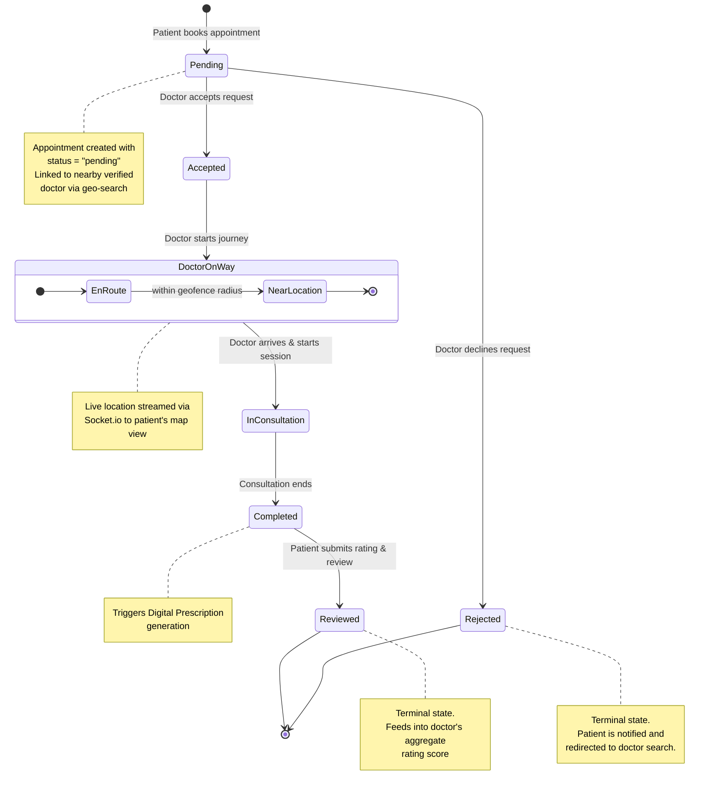
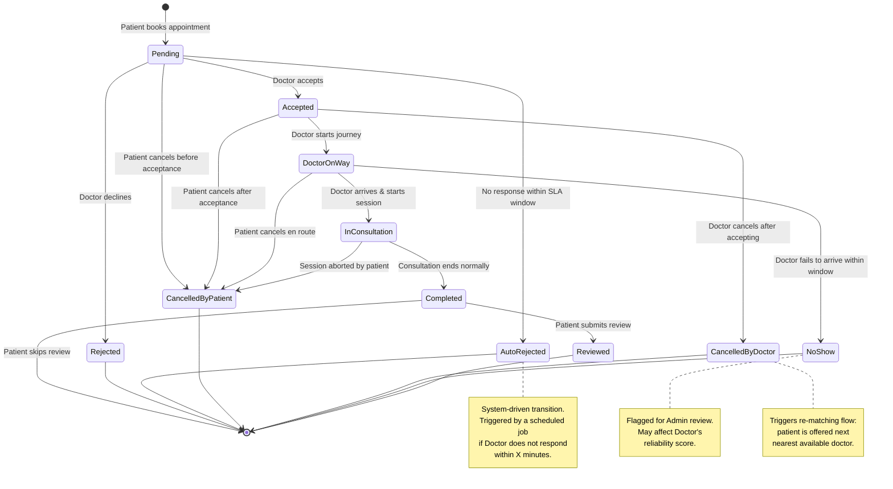

# DocDock — Appointment Lifecycle State Diagram Documentation

**Tagline:** "Knock-Knock, your doctor is here."
**Document Type:** State Diagram Specification — Appointment Lifecycle
**Audience:** Engineering, QA, Product
**Status:** Draft v1.0

---

## 1. Purpose

This document defines the **state machine governing an Appointment object** in DocDock, from creation by a patient through to completion and review. It is the authoritative reference for implementing the `Appointment` schema's `status` field, backend transition guards, and frontend UI states.

---

## 2. Primary Appointment Lifecycle (Core States)

This is the core lifecycle as specified: a linear happy-path with a single rejection branch.

---

## 3. Extended Lifecycle (Production Edge Cases)

A portfolio/production-grade system must also account for cancellations, timeouts, and no-shows. This extended diagram layers those branches onto the core 7 states without altering the primary path.

---

## 4. State Transition Table

| From State | To State | Trigger / Actor | Notes |
|---|---|---|---|
| `[*]` | Pending | Patient submits booking request | Doctor matched via geo-search |
| Pending | Accepted | Doctor accepts | Notification sent to patient |
| Pending | Rejected | Doctor declines | Terminal; patient redirected to search |
| Pending | AutoRejected | SLA timeout (system job) | Terminal; counts against doctor SLA metrics |
| Pending | CancelledByPatient | Patient cancels | Terminal |
| Accepted | DoctorOnWay | Doctor marks "started journey" | Live tracking session begins (Socket.io) |
| Accepted | CancelledByPatient | Patient cancels | Terminal; may incur cancellation policy |
| Accepted | CancelledByDoctor | Doctor cancels post-acceptance | Terminal; triggers re-match suggestion |
| DoctorOnWay | InConsultation | Doctor arrives, taps "Start Consultation" | Tracking session ends |
| DoctorOnWay | NoShow | Arrival timeout exceeded | Terminal; flagged for Admin review |
| DoctorOnWay | CancelledByPatient | Patient cancels en route | Terminal |
| InConsultation | Completed | Doctor marks "End Consultation" | Triggers prescription generation |
| InConsultation | CancelledByPatient | Patient aborts session | Terminal; partial-session handling required |
| Completed | Reviewed | Patient submits rating/review | Terminal; updates doctor's aggregate rating |
| Completed | `[*]` | Patient does not review | Terminal; appointment archived as completed |

---

## 5. Implementation Notes

- **Status field**: Store as an enum string on the `Appointment` document (e.g. `pending`, `accepted`, `rejected`, `auto_rejected`, `doctor_on_way`, `in_consultation`, `completed`, `cancelled_by_patient`, `cancelled_by_doctor`, `no_show`, `reviewed`).
- **Guard conditions**: Backend transition handlers should reject any state change that doesn't match an edge defined above (e.g. `InConsultation → Accepted` is invalid and must be blocked at the API layer).
- **Real-time sync**: Every transition should emit a Socket.io event (`appointment:status_changed`) so both Patient and Doctor clients update their UI without polling.
- **Audit trail**: Each transition should be timestamped and appended to an `appointment.history[]` array for dispute resolution and admin auditing.
- **SLA jobs**: `AutoRejected` and `NoShow` require a scheduled background job (e.g. cron or queue-based) to detect timeouts independent of client activity.
