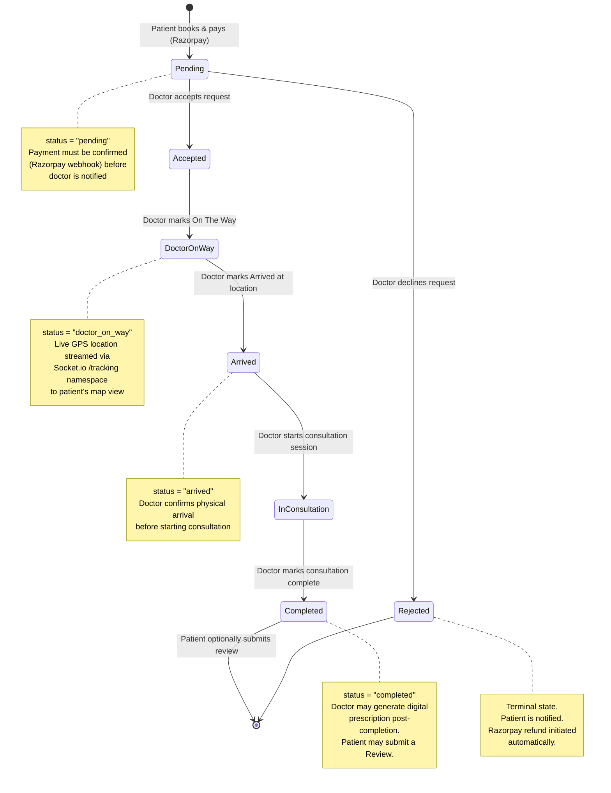
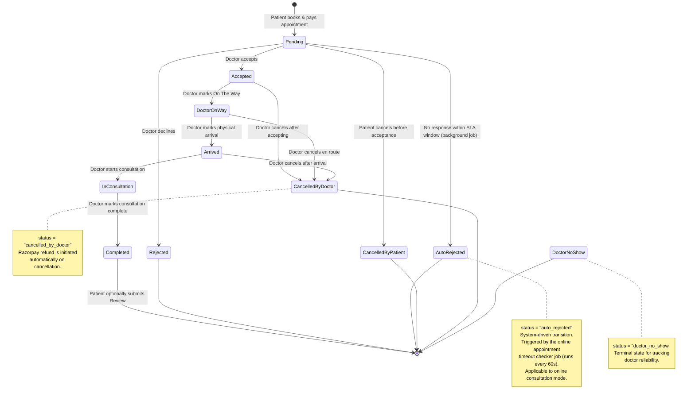

# DocDock — Appointment Lifecycle State Diagram Documentation

**Tagline:** "Knock-Knock, your doctor is here."
**Document Type:** State Diagram Specification — Appointment Lifecycle
**Audience:** Engineering, QA, Product
**Status:** v1.0 (Reflects Implemented Build)

---

## 1. Purpose

This document defines the **state machine governing an Appointment object** in DocDock, from creation by a patient through to completion and review. It is the authoritative reference for implementing the `Appointment` schema's `status` field, backend transition guards, and frontend UI states.

DocDock supports **three consultation modes**, each with its own tailored workflow:

| Mode | Status Path | Key Mechanism |
|---|---|---|
| **Home Visit** | `pending` → `accepted` → `doctor_on_way` → `arrived` → `in_consultation` → `completed` | Live GPS tracking + 100m geo-fence arrival validation |
| **Clinic Visit** | `pending` → `accepted` → `in_consultation` → `completed` | Appointment slip with QR code generated on acceptance |
| **Online** | `pending` → `accepted` → `in_consultation` → `completed` | OTP verification + WebRTC peer-to-peer video via Socket.io signalling |

---

## 2. Primary Appointment Lifecycle (Core States)

This is the core happy-path lifecycle with the discrete **Arrived** state that separates doctor travel from consultation start. Note: `reviewed` is NOT a stored appointment status — reviews are stored as a separate `Review` document linked to the appointment. Consultation modes supported: `clinic`, `home`, and `online`.

```mermaid
stateDiagram-v2
    [*] --> Pending : Patient books & pays (Razorpay)

    Pending --> Accepted : Doctor accepts request
    Pending --> Rejected : Doctor declines request

    Accepted --> DoctorOnWay : Doctor marks On The Way

    DoctorOnWay --> Arrived : Doctor marks Arrived at location

    Arrived --> InConsultation : Doctor starts consultation session

    InConsultation --> Completed : Doctor marks consultation complete

    Rejected --> [*]
    Completed --> [*] : Patient optionally submits review

    note right of Pending
        status = "pending"
        Payment must be confirmed
        (Razorpay webhook) before
        doctor is notified
    end note

    note right of Rejected
        Terminal state.
        Patient is notified.
        Razorpay refund initiated
        automatically.
    end note

    note right of DoctorOnWay
        status = "doctor_on_way"
        Live GPS location streamed via
        Socket.io /tracking namespace
        to patient's map view
    end note

    note right of Arrived
        status = "arrived"
        Doctor confirms physical arrival
        before starting consultation
    end note

    note right of Completed
        status = "completed"
        Doctor may generate digital
        prescription post-completion.
        Patient may submit a Review.
    end note
```

---

## 3. Extended Lifecycle (Production Edge Cases)

The full implemented state machine accounts for cancellations, timeouts, no-shows, and the discrete `arrived` step. All states below are persisted in the `Appointment` document's `status` field.

```mermaid
stateDiagram-v2
    [*] --> Pending : Patient books & pays appointment

    Pending --> Accepted : Doctor accepts
    Pending --> Rejected : Doctor declines
    Pending --> AutoRejected : No response within SLA window (background job)
    Pending --> CancelledByPatient : Patient cancels before acceptance

    Accepted --> DoctorOnWay : Doctor marks On The Way
    Accepted --> CancelledByDoctor : Doctor cancels after accepting

    DoctorOnWay --> Arrived : Doctor marks physical arrival
    DoctorOnWay --> CancelledByDoctor : Doctor cancels en route

    Arrived --> InConsultation : Doctor starts consultation
    Arrived --> CancelledByDoctor : Doctor cancels after arrival

    InConsultation --> Completed : Doctor marks consultation complete

    Completed --> [*] : Patient optionally submits Review

    Rejected --> [*]
    AutoRejected --> [*]
    CancelledByPatient --> [*]
    CancelledByDoctor --> [*]
    DoctorNoShow --> [*]

    note right of AutoRejected
        status = "auto_rejected"
        System-driven transition.
        Triggered by the online appointment
        timeout checker job (runs every 60s).
        Applicable to online consultation mode.
    end note

    note right of DoctorNoShow
        status = "doctor_no_show"
        Terminal state for tracking
        doctor reliability.
    end note

    note right of CancelledByDoctor
        status = "cancelled_by_doctor"
        Razorpay refund is initiated
        automatically on cancellation.
    end note
```

---

## 4. State Transition Table

> **Implementation Note:** `CancelledByPatient` is not currently an allowed transition from `DoctorOnWay`, `Arrived`, or `InConsultation` in the backend `validTransitions` guard. Cancellation by patient is only permitted while the appointment is in `pending` state. The `arrived` state is a mandatory distinct step between `doctor_on_way` and `in_consultation`.

| From State | Enum Value | To State | Trigger / Actor | Notes |
|---|---|---|---|---|
| `[*]` | — | `pending` | Patient books + Razorpay payment confirmed | Doctor and patient notified via in-app notification |
| `pending` | `pending` | `accepted` | Doctor accepts | In-app notification sent to patient |
| `pending` | `pending` | `rejected` | Doctor declines (with reason) | Terminal; Razorpay refund initiated |
| `pending` | `pending` | `auto_rejected` | SLA timeout (background job every 60s) | Terminal; applicable for online mode timeouts |
| `pending` | `pending` | `cancelled_by_patient` | Patient cancels | Terminal; refund initiated |
| `accepted` | `accepted` | `doctor_on_way` | Doctor marks On The Way | Live tracking session begins (Socket.io /tracking) |
| `accepted` | `accepted` | `cancelled_by_doctor` | Doctor cancels post-acceptance | Terminal; refund initiated |
| `doctor_on_way` | `doctor_on_way` | `arrived` | Doctor marks physical arrival | Discrete arrived confirmation step |
| `doctor_on_way` | `doctor_on_way` | `cancelled_by_doctor` | Doctor cancels en route | Terminal; refund initiated |
| `arrived` | `arrived` | `in_consultation` | Doctor starts consultation | OTP verification may be used for online mode |
| `arrived` | `arrived` | `cancelled_by_doctor` | Doctor cancels after arrival | Terminal |
| `in_consultation` | `in_consultation` | `completed` | Doctor marks End Consultation | Patient may then submit a Review |
| `completed` | `completed` | `[*]` | Patient optionally submits rating/review | Review stored as separate `Review` document |
| Any active | — | `doctor_no_show` | Admin or system marks no-show | Terminal; flagged for admin review |

---

## 5. Implementation Notes

- **Status field**: Stored as an enum string on the `Appointment` document. Valid values: `pending`, `accepted`, `rejected`, `auto_rejected`, `doctor_on_way`, `arrived`, `in_consultation`, `completed`, `cancelled_by_patient`, `cancelled_by_doctor`, `doctor_no_show`.
- **`arrived` is a required state (Home Visit only)**: The backend `validTransitions` guard enforces `doctor_on_way → arrived → in_consultation` for home visits. For clinic and online modes, `doctor_on_way` and `arrived` are not used — transition goes `accepted → in_consultation` directly.
- **`reviewed` is NOT a status**: Reviews are stored as a separate `Review` collection document linked to the appointment by `appointmentId`. The appointment status remains `completed` after a review is submitted.
- **Guard conditions**: Backend `validTransitions` map rejects any transition not explicitly listed (e.g. `in_consultation → accepted` returns `400`).
- **Consultation modes**: `consultationMode` field is `clinic | home | online`. For `home` mode, an address with geospatial coordinates is required and live GPS tracking is activated. For `online` mode, the appointment uses WebRTC-based video/audio calling via Socket.io `/notifications` namespace signalling, with mandatory OTP verification at session start.
- **Clinic mode**: When a doctor accepts a clinic appointment, an appointment slip with a QR code is generated client-side (jsPDF) for the patient to present at the clinic.
- **Real-time sync**: Status transitions emit Socket.io events via the `/notifications` namespace to both patient and doctor clients.
- **Background job**: `checkOnlineTimeouts()` runs every 60 seconds to auto-reject online appointments where the doctor has not joined within the allowed window. Implemented via BullMQ worker on Redis-backed queue.
- **OTP verification**: For online consultation appointments, an OTP-based verification flow (`otp.model.ts`) is used. The backend generates a 6-digit OTP, hashes it (SHA-256), delivers it via SMS to the patient, and the doctor verifies it before the session starts.
- **Payment on booking**: Razorpay payment must be completed and confirmed via webhook before the appointment enters `pending` status and the doctor is notified. Emergency appointments (`isEmergency: true`) bypass the payment requirement.
- **Doctor verification status**: A doctor must have `verificationStatus: "approved"` (set by admin) before appearing in patient search results and accepting bookings. Note: the field value is `"approved"`, not `"verified"`.
- **Call log**: For online appointments, a `CallLog` document is created in `call_logs` collection recording caller, callee, call start/end times, and duration.
