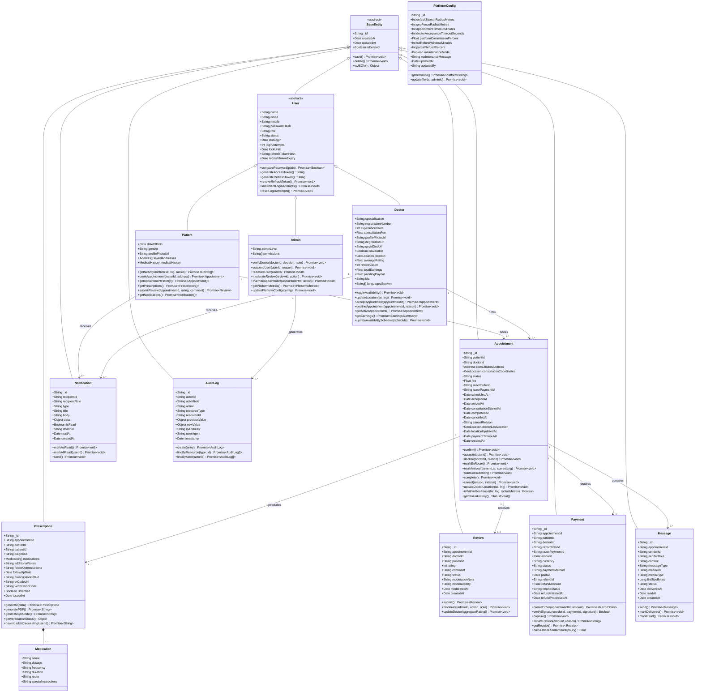
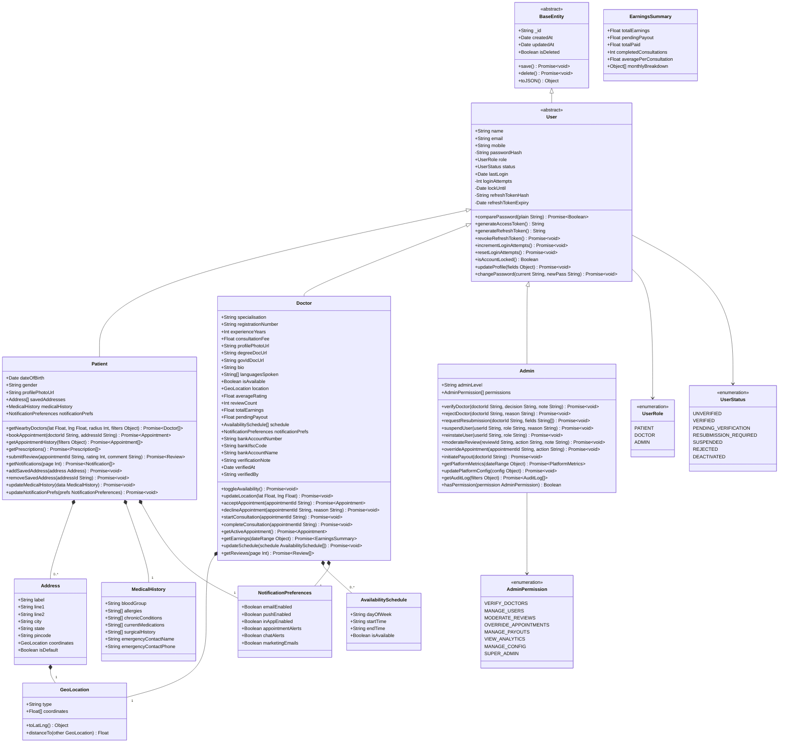
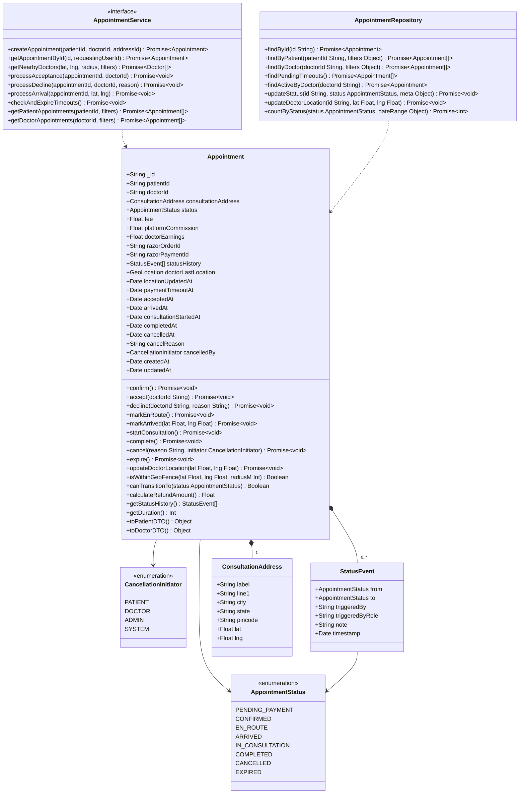
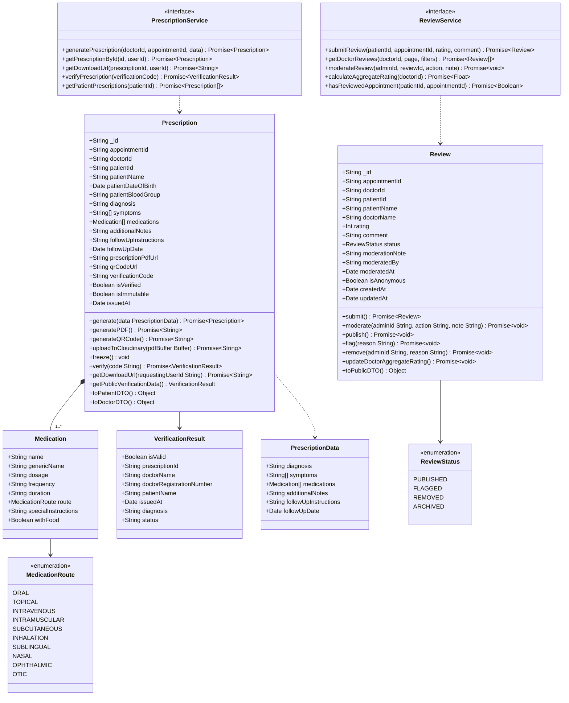
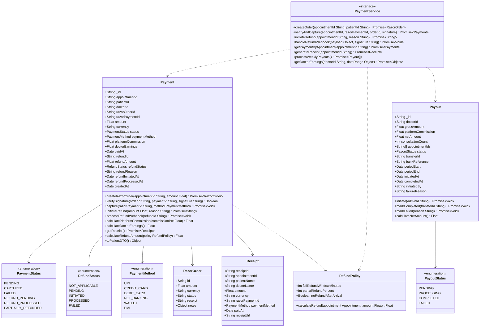
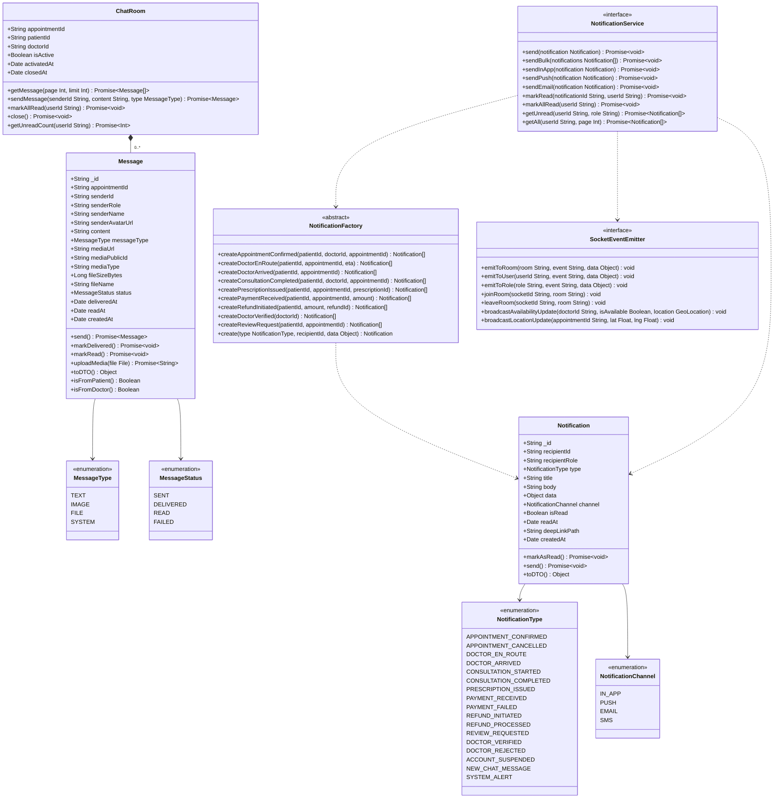
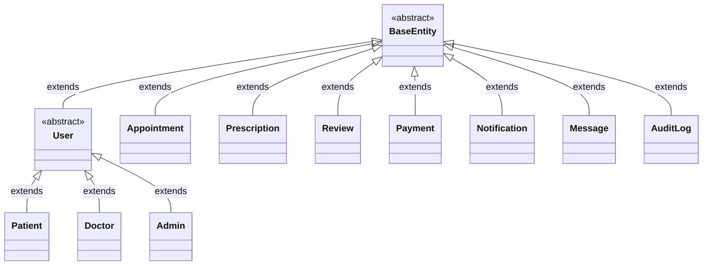

# DocDock — Class Diagram Specification

**Document ID:** DOCDOCK-CLS-v1.0  
**Project Name:** DocDock  
**Tagline:** *"Knock-Knock, your doctor is here."*  
**Document Type:** Class Diagram Specification  
**Version:** 1.0.0  
**Status:** Draft  
**Prepared By:** Engineering Team  
**Last Updated:** June 2025  

---

## Table of Contents

1. [Introduction](#1-introduction)
2. [Notation Guide](#2-notation-guide)
3. [Master Class Diagram — Full System](#3-master-class-diagram--full-system)
4. [Module 1 — User Domain](#4-module-1--user-domain)
5. [Module 2 — Appointment Domain](#5-module-2--appointment-domain)
6. [Module 3 — Clinical Domain](#6-module-3--clinical-domain)
7. [Module 4 — Financial Domain](#7-module-4--financial-domain)
8. [Module 5 — Communication Domain](#8-module-5--communication-domain)
9. [Class Specifications](#9-class-specifications)
10. [Relationship Summary](#10-relationship-summary)
11. [MongoDB Schema Mapping](#11-mongodb-schema-mapping)

---

## 1. Introduction

This document specifies the object-oriented class model for the DocDock platform. Each class represents a domain entity that maps to a MongoDB collection, an Express.js Mongoose model, and a set of service-layer methods. The diagrams capture attributes with types and visibility, methods with signatures, and all inter-class relationships including inheritance, composition, aggregation, and association.

The class model is structured across five cohesive domains:

- **User Domain** — identity, authentication, and role-specific profiles
- **Appointment Domain** — booking lifecycle and status management
- **Clinical Domain** — prescriptions, medications, and medical history
- **Financial Domain** — payments, refunds, and earnings
- **Communication Domain** — chat messages and notifications

These diagrams are the primary reference for:

- Mongoose schema definition and model design
- Service layer and repository pattern implementation
- API contract design and DTO mapping
- Database indexing strategy

---

## 2. Notation Guide

| Symbol | Meaning |
|---|---|
| `+` | Public visibility |
| `-` | Private visibility |
| `#` | Protected visibility |
| `~` | Package / internal visibility |
| `<<abstract>>` | Abstract class — cannot be instantiated |
| `<<interface>>` | Interface definition |
| `<<enumeration>>` | Enumerated type |
| `<\|--` | Inheritance (generalisation) |
| `*--` | Composition (strong ownership) |
| `o--` | Aggregation (weak ownership) |
| `-->` | Association (directed) |
| `..>` | Dependency (uses) |
| `"1"`, `"0..*"` | Multiplicity on relationship ends |

---

## 3. Master Class Diagram — Full System

The master diagram presents all classes and their relationships at a structural level, providing a bird's-eye view of the entire domain model before each module is detailed individually.

---

## 4. Module 1 — User Domain

### 4.1 Description

The User domain implements a class hierarchy with `BaseEntity` as the root persistence class and `User` as the abstract identity class. `Patient`, `Doctor`, and `Admin` inherit from `User`, each extending it with role-specific attributes and methods. This structure maps to MongoDB's single-collection inheritance pattern using a discriminator `role` field.

### 4.2 Class Diagram

---

## 5. Module 2 — Appointment Domain

### 5.1 Description

The Appointment domain is the operational core of DocDock. The `Appointment` class manages the full booking lifecycle through a strict status state machine. The `AppointmentStatus` enumeration defines all valid states and their transitions are enforced at the method level.

### 5.2 Class Diagram

---

## 6. Module 3 — Clinical Domain

### 6.1 Description

The Clinical domain encompasses `Prescription` and its composed `Medication` items, as well as the `Review` class which captures post-consultation patient feedback. The `Prescription` class handles PDF generation, QR code embedding, and verification — while `Review` manages the rating lifecycle and aggregate score maintenance.

### 6.2 Class Diagram

---

## 7. Module 4 — Financial Domain

### 7.1 Description

The Financial domain manages all monetary operations through the `Payment` class, including Razorpay order creation, HMAC signature verification, capture recording, refund initiation, and payout processing. The `Payout` class manages doctor earnings disbursement and the `Receipt` value object represents generated payment receipts.

### 7.2 Class Diagram

---

## 8. Module 5 — Communication Domain

### 8.1 Description

The Communication domain covers the `Message` class for real-time in-appointment chat and the `Notification` class for system-generated alerts across all channels (in-app, push, email). The `NotificationFactory` implements the factory pattern to construct the appropriate notification type based on the triggering event.

### 8.2 Class Diagram

---

## 9. Class Specifications

Detailed attribute and method reference for each primary class.

### 9.1 BaseEntity

| Member | Type | Visibility | Description |
|---|---|---|---|
| `_id` | `String` | `+` | MongoDB ObjectId as string |
| `createdAt` | `Date` | `+` | Auto-set on document creation (Mongoose timestamps) |
| `updatedAt` | `Date` | `+` | Auto-updated on every save |
| `isDeleted` | `Boolean` | `+` | Soft delete flag (default: false) |
| `save()` | `Promise<void>` | `+` | Persist document to MongoDB |
| `delete()` | `Promise<void>` | `+` | Soft-delete document (sets isDeleted: true) |
| `toJSON()` | `Object` | `+` | Serialise document, stripping private fields |

### 9.2 User (Abstract)

| Member | Type | Visibility | Description |
|---|---|---|---|
| `name` | `String` | `+` | Full legal name |
| `email` | `String` | `+` | Unique, indexed, lowercase |
| `mobile` | `String` | `+` | Unique, E.164 format |
| `passwordHash` | `String` | `-` | bcrypt hash, never serialised to JSON |
| `role` | `UserRole` | `+` | Discriminator field: patient / doctor / admin |
| `status` | `UserStatus` | `+` | Account lifecycle status |
| `lastLogin` | `Date` | `+` | Timestamp of most recent successful login |
| `loginAttempts` | `Int` | `-` | Consecutive failed login count |
| `lockUntil` | `Date` | `-` | Lockout expiry; null if not locked |
| `refreshTokenHash` | `String` | `-` | SHA-256 hash of current refresh token |
| `refreshTokenExpiry` | `Date` | `-` | Expiry of current refresh token |
| `comparePassword(plain)` | `Promise<Boolean>` | `+` | bcrypt.compare against stored hash |
| `generateAccessToken()` | `String` | `+` | Signs JWT; exp: 15 min |
| `generateRefreshToken()` | `String` | `+` | UUID v4; stores hash in DB |
| `revokeRefreshToken()` | `Promise<void>` | `+` | Nullifies token hash and expiry |
| `incrementLoginAttempts()` | `Promise<void>` | `+` | Increments counter; locks after 5 |
| `resetLoginAttempts()` | `Promise<void>` | `+` | Resets counter and lock on success |
| `isAccountLocked()` | `Boolean` | `+` | True if loginAttempts ≥ 5 and lockUntil > now |

### 9.3 Appointment

| Member | Type | Visibility | Description |
|---|---|---|---|
| `status` | `AppointmentStatus` | `+` | Current lifecycle status |
| `fee` | `Float` | `+` | Doctor's consultation fee at time of booking |
| `platformCommission` | `Float` | `+` | Calculated platform fee (fee × commissionPct) |
| `doctorEarnings` | `Float` | `+` | fee − platformCommission |
| `doctorLastLocation` | `GeoLocation` | `+` | Latest broadcasted doctor position |
| `paymentTimeoutAt` | `Date` | `+` | 10-minute booking payment deadline |
| `statusHistory` | `StatusEvent[]` | `+` | Immutable log of all status transitions |
| `canTransitionTo(status)` | `Boolean` | `+` | Validates state machine rules |
| `isWithinGeoFence(lat, lng, r)` | `Boolean` | `+` | Haversine check for arrival confirmation |
| `calculateRefundAmount()` | `Float` | `+` | Policy-based refund calculation |
| `getDuration()` | `Int` | `+` | Consultation duration in minutes |

### 9.4 Payment

| Member | Type | Visibility | Description |
|---|---|---|---|
| `razorOrderId` | `String` | `+` | Razorpay Order ID (prefix: `order_`) |
| `razorPaymentId` | `String` | `+` | Razorpay Payment ID (prefix: `pay_`) |
| `status` | `PaymentStatus` | `+` | Current payment lifecycle status |
| `platformCommission` | `Float` | `+` | Platform's cut from the transaction |
| `doctorEarnings` | `Float` | `+` | Amount owed to doctor post-commission |
| `refundId` | `String` | `+` | Razorpay Refund ID (prefix: `rfnd_`) |
| `verifySignature(oId, pId, sig)` | `Boolean` | `+` | HMAC-SHA256 via timingSafeEqual |
| `calculatePlatformCommission(pct)` | `Float` | `+` | amount × (pct / 100) |
| `calculateDoctorEarnings()` | `Float` | `+` | amount − platformCommission |

---

## 10. Relationship Summary

### 10.1 Inheritance Relationships

### 10.2 Association and Composition Map

| Relationship | From | To | Multiplicity | Type | Description |
|---|---|---|---|---|---|
| books | Patient | Appointment | 1 → 0..* | Association | Patient initiates appointments |
| fulfils | Doctor | Appointment | 1 → 0..* | Association | Doctor services appointments |
| generates | Appointment | Prescription | 1 → 0..1 | Association | One prescription per appointment |
| receives | Appointment | Review | 1 → 0..1 | Association | One review per appointment |
| requires | Appointment | Payment | 1 → 1 | Association | Every appointment has a payment |
| contains | Appointment | Message | 1 → 0..* | Aggregation | Chat history per appointment |
| composed of | Prescription | Medication | 1 → 1..* | Composition | Medications exist within prescription |
| hosted by | ChatRoom | Message | 1 → 0..* | Composition | Messages belong to a chat room |
| receives | Patient | Notification | 1 → 0..* | Association | Patient notification delivery |
| receives | Doctor | Notification | 1 → 0..* | Association | Doctor notification delivery |
| generates | Admin | AuditLog | 1 → 0..* | Association | All admin actions are logged |

### 10.3 Dependency Relationships

| From | To | Description |
|---|---|---|
| `AppointmentService` | `Appointment` | Service orchestrates appointment operations |
| `AppointmentService` | `Doctor` | Queries available doctors |
| `PaymentService` | `Payment` | Creates and captures payments |
| `PaymentService` | `Payout` | Manages doctor payout records |
| `ReviewService` | `Review` | Manages review lifecycle |
| `ReviewService` | `Doctor` | Updates aggregate rating |
| `PrescriptionService` | `Prescription` | Generates and serves prescriptions |
| `NotificationService` | `Notification` | Dispatches notifications |
| `NotificationFactory` | `Notification` | Constructs typed notifications |
| `NotificationService` | `SocketEventEmitter` | Real-time in-app delivery |

---

## 11. MongoDB Schema Mapping

Each class maps to a MongoDB collection with the following conventions.

| Class | Collection Name | Key Indexes | Notes |
|---|---|---|---|
| `Patient` | `users` | `email (unique)`, `mobile (unique)`, `role` | Shared collection with Doctor / Admin via discriminator |
| `Doctor` | `users` | `email (unique)`, `registrationNumber (unique)`, `location (2dsphere)`, `isAvailable`, `status` | 2dsphere index enables `$near` geo-queries |
| `Admin` | `users` | `email (unique)` | Role discriminator: `admin` |
| `Appointment` | `appointments` | `patientId`, `doctorId`, `status`, `paymentTimeoutAt (TTL)`, `createdAt` | TTL index on `paymentTimeoutAt` auto-expires stale bookings |
| `Prescription` | `prescriptions` | `appointmentId (unique)`, `patientId`, `verificationCode (unique)` | `isImmutable: true` enforced at schema level |
| `Review` | `reviews` | `appointmentId (unique)`, `doctorId`, `status` | Unique on appointmentId prevents duplicate reviews |
| `Payment` | `payments` | `appointmentId (unique)`, `razorOrderId`, `razorPaymentId`, `refundId` | All Razorpay IDs indexed for webhook lookup |
| `Payout` | `payouts` | `doctorId`, `status`, `periodStart` | Compound index for weekly batch queries |
| `Notification` | `notifications` | `recipientId`, `isRead`, `createdAt` | TTL index: auto-delete after 90 days |
| `Message` | `messages` | `appointmentId`, `createdAt` | Compound index for pagination queries |
| `AuditLog` | `auditlogs` | `actorId`, `resourceType`, `resourceId`, `timestamp` | Immutable — no update or delete operations |
| `PlatformConfig` | `configs` | `_id (singleton)` | Single document; fetched via `getInstance()` |

### Index Strategy Notes

- The `users.location` field on Doctor documents uses a **GeoJSON Point** type with a `2dsphere` index to support MongoDB's `$near` and `$geoWithin` operators for the nearby doctor search.
- `appointments.paymentTimeoutAt` carries a **TTL index** with `expireAfterSeconds: 0`, which MongoDB evaluates against the field value itself — appointments in `pending_payment` state are automatically expired by MongoDB if not converted to `confirmed` within the window.
- All Razorpay identifiers (`razorOrderId`, `razorPaymentId`, `refundId`) are individually indexed to enable O(1) lookup during webhook processing.
- `reviews.appointmentId` carries a **sparse unique index** to enforce the one-review-per-appointment constraint at the database layer, not just the application layer.

---

*End of DocDock Class Diagram Specification v1.0*  
*© 2025 DocDock. All rights reserved.*
