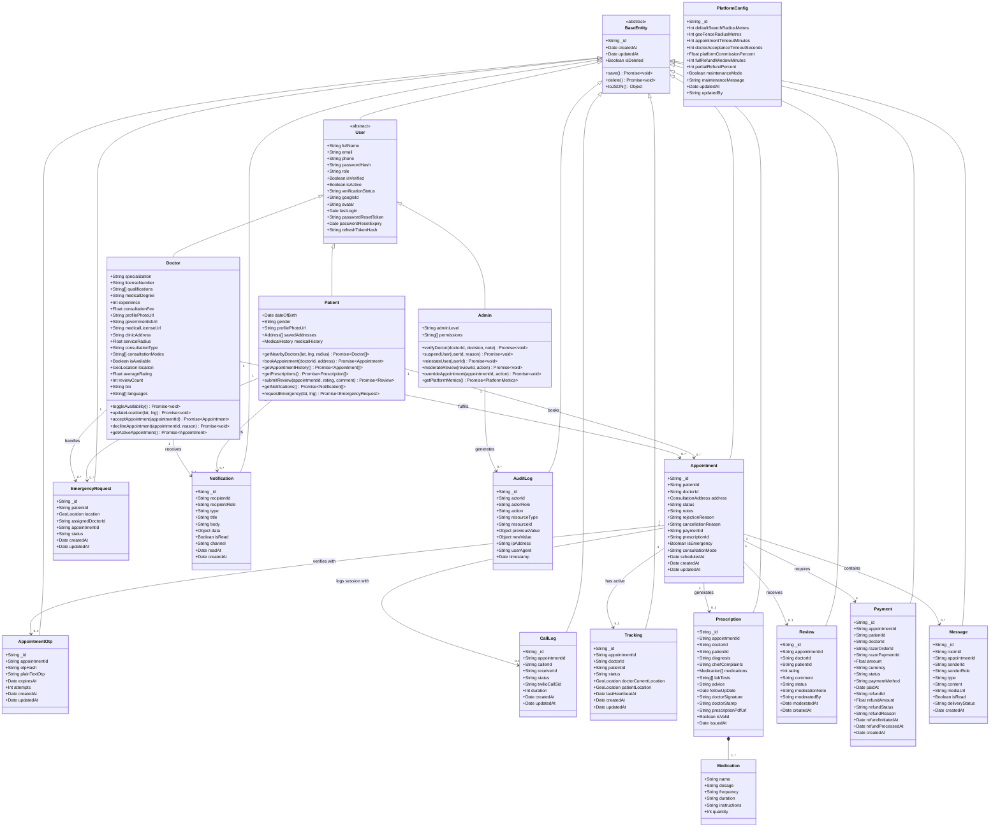
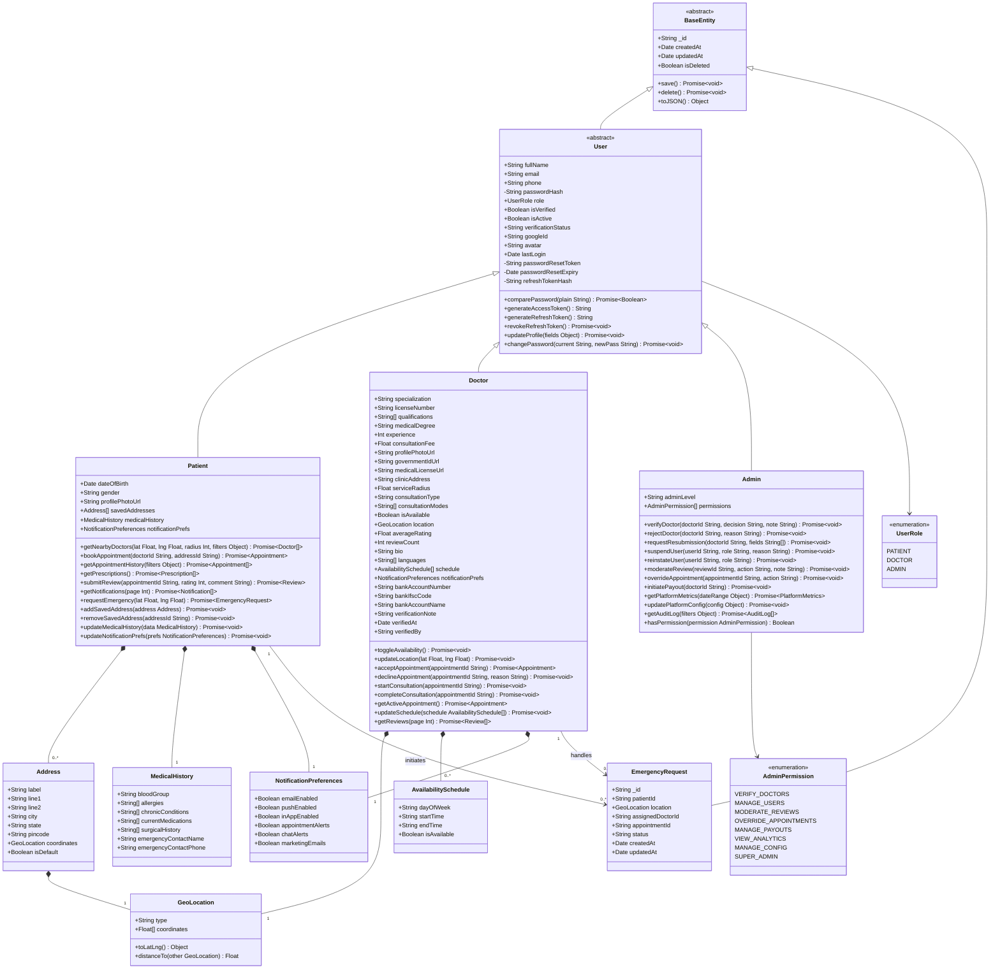
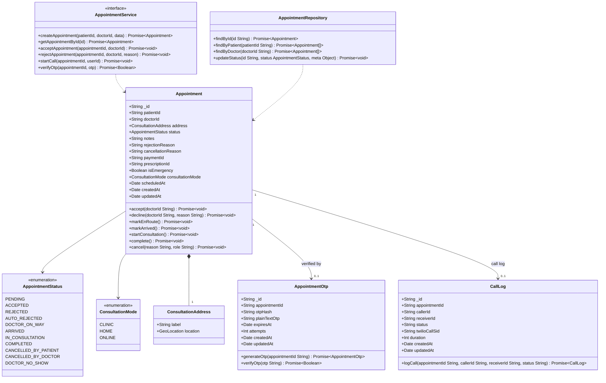
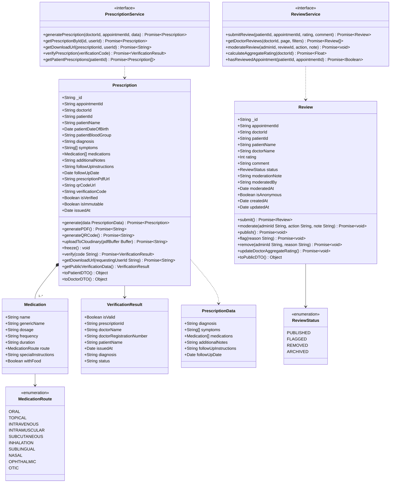
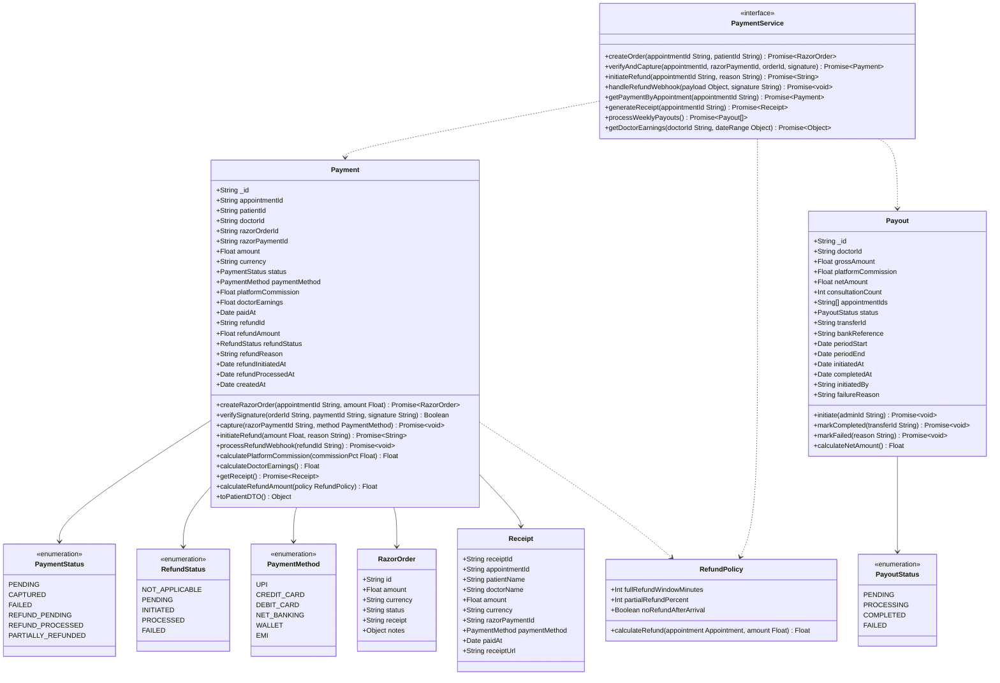
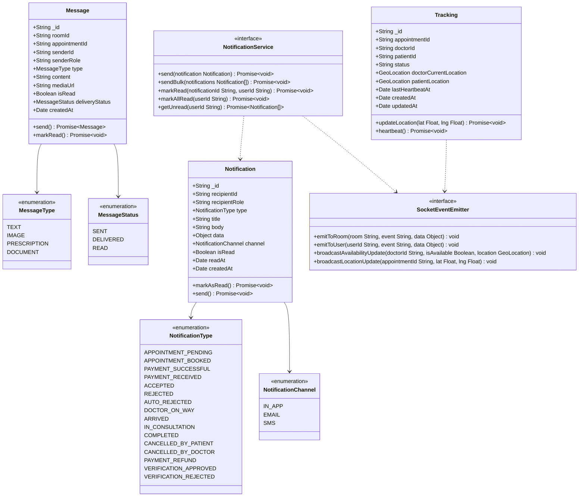
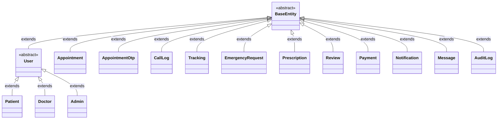

# DocDock — Class Diagram Specification

**Document ID:** DOCDOCK-CLS-v1.0  
**Project Name:** DocDock  
**Tagline:** *"Knock-Knock, your doctor is here."*  
**Document Type:** Class Diagram Specification  
**Version:** 1.0.0  
**Status:** Draft  
**Prepared By:** Engineering Team  
**Last Updated:** June 2025  

---

## Table of Contents

1. [Introduction](#1-introduction)
2. [Notation Guide](#2-notation-guide)
3. [Master Class Diagram — Full System](#3-master-class-diagram--full-system)
4. [Module 1 — User Domain](#4-module-1--user-domain)
5. [Module 2 — Appointment Domain](#5-module-2--appointment-domain)
6. [Module 3 — Clinical Domain](#6-module-3--clinical-domain)
7. [Module 4 — Financial Domain](#7-module-4--financial-domain)
8. [Module 5 — Communication Domain](#8-module-5--communication-domain)
9. [Class Specifications](#9-class-specifications)
10. [Relationship Summary](#10-relationship-summary)
11. [MongoDB Schema Mapping](#11-mongodb-schema-mapping)

---

## 1. Introduction

This document specifies the object-oriented class model for the DocDock platform. Each class represents a domain entity that maps to a MongoDB collection, an Express.js Mongoose model, and a set of service-layer methods. The diagrams capture attributes with types and visibility, methods with signatures, and all inter-class relationships including inheritance, composition, aggregation, and association.

The class model is structured across five cohesive domains:

- **User Domain** — identity, authentication, and role-specific profiles
- **Appointment Domain** — booking lifecycle and status management
- **Clinical Domain** — prescriptions, medications, and medical history
- **Financial Domain** — payments, refunds, and earnings
- **Communication Domain** — chat messages and notifications

These diagrams are the primary reference for:

- Mongoose schema definition and model design
- Service layer and repository pattern implementation
- API contract design and DTO mapping
- Database indexing strategy

---

## 2. Notation Guide

| Symbol | Meaning |
|---|---|
| `+` | Public visibility |
| `-` | Private visibility |
| `#` | Protected visibility |
| `~` | Package / internal visibility |
| `<<abstract>>` | Abstract class — cannot be instantiated |
| `<<interface>>` | Interface definition |
| `<<enumeration>>` | Enumerated type |
| `<\|--` | Inheritance (generalisation) |
| `*--` | Composition (strong ownership) |
| `o--` | Aggregation (weak ownership) |
| `-->` | Association (directed) |
| `..>` | Dependency (uses) |
| `"1"`, `"0..*"` | Multiplicity on relationship ends |

---

## 3. Master Class Diagram — Full System

The master diagram presents all classes and their relationships at a structural level, providing a bird's-eye view of the entire domain model before each module is detailed individually.

```mermaid
classDiagram
    direction TB

    %% ── Inheritance Hierarchy ──
    class BaseEntity {
        <<abstract>>
        +String _id
        +Date createdAt
        +Date updatedAt
        +Boolean isDeleted
        +save() Promise~void~
        +delete() Promise~void~
        +toJSON() Object
    }

    class User {
        <<abstract>>
        +String fullName
        +String email
        +String phone
        +String passwordHash
        +String role
        +Boolean isVerified
        +Boolean isActive
        +String verificationStatus
        +String googleId
        +String avatar
        +Date lastLogin
        +String passwordResetToken
        +Date passwordResetExpiry
        +String refreshTokenHash
    }

    class Patient {
        +Date dateOfBirth
        +String gender
        +String profilePhotoUrl
        +Address[] savedAddresses
        +MedicalHistory medicalHistory
        +getNearbyDoctors(lat, lng, radius) Promise~Doctor[]~
        +bookAppointment(doctorId, address) Promise~Appointment~
        +getAppointmentHistory() Promise~Appointment[]~
        +getPrescriptions() Promise~Prescription[]~
        +submitReview(appointmentId, rating, comment) Promise~Review~
        +getNotifications() Promise~Notification[]~
        +requestEmergency(lat, lng) Promise~EmergencyRequest~
    }

    class Doctor {
        +String specialization
        +String licenseNumber
        +String[] qualifications
        +String medicalDegree
        +Int experience
        +Float consultationFee
        +String profilePhotoUrl
        +String governmentIdUrl
        +String medicalLicenseUrl
        +String clinicAddress
        +Float serviceRadius
        +String consultationType
        +String[] consultationModes
        +Boolean isAvailable
        +GeoLocation location
        +Float averageRating
        +Int reviewCount
        +String bio
        +String[] languages
        +toggleAvailability() Promise~void~
        +updateLocation(lat, lng) Promise~void~
        +acceptAppointment(appointmentId) Promise~Appointment~
        +declineAppointment(appointmentId, reason) Promise~void~
        +getActiveAppointment() Promise~Appointment~
    }

    class Admin {
        +String adminLevel
        +String[] permissions
        +verifyDoctor(doctorId, decision, note) Promise~void~
        +suspendUser(userId, reason) Promise~void~
        +reinstateUser(userId) Promise~void~
        +moderateReview(reviewId, action) Promise~void~
        +overrideAppointment(appointmentId, action) Promise~void~
        +getPlatformMetrics() Promise~PlatformMetrics~
    }

    class Appointment {
        +String _id
        +String patientId
        +String doctorId
        +ConsultationAddress address
        +String status
        +String notes
        +String rejectionReason
        +String cancellationReason
        +String paymentId
        +String prescriptionId
        +Boolean isEmergency
        +String consultationMode
        +Date scheduledAt
        +Date createdAt
        +Date updatedAt
    }

    class AppointmentOtp {
        +String _id
        +String appointmentId
        +String otpHash
        +String plainTextOtp
        +Date expiresAt
        +Int attempts
        +Date createdAt
        +Date updatedAt
    }

    class CallLog {
        +String _id
        +String appointmentId
        +String callerId
        +String receiverId
        +String status
        +String twilioCallSid
        +Int duration
        +Date createdAt
        +Date updatedAt
    }

    class Tracking {
        +String _id
        +String appointmentId
        +String doctorId
        +String patientId
        +String status
        +GeoLocation doctorCurrentLocation
        +GeoLocation patientLocation
        +Date lastHeartbeatAt
        +Date createdAt
        +Date updatedAt
    }

    class EmergencyRequest {
        +String _id
        +String patientId
        +GeoLocation location
        +String assignedDoctorId
        +String appointmentId
        +String status
        +Date createdAt
        +Date updatedAt
    }

    class Prescription {
        +String _id
        +String appointmentId
        +String doctorId
        +String patientId
        +String diagnosis
        +String chiefComplaints
        +Medication[] medications
        +String[] labTests
        +String advice
        +Date followUpDate
        +String doctorSignature
        +String doctorStamp
        +String prescriptionPdfUrl
        +Boolean isValid
        +Date issuedAt
    }

    class Medication {
        +String name
        +String dosage
        +String frequency
        +String duration
        +String instructions
        +Int quantity
    }

    class Review {
        +String _id
        +String appointmentId
        +String doctorId
        +String patientId
        +Int rating
        +String comment
        +String status
        +String moderationNote
        +String moderatedBy
        +Date moderatedAt
        +Date createdAt
    }

    class Payment {
        +String _id
        +String appointmentId
        +String patientId
        +String doctorId
        +String razorOrderId
        +String razorPaymentId
        +Float amount
        +String currency
        +String status
        +String paymentMethod
        +Date paidAt
        +String refundId
        +Float refundAmount
        +String refundStatus
        +String refundReason
        +Date refundInitiatedAt
        +Date refundProcessedAt
        +Date createdAt
    }

    class Notification {
        +String _id
        +String recipientId
        +String recipientRole
        +String type
        +String title
        +String body
        +Object data
        +Boolean isRead
        +String channel
        +Date readAt
        +Date createdAt
    }

    class Message {
        +String _id
        +String roomId
        +String appointmentId
        +String senderId
        +String senderRole
        +String type
        +String content
        +String mediaUrl
        +Boolean isRead
        +String deliveryStatus
        +Date createdAt
    }

    class AuditLog {
        +String _id
        +String actorId
        +String actorRole
        +String action
        +String resourceType
        +String resourceId
        +Object previousValue
        +Object newValue
        +String ipAddress
        +String userAgent
        +Date timestamp
    }

    class PlatformConfig {
        +String _id
        +Int defaultSearchRadiusMetres
        +Int geoFenceRadiusMetres
        +Int appointmentTimeoutMinutes
        +Int doctorAcceptanceTimeoutSeconds
        +Float platformCommissionPercent
        +Int fullRefundWindowMinutes
        +Int partialRefundPercent
        +Boolean maintenanceMode
        +String maintenanceMessage
        +Date updatedAt
        +String updatedBy
    }

    %% ── Inheritance ──
    BaseEntity <|-- User
    BaseEntity <|-- Appointment
    BaseEntity <|-- AppointmentOtp
    BaseEntity <|-- CallLog
    BaseEntity <|-- Tracking
    BaseEntity <|-- EmergencyRequest
    BaseEntity <|-- Prescription
    BaseEntity <|-- Review
    BaseEntity <|-- Payment
    BaseEntity <|-- Notification
    BaseEntity <|-- Message
    BaseEntity <|-- AuditLog
    User <|-- Patient
    User <|-- Doctor
    User <|-- Admin

    %% ── Composition ──
    Prescription *-- "1..*" Medication

    %% ── Associations ──
    Patient "1" --> "0..*" Appointment : books
    Doctor "1" --> "0..*" Appointment : fulfils
    Appointment "1" --> "0..1" AppointmentOtp : verifies with
    Appointment "1" --> "0..1" CallLog : logs session with
    Appointment "1" --> "0..1" Tracking : has active
    Appointment "1" --> "0..1" Prescription : generates
    Appointment "1" --> "0..1" Review : receives
    Appointment "1" --> "1" Payment : requires
    Appointment "1" --> "0..*" Message : contains
    Patient "1" --> "0..*" EmergencyRequest : initiates
    Doctor "1" --> "0..*" EmergencyRequest : handles
    Patient "1" --> "0..*" Notification : receives
    Doctor "1" --> "0..*" Notification : receives
    Admin "1" --> "0..*" AuditLog : generates
```

---

## 4. Module 1 — User Domain

### 4.1 Description

The User domain implements a class hierarchy with `BaseEntity` as the root persistence class and `User` as the abstract identity class. `Patient`, `Doctor`, and `Admin` inherit from `User`, each extending it with role-specific attributes and methods. This structure maps to MongoDB's single-collection inheritance pattern using a discriminator `role` field.

### 4.2 Class Diagram

```mermaid
classDiagram
    direction TB

    class BaseEntity {
        <<abstract>>
        +String _id
        +Date createdAt
        +Date updatedAt
        +Boolean isDeleted
        +save() Promise~void~
        +delete() Promise~void~
        +toJSON() Object
    }

    class UserRole {
        <<enumeration>>
        PATIENT
        DOCTOR
        ADMIN
    }

    class User {
        <<abstract>>
        +String fullName
        +String email
        +String phone
        -String passwordHash
        +UserRole role
        +Boolean isVerified
        +Boolean isActive
        +String verificationStatus
        +String googleId
        +String avatar
        +Date lastLogin
        -String passwordResetToken
        -Date passwordResetExpiry
        -String refreshTokenHash
        +comparePassword(plain String) Promise~Boolean~
        +generateAccessToken() String
        +generateRefreshToken() String
        +revokeRefreshToken() Promise~void~
        +updateProfile(fields Object) Promise~void~
        +changePassword(current String, newPass String) Promise~void~
    }

    class Address {
        +String label
        +String line1
        +String line2
        +String city
        +String state
        +String pincode
        +GeoLocation coordinates
        +Boolean isDefault
    }

    class GeoLocation {
        +String type
        +Float[] coordinates
        +toLatLng() Object
        +distanceTo(other GeoLocation) Float
    }

    class MedicalHistory {
        +String bloodGroup
        +String[] allergies
        +String[] chronicConditions
        +String[] currentMedications
        +String[] surgicalHistory
        +String emergencyContactName
        +String emergencyContactPhone
    }

    class NotificationPreferences {
        +Boolean emailEnabled
        +Boolean pushEnabled
        +Boolean inAppEnabled
        +Boolean appointmentAlerts
        +Boolean chatAlerts
        +Boolean marketingEmails
    }

    class Patient {
        +Date dateOfBirth
        +String gender
        +String profilePhotoUrl
        +Address[] savedAddresses
        +MedicalHistory medicalHistory
        +NotificationPreferences notificationPrefs
        +getNearbyDoctors(lat Float, lng Float, radius Int, filters Object) Promise~Doctor[]~
        +bookAppointment(doctorId String, addressId String) Promise~Appointment~
        +getAppointmentHistory(filters Object) Promise~Appointment[]~
        +getPrescriptions() Promise~Prescription[]~
        +submitReview(appointmentId String, rating Int, comment String) Promise~Review~
        +getNotifications(page Int) Promise~Notification[]~
        +requestEmergency(lat Float, lng Float) Promise~EmergencyRequest~
        +addSavedAddress(address Address) Promise~void~
        +removeSavedAddress(addressId String) Promise~void~
        +updateMedicalHistory(data MedicalHistory) Promise~void~
        +updateNotificationPrefs(prefs NotificationPreferences) Promise~void~
    }

    class AvailabilitySchedule {
        +String dayOfWeek
        +String startTime
        +String endTime
        +Boolean isAvailable
    }

    class Doctor {
        +String specialization
        +String licenseNumber
        +String[] qualifications
        +String medicalDegree
        +Int experience
        +Float consultationFee
        +String profilePhotoUrl
        +String governmentIdUrl
        +String medicalLicenseUrl
        +String clinicAddress
        +Float serviceRadius
        +String consultationType
        +String[] consultationModes
        +Boolean isAvailable
        +GeoLocation location
        +Float averageRating
        +Int reviewCount
        +String bio
        +String[] languages
        +AvailabilitySchedule[] schedule
        +NotificationPreferences notificationPrefs
        +String bankAccountNumber
        +String bankIfscCode
        +String bankAccountName
        +String verificationNote
        +Date verifiedAt
        +String verifiedBy
        +toggleAvailability() Promise~void~
        +updateLocation(lat Float, lng Float) Promise~void~
        +acceptAppointment(appointmentId String) Promise~Appointment~
        +declineAppointment(appointmentId String, reason String) Promise~void~
        +startConsultation(appointmentId String) Promise~void~
        +completeConsultation(appointmentId String) Promise~void~
        +getActiveAppointment() Promise~Appointment~
        +updateSchedule(schedule AvailabilitySchedule[]) Promise~void~
        +getReviews(page Int) Promise~Review[]~
    }

    class AdminPermission {
        <<enumeration>>
        VERIFY_DOCTORS
        MANAGE_USERS
        MODERATE_REVIEWS
        OVERRIDE_APPOINTMENTS
        MANAGE_PAYOUTS
        VIEW_ANALYTICS
        MANAGE_CONFIG
        SUPER_ADMIN
    }

    class Admin {
        +String adminLevel
        +AdminPermission[] permissions
        +verifyDoctor(doctorId String, decision String, note String) Promise~void~
        +rejectDoctor(doctorId String, reason String) Promise~void~
        +requestResubmission(doctorId String, fields String[]) Promise~void~
        +suspendUser(userId String, role String, reason String) Promise~void~
        +reinstateUser(userId String, role String) Promise~void~
        +moderateReview(reviewId String, action String, note String) Promise~void~
        +overrideAppointment(appointmentId String, action String) Promise~void~
        +initiatePayout(doctorId String) Promise~void~
        +getPlatformMetrics(dateRange Object) Promise~PlatformMetrics~
        +updatePlatformConfig(config Object) Promise~void~
        +getAuditLog(filters Object) Promise~AuditLog[]~
        +hasPermission(permission AdminPermission) Boolean
    }

    class EmergencyRequest {
        +String _id
        +String patientId
        +GeoLocation location
        +String assignedDoctorId
        +String appointmentId
        +String status
        +Date createdAt
        +Date updatedAt
    }

    %% Inheritance
    BaseEntity <|-- User
    BaseEntity <|-- EmergencyRequest
    User <|-- Patient
    User <|-- Doctor
    User <|-- Admin

    %% Enumerations
    User --> UserRole
    Admin --> AdminPermission

    %% Composition
    Patient *-- "0..*" Address
    Patient *-- "1" MedicalHistory
    Patient *-- "1" NotificationPreferences
    Doctor *-- "1" GeoLocation
    Doctor *-- "0..*" AvailabilitySchedule
    Doctor *-- "1" NotificationPreferences
    Address *-- "1" GeoLocation
    Patient "1" --> "0..*" EmergencyRequest : initiates
    Doctor "1" --> "0..*" EmergencyRequest : handles

```

---

## 5. Module 2 — Appointment Domain

### 5.1 Description

The Appointment domain is the operational core of DocDock. The `Appointment` class manages the full booking lifecycle through a strict status state machine. The `AppointmentStatus` enumeration defines all valid states and their transitions are enforced at the method level.

### 5.2 Class Diagram

```mermaid
classDiagram
    direction TB

    class AppointmentStatus {
        <<enumeration>>
        PENDING
        ACCEPTED
        REJECTED
        AUTO_REJECTED
        DOCTOR_ON_WAY
        ARRIVED
        IN_CONSULTATION
        COMPLETED
        CANCELLED_BY_PATIENT
        CANCELLED_BY_DOCTOR
        DOCTOR_NO_SHOW
    }

    class ConsultationMode {
        <<enumeration>>
        CLINIC
        HOME
        ONLINE
    }

    class ConsultationAddress {
        +String label
        +GeoLocation location
    }

    class Appointment {
        +String _id
        +String patientId
        +String doctorId
        +ConsultationAddress address
        +AppointmentStatus status
        +String notes
        +String rejectionReason
        +String cancellationReason
        +String paymentId
        +String prescriptionId
        +Boolean isEmergency
        +ConsultationMode consultationMode
        +Date scheduledAt
        +Date createdAt
        +Date updatedAt
        +accept(doctorId String) Promise~void~
        +decline(doctorId String, reason String) Promise~void~
        +markEnRoute() Promise~void~
        +markArrived() Promise~void~
        +startConsultation() Promise~void~
        +complete() Promise~void~
        +cancel(reason String, role String) Promise~void~
    }

    class AppointmentOtp {
        +String _id
        +String appointmentId
        +String otpHash
        +String plainTextOtp
        +Date expiresAt
        +Int attempts
        +Date createdAt
        +Date updatedAt
        +generateOtp(appointmentId String) Promise~AppointmentOtp~
        +verifyOtp(otp String) Promise~Boolean~
    }

    class CallLog {
        +String _id
        +String appointmentId
        +String callerId
        +String receiverId
        +String status
        +String twilioCallSid
        +Int duration
        +Date createdAt
        +Date updatedAt
        +logCall(appointmentId String, callerId String, receiverId String, status String) Promise~CallLog~
    }

    class AppointmentService {
        <<interface>>
        +createAppointment(patientId, doctorId, data) Promise~Appointment~
        +getAppointmentById(id) Promise~Appointment~
        +acceptAppointment(appointmentId, doctorId) Promise~void~
        +rejectAppointment(appointmentId, doctorId, reason) Promise~void~
        +startCall(appointmentId, userId) Promise~void~
        +verifyOtp(appointmentId, otp) Promise~Boolean~
    }

    class AppointmentRepository {
        +findById(id String) Promise~Appointment~
        +findByPatient(patientId String) Promise~Appointment[]~
        +findByDoctor(doctorId String) Promise~Appointment[]~
        +updateStatus(id String, status AppointmentStatus, meta Object) Promise~void~
    }

    Appointment --> AppointmentStatus
    Appointment --> ConsultationMode
    Appointment *-- "1" ConsultationAddress
    Appointment "1" --> "0..1" AppointmentOtp : verified by
    Appointment "1" --> "0..1" CallLog : call log
    AppointmentService ..> Appointment
    AppointmentRepository ..> Appointment
```

---

## 6. Module 3 — Clinical Domain

### 6.1 Description

The Clinical domain encompasses `Prescription` and its composed `Medication` items, as well as the `Review` class which captures post-consultation patient feedback. The `Prescription` class handles PDF generation, QR code embedding, and verification — while `Review` manages the rating lifecycle and aggregate score maintenance.

### 6.2 Class Diagram

```mermaid
classDiagram
    direction TB

    class MedicationRoute {
        <<enumeration>>
        ORAL
        TOPICAL
        INTRAVENOUS
        INTRAMUSCULAR
        SUBCUTANEOUS
        INHALATION
        SUBLINGUAL
        NASAL
        OPHTHALMIC
        OTIC
    }

    class Medication {
        +String name
        +String genericName
        +String dosage
        +String frequency
        +String duration
        +MedicationRoute route
        +String specialInstructions
        +Boolean withFood
    }

    class Prescription {
        +String _id
        +String appointmentId
        +String doctorId
        +String patientId
        +String patientName
        +Date patientDateOfBirth
        +String patientBloodGroup
        +String diagnosis
        +String[] symptoms
        +Medication[] medications
        +String additionalNotes
        +String followUpInstructions
        +Date followUpDate
        +String prescriptionPdfUrl
        +String qrCodeUrl
        +String verificationCode
        +Boolean isVerified
        +Boolean isImmutable
        +Date issuedAt
        +generate(data PrescriptionData) Promise~Prescription~
        +generatePDF() Promise~String~
        +generateQRCode() Promise~String~
        +uploadToCloudinary(pdfBuffer Buffer) Promise~String~
        +freeze() void
        +verify(code String) Promise~VerificationResult~
        +getDownloadUrl(requestingUserId String) Promise~String~
        +getPublicVerificationData() VerificationResult
        +toPatientDTO() Object
        +toDoctorDTO() Object
    }

    class VerificationResult {
        +Boolean isValid
        +String prescriptionId
        +String doctorName
        +String doctorRegistrationNumber
        +String patientName
        +Date issuedAt
        +String diagnosis
        +String status
    }

    class PrescriptionData {
        +String diagnosis
        +String[] symptoms
        +Medication[] medications
        +String additionalNotes
        +String followUpInstructions
        +Date followUpDate
    }

    class ReviewStatus {
        <<enumeration>>
        PUBLISHED
        FLAGGED
        REMOVED
        ARCHIVED
    }

    class Review {
        +String _id
        +String appointmentId
        +String doctorId
        +String patientId
        +String patientName
        +String doctorName
        +Int rating
        +String comment
        +ReviewStatus status
        +String moderationNote
        +String moderatedBy
        +Date moderatedAt
        +Boolean isAnonymous
        +Date createdAt
        +Date updatedAt
        +submit() Promise~Review~
        +moderate(adminId String, action String, note String) Promise~void~
        +publish() Promise~void~
        +flag(reason String) Promise~void~
        +remove(adminId String, reason String) Promise~void~
        +updateDoctorAggregateRating() Promise~void~
        +toPublicDTO() Object
    }

    class ReviewService {
        <<interface>>
        +submitReview(patientId, appointmentId, rating, comment) Promise~Review~
        +getDoctorReviews(doctorId, page, filters) Promise~Review[]~
        +moderateReview(adminId, reviewId, action, note) Promise~void~
        +calculateAggregateRating(doctorId) Promise~Float~
        +hasReviewedAppointment(patientId, appointmentId) Promise~Boolean~
    }

    class PrescriptionService {
        <<interface>>
        +generatePrescription(doctorId, appointmentId, data) Promise~Prescription~
        +getPrescriptionById(id, userId) Promise~Prescription~
        +getDownloadUrl(prescriptionId, userId) Promise~String~
        +verifyPrescription(verificationCode) Promise~VerificationResult~
        +getPatientPrescriptions(patientId) Promise~Prescription[]~
    }

    Prescription *-- "1..*" Medication
    Prescription --> VerificationResult
    Prescription ..> PrescriptionData
    Medication --> MedicationRoute
    Review --> ReviewStatus
    ReviewService ..> Review
    PrescriptionService ..> Prescription
```

---

## 7. Module 4 — Financial Domain

### 7.1 Description

The Financial domain manages all monetary operations through the `Payment` class, including Razorpay order creation, HMAC signature verification, capture recording, refund initiation, and payout processing. The `Payout` class manages doctor earnings disbursement and the `Receipt` value object represents generated payment receipts.

### 7.2 Class Diagram

```mermaid
classDiagram
    direction TB

    class PaymentStatus {
        <<enumeration>>
        PENDING
        CAPTURED
        FAILED
        REFUND_PENDING
        REFUND_PROCESSED
        PARTIALLY_REFUNDED
    }

    class RefundStatus {
        <<enumeration>>
        NOT_APPLICABLE
        PENDING
        INITIATED
        PROCESSED
        FAILED
    }

    class PaymentMethod {
        <<enumeration>>
        UPI
        CREDIT_CARD
        DEBIT_CARD
        NET_BANKING
        WALLET
        EMI
    }

    class PayoutStatus {
        <<enumeration>>
        PENDING
        PROCESSING
        COMPLETED
        FAILED
    }

    class Payment {
        +String _id
        +String appointmentId
        +String patientId
        +String doctorId
        +String razorOrderId
        +String razorPaymentId
        +Float amount
        +String currency
        +PaymentStatus status
        +PaymentMethod paymentMethod
        +Float platformCommission
        +Float doctorEarnings
        +Date paidAt
        +String refundId
        +Float refundAmount
        +RefundStatus refundStatus
        +String refundReason
        +Date refundInitiatedAt
        +Date refundProcessedAt
        +Date createdAt
        +createRazorOrder(appointmentId String, amount Float) Promise~RazorOrder~
        +verifySignature(orderId String, paymentId String, signature String) Boolean
        +capture(razorPaymentId String, method PaymentMethod) Promise~void~
        +initiateRefund(amount Float, reason String) Promise~String~
        +processRefundWebhook(refundId String) Promise~void~
        +calculatePlatformCommission(commissionPct Float) Float
        +calculateDoctorEarnings() Float
        +getReceipt() Promise~Receipt~
        +calculateRefundAmount(policy RefundPolicy) Float
        +toPatientDTO() Object
    }

    class RazorOrder {
        +String id
        +Float amount
        +String currency
        +String status
        +String receipt
        +Object notes
    }

    class Receipt {
        +String receiptId
        +String appointmentId
        +String patientName
        +String doctorName
        +Float amount
        +String currency
        +String razorPaymentId
        +PaymentMethod paymentMethod
        +Date paidAt
        +String receiptUrl
    }

    class RefundPolicy {
        +Int fullRefundWindowMinutes
        +Int partialRefundPercent
        +Boolean noRefundAfterArrival
        +calculateRefund(appointment Appointment, amount Float) Float
    }

    class Payout {
        +String _id
        +String doctorId
        +Float grossAmount
        +Float platformCommission
        +Float netAmount
        +Int consultationCount
        +String[] appointmentIds
        +PayoutStatus status
        +String transferId
        +String bankReference
        +Date periodStart
        +Date periodEnd
        +Date initiatedAt
        +Date completedAt
        +String initiatedBy
        +String failureReason
        +initiate(adminId String) Promise~void~
        +markCompleted(transferId String) Promise~void~
        +markFailed(reason String) Promise~void~
        +calculateNetAmount() Float
    }

    class PaymentService {
        <<interface>>
        +createOrder(appointmentId String, patientId String) Promise~RazorOrder~
        +verifyAndCapture(appointmentId, razorPaymentId, orderId, signature) Promise~Payment~
        +initiateRefund(appointmentId String, reason String) Promise~String~
        +handleRefundWebhook(payload Object, signature String) Promise~void~
        +getPaymentByAppointment(appointmentId String) Promise~Payment~
        +generateReceipt(appointmentId String) Promise~Receipt~
        +processWeeklyPayouts() Promise~Payout[]~
        +getDoctorEarnings(doctorId String, dateRange Object) Promise~Object~
    }

    Payment --> PaymentStatus
    Payment --> RefundStatus
    Payment --> PaymentMethod
    Payment --> RazorOrder
    Payment --> Receipt
    Payment ..> RefundPolicy
    Payout --> PayoutStatus
    PaymentService ..> Payment
    PaymentService ..> Payout
    PaymentService ..> RefundPolicy
```

---

## 8. Module 5 — Communication Domain

### 8.1 Description

The Communication domain covers the `Message` class for real-time in-appointment chat and the `Notification` class for system-generated alerts across all channels (in-app, push, email). The `NotificationFactory` implements the factory pattern to construct the appropriate notification type based on the triggering event.

### 8.2 Class Diagram

```mermaid
classDiagram
    direction TB

    class MessageType {
        <<enumeration>>
        TEXT
        IMAGE
        PRESCRIPTION
        DOCUMENT
    }

    class MessageStatus {
        <<enumeration>>
        SENT
        DELIVERED
        READ
    }

    class NotificationType {
        <<enumeration>>
        APPOINTMENT_PENDING
        APPOINTMENT_BOOKED
        PAYMENT_SUCCESSFUL
        PAYMENT_RECEIVED
        ACCEPTED
        REJECTED
        AUTO_REJECTED
        DOCTOR_ON_WAY
        ARRIVED
        IN_CONSULTATION
        COMPLETED
        CANCELLED_BY_PATIENT
        CANCELLED_BY_DOCTOR
        PAYMENT_REFUND
        VERIFICATION_APPROVED
        VERIFICATION_REJECTED
    }

    class NotificationChannel {
        <<enumeration>>
        IN_APP
        EMAIL
        SMS
    }

    class Message {
        +String _id
        +String roomId
        +String appointmentId
        +String senderId
        +String senderRole
        +MessageType type
        +String content
        +String mediaUrl
        +Boolean isRead
        +MessageStatus deliveryStatus
        +Date createdAt
        +send() Promise~Message~
        +markRead() Promise~void~
    }

    class Tracking {
        +String _id
        +String appointmentId
        +String doctorId
        +String patientId
        +String status
        +GeoLocation doctorCurrentLocation
        +GeoLocation patientLocation
        +Date lastHeartbeatAt
        +Date createdAt
        +Date updatedAt
        +updateLocation(lat Float, lng Float) Promise~void~
        +heartbeat() Promise~void~
    }

    class Notification {
        +String _id
        +String recipientId
        +String recipientRole
        +NotificationType type
        +String title
        +String body
        +Object data
        +NotificationChannel channel
        +Boolean isRead
        +Date readAt
        +Date createdAt
        +markAsRead() Promise~void~
        +send() Promise~void~
    }

    class NotificationService {
        <<interface>>
        +send(notification Notification) Promise~void~
        +sendBulk(notifications Notification[]) Promise~void~
        +markRead(notificationId String, userId String) Promise~void~
        +markAllRead(userId String) Promise~void~
        +getUnread(userId String) Promise~Notification[]~
    }

    class SocketEventEmitter {
        <<interface>>
        +emitToRoom(room String, event String, data Object) void
        +emitToUser(userId String, event String, data Object) void
        +broadcastAvailabilityUpdate(doctorId String, isAvailable Boolean, location GeoLocation) void
        +broadcastLocationUpdate(appointmentId String, lat Float, lng Float) void
    }

    Message --> MessageType
    Message --> MessageStatus
    Notification --> NotificationType
    Notification --> NotificationChannel
    NotificationService ..> Notification
    NotificationService ..> SocketEventEmitter
    Tracking ..> SocketEventEmitter
```

---

## 9. Class Specifications

Detailed attribute and method reference for each primary class.

### 9.1 BaseEntity

| Member | Type | Visibility | Description |
|---|---|---|---|
| `_id` | `String` | `+` | MongoDB ObjectId as string |
| `createdAt` | `Date` | `+` | Auto-set on document creation (Mongoose timestamps) |
| `updatedAt` | `Date` | `+` | Auto-updated on every save |
| `isDeleted` | `Boolean` | `+` | Soft delete flag (default: false) |
| `save()` | `Promise<void>` | `+` | Persist document to MongoDB |
| `delete()` | `Promise<void>` | `+` | Soft-delete document (sets isDeleted: true) |
| `toJSON()` | `Object` | `+` | Serialise document, stripping private fields |

### 9.2 User (Abstract)

| Member | Type | Visibility | Description |
|---|---|---|---|
| `fullName` | `String` | `+` | Full legal name |
| `email` | `String` | `+` | Unique, indexed, lowercase |
| `phone` | `String` | `+` | Unique, phone format |
| `passwordHash` | `String` | `-` | bcrypt hash, never serialised to JSON |
| `role` | `String` | `+` | Discriminator field: patient / doctor / admin |
| `isVerified` | `Boolean` | `+` | Email verification status |
| `isActive` | `Boolean` | `+` | Active account status |
| `verificationStatus` | `String` | `+` | Doctor/Admin onboarding verification status |
| `googleId` | `String` | `+` | Google OAuth User ID |
| `avatar` | `String` | `+` | User profile avatar image URL |
| `lastLogin` | `Date` | `+` | Timestamp of most recent successful login |
| `passwordResetToken` | `String` | `-` | Password reset token |
| `passwordResetExpiry` | `Date` | `-` | Expiry of password reset token |
| `refreshTokenHash` | `String` | `-` | Stored session refresh token hash |
| `comparePassword(plain)` | `Promise<Boolean>` | `+` | bcrypt.compare against stored hash |
| `generateAccessToken()` | `String` | `+` | Signs JWT |
| `generateRefreshToken()` | `String` | `+` | Generates token for storage in DB |
| `revokeRefreshToken()` | `Promise<void>` | `+` | Nullifies token hash |

### 9.3 Appointment

| Member | Type | Visibility | Description |
|---|---|---|---|
| `patientId` | `String` | `+` | Patient identifier (Ref: User) |
| `doctorId` | `String` | `+` | Doctor identifier (Ref: Doctor) |
| `scheduledAt` | `Date` | `+` | Scheduled date and time |
| `address` | `ConsultationAddress` | `+` | Address and geospatial coordinates |
| `status` | `AppointmentStatus` | `+` | Current state of appointment lifecycle |
| `notes` | `String` | `+` | Medical notes or symptom descriptions |
| `rejectionReason` | `String` | `+` | Reason if appointment rejected by doctor |
| `cancellationReason` | `String` | `+` | Reason if appointment cancelled |
| `paymentId` | `String` | `+` | Linked Payment identifier |
| `prescriptionId` | `String` | `+` | Linked Prescription identifier |
| `isEmergency` | `Boolean` | `+` | Flag for emergency appointment requests |
| `consultationMode` | `ConsultationMode` | `+` | clinic, home, or online mode |

### 9.4 Payment

| Member | Type | Visibility | Description |
|---|---|---|---|
| `appointmentId` | `String` | `+` | Associated appointment |
| `patientId` | `String` | `+` | Paying patient |
| `doctorId` | `String` | `+` | Receiving doctor |
| `razorOrderId` | `String` | `+` | Razorpay Order ID |
| `razorPaymentId` | `String` | `+` | Razorpay Payment ID |
| `amount` | `Float` | `+` | Total transaction amount |
| `currency` | `String` | `+` | Payment currency (e.g. INR) |
| `status` | `PaymentStatus` | `+` | pending, captured, failed, etc. |
| `paymentMethod` | `String` | `+` | UPI, card, net_banking, etc. |
| `paidAt` | `Date` | `+` | Payment timestamp |
| `refundId` | `String` | `+` | Razorpay refund identifier |
| `refundAmount` | `Float` | `+` | Refunded amount |
| `refundStatus` | `String` | `+` | pending, processed, failed |
| `refundReason` | `String` | `+` | Reason for refund |

### 9.5 CallLog

| Member | Type | Visibility | Description |
|---|---|---|---|
| `appointmentId` | `String` | `+` | Ref: Appointment (unique index) |
| `callerId` | `String` | `+` | Ref: User (initiator) |
| `receiverId` | `String` | `+` | Ref: User (recipient) |
| `status` | `String` | `+` | calling, connected, ended, missed |
| `twilioCallSid` | `String` | `+` | Optional Twilio Call SID if telephony used |
| `duration` | `Int` | `+` | Duration in seconds |

### 9.6 AppointmentOtp

| Member | Type | Visibility | Description |
|---|---|---|---|
| `appointmentId` | `String` | `+` | Ref: Appointment (unique) |
| `otpHash` | `String` | `+` | SHA-256 hash of the 6-digit OTP |
| `plainTextOtp` | `String` | `+` | Used for testing in development mode |
| `expiresAt` | `Date` | `+` | Time limit (typically 10 minutes) |
| `attempts` | `Int` | `+` | Attempt counter to prevent brute forcing |

### 9.7 Tracking

| Member | Type | Visibility | Description |
|---|---|---|---|
| `appointmentId` | `String` | `+` | Ref: Appointment (unique) |
| `doctorId` | `String` | `+` | Ref: Doctor |
| `patientId` | `String` | `+` | Ref: Patient |
| `status` | `String` | `+` | idle, active, completed |
| `doctorCurrentLocation` | `GeoLocation` | `+` | Latest doctor position Point |
| `patientLocation` | `GeoLocation` | `+` | Target patient position Point |
| `lastHeartbeatAt` | `Date` | `+` | Heartbeat timestamp from tracking stream |

### 9.8 EmergencyRequest

| Member | Type | Visibility | Description |
|---|---|---|---|
| `patientId` | `String` | `+` | Ref: Patient |
| `location` | `GeoLocation` | `+` | Point coordinates where emergency triggered |
| `assignedDoctorId` | `String` | `+` | Ref: Doctor |
| `appointmentId` | `String` | `+` | Auto-generated Appointment if accepted |
| `status` | `String` | `+` | pending, resolved, failed |

---

## 10. Relationship Summary

### 10.1 Inheritance Relationships

```mermaid
classDiagram
    direction TB

    class BaseEntity {
        <<abstract>>
    }
    class User {
        <<abstract>>
    }
    class Patient
    class Doctor
    class Admin

    BaseEntity <|-- User : extends
    BaseEntity <|-- Appointment : extends
    BaseEntity <|-- AppointmentOtp : extends
    BaseEntity <|-- CallLog : extends
    BaseEntity <|-- Tracking : extends
    BaseEntity <|-- EmergencyRequest : extends
    BaseEntity <|-- Prescription : extends
    BaseEntity <|-- Review : extends
    BaseEntity <|-- Payment : extends
    BaseEntity <|-- Notification : extends
    BaseEntity <|-- Message : extends
    BaseEntity <|-- AuditLog : extends
    User <|-- Patient : extends
    User <|-- Doctor : extends
    User <|-- Admin : extends
```

### 10.2 Association and Composition Map

| Relationship | From | To | Multiplicity | Type | Description |
|---|---|---|---|---|---|
| books | Patient | Appointment | 1 → 0..* | Association | Patient initiates appointments |
| fulfils | Doctor | Appointment | 1 → 0..* | Association | Doctor services appointments |
| verifies with | Appointment | AppointmentOtp | 1 → 0..1 | Association | Appointment session verification |
| logs session | Appointment | CallLog | 1 → 0..1 | Association | WebRTC call metadata log |
| tracks | Appointment | Tracking | 1 → 0..1 | Association | Live tracking coordinates |
| initiates | Patient | EmergencyRequest | 1 → 0..* | Association | Patient requests emergency doctor |
| handles | Doctor | EmergencyRequest | 1 → 0..* | Association | Doctor responds to emergency request |
| generates | Appointment | Prescription | 1 → 0..1 | Association | One prescription per appointment |
| receives | Appointment | Review | 1 → 0..1 | Association | One review per appointment |
| requires | Appointment | Payment | 1 → 1 | Association | Every appointment has a payment |
| contains | Appointment | Message | 1 → 0..* | Aggregation | Chat history per appointment |
| composed of | Prescription | Medication | 1 → 1..* | Composition | Medications exist within prescription |
| receives | Patient | Notification | 1 → 0..* | Association | Patient notification delivery |
| receives | Doctor | Notification | 1 → 0..* | Association | Doctor notification delivery |
| generates | Admin | AuditLog | 1 → 0..* | Association | All admin actions are logged |

### 10.3 Dependency Relationships

| From | To | Description |
|---|---|---|
| `AppointmentService` | `Appointment` | Service orchestrates appointment operations |
| `AppointmentService` | `Doctor` | Queries available doctors |
| `PaymentService` | `Payment` | Creates and captures payments |
| `PaymentService` | `Payout` | Manages doctor payout records |
| `ReviewService` | `Review` | Manages review lifecycle |
| `ReviewService` | `Doctor` | Updates aggregate rating |
| `PrescriptionService` | `Prescription` | Generates and serves prescriptions |
| `NotificationService` | `Notification` | Dispatches notifications |
| `NotificationService` | `SocketEventEmitter` | Real-time in-app delivery |
| `Tracking` | `SocketEventEmitter` | Streams live GPS coordinates |

---

## 11. MongoDB Schema Mapping

Each class maps to a MongoDB collection with the following conventions.

| Class | Collection Name | Key Indexes | Notes |
|---|---|---|---|
| `Patient` | `users` | `email (unique)`, `phone (unique)`, `role` | Shared collection with Doctor / Admin via discriminator |
| `Doctor` | `users` | `email (unique)`, `role` | Discriminator: doctor; details stored in separate doctors collection |
| `Admin` | `users` | `email (unique)` | Role discriminator: `admin` |
| `Appointment` | `appointments` | `patientId`, `doctorId`, `status`, `scheduledAt` | Maps appointments |
| `AppointmentOtp` | `appointment_otps` | `appointmentId (unique)`, `expiresAt (TTL)` | Stores appointment start OTPs |
| `CallLog` | `call_logs` | `appointmentId (unique)`, `callerId`, `calleeId` | Stores video call session metadata |
| `Tracking` | `tracking` | `appointmentId (unique)`, `doctorCurrentLocation (2dsphere)` | Live GPS tracking data |
| `EmergencyRequest` | `emergencyrequests` | `location (2dsphere)`, `patientId` | Active emergency requests |
| `Prescription` | `prescriptions` | `appointmentId (unique)`, `patientId` | Prescriptions |
| `Review` | `reviews` | `appointmentId (unique)`, `doctorId`, `status` | Doctor ratings and reviews |
| `Payment` | `payments` | `appointmentId (unique)`, `razorOrderId`, `razorPaymentId` | Payment transactions |
| `Payout` | `payouts` | `doctorId`, `status` | Weekly payout history |
| `Notification` | `notifications` | `recipientId`, `createdAt (TTL)` | Temporary notification records |
| `Message` | `chat_messages` | `roomId`, `appointmentId`, `createdAt` | Real-time chat message history |
| `AuditLog` | `auditlogs` | `actorId`, `resourceType`, `timestamp` | Audit trails |
| `PlatformConfig` | `configs` | `_id (singleton)` | Platform configurations |

### Index Strategy Notes

- The `tracking.doctorCurrentLocation` and `emergencyrequests.location` fields use **GeoJSON Point** types with `2dsphere` indexes to support geospatial lookups.
- `appointment_otps.expiresAt` carries a **TTL index** which automatically cleans up expired OTP codes 10 minutes after generation.
- `chat_messages` indexes compound `roomId` and `createdAt` to support high-performance chat pagination query patterns.

---

*End of DocDock Class Diagram Specification v1.0*  
*© 2026 DocDock. All rights reserved.*
