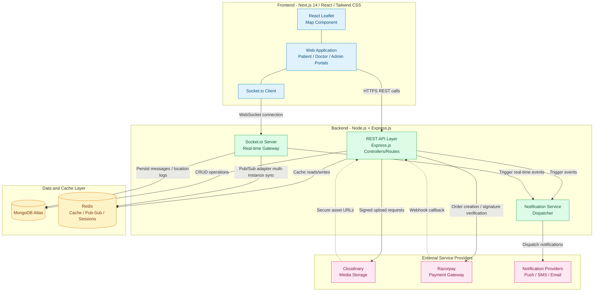
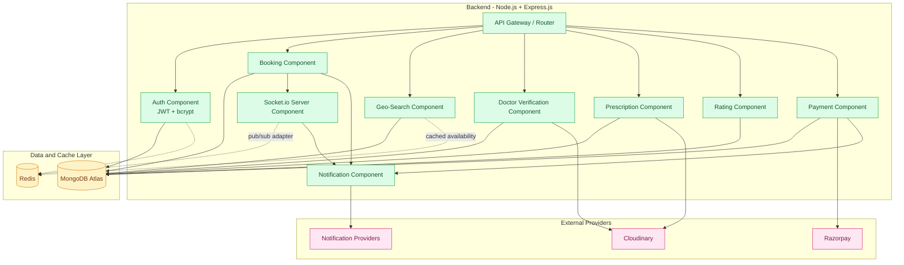
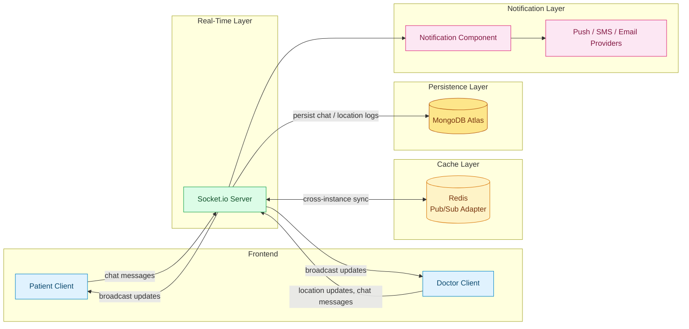

# DocDock — Component Diagram Documentation

**Tagline:** "Knock-Knock, your doctor is here."
**Document Type:** System Component Architecture
**Audience:** Engineering, DevOps, Technical Reviewers
**Status:** Draft v1.0

> **Scope note:** Redis is not part of the original technology stack but is included below as a **recommended supporting component** for Socket.io horizontal scaling (pub/sub adapter), live-availability caching, and session state — per the requested component list. If the team prefers to exclude it, simply remove the Redis node and its connections; all other interactions remain valid.

---

## 1. Purpose

This document presents **component diagrams** describing the structural architecture of DocDock — how the Frontend, Backend, MongoDB, Redis, Socket.io, Cloudinary, Razorpay, and Notification Services are composed and connected. All diagrams use Mermaid `graph` syntax and will render automatically in GitHub, GitLab, VS Code (with the Mermaid extension), Notion, Obsidian, and any Mermaid-compatible markdown viewer.

---

## 2. System-Wide Component Diagram

This top-level view shows how the Frontend connects to the Backend, and how the Backend integrates with MongoDB, Redis, Cloudinary, Razorpay, and Notification Providers.

---

## 3. Backend Internal Component Diagram

This view decomposes the Backend layer into its internal components (Auth, Booking, Geo-Search, Verification, Prescription, Rating, Payment, Socket.io Server, Notification) and shows how each connects to MongoDB, Redis, and the relevant external providers.

---

## 4. Real-Time Subsystem Component Diagram

This view isolates the real-time path: Patient and Doctor clients connect to the Socket.io Server, which synchronizes across instances via Redis, persists data to MongoDB, and triggers the Notification Component for downstream alerts.

---

## 5. Component Responsibility Reference

| Component | Layer | Responsibility |
|---|---|---|
| Web Application | Frontend | Renders Patient/Doctor/Admin portals; initiates REST and WebSocket connections |
| React Leaflet Map | Frontend | Renders geo-search results and live tracking maps |
| Socket.io Client | Frontend | Maintains persistent WebSocket connection for real-time events |
| API Gateway / Router | Backend | Routes and validates all incoming REST requests |
| Auth Component | Backend | JWT issuance/verification, bcrypt password hashing, RBAC |
| Booking Component | Backend | Manages appointment lifecycle and state transitions |
| Geo-Search Component | Backend | Executes geospatial queries for nearby verified doctors |
| Doctor Verification Component | Backend | Manages admin approval workflow for doctor onboarding |
| Prescription Component | Backend | Generates and stores digital prescriptions |
| Rating Component | Backend | Captures and aggregates doctor ratings/reviews |
| Payment Component | Backend | Creates Razorpay orders, verifies payment webhooks |
| Socket.io Server | Backend | Real-time gateway for chat, location, and status broadcast events |
| Notification Component | Backend | Central dispatcher fanning out events to external notification providers |
| MongoDB Atlas | Data | System of record for all persistent application data |
| Redis | Data/Cache | Caching, session state, and Socket.io pub/sub adapter across instances |
| Cloudinary | External | Stores/serves images, verification documents, prescription PDFs |
| Razorpay | External | Processes payments; sends webhook confirmation on payment capture |
| Notification Providers | External | Delivers push notifications, SMS, and email on behalf of the platform |
