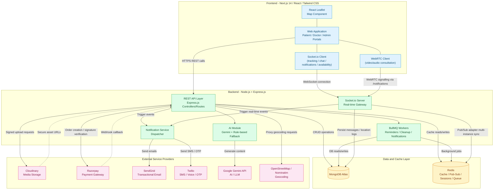
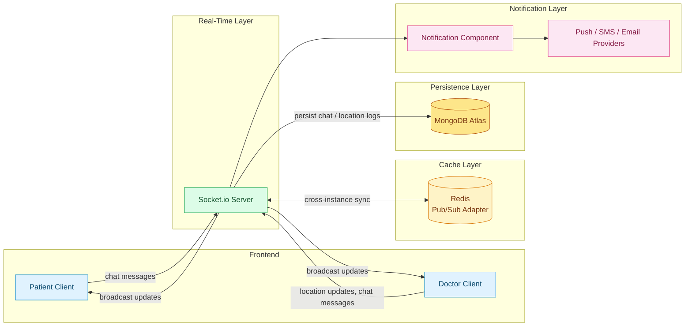

# DocDock — Component Diagram Documentation

**Tagline:** "Knock-Knock, your doctor is here."
**Document Type:** System Component Architecture
**Audience:** Engineering, DevOps, Technical Reviewers
**Status:** Draft v1.0

> **Scope note:** Redis is included in the technology stack as a **supporting component** for Socket.io horizontal scaling (pub/sub adapter), caching, and session state. The AI Module (Google Gemini API) and WebRTC-based video/audio calling are also implemented components not reflected in the original pre-build diagrams — they are added below.

---

## 1. Purpose

This document presents **component diagrams** describing the structural architecture of DocDock — how the Frontend, Backend, MongoDB, Redis, Socket.io, Cloudinary, Razorpay, and Notification Services are composed and connected. All diagrams use Mermaid `graph` syntax and will render automatically in GitHub, GitLab, VS Code (with the Mermaid extension), Notion, Obsidian, and any Mermaid-compatible markdown viewer.

---

## 2. System-Wide Component Diagram

```mermaid
graph TB
    subgraph Client["Frontend - Next.js 14 / React / Tailwind CSS"]
        WEB["Web Application<br/>Patient / Doctor / Admin Portals"]
        MAP["React Leaflet<br/>Map Component"]
        SOCKETCLIENT["Socket.io Client<br/>(tracking / chat / notifications / availability)"]
        WEBRTC["WebRTC Client<br/>(video/audio consultation)"]
    end

    subgraph Backend["Backend - Node.js + Express.js"]
        API["REST API Layer<br/>Express.js Controllers/Routes"]
        SOCKETSERVER["Socket.io Server<br/>Real-time Gateway"]
        NOTIFSVC["Notification Service<br/>Dispatcher"]
        AIMOD["AI Module<br/>Gemini + Rule-based Fallback"]
        WORKER["BullMQ Workers<br/>Reminders / Cleanup / Notifications"]
    end

    subgraph Data["Data and Cache Layer"]
        MONGO[("MongoDB Atlas")]
        REDIS[("Redis<br/>Cache / Pub-Sub / Sessions / Queue")]
    end

    subgraph External["External Service Providers"]
        CLOUD["Cloudinary<br/>Media Storage"]
        RAZOR["Razorpay<br/>Payment Gateway"]
        SENDGRID["SendGrid<br/>Transactional Email"]
        TWILIO["Twilio<br/>SMS / Voice / OTP"]
        GEMINI["Google Gemini API<br/>AI / LLM"]
        NOMINATIM["OpenStreetMap / Nominatim<br/>Geocoding"]
    end

    WEB -->|HTTPS REST calls| API
    MAP --- WEB
    SOCKETCLIENT -->|WebSocket connection| SOCKETSERVER
    WEB --- SOCKETCLIENT
    WEB --- WEBRTC
    WEBRTC -->|WebRTC signalling via /notifications| SOCKETSERVER

    API -->|CRUD operations| MONGO
    API -->|Cache reads/writes| REDIS
    API -->|Signed upload requests| CLOUD
    API -->|Order creation / signature verification| RAZOR
    API -->|Trigger events| NOTIFSVC
    API -->|Proxy geocoding requests| NOMINATIM
    AIMOD -->|Generate content| GEMINI
    API --> AIMOD
    WORKER -->|Background jobs| REDIS
    WORKER -->|DB reads/writes| MONGO
    API --> WORKER

    SOCKETSERVER -->|Persist messages / location logs| MONGO
    SOCKETSERVER -->|Pub/Sub adapter multi-instance sync| REDIS
    SOCKETSERVER -->|Trigger real-time events| NOTIFSVC

    NOTIFSVC -->|Send emails| SENDGRID
    NOTIFSVC -->|Send SMS / OTP| TWILIO

    RAZOR -.->|Webhook callback| API
    CLOUD -.->|Secure asset URLs| API

    classDef client fill:#E0F2FE,stroke:#0284C7,color:#0C4A6E
    classDef backend fill:#DCFCE7,stroke:#16A34A,color:#14532D
    classDef data fill:#FEF3C7,stroke:#D97706,color:#78350F
    classDef external fill:#FCE7F3,stroke:#DB2777,color:#831843

    class WEB,MAP,SOCKETCLIENT,WEBRTC client
    class API,SOCKETSERVER,NOTIFSVC,AIMOD,WORKER backend
    class MONGO,REDIS data
    class CLOUD,RAZOR,SENDGRID,TWILIO,GEMINI,NOMINATIM external
```

This top-level view shows how the Frontend connects to the Backend, and how the Backend integrates with MongoDB, Redis, Cloudinary, Razorpay, and Notification Providers.

---

## 3. Backend Internal Component Diagram

```mermaid
graph TB
    subgraph Backend["Backend - Node.js + Express.js"]
        GATEWAY["API Gateway / Router"]
        AUTHCOMP["Auth Component<br/>JWT + bcrypt + Google OAuth"]
        BOOKINGCOMP["Booking/Appointment Component"]
        GEOCOMP["Geo-Search Component"]
        VERIFYCOMP["Doctor Verification Component"]
        PRESCCOMP["Prescription Component"]
        RATINGCOMP["Rating/Review Component"]
        PAYCOMP["Payment Component"]
        TRACKINGCOMP["Tracking Component"]
        CHATCOMP["Chat Component"]
        SOCKETSERVER["Socket.io Server Component<br/>/tracking /chat /availability /notifications"]
        NOTIFSVC["Notification Component"]
        AICOMP["AI Component<br/>Gemini + Rule-based Fallback"]
        BULLWORKER["BullMQ Workers<br/>Reminders / Cleanup / Notifications"]
    end

    subgraph Data["Data and Cache Layer"]
        MONGO[("MongoDB Atlas")]
        REDIS[("Redis / BullMQ Queue")]
    end

    subgraph External["External Providers"]
        CLOUD["Cloudinary"]
        RAZOR["Razorpay"]
        SENDGRID["SendGrid<br/>Transactional Email"]
        TWILIO["Twilio<br/>SMS / OTP"]
        GEMINI["Google Gemini API"]
        NOMINATIM["OpenStreetMap / Nominatim"]
    end

    GATEWAY --> AUTHCOMP
    GATEWAY --> BOOKINGCOMP
    GATEWAY --> GEOCOMP
    GATEWAY --> VERIFYCOMP
    GATEWAY --> PRESCCOMP
    GATEWAY --> RATINGCOMP
    GATEWAY --> PAYCOMP
    GATEWAY --> TRACKINGCOMP
    GATEWAY --> CHATCOMP
    GATEWAY --> AICOMP
    GATEWAY -->|Proxy| NOMINATIM

    AUTHCOMP --> MONGO
    AUTHCOMP -.->|token management| REDIS
    BOOKINGCOMP --> MONGO
    GEOCOMP --> MONGO
    GEOCOMP -.->|cached availability| REDIS
    VERIFYCOMP --> MONGO
    VERIFYCOMP --> CLOUD
    PRESCCOMP --> MONGO
    PRESCCOMP --> CLOUD
    RATINGCOMP --> MONGO
    PAYCOMP --> MONGO
    PAYCOMP --> RAZOR
    TRACKINGCOMP --> MONGO
    CHATCOMP --> MONGO

    AICOMP --> GEMINI

    BOOKINGCOMP --> SOCKETSERVER
    TRACKINGCOMP --> SOCKETSERVER
    CHATCOMP --> SOCKETSERVER
    PAYCOMP --> NOTIFSVC
    BOOKINGCOMP --> NOTIFSVC
    SOCKETSERVER -.->|pub/sub adapter| REDIS
    SOCKETSERVER --> NOTIFSVC
    NOTIFSVC --> SENDGRID
    NOTIFSVC --> TWILIO

    BOOKINGCOMP --> BULLWORKER
    BULLWORKER -.->|job queue| REDIS
    BULLWORKER --> MONGO
    BULLWORKER --> NOTIFSVC

    classDef backend fill:#DCFCE7,stroke:#16A34A,color:#14532D
    classDef data fill:#FEF3C7,stroke:#D97706,color:#78350F
    classDef external fill:#FCE7F3,stroke:#DB2777,color:#831843

    class GATEWAY,AUTHCOMP,BOOKINGCOMP,GEOCOMP,VERIFYCOMP,PRESCCOMP,RATINGCOMP,PAYCOMP,TRACKINGCOMP,CHATCOMP,SOCKETSERVER,NOTIFSVC,AICOMP,BULLWORKER backend
    class MONGO,REDIS data
    class CLOUD,RAZOR,SENDGRID,TWILIO,GEMINI,NOMINATIM external
```

This view decomposes the Backend layer into its internal components (Auth, Booking, Geo-Search, Verification, Prescription, Rating, Payment, Socket.io Server, Notification) and shows how each connects to MongoDB, Redis, and the relevant external providers.

---

## 4. Real-Time Subsystem Component Diagram

```mermaid
graph LR
    subgraph Client["Frontend"]
        PATIENTAPP["Patient Client"]
        DOCTORAPP["Doctor Client"]
    end

    subgraph RealTime["Real-Time Layer"]
        SOCKETSERVER["Socket.io Server"]
    end

    subgraph Cache["Cache Layer"]
        REDIS[("Redis<br/>Pub/Sub Adapter")]
    end

    subgraph Persistence["Persistence Layer"]
        MONGO[("MongoDB Atlas")]
    end

    subgraph Notify["Notification Layer"]
        NOTIFSVC["Notification Component"]
        NOTIFPROVIDER["Push / SMS / Email Providers"]
    end

    DOCTORAPP -->|location updates, chat messages| SOCKETSERVER
    SOCKETSERVER -->|broadcast updates| PATIENTAPP
    PATIENTAPP -->|chat messages| SOCKETSERVER
    SOCKETSERVER -->|broadcast updates| DOCTORAPP

    SOCKETSERVER <-->|cross-instance sync| REDIS
    SOCKETSERVER -->|persist chat / location logs| MONGO
    SOCKETSERVER --> NOTIFSVC
    NOTIFSVC --> NOTIFPROVIDER

    classDef client fill:#E0F2FE,stroke:#0284C7,color:#0C4A6E
    classDef realtime fill:#DCFCE7,stroke:#16A34A,color:#14532D
    classDef cache fill:#FEF3C7,stroke:#D97706,color:#78350F
    classDef persist fill:#FDE68A,stroke:#B45309,color:#78350F
    classDef notify fill:#FCE7F3,stroke:#DB2777,color:#831843

    class PATIENTAPP,DOCTORAPP client
    class SOCKETSERVER realtime
    class REDIS cache
    class MONGO persist
    class NOTIFSVC,NOTIFPROVIDER notify
```

This view isolates the real-time path: Patient and Doctor clients connect to the Socket.io Server, which synchronizes across instances via Redis, persists data to MongoDB, and triggers the Notification Component for downstream alerts.

---

## 5. Component Responsibility Reference

| Component | Layer | Responsibility |
|---|---|---|
| Web Application | Frontend | Renders Patient/Doctor/Admin portals; initiates REST and WebSocket connections |
| React Leaflet Map | Frontend | Renders geo-search results and live tracking maps |
| Socket.io Client | Frontend | Maintains persistent WebSocket connection for real-time events across /tracking, /chat, /availability, /notifications namespaces |
| WebRTC Client | Frontend | Peer-to-peer video/audio consultation for online appointment mode; signalling via Socket.io /notifications namespace (call:initiate, call:accept, call:reject, call:hangup, webrtc:signal) |
| API Gateway / Router | Backend | Routes and validates all incoming REST requests |
| Auth Component | Backend | JWT issuance/verification, bcrypt password hashing, Google OAuth 2.0, RBAC |
| Booking/Appointment Component | Backend | Manages appointment lifecycle and state transitions (11 states); supports clinic/home/online consultation modes; slot generation from doctor per-day schedule |
| Geo-Search Component | Backend | Executes geospatial queries for nearby verified doctors |
| Doctor Verification Component | Backend | Manages admin approval workflow for doctor onboarding |
| Prescription Component | Backend | Generates and stores digital prescriptions; Cloudinary PDF storage |
| Rating/Review Component | Backend | Captures and aggregates doctor ratings/reviews |
| Payment Component | Backend | Creates Razorpay orders, verifies payment webhooks, initiates refunds on cancellation |
| Tracking Component | Backend | REST endpoints for location history; real-time GPS streaming via /tracking namespace |
| Chat Component | Backend | REST endpoints for chat history retrieval; real-time delivery via /chat namespace; persists messages in chat_messages collection |
| Socket.io Server | Backend | Real-time gateway for chat, location, status broadcast, WebRTC call signalling, and availability events |
| Notification Component | Backend | Central dispatcher for in-app (Socket.io), email (SendGrid), and SMS (Twilio) notifications |
| AI Component | Backend | Google Gemini-powered symptom check, doctor recommendations, and streaming AI chat; rule-based fallback when Gemini is unavailable |
| BullMQ Workers | Backend | Three Redis-backed job queues: appointment reminders, notification dispatch, and scheduled data cleanup; retry with exponential backoff |
| MongoDB Atlas | Data | System of record for all persistent application data: Users, Doctors, Patients, Appointments, Prescriptions, Reviews, Payments, Notifications, ChatMessages, CallLogs, AppointmentOTPs |
| Redis | Data/Cache | Caching, session state, Socket.io pub/sub adapter, and BullMQ job queue backing |
| Cloudinary | External | Stores/serves doctor photos, verification documents, prescription assets |
| Razorpay | External | Processes payments; sends webhook confirmation on payment capture |
| SendGrid | External | Delivers transactional email: appointment confirmations, doctor verification status, prescription notifications |
| Twilio | External | Delivers SMS OTP for online consultation verification and appointment reminders; voice service (optional) |
| Google Gemini API | External | LLM inference for AI symptom check, recommendations, and streaming chat |
| OpenStreetMap / Nominatim | External | Geocoding and reverse geocoding for location search and map display |
