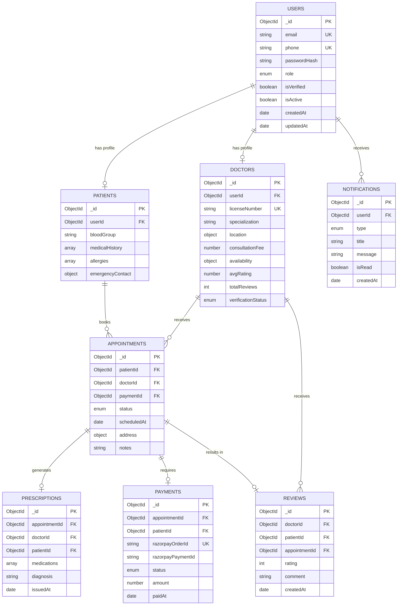

# DocDock — Database Design Documentation

> **Project:** DocDock — Doctor-on-Demand Healthcare Platform
> **Version:** 1.0.0
> **Database:** MongoDB Atlas
> **Standard:** Professional Software Engineering / Enterprise Grade

---

## Table of Contents

1. [Overview](#overview)
2. [Design Principles](#design-principles)
3. [ER Diagram](#er-diagram)
4. [Collections](#collections)
   - [Users](#1-users-collection)
   - [Doctors](#2-doctors-collection)
   - [Patients](#3-patients-collection)
   - [Appointments](#4-appointments-collection)
   - [Prescriptions](#5-prescriptions-collection)
   - [Reviews](#6-reviews-collection)
   - [Payments](#7-payments-collection)
   - [Notifications](#8-notifications-collection)
5. [Geospatial Index Design](#geospatial-index-design)
6. [Index Strategy Summary](#index-strategy-summary)
7. [Relationships Overview](#relationships-overview)
8. [Performance Considerations](#performance-considerations)
9. [Data Validation Rules Summary](#data-validation-rules-summary)
10. [Migration & Versioning Strategy](#migration--versioning-strategy)

---

## Overview

DocDock uses **MongoDB Atlas** as its primary database. The schema is designed around the on-demand healthcare domain, where geospatial proximity search, real-time availability, and transactional integrity are first-class concerns.

The database is split into **8 core collections** that mirror the bounded contexts of the platform:

| Collection      | Primary Role                                    |
|-----------------|--------------------------------------------------|
| `users`         | Unified authentication identity store            |
| `doctors`       | Doctor profiles, availability, geo-location      |
| `patients`      | Patient profiles, medical history                |
| `appointments`  | Booking lifecycle management                     |
| `prescriptions` | Digital prescriptions linked to appointments     |
| `reviews`       | Doctor ratings and patient feedback              |
| `payments`      | Razorpay transaction records                     |
| `notifications` | In-app and push notification queue               |

---

## Design Principles

- **Hybrid embedding + referencing:** Frequently co-accessed data is embedded; loosely related data is referenced by `ObjectId`.
- **Role separation:** `users` stores credentials. `doctors` and `patients` extend the user identity via `userId` reference, keeping auth and domain logic decoupled.
- **Geospatial-first:** Doctor location is stored in GeoJSON format to enable native `$geoNear` and `$nearSphere` queries.
- **Audit trails:** Every collection includes `createdAt` and `updatedAt` timestamps.
- **Soft deletes:** `isActive` / `isDeleted` flags are used instead of hard deletes to preserve referential integrity.
- **Schema validation:** MongoDB JSON Schema validators are defined per collection.

---

## ER Diagram



---

## Collections

---

### 1. `users` Collection

**Purpose:** Unified authentication and identity store for all roles (patient, doctor, admin). Domain-specific data lives in `patients` or `doctors` collections.

#### Schema

```javascript
{
  _id: ObjectId,                        // Auto-generated primary key
  email: String,                        // Unique login email
  phone: String,                        // Unique phone number (E.164 format)
  passwordHash: String,                 // bcrypt hashed password
  role: String,                         // Enum: "patient" | "doctor" | "admin"
  fullName: String,                     // Display name
  avatar: String,                       // Cloudinary URL
  isVerified: Boolean,                  // Email/phone verified
  isActive: Boolean,                    // Account active (soft delete flag)
  isDeleted: Boolean,                   // Soft delete flag
  lastLogin: Date,                      // Last successful login timestamp
  fcmToken: String,                     // Firebase Cloud Messaging token for push
  refreshTokenHash: String,             // Hashed refresh token for JWT rotation
  passwordResetToken: String,           // Hashed reset token
  passwordResetExpiry: Date,            // Reset token expiry
  createdAt: Date,                      // Auto timestamp
  updatedAt: Date                       // Auto timestamp
}
```

#### Validation Rules

| Field           | Rule                                                         |
|-----------------|--------------------------------------------------------------|
| `email`         | Required, unique, valid RFC 5321 format, lowercase           |
| `phone`         | Required, unique, E.164 format (`+[country][number]`)        |
| `passwordHash`  | Required, min 60 chars (bcrypt output)                       |
| `role`          | Required, enum: `["patient", "doctor", "admin"]`             |
| `fullName`      | Required, 2–100 characters                                   |
| `isVerified`    | Default: `false`                                             |
| `isActive`      | Default: `true`                                              |
| `isDeleted`     | Default: `false`                                             |

#### Indexes

```javascript
// Unique indexes
db.users.createIndex({ email: 1 }, { unique: true })
db.users.createIndex({ phone: 1 }, { unique: true })

// Query optimization indexes
db.users.createIndex({ role: 1, isActive: 1 })
db.users.createIndex({ createdAt: -1 })
db.users.createIndex({ passwordResetToken: 1 }, { sparse: true, expireAfterSeconds: 3600 })
```

#### Relationships

- One `user` → One `doctor` profile (when `role === "doctor"`)
- One `user` → One `patient` profile (when `role === "patient"`)
- One `user` → Many `notifications`

---

### 2. `doctors` Collection

**Purpose:** Stores doctor domain data — specialization, geo-location, availability, verification status, and aggregated rating. This is the most query-intensive collection due to geospatial and availability searches.

#### Schema

```javascript
{
  _id: ObjectId,
  userId: ObjectId,                     // Ref: users._id

  // Professional Information
  licenseNumber: String,                // Unique medical license number
  specialization: String,              // e.g., "General Physician", "Cardiologist"
  qualifications: [String],            // e.g., ["MBBS", "MD"]
  experience: Number,                  // Years of experience (integer)
  bio: String,                         // Short professional bio
  languages: [String],                 // Spoken languages

  // Location (GeoJSON — required for $geoNear queries)
  location: {
    type: { type: String, enum: ["Point"], default: "Point" },
    coordinates: [Number]              // [longitude, latitude] — GeoJSON order
  },
  address: {
    street: String,
    city: String,
    state: String,
    pincode: String,
    country: String
  },

  // Availability
  isAvailable: Boolean,               // Real-time online/offline toggle
  availabilitySchedule: {             // Weekly schedule
    monday:    { start: String, end: String, isOff: Boolean },
    tuesday:   { start: String, end: String, isOff: Boolean },
    wednesday: { start: String, end: String, isOff: Boolean },
    thursday:  { start: String, end: String, isOff: Boolean },
    friday:    { start: String, end: String, isOff: Boolean },
    saturday:  { start: String, end: String, isOff: Boolean },
    sunday:    { start: String, end: String, isOff: Boolean }
  },
  slotDuration: Number,               // Consultation slot in minutes (default: 30)

  // Financials
  consultationFee: Number,            // In INR (paise for Razorpay)

  // Ratings (denormalized for read performance)
  avgRating: Number,                  // Rolling average (1.0–5.0)
  totalReviews: Number,               // Review count

  // Documents (Cloudinary URLs)
  documents: {
    licenseDocument: String,          // URL to uploaded license scan
    profilePhoto: String              // URL to profile photo
  },

  // Admin Verification
  verificationStatus: String,         // Enum: "pending" | "verified" | "rejected"
  verificationNote: String,           // Admin rejection reason
  verifiedAt: Date,
  verifiedBy: ObjectId,              // Ref: users._id (admin)

  isActive: Boolean,
  isDeleted: Boolean,
  createdAt: Date,
  updatedAt: Date
}
```

#### Validation Rules

| Field                 | Rule                                              |
|-----------------------|---------------------------------------------------|
| `userId`              | Required, unique, valid ObjectId                  |
| `licenseNumber`       | Required, unique, alphanumeric                    |
| `specialization`      | Required, max 100 chars                           |
| `experience`          | Required, integer ≥ 0                             |
| `location.type`       | Must be `"Point"`                                 |
| `location.coordinates`| Array of 2 numbers: `[lng, lat]`; lng ∈ [-180,180], lat ∈ [-90,90] |
| `consultationFee`     | Required, number ≥ 0                              |
| `avgRating`           | Float between 0.0 and 5.0                         |
| `verificationStatus`  | Enum: `["pending", "verified", "rejected"]`       |

#### Indexes

```javascript
// Geospatial index — CRITICAL for nearby doctor search
db.doctors.createIndex({ location: "2dsphere" })

// Availability + verification filter
db.doctors.createIndex({ isAvailable: 1, verificationStatus: 1, isActive: 1 })

// Specialization search
db.doctors.createIndex({ specialization: 1, avgRating: -1 })

// Compound: geo + availability (used in $geoNear pipeline with match stage)
db.doctors.createIndex({ location: "2dsphere", isAvailable: 1 })

// Admin queries
db.doctors.createIndex({ verificationStatus: 1, createdAt: -1 })

// User lookup
db.doctors.createIndex({ userId: 1 }, { unique: true })
```

#### Relationships

- Belongs to one `user` (`userId`)
- Has many `appointments`
- Has many `reviews`
- Has many `prescriptions` (as author)

---

### 3. `patients` Collection

**Purpose:** Stores patient-specific medical and personal profile data, extending the `users` identity.

#### Schema

```javascript
{
  _id: ObjectId,
  userId: ObjectId,                    // Ref: users._id

  // Personal Info
  dateOfBirth: Date,
  gender: String,                     // Enum: "male" | "female" | "other"
  bloodGroup: String,                 // Enum: "A+" | "A-" | "B+" | "B-" | "AB+" | "AB-" | "O+" | "O-"

  // Medical History (embedded for read performance)
  medicalHistory: [
    {
      condition: String,              // e.g., "Diabetes Type 2"
      diagnosedYear: Number,
      isOngoing: Boolean
    }
  ],
  allergies: [String],               // e.g., ["Penicillin", "Peanuts"]
  currentMedications: [String],

  // Address
  address: {
    street: String,
    city: String,
    state: String,
    pincode: String,
    country: String
  },

  // Emergency Contact
  emergencyContact: {
    name: String,
    relationship: String,
    phone: String
  },

  isActive: Boolean,
  isDeleted: Boolean,
  createdAt: Date,
  updatedAt: Date
}
```

#### Validation Rules

| Field          | Rule                                               |
|----------------|----------------------------------------------------|
| `userId`       | Required, unique, valid ObjectId                   |
| `gender`       | Enum: `["male", "female", "other"]`                |
| `bloodGroup`   | Enum: `["A+","A-","B+","B-","AB+","AB-","O+","O-"]` |
| `dateOfBirth`  | Must be in the past; patient must be ≥ 0 years old |
| `emergencyContact.phone` | E.164 format when provided               |

#### Indexes

```javascript
db.patients.createIndex({ userId: 1 }, { unique: true })
db.patients.createIndex({ createdAt: -1 })
```

#### Relationships

- Belongs to one `user` (`userId`)
- Has many `appointments`
- Has many `prescriptions` (as recipient)
- Has many `reviews` (as author)
- Has many `payments`

---

### 4. `appointments` Collection

**Purpose:** Central booking record capturing the full lifecycle of a doctor-patient consultation — from pending booking to completed or cancelled state.

#### Schema

```javascript
{
  _id: ObjectId,

  // References
  patientId: ObjectId,               // Ref: patients._id
  doctorId: ObjectId,                // Ref: doctors._id
  paymentId: ObjectId,               // Ref: payments._id (set after payment)

  // Scheduling
  scheduledAt: Date,                 // Appointment start datetime
  estimatedDuration: Number,         // Minutes (default: 30)
  actualStartTime: Date,             // Set when doctor starts
  actualEndTime: Date,               // Set when consultation ends

  // Location (where the doctor will visit)
  visitAddress: {
    street: String,
    city: String,
    state: String,
    pincode: String,
    coordinates: {
      type: { type: String, enum: ["Point"] },
      coordinates: [Number]          // [lng, lat]
    }
  },

  // Status Lifecycle
  status: String,                    // Enum below
  statusHistory: [
    {
      status: String,
      changedAt: Date,
      changedBy: ObjectId,           // userId who triggered change
      note: String
    }
  ],

  // Patient Notes
  symptoms: String,                  // Patient-provided symptoms
  notes: String,                     // Additional booking notes

  // Doctor Tracking (for live tracking feature)
  doctorCurrentLocation: {
    type: { type: String, enum: ["Point"] },
    coordinates: [Number],
    updatedAt: Date
  },

  // Cancellation
  cancelledBy: String,               // Enum: "patient" | "doctor" | "admin"
  cancellationReason: String,
  cancelledAt: Date,

  // Prescription
  prescriptionId: ObjectId,         // Ref: prescriptions._id (set after consultation)

  createdAt: Date,
  updatedAt: Date
}
```

#### Status Enum

```
pending_payment → payment_confirmed → doctor_assigned → doctor_en_route
  → doctor_arrived → in_consultation → completed → cancelled → refunded
```

#### Validation Rules

| Field          | Rule                                                              |
|----------------|-------------------------------------------------------------------|
| `patientId`    | Required, valid ObjectId                                          |
| `doctorId`     | Required, valid ObjectId                                          |
| `scheduledAt`  | Required, must be a future datetime at time of booking            |
| `status`       | Enum of valid lifecycle states                                    |
| `symptoms`     | Max 1000 characters                                               |
| `cancelledBy`  | Enum: `["patient", "doctor", "admin"]` when present              |

#### Indexes

```javascript
// Core query patterns
db.appointments.createIndex({ patientId: 1, status: 1, scheduledAt: -1 })
db.appointments.createIndex({ doctorId: 1, status: 1, scheduledAt: 1 })
db.appointments.createIndex({ status: 1, scheduledAt: 1 })

// Admin dashboard
db.appointments.createIndex({ createdAt: -1 })

// Prescription and payment lookups
db.appointments.createIndex({ prescriptionId: 1 }, { sparse: true })
db.appointments.createIndex({ paymentId: 1 }, { sparse: true })

// Geospatial index on visit address (optional: for area-based admin reports)
db.appointments.createIndex({ "visitAddress.coordinates": "2dsphere" })

// TTL: Auto-archive very old cancelled/refunded records after 2 years
db.appointments.createIndex(
  { updatedAt: 1 },
  { expireAfterSeconds: 63072000, partialFilterExpression: { status: { $in: ["cancelled", "refunded"] } } }
)
```

#### Relationships

- Belongs to one `patient`
- Belongs to one `doctor`
- Has one `payment`
- Has one `prescription`
- Has one `review`

---

### 5. `prescriptions` Collection

**Purpose:** Digital prescriptions generated by doctors at the end of consultations. Linked to a single appointment.

#### Schema

```javascript
{
  _id: ObjectId,

  // References
  appointmentId: ObjectId,          // Ref: appointments._id (unique)
  doctorId: ObjectId,               // Ref: doctors._id
  patientId: ObjectId,              // Ref: patients._id

  // Prescription Content
  diagnosis: String,                // Primary diagnosis
  chiefComplaints: String,          // Patient-reported complaints

  medications: [
    {
      name: String,                 // Drug name
      dosage: String,               // e.g., "500mg"
      frequency: String,            // e.g., "Twice daily"
      duration: String,             // e.g., "7 days"
      instructions: String,         // e.g., "After food"
      quantity: Number              // Total units
    }
  ],

  labTests: [String],              // Recommended tests (e.g., ["CBC", "LFT"])
  advice: String,                  // General advice / lifestyle notes
  followUpDate: Date,              // Recommended follow-up date

  // Doctor Signature
  doctorSignature: String,         // Cloudinary URL of signature image
  doctorStamp: String,             // Cloudinary URL of stamp image

  // PDF
  prescriptionPdfUrl: String,      // Cloudinary URL of generated PDF

  issuedAt: Date,
  isValid: Boolean,                // Can be invalidated by admin
  createdAt: Date,
  updatedAt: Date
}
```

#### Validation Rules

| Field           | Rule                                              |
|-----------------|---------------------------------------------------|
| `appointmentId` | Required, unique (one prescription per appointment)|
| `doctorId`      | Required, valid ObjectId                          |
| `patientId`     | Required, valid ObjectId                          |
| `diagnosis`     | Required, max 500 characters                      |
| `medications`   | Array, each item must have `name`, `dosage`, `frequency`, `duration` |
| `medications[].name` | Required, max 200 chars                    |

#### Indexes

```javascript
db.prescriptions.createIndex({ appointmentId: 1 }, { unique: true })
db.prescriptions.createIndex({ patientId: 1, issuedAt: -1 })
db.prescriptions.createIndex({ doctorId: 1, issuedAt: -1 })
db.prescriptions.createIndex({ issuedAt: -1 })
```

#### Relationships

- Belongs to one `appointment`
- Belongs to one `doctor`
- Belongs to one `patient`

---

### 6. `reviews` Collection

**Purpose:** Patient ratings and textual reviews for doctors, submitted after appointment completion. Used to compute `avgRating` on the `doctors` collection.

#### Schema

```javascript
{
  _id: ObjectId,

  // References
  doctorId: ObjectId,              // Ref: doctors._id
  patientId: ObjectId,             // Ref: patients._id
  appointmentId: ObjectId,         // Ref: appointments._id (unique — one review per appointment)

  // Review Content
  rating: Number,                  // Integer: 1–5
  comment: String,                 // Free-text review (optional)

  // Sub-ratings (optional granular feedback)
  subRatings: {
    punctuality: Number,           // 1–5
    bedside_manner: Number,        // 1–5
    diagnosis_accuracy: Number,    // 1–5
    prescription_clarity: Number   // 1–5
  },

  // Moderation
  isVisible: Boolean,              // Hidden if flagged by admin
  flaggedReason: String,           // Reason if hidden

  // Doctor Reply
  doctorReply: {
    text: String,
    repliedAt: Date
  },

  createdAt: Date,
  updatedAt: Date
}
```

#### Validation Rules

| Field           | Rule                                                    |
|-----------------|---------------------------------------------------------|
| `appointmentId` | Required, unique (one review per appointment)           |
| `doctorId`      | Required, valid ObjectId                                |
| `patientId`     | Required, valid ObjectId                                |
| `rating`        | Required, integer, min: 1, max: 5                       |
| `comment`       | Optional, max 1000 characters                           |
| `subRatings.*`  | Optional integers 1–5                                   |
| `isVisible`     | Default: `true`                                         |

#### Indexes

```javascript
db.reviews.createIndex({ appointmentId: 1 }, { unique: true })
db.reviews.createIndex({ doctorId: 1, isVisible: 1, createdAt: -1 })
db.reviews.createIndex({ patientId: 1, createdAt: -1 })
db.reviews.createIndex({ rating: 1 })
```

#### Post-Write Hook (Application Layer)

After every insert/update to `reviews`, recalculate and update `doctors.avgRating` and `doctors.totalReviews` using an aggregation pipeline:

```javascript
// Triggered after review save
const result = await Review.aggregate([
  { $match: { doctorId: doctorObjectId, isVisible: true } },
  { $group: { _id: "$doctorId", avg: { $avg: "$rating" }, count: { $sum: 1 } } }
]);
await Doctor.findByIdAndUpdate(doctorObjectId, {
  avgRating: parseFloat(result[0].avg.toFixed(1)),
  totalReviews: result[0].count
});
```

#### Relationships

- Belongs to one `appointment`
- Belongs to one `doctor`
- Belongs to one `patient`

---

### 7. `payments` Collection

**Purpose:** Immutable record of all Razorpay payment transactions. Decoupled from appointments to allow re-payment flows and refund tracking.

#### Schema

```javascript
{
  _id: ObjectId,

  // References
  appointmentId: ObjectId,          // Ref: appointments._id
  patientId: ObjectId,              // Ref: patients._id

  // Razorpay Fields
  razorpayOrderId: String,          // Razorpay Order ID (order_xxxx) — unique
  razorpayPaymentId: String,        // Razorpay Payment ID (pay_xxxx) — set on success
  razorpaySignature: String,        // HMAC-SHA256 verification signature

  // Amount
  amount: Number,                   // In paise (INR × 100)
  currency: String,                 // Default: "INR"
  consultationFeeSnapshot: Number,  // Doctor's fee at time of booking (paise)
  platformFee: Number,              // DocDock platform commission (paise)
  tax: Number,                      // GST / tax amount (paise)

  // Status
  status: String,                   // Enum below
  failureReason: String,            // Razorpay failure message if failed

  // Refund
  refundId: String,                 // Razorpay refund ID if refunded
  refundAmount: Number,             // Refunded amount in paise
  refundStatus: String,             // Enum: "pending" | "processed" | "failed"
  refundInitiatedAt: Date,
  refundCompletedAt: Date,

  // Metadata
  paymentMethod: String,            // e.g., "upi", "card", "netbanking"
  paidAt: Date,                     // Timestamp of successful payment

  createdAt: Date,
  updatedAt: Date
}
```

#### Status Enum

```
created → attempted → captured → failed → refund_initiated → refunded
```

#### Validation Rules

| Field              | Rule                                              |
|--------------------|---------------------------------------------------|
| `appointmentId`    | Required, valid ObjectId                          |
| `patientId`        | Required, valid ObjectId                          |
| `razorpayOrderId`  | Required, unique                                  |
| `amount`           | Required, integer ≥ 0 (in paise)                 |
| `currency`         | Default `"INR"`, max 3 chars                      |
| `status`           | Enum of valid payment states                      |

#### Indexes

```javascript
db.payments.createIndex({ razorpayOrderId: 1 }, { unique: true })
db.payments.createIndex({ razorpayPaymentId: 1 }, { sparse: true })
db.payments.createIndex({ appointmentId: 1 })
db.payments.createIndex({ patientId: 1, createdAt: -1 })
db.payments.createIndex({ status: 1, createdAt: -1 })

// Refund processing queue
db.payments.createIndex({ refundStatus: 1 }, { sparse: true })
```

#### Relationships

- Belongs to one `appointment`
- Belongs to one `patient`

---

### 8. `notifications` Collection

**Purpose:** Stores in-app notifications for all users. Consumed by the frontend notification bell. Push notifications (FCM) are sent at application layer using `users.fcmToken`.

#### Schema

```javascript
{
  _id: ObjectId,

  // Target
  userId: ObjectId,                 // Ref: users._id

  // Content
  type: String,                     // Enum: see types below
  title: String,                    // Short notification title
  message: String,                  // Full notification body
  data: Object,                     // Contextual payload (e.g., { appointmentId })

  // Delivery
  isRead: Boolean,                  // Read receipt flag
  readAt: Date,                     // Timestamp when read

  // Channel
  channels: [String],               // Enum: "in_app" | "push" | "sms" | "email"
  pushSent: Boolean,                // Whether FCM push was dispatched
  pushSentAt: Date,

  createdAt: Date
  // No updatedAt — notifications are immutable once created
}
```

#### Notification Type Enum

| Type                       | Trigger                                         |
|----------------------------|-------------------------------------------------|
| `appointment_booked`       | Patient books appointment                       |
| `appointment_confirmed`    | Payment captured successfully                   |
| `appointment_cancelled`    | Either party cancels                            |
| `doctor_en_route`          | Doctor starts travelling to patient             |
| `doctor_arrived`           | Doctor marks arrival                            |
| `consultation_started`     | Doctor begins consultation                      |
| `prescription_issued`      | Doctor issues prescription                      |
| `payment_success`          | Payment captured                                |
| `payment_failed`           | Payment capture failed                          |
| `refund_initiated`         | Refund initiated                                |
| `refund_processed`         | Refund completed                                |
| `review_received`          | Doctor receives a new review                    |
| `verification_approved`    | Admin approves doctor registration              |
| `verification_rejected`    | Admin rejects doctor registration               |

#### Validation Rules

| Field     | Rule                                                   |
|-----------|--------------------------------------------------------|
| `userId`  | Required, valid ObjectId                               |
| `type`    | Required, enum of valid notification types             |
| `title`   | Required, max 100 characters                           |
| `message` | Required, max 500 characters                           |
| `isRead`  | Default: `false`                                       |

#### Indexes

```javascript
// Primary read pattern: user's unread notifications
db.notifications.createIndex({ userId: 1, isRead: 1, createdAt: -1 })

// Mark all as read
db.notifications.createIndex({ userId: 1, createdAt: -1 })

// TTL: Auto-delete notifications older than 90 days
db.notifications.createIndex({ createdAt: 1 }, { expireAfterSeconds: 7776000 })
```

#### Relationships

- Belongs to one `user`

---

## Geospatial Index Design

DocDock's core differentiator is nearby doctor discovery. MongoDB's `2dsphere` index enables this natively.

### Index Declaration

```javascript
// Required for $geoNear, $near, $nearSphere, $geoWithin queries
db.doctors.createIndex({ location: "2dsphere" })
```

### GeoJSON Storage Format

Coordinates must be stored as `[longitude, latitude]` — this is the **GeoJSON spec** and the reverse of common intuition.

```javascript
// Example document
{
  location: {
    type: "Point",
    coordinates: [78.4867, 17.3850]   // [longitude, latitude] — Hyderabad
  }
}
```

### Nearby Doctor Search — Aggregation Pipeline

```javascript
db.doctors.aggregate([
  {
    $geoNear: {
      near: {
        type: "Point",
        coordinates: [patientLng, patientLat]     // Patient's real-time coordinates
      },
      distanceField: "distanceMeters",            // Added field on each result
      maxDistance: 10000,                         // 10 km radius
      spherical: true,
      query: {
        isAvailable: true,
        verificationStatus: "verified",
        isActive: true
      }
    }
  },
  {
    $addFields: {
      distanceKm: { $divide: ["$distanceMeters", 1000] }
    }
  },
  {
    $match: {
      distanceKm: { $lte: 10 }
    }
  },
  {
    $sort: { distanceMeters: 1, avgRating: -1 }  // Closest first, then highest rated
  },
  {
    $limit: 20
  },
  {
    $lookup: {
      from: "users",
      localField: "userId",
      foreignField: "_id",
      as: "userProfile",
      pipeline: [{ $project: { fullName: 1, avatar: 1 } }]
    }
  }
])
```

### Live Doctor Tracking

During active appointments, the doctor's location is updated in real-time via Socket.io and written to `appointments.doctorCurrentLocation`:

```javascript
// Upsert doctor's current coordinates (triggered every 10 seconds via Socket.io)
await Appointment.findByIdAndUpdate(appointmentId, {
  $set: {
    "doctorCurrentLocation.coordinates": [lng, lat],
    "doctorCurrentLocation.updatedAt": new Date()
  }
})
```

---

## Index Strategy Summary

| Collection      | Index                                    | Type        | Purpose                                 |
|-----------------|------------------------------------------|-------------|-----------------------------------------|
| `users`         | `email`                                  | Unique      | Login lookup                            |
| `users`         | `phone`                                  | Unique      | OTP / SMS lookup                        |
| `users`         | `role, isActive`                         | Compound    | Admin user management                   |
| `doctors`       | `location`                               | 2dsphere    | Nearby doctor geo-search                |
| `doctors`       | `userId`                                 | Unique      | Profile fetch by user                   |
| `doctors`       | `isAvailable, verificationStatus, isActive` | Compound | Availability filter                  |
| `doctors`       | `specialization, avgRating`              | Compound    | Filtered specialty search               |
| `patients`      | `userId`                                 | Unique      | Profile fetch by user                   |
| `appointments`  | `patientId, status, scheduledAt`         | Compound    | Patient appointment list                |
| `appointments`  | `doctorId, status, scheduledAt`          | Compound    | Doctor schedule view                    |
| `appointments`  | `visitAddress.coordinates`               | 2dsphere    | Area-based reporting                    |
| `prescriptions` | `appointmentId`                          | Unique      | One prescription per appointment        |
| `prescriptions` | `patientId, issuedAt`                    | Compound    | Patient prescription history            |
| `reviews`       | `appointmentId`                          | Unique      | One review per appointment              |
| `reviews`       | `doctorId, isVisible, createdAt`         | Compound    | Doctor review listing                   |
| `payments`      | `razorpayOrderId`                        | Unique      | Razorpay webhook deduplication          |
| `payments`      | `status, createdAt`                      | Compound    | Failed payment retry queue              |
| `notifications` | `userId, isRead, createdAt`              | Compound    | Unread notification fetch               |
| `notifications` | `createdAt`                              | TTL (90d)   | Auto-cleanup old notifications          |

---

## Relationships Overview

```
users (1) ──────────────── (1) doctors
users (1) ──────────────── (1) patients
patients (1) ──────────── (N) appointments
doctors (1) ───────────── (N) appointments
appointments (1) ─────── (0|1) payments
appointments (1) ─────── (0|1) prescriptions
appointments (1) ─────── (0|1) reviews
doctors (1) ───────────── (N) reviews
users (1) ─────────────── (N) notifications
```

---

## Performance Considerations

### 1. Read-Heavy Collections

`doctors` and `appointments` are the most queried collections. Both use compound indexes designed around the most common query patterns (nearby search, schedule lookup).

### 2. Denormalization of `avgRating`

Doctor average rating is stored directly on the `doctors` document rather than computed at read time. This trades a slight write overhead (aggregation on every review save) for O(1) read performance on listing pages.

### 3. Embedded vs Referenced Data

| Embedded (for read speed)           | Referenced (for normalization)        |
|-------------------------------------|---------------------------------------|
| `doctors.availabilitySchedule`      | `appointments → patientId, doctorId`  |
| `patients.medicalHistory`           | `prescriptions → appointmentId`       |
| `appointments.statusHistory`        | `reviews → appointmentId`             |
| `appointments.visitAddress`         | `payments → appointmentId`            |

### 4. Connection Pooling (Mongoose)

```javascript
mongoose.connect(process.env.MONGO_URI, {
  maxPoolSize: 20,           // Max concurrent connections
  minPoolSize: 5,
  socketTimeoutMS: 45000,
  serverSelectionTimeoutMS: 5000,
  family: 4
});
```

### 5. Pagination

All listing endpoints must use cursor-based pagination (not `skip/limit` beyond page 5), to avoid full collection scans:

```javascript
// Efficient cursor-based pagination
db.appointments.find({
  patientId: ObjectId("..."),
  _id: { $lt: lastSeenId }        // Use _id as cursor
}).sort({ _id: -1 }).limit(10)
```

### 6. Atlas Search (Future)

For full-text doctor search by name or specialization, MongoDB Atlas Search (Lucene-based) is recommended over regex queries:

```javascript
// Atlas Search index on doctors collection
{
  "mappings": {
    "fields": {
      "specialization": [{ "type": "string" }],
      "bio": [{ "type": "string" }],
      "address.city": [{ "type": "string" }]
    }
  }
}
```

### 7. Caching Strategy (Redis — Future)

- Cache `nearby doctors` query results per geo-cell (H3 grid) with 30-second TTL
- Cache `doctor profile` with 5-minute TTL, invalidated on profile update
- Cache `appointment status` for active appointments with 10-second TTL

### 8. Write Concerns

For payment and prescription records, use `{ w: "majority", j: true }` write concern to guarantee durability:

```javascript
await Payment.create(paymentDoc, { writeConcern: { w: "majority", j: true } });
```

---

## Data Validation Rules Summary

MongoDB JSON Schema validation is applied at the collection level. Example for `appointments`:

```javascript
db.createCollection("appointments", {
  validator: {
    $jsonSchema: {
      bsonType: "object",
      required: ["patientId", "doctorId", "scheduledAt", "status"],
      properties: {
        patientId:   { bsonType: "objectId" },
        doctorId:    { bsonType: "objectId" },
        scheduledAt: { bsonType: "date" },
        status: {
          bsonType: "string",
          enum: [
            "pending_payment", "payment_confirmed", "doctor_assigned",
            "doctor_en_route", "doctor_arrived", "in_consultation",
            "completed", "cancelled", "refunded"
          ]
        },
        symptoms: { bsonType: "string", maxLength: 1000 }
      }
    }
  },
  validationLevel: "moderate",       // Validates inserts and updates to existing valid docs
  validationAction: "error"          // Rejects invalid documents
})
```

---

## Migration & Versioning Strategy

- **Schema version field:** Add `__v` (Mongoose default) and a custom `schemaVersion: Number` field to critical collections for tracking breaking changes.
- **Zero-downtime migrations:** Use the expand/contract pattern — add new fields first, migrate data in background, then remove old fields.
- **Atlas Data API / Triggers:** Use MongoDB Atlas Triggers for async denormalization tasks (e.g., rating recalculation, notification dispatch) to avoid blocking the request lifecycle.
- **Backup policy:** Enable continuous backups on MongoDB Atlas with point-in-time recovery (PITR) for a minimum 7-day window.

---

*DocDock Database Design Documentation — v1.0.0 | Generated for portfolio-grade production use*
