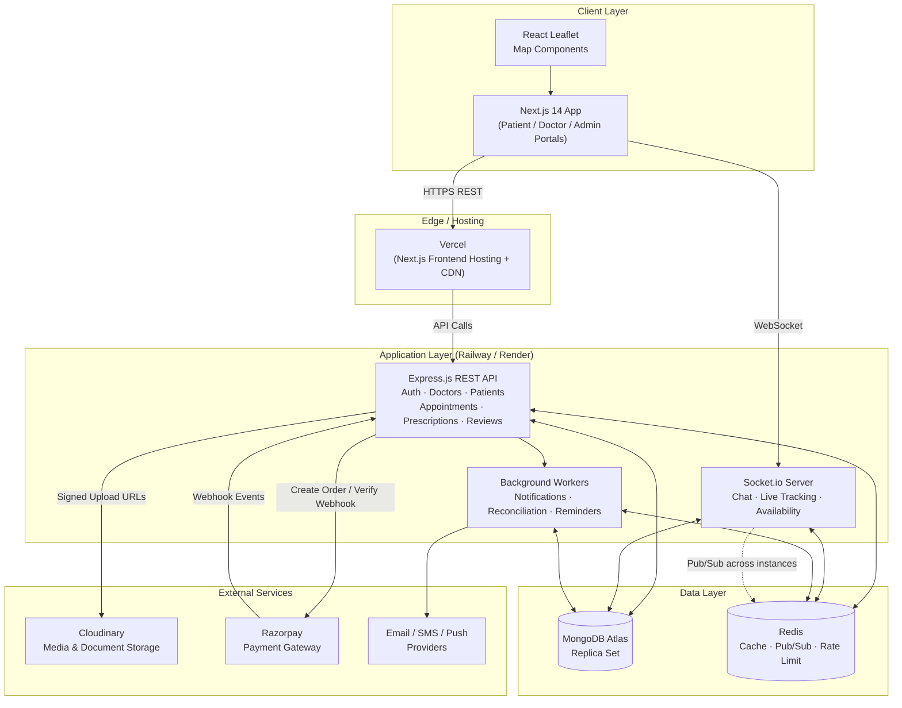
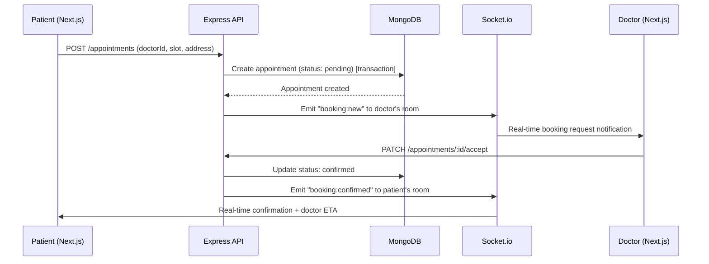
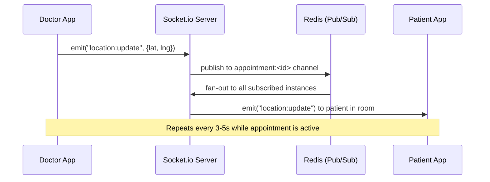
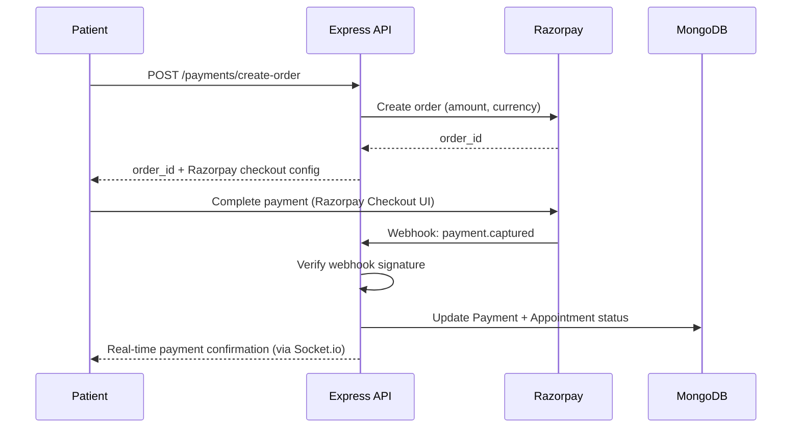
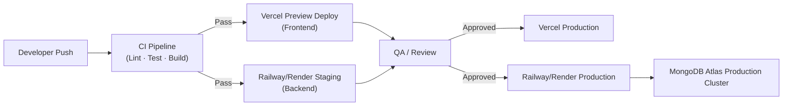

# High Level Design (HLD) Documentation

**Project:** DocDock — Doctor-on-Demand Healthcare Platform
**Tagline:** "Knock-Knock, your doctor is here."
**Document Version:** 1.0
**Document Owner:** Engineering Team
**Classification:** Internal / Portfolio-Grade Reference

---

## 1. Purpose

This document describes the High Level Design (HLD) of DocDock — the system architecture, major components, inter-service communication patterns, external integrations, scalability approach, security posture, and deployment topology. It is intended to give engineers, architects, and technical stakeholders a shared understanding of how the platform is structured before diving into low-level design or implementation.

---

## 2. System Architecture Overview

DocDock follows a **modular monolith with real-time augmentation** architecture for its MVP/portfolio scope — a single well-structured Express.js backend organized into domain modules (auth, doctors, patients, appointments, payments, chat, notifications), paired with a Next.js frontend, a persistent WebSocket layer (Socket.io) for real-time features, and managed third-party services for storage, payments, and media.

This approach is deliberately chosen over a full microservices split because:
- It minimizes operational overhead appropriate for a portfolio/early-stage product.
- Domain modules are still cleanly separated, so the codebase can be decomposed into independent services later (e.g., extracting the Chat/Tracking module into its own real-time service) without major rework.
- It reduces network-hop latency for tightly coupled flows like booking → notification → payment.

The architecture is composed of four logical layers:

1. **Client Layer** — Next.js 14 web application (patient, doctor, and admin portals as route groups or separate apps).
2. **API & Real-Time Layer** — Express.js REST API + Socket.io WebSocket server, both running within the same Node.js process(es) for the MVP, scalable independently later.
3. **Data & Caching Layer** — MongoDB Atlas (primary datastore) and Redis (caching, Socket.io pub/sub adapter, rate limiting, session/token blacklist).
4. **External Services Layer** — Cloudinary (media), Razorpay (payments), and notification providers (email/SMS/push).

---

## 3. Architecture Diagram (Mermaid)

---

## 4. Major Components

### 4.1 Frontend (Next.js 14)

| Component | Responsibility |
|-----------|------------------|
| **Patient Portal** | Registration/login, doctor search, booking, live tracking, chat, payments, reviews |
| **Doctor Portal** | Registration/verification flow, availability toggle, appointment management, chat, prescription creation |
| **Admin Portal** | Doctor verification queue, user management, payment reconciliation, audit logs, analytics |
| **Shared UI Library** | Tailwind-based design system (buttons, forms, cards, modals) shared across all three portals |
| **Map Module (React Leaflet)** | Renders doctor search results and live tracking views; abstracts marker/route rendering from business logic |

**Next.js-specific design notes:**
- Uses the **App Router** with Server Components for data-heavy, SEO-irrelevant authenticated views (dashboards, appointment lists) to reduce client bundle size, and Client Components for interactive real-time pieces (chat, live map, availability toggle) that depend on Socket.io.
- **Route groups** (`(patient)`, `(doctor)`, `(admin)`) separate persona-specific layouts and middleware (auth guards) without duplicating the routing tree.
- **Middleware** at the edge validates JWT presence/expiry before allowing access to protected route groups, redirecting to login when absent — full role authorization is still re-verified server-side on every API call.
- **API routes are NOT used as the primary backend** — Next.js communicates with the standalone Express.js API; Next.js API routes (if any) are limited to lightweight server-side proxying (e.g., attaching httpOnly cookies) rather than business logic, keeping a clean separation between frontend and backend deployability.

### 4.2 Backend API (Express.js)

| Module | Responsibility |
|--------|------------------|
| **Auth Module** | Registration, login, JWT issuance/refresh, password reset, bcrypt hashing |
| **Doctor Module** | Profile CRUD, verification status, availability state, geospatial indexing |
| **Patient Module** | Profile CRUD, address management, health profile |
| **Appointment Module** | Booking lifecycle (pending → confirmed → in-progress → completed/cancelled), slot-conflict handling |
| **Chat Module** | REST endpoints for chat history retrieval; real-time delivery handled by Socket.io |
| **Prescription Module** | Digital prescription generation and retrieval (PDF generation) |
| **Review Module** | Rating/review submission and aggregation |
| **Payment Module** | Razorpay order creation, webhook handling, reconciliation |
| **Admin Module** | Verification approvals, suspensions, audit log queries |
| **Notification Module** | Dispatch logic for email/SMS/push, delegated to background workers |

**Express.js-specific design notes:**
- Organized as **feature-based modules**, each exposing a `routes/`, `controller/`, `service/`, and `model/` layer — controllers stay thin, business logic lives in services, keeping routes testable in isolation.
- **Centralized error-handling middleware** normalizes all error responses to a consistent shape (`{ success, message, code }`), avoiding leaking stack traces in production.
- **Validation middleware** (e.g., Zod/Joi schemas) runs before controllers to reject malformed requests early.
- **Auth middleware** verifies JWT and attaches `req.user` with role claims; a separate `requireRole()` middleware enforces RBAC per route.

### 4.3 Real-Time Layer (Socket.io)

| Channel/Namespace | Purpose |
|--------------------|---------|
| `/tracking` | Doctor → Patient live location streaming during active appointments |
| `/chat` | Bi-directional patient ↔ doctor messaging |
| `/availability` | Doctor status broadcast (online/busy/offline) to relevant search sessions |
| `/notifications` | Lightweight real-time toast/badge updates for in-app events |

**Socket.io-specific design notes:**
- Each socket connection authenticates via JWT passed during the handshake (`auth` payload), validated before joining any room.
- **Rooms are scoped per appointment ID** (e.g., `appointment:<id>`) for chat and tracking, ensuring messages/location data are only broadcast to the two relevant parties — never globally.
- The **Redis adapter** (`@socket.io/redis-adapter`) is used from day one (even pre-scale) so that horizontal scaling later requires no protocol changes — all instances publish/subscribe through Redis rather than relying on in-memory state.
- Socket disconnect handling automatically updates doctor availability to "Offline" if no reconnection occurs within a grace period (e.g., 30 seconds), preventing stale "Online" statuses.

### 4.4 Data Layer

**MongoDB Atlas:**
- Primary operational datastore for all persistent entities: Users (Patients/Doctors/Admins), Appointments, Prescriptions, Reviews, Payments, Notifications, AuditLogs.
- **2dsphere geospatial index** on the Doctor collection's location field powers nearby-search via `$geoNear`/`$near`.
- Compound indexes on (`doctorId`, `status`, `scheduledAt`) support efficient appointment queries.
- Schema design favors **embedding for bounded, rarely-changing sub-documents** (e.g., a prescription's medication list) and **referencing for high-growth or independently-queried entities** (e.g., chat messages, reviews) to keep documents within MongoDB's size and performance sweet spot.

**Redis:**
- **Socket.io pub/sub adapter** for cross-instance real-time event delivery.
- **Caching layer** for frequently-read, infrequently-changed data (doctor search results for popular geo-buckets, doctor profile cards) with short TTLs (30–60s) to reduce MongoDB load.
- **Rate limiting** store (e.g., via `rate-limit-redis`) for login and search endpoint throttling.
- **Token blacklist** for revoked refresh tokens/logout, checked during JWT refresh flow.

### 4.5 Background Workers

- Decoupled from the request/response cycle via a job queue (e.g., BullMQ on Redis) for:
  - Notification dispatch (email/SMS/push)
  - Appointment reminders
  - Payment reconciliation (Razorpay ↔ internal records)
  - Scheduled data retention/purge jobs (chat logs, expired tokens)
- Workers retry with exponential backoff and route persistent failures to a dead-letter queue for manual inspection.

---

## 5. Service Interaction

### 5.1 Appointment Booking Flow

### 5.2 Live Tracking Flow

### 5.3 Payment Flow

---

## 6. External Services

| Service | Role in DocDock | Integration Notes |
|---------|------------------|---------------------|
| **Cloudinary** | Stores doctor verification documents, profile photos, clinic images, prescription PDFs | Uploads use signed, time-limited URLs generated server-side; verification documents stored as **private** assets accessible only to Admin role via short-lived signed access; no raw files touch application servers (direct-to-Cloudinary upload via signed params) |
| **Razorpay** | Handles all payment processing for consultations | Backend creates orders server-side using the secret key; frontend only ever sees the public key; payment confirmation is **never trusted from client-side redirect alone** — confirmed only via verified webhook signature |
| **Email/SMS/Push Provider** (e.g., SendGrid/Twilio/FCM) | Delivers appointment, verification, and payment notifications | Abstracted behind a `NotificationProvider` interface in the Notification Module so providers can be swapped without touching business logic |
| **MongoDB Atlas** | Managed database hosting with built-in replication, backups, and monitoring | Connection via MongoDB driver with connection pooling; Atlas Performance Advisor reviewed periodically for index recommendations |
| **Redis** (managed, e.g., Upstash/Redis Cloud) | Pub/sub, caching, rate limiting, queues | Single Redis instance for MVP; can be split into separate logical databases/instances for cache vs. queue vs. pub/sub as load grows |

---

## 7. Scalability Strategy

| Concern | Strategy |
|---------|----------|
| **Stateless API servers** | Express.js servers hold no in-memory session state — JWTs are self-contained and Redis backs any shared state — allowing horizontal scaling behind a load balancer on Railway/Render. |
| **Real-time fan-out** | Socket.io's Redis adapter ensures that scaling to N server instances doesn't fragment chat/tracking delivery; any instance can serve any client and still reach the right room. |
| **Database read load** | Redis caches hot-path reads (popular search geo-buckets, doctor profile cards); MongoDB Atlas read replicas can be introduced for reporting/analytics queries to isolate them from transactional load. |
| **Geospatial query performance** | 2dsphere index on doctor location field keeps nearby-search performant even as the doctor count grows into the tens of thousands; queries are bounded by radius to avoid full-collection scans. |
| **Media offloading** | All binary assets (images, PDFs) live on Cloudinary's CDN, never on application servers — scaling user-generated content doesn't pressure compute infrastructure. |
| **Asynchronous workloads** | Notification dispatch, reconciliation, and reminders run via a Redis-backed job queue rather than inline in the request cycle, preventing slow third-party calls (e.g., SMS providers) from blocking API throughput. |
| **Auto-scaling** | Railway/Render auto-scaling rules trigger on CPU/memory thresholds; Vercel scales the Next.js frontend automatically by design (serverless/edge). |
| **Future decomposition path** | Because modules are cleanly bounded within the monolith, the Chat/Tracking module is the most natural first candidate to extract into an independently-scaled real-time service if/when load demands it. |

---

## 8. Security Overview

| Layer | Controls |
|-------|----------|
| **Authentication** | JWT (short-lived access token + longer-lived refresh token); bcrypt (cost factor ≥ 12) for password hashing; refresh tokens revocable via Redis blacklist |
| **Authorization** | Role-based access control (Patient/Doctor/Admin) enforced via Express middleware on every protected route; resource-level checks (e.g., a doctor can only view patients they have an appointment with) enforced in service layer, not just route-level |
| **Transport Security** | TLS enforced end-to-end (client ↔ Vercel ↔ Express API ↔ MongoDB Atlas/Redis); HTTP auto-redirects to HTTPS |
| **Data Protection** | MongoDB Atlas encryption-at-rest; sensitive fields (health notes, prescription content) eligible for field-level encryption; Cloudinary verification documents stored as private assets behind signed URLs |
| **Input Validation** | Schema validation (Zod/Joi) on all incoming payloads before reaching controllers; MongoDB driver parameterization prevents NoSQL injection |
| **Real-Time Security** | Socket.io connections authenticate via JWT at handshake; room access scoped per appointment ID, preventing cross-patient/cross-doctor data leakage |
| **Payment Security** | No card data ever touches DocDock servers (PCI-DSS scope stays with Razorpay); webhook payloads verified via HMAC signature before trusting payment status changes |
| **Rate Limiting & Abuse Prevention** | Redis-backed rate limiting on auth and search endpoints; exponential lockout on repeated failed login attempts |
| **Auditability** | Sensitive admin actions (verification decisions, suspensions, refunds) write immutable audit log entries with actor, timestamp, and outcome |
| **Secrets Management** | All API keys/secrets (Razorpay, Cloudinary, JWT signing keys, MongoDB URI) stored as environment variables on Vercel/Railway/Render, never committed to source control |

---

## 9. Deployment Overview

| Component | Platform | Notes |
|-----------|----------|-------|
| **Frontend (Next.js 14)** | **Vercel** | Automatic CI/CD from Git; preview deployments per PR; edge caching and CDN for static assets; environment variables scoped per environment (Development/Preview/Production) |
| **Backend API + Socket.io** | **Railway or Render** | Containerized Node.js/Express deployment; horizontal scaling via platform auto-scale rules; health-check endpoint (`/health`) used for zero-downtime rolling deploys |
| **Database** | **MongoDB Atlas** | Managed replica set (minimum 3 nodes) across availability zones; automated daily backups with point-in-time recovery; Atlas network access restricted via IP allow-list/VPC peering to backend hosting provider |
| **Cache/Pub-Sub/Queue** | **Redis** (managed add-on, e.g., Upstash/Redis Cloud) | Provisioned alongside backend hosting; persistence enabled for queue durability |
| **Media Storage** | **Cloudinary** | CDN-backed; signed upload presets restrict what the frontend can upload directly, reducing backend bandwidth usage |
| **Payments** | **Razorpay** | Webhook endpoint exposed on the backend (`/webhooks/razorpay`), registered in the Razorpay dashboard; sandbox/test mode used in staging, live keys restricted to production environment only |

### Deployment Pipeline (CI/CD)

**Environment Strategy:**
- **Development** — local Docker Compose (Node.js, local/dev MongoDB Atlas cluster, local Redis) for fast iteration.
- **Staging** — mirrors production topology with sandbox third-party credentials (Razorpay test mode, Cloudinary dev folder).
- **Production** — live credentials, stricter rate limits, full monitoring/alerting enabled.

---

## 10. Revision History

| Version | Date | Author | Change Summary |
|---------|------|--------|------------------|
| 1.0 | 2026-06-24 | Engineering Team | Initial High Level Design documentation for DocDock. |
