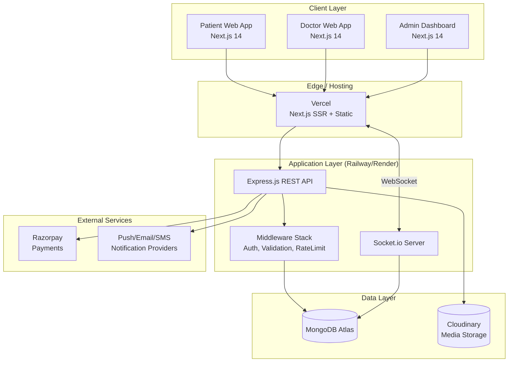
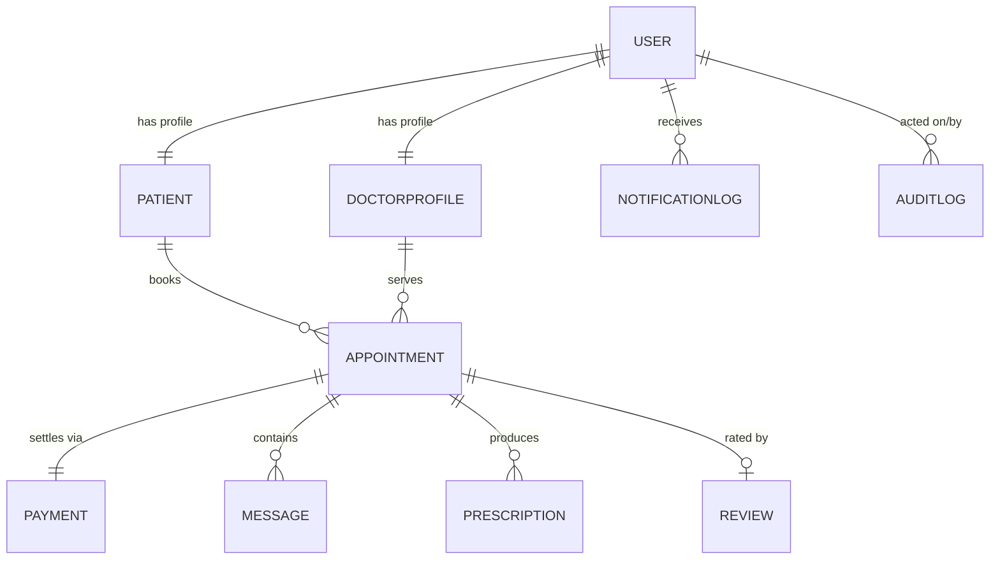
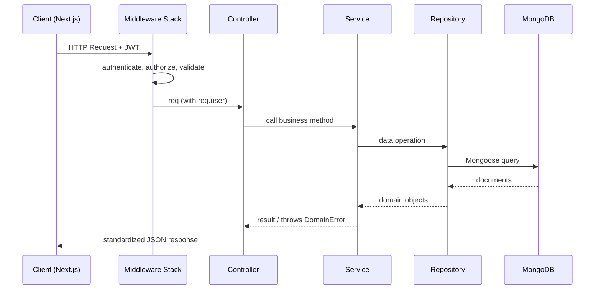
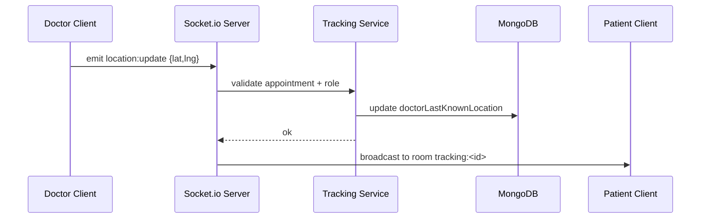
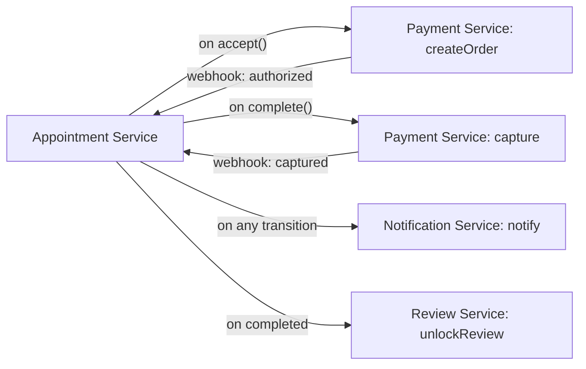
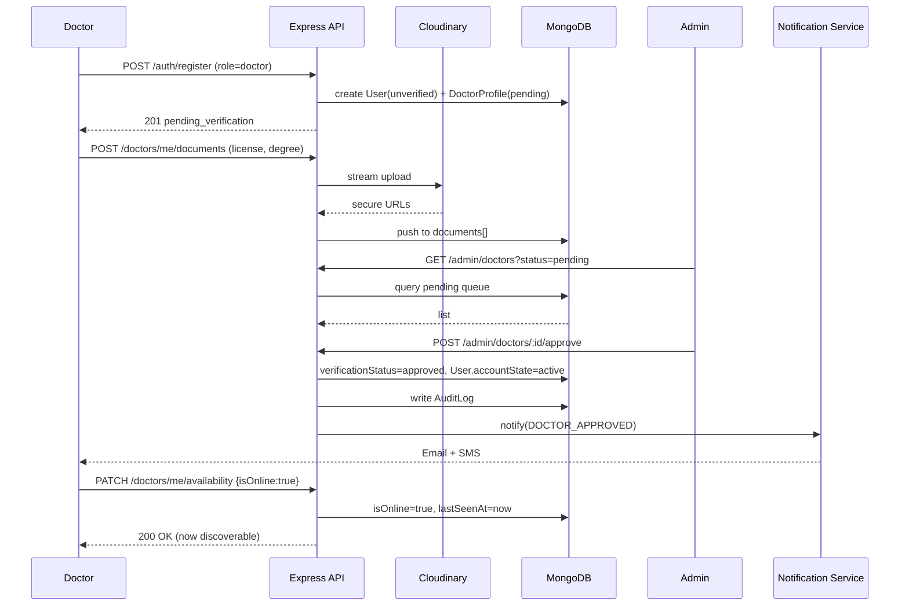
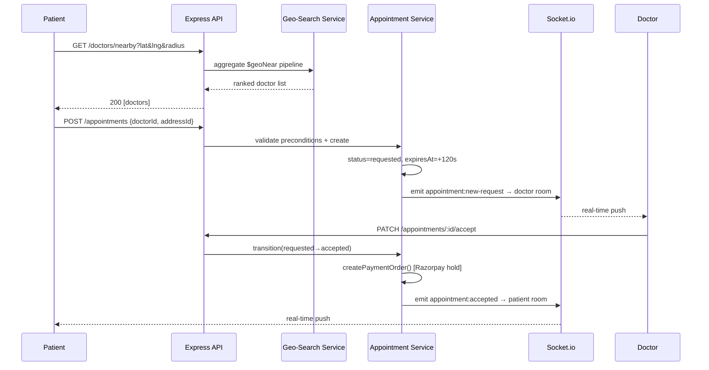
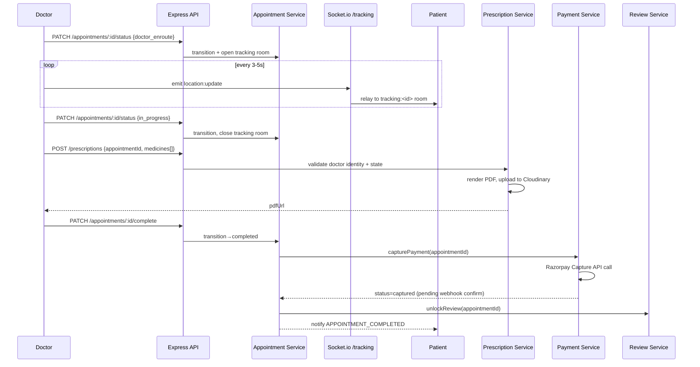
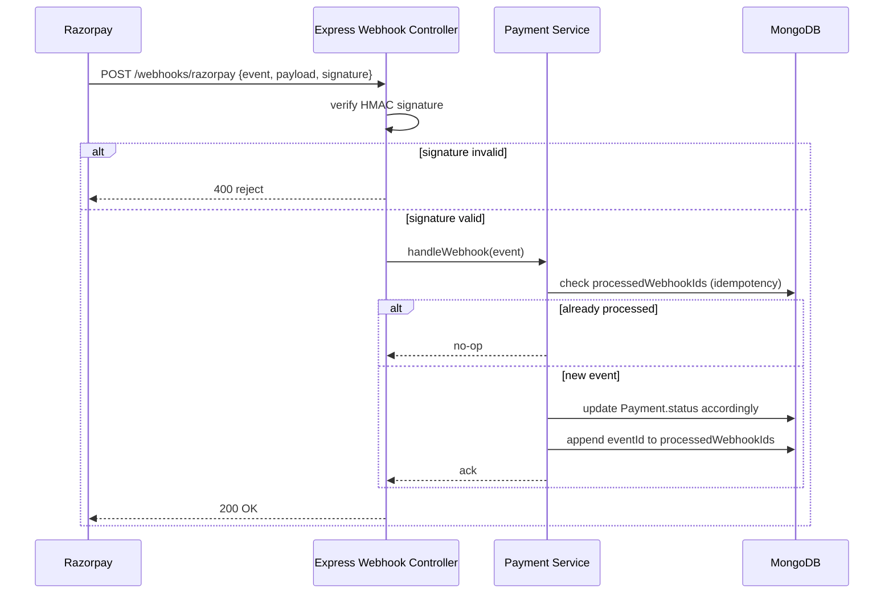
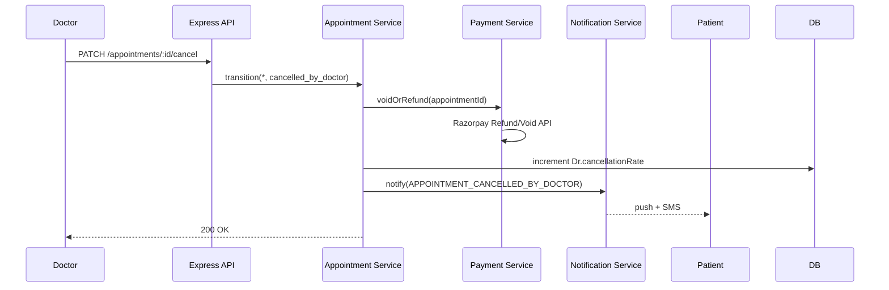

# DocDock — Low Level Design Document

**Tagline:** *"Knock-Knock, your doctor is here."*

| Field | Value |
|---|---|
| Document Type | Low Level Design (LLD) |
| Project | DocDock — Doctor-on-Demand Healthcare Platform |
| Version | 1.0 |
| Audience | Engineering team, technical reviewers, future maintainers |
| Status | Draft for Implementation |

---

## 1. Document Control

| Version | Description | Author Role |
|---|---|---|
| 1.0 | Initial LLD covering all core modules, schemas, sequence flows, and error handling strategy | Engineering |

This document assumes familiarity with the High Level Design (HLD) and Product Requirements. It focuses exclusively on **implementation-level detail**: class/module responsibilities, function-level workflows, database schema, sequence diagrams, and failure-mode handling.

---

## 2. Introduction & Scope

### 2.1 Purpose

This LLD translates the DocDock product vision into concrete engineering specifications. It is written so that a backend or frontend engineer can implement any module without needing additional architectural decisions — those decisions are made here.

### 2.2 In Scope

- Internal module decomposition for all 12 core features
- MongoDB schema design with indexes and relationships
- Sequence flows for critical user journeys (registration, booking, tracking, payment, prescription)
- Socket.io event contracts for real-time features (tracking, chat, availability)
- Error handling and resiliency strategy across API, sockets, and third-party integrations (Razorpay, Cloudinary)
- Business rules governing appointment lifecycle, doctor verification, and payment settlement

### 2.3 Out of Scope

- UI wireframes / visual design (covered in design specs)
- Infrastructure-as-code / CI-CD pipeline definitions
- Load testing and capacity planning numbers
- Legal/compliance certification (HIPAA/DPDP details are noted as considerations only, not certified controls)

### 2.4 Glossary

| Term | Meaning |
|---|---|
| Patient | End user seeking a home consultation |
| Doctor | Verified medical professional offering on-demand consultations |
| Admin | Internal staff verifying doctor credentials and moderating the platform |
| Appointment | A booked consultation session between a Patient and a Doctor |
| Geo-fence | Radius-based search boundary used to find nearby doctors |
| Live Tracking | Real-time location broadcast of a Doctor en route to a Patient |

---

## 3. System Architecture Overview

### 3.1 High-Level Component Map



### 3.2 Layered Architecture (Backend)

The backend follows a **layered, modular monolith** pattern — a single deployable Express service internally organized into isolated feature modules. This balances startup-speed simplicity with enterprise-style separation of concerns, and allows future extraction into microservices (e.g., Chat, Notification) without a rewrite.

```
src/
├── modules/
│   ├── auth/
│   ├── patient/
│   ├── doctor/
│   ├── admin/
│   ├── geo-search/
│   ├── availability/
│   ├── appointment/
│   ├── tracking/
│   ├── chat/
│   ├── prescription/
│   ├── review/
│   ├── payment/
│   └── notification/
├── common/
│   ├── middleware/
│   ├── utils/
│   ├── errors/
│   ├── config/
│   └── constants/
├── sockets/
│   ├── gateway.js
│   └── handlers/
├── jobs/              # cron / background workers
└── server.js
```

Each module under `modules/` is structured uniformly:

```
modules/<feature>/
├── <feature>.routes.js       # Express route definitions
├── <feature>.controller.js   # Request/response orchestration
├── <feature>.service.js      # Business logic (pure, testable)
├── <feature>.repository.js   # MongoDB data access (Mongoose)
├── <feature>.model.js        # Mongoose schema
├── <feature>.validation.js   # Joi/Zod request schemas
└── <feature>.events.js       # Socket.io emitters (if applicable)
```

**Layering rule (strict dependency direction):**

```
routes → controller → service → repository → model
```

- Controllers never touch Mongoose models directly.
- Services never read `req`/`res` — they are framework-agnostic and unit-testable.
- Repositories are the only layer aware of MongoDB query syntax.

### 3.3 Real-Time Architecture

Socket.io runs as a separate logical layer attached to the same HTTP server (shared port, separate namespace structure), backed by a **Redis adapter** (recommended addition for horizontal scaling across Railway/Render instances) to enable multi-instance pub/sub for tracking and chat events.

Namespaces:

| Namespace | Purpose |
|---|---|
| `/tracking` | Doctor → Patient live location broadcast |
| `/chat` | Patient ↔ Doctor messaging |
| `/availability` | Doctor online/offline status broadcast to search results |
| `/notifications` | In-app real-time notification delivery |
---

## 4. Module Breakdown

Each module below documents: **Responsibility**, **Internal Components**, **Key Workflows**, and **Business Rules**.

---

### 4.1 Auth Module

**Responsibility:** Unified authentication/authorization for all three user roles (Patient, Doctor, Admin) using a single JWT-based scheme differentiated by a `role` claim.

**Internal Components**

| Component | Responsibility |
|---|---|
| `auth.controller.js` | Handles `/register`, `/login`, `/refresh`, `/logout`, `/forgot-password` endpoints |
| `auth.service.js` | Password hashing (bcrypt), JWT signing/verification, OTP generation for phone verification |
| `auth.repository.js` | User lookup/creation across `User` collection (discriminator pattern for role-specific fields) |
| `token.util.js` | Access token (15 min TTL) + Refresh token (7 day TTL) generation, rotation, and blacklisting via Redis/DB |
| `rbac.middleware.js` | Route guard verifying `role` claim against required permissions per route |

**Workflow — Registration**

1. Client submits `{ name, email, phone, password, role }`.
2. `auth.validation.js` enforces schema: valid email regex, phone in E.164, password ≥ 8 chars with at least one number/symbol.
3. `auth.service.checkDuplicate()` queries by email AND phone (compound uniqueness) to prevent duplicate accounts.
4. Password hashed via `bcrypt.hash(password, 12)`.
5. If `role === 'doctor'`, a linked `DoctorProfile` document is created with `verificationStatus: 'pending'` and the account is **login-disabled** until Admin approval (see 4.4).
6. If `role === 'patient'`, account is immediately active.
7. OTP sent to phone via Notification Module for verification (non-blocking — account created in `unverified` state, restricted to read-only actions until OTP confirmed).
8. Response returns access + refresh tokens (patients only; doctors receive a "pending verification" response with no tokens).

**Workflow — Login**

1. Client submits `{ email/phone, password }`.
2. Lookup user; compare hash via `bcrypt.compare`.
3. Check account state machine: `unverified → active → suspended → banned`. Only `active` accounts may log in (with `unverified` allowed limited access).
4. For doctors: additionally check `verificationStatus === 'approved'`. If `pending` or `rejected`, return `403` with a specific error code (`DOCTOR_NOT_VERIFIED`) so the frontend can render the correct pending-approval screen.
5. Issue access + refresh token pair. Refresh token stored hashed in `RefreshToken` collection with device metadata (for multi-device logout support).

**Business Rules**

- A single email cannot hold both a Patient and Doctor account (role is fixed at registration).
- Refresh tokens are single-use and rotate on every refresh (old token is invalidated, preventing replay).
- Failed login attempts are rate-limited: 5 attempts / 15 minutes per IP+identifier combination, then a 15-minute lockout.
- JWT payload: `{ sub: userId, role, verificationStatus (doctor only), iat, exp }`. No PII beyond ID/role is embedded.

---

### 4.2 Patient Module

**Responsibility:** Manages patient profile data, address book (for home-visit locations), and medical history reference data used during booking.

**Internal Components**

| Component | Responsibility |
|---|---|
| `patient.controller.js` | CRUD for profile, address management, medical history upload |
| `patient.service.js` | Profile completeness scoring, default-address resolution |
| `patient.repository.js` | `Patient` collection access |
| `patient.model.js` | Schema: personal info, saved addresses (GeoJSON Points), allergies/conditions array |

**Key Workflows**

- **Add Address:** Patient submits address string → resolved to `{ lat, lng }` via a geocoding call (client-side using React Leaflet's geocoder, or a server-side fallback) → stored as a GeoJSON `Point` in `addresses[]`. One address may be flagged `isDefault: true`; setting a new default unsets the previous one atomically (`findOneAndUpdate` with array filters).
- **Profile View (Doctor-facing):** When a Doctor opens an appointment, the Patient Module exposes a **redacted profile view** (name, age, gender, allergies, current address) — excluding unrelated fields like saved payment methods.

**Business Rules**

- A patient must have at least one saved address with valid coordinates before booking is allowed (enforced in Appointment Module as a precondition check, not duplicated here).
- Medical history fields are append-only (no destructive edits) — each update creates a new history entry with a timestamp, preserving an audit trail for clinical safety.

---

### 4.3 Doctor Module

**Responsibility:** Manages doctor professional profile, credentials, specialization, consultation fee, service radius, and links to verification status.

**Internal Components**

| Component | Responsibility |
|---|---|
| `doctor.controller.js` | Profile CRUD, document upload (degree/license via Cloudinary), specialization & fee management |
| `doctor.service.js` | Computes derived fields: average rating, total consultations, profile completeness |
| `doctor.repository.js` | `DoctorProfile` collection access, including geo-indexed current-location field |
| `doctor.model.js` | Schema with embedded `currentLocation` (GeoJSON Point, 2dsphere indexed), `serviceRadiusKm`, `consultationFee`, `specializations[]`, `documents[]` |

**Key Workflows**

- **Credential Upload:** Doctor uploads license/degree images/PDFs → `cloudinary.uploader.upload()` (resource type auto-detected) → returned secure URL + public ID stored in `documents[]` with `status: 'pending_review'`. Raw files are never stored on the application server (streamed directly to Cloudinary using multipart streaming, not buffered to disk).
- **Fee & Radius Configuration:** Doctor sets `consultationFee` (used at payment time) and `serviceRadiusKm` (used by Geo-Search Module to filter doctor visibility for nearby patients).
- **Profile Update Post-Verification:** Certain fields (registration number, primary degree) become **immutable** after `verificationStatus === 'approved'` and require a re-verification request to change — preventing a verified doctor from silently swapping credentials.

**Business Rules**

- A doctor's profile is invisible in search results unless: `verificationStatus === 'approved' AND isOnline === true AND availability window matches current time`.
- `consultationFee` must be a positive integer in smallest currency unit (paise) to avoid floating-point payment errors downstream.

---

### 4.4 Admin Verification Module

**Responsibility:** Reviews doctor-submitted credentials and approves/rejects doctor accounts; moderates flagged content (reviews, chat reports).

**Internal Components**

| Component | Responsibility |
|---|---|
| `admin.controller.js` | Endpoints: list pending doctors, view documents, approve/reject, suspend any account |
| `admin.service.js` | Verification state transitions, audit log writing |
| `admin.repository.js` | Cross-collection queries (joins `DoctorProfile` + `User` + `documents`) |
| `auditLog.model.js` | Immutable record of every admin action: `{ adminId, action, targetId, reason, timestamp }` |

**Key Workflow — Doctor Verification**

1. Admin fetches paginated queue: `GET /admin/doctors?status=pending`.
2. Admin opens a doctor record; views Cloudinary-hosted documents inline.
3. Admin issues `POST /admin/doctors/:id/approve` or `/reject`.
4. **Approve path:** `DoctorProfile.verificationStatus → 'approved'`; `User.accountState → 'active'`; Notification Module triggers an approval email/SMS; doctor becomes searchable once they toggle online.
5. **Reject path:** requires a mandatory `reason` field (free text, min 10 chars) → status set to `'rejected'`; doctor notified with the reason and allowed to resubmit corrected documents (resubmission resets status to `'pending'`, not a new account).
6. Every transition writes an `AuditLog` entry — this is non-negotiable and implemented as a service-layer side effect, not optional middleware, ensuring it cannot be skipped by future code paths.

**Business Rules**

- Only Admins with role `admin` and an additional `permissions.canVerifyDoctors` flag may approve/reject (supports future tiered-admin roles like support-only admins).
- A rejected doctor cannot reapply more than 3 times without escalation to a senior admin flag (`escalationRequired: true`), preventing infinite resubmission loops.
- All admin actions are logged with before/after state snapshots for compliance traceability.
---

### 4.5 Geo-Search Module

**Responsibility:** Resolves "doctors near me" queries using MongoDB geospatial queries, combining location proximity with availability and specialization filters.

**Internal Components**

| Component | Responsibility |
|---|---|
| `geoSearch.controller.js` | `GET /doctors/nearby` endpoint accepting `lat, lng, radiusKm, specialization?, minRating?` |
| `geoSearch.service.js` | Builds the MongoDB aggregation pipeline; applies business filters; sorts by relevance |
| `geoSearch.repository.js` | Executes `$geoNear` / `$geoWithin` aggregation against `DoctorProfile` |

**Key Workflow**

1. Client (Patient app) requests current geolocation via browser Geolocation API; React Leaflet renders the map centered on this point.
2. Request hits `GET /doctors/nearby?lat=..&lng=..&radiusKm=10`.
3. Service layer constructs an aggregation pipeline:

```js
[
  {
    $geoNear: {
      near: { type: "Point", coordinates: [lng, lat] },
      distanceField: "distanceMeters",
      maxDistance: radiusKm * 1000,
      spherical: true,
      query: {
        verificationStatus: "approved",
        isOnline: true,
        ...(specialization && { specializations: specialization })
      }
    }
  },
  { $match: { $expr: { $lte: ["$distanceMeters", { $multiply: ["$serviceRadiusKm", 1000] }] } } },
  { $sort: { distanceMeters: 1 } },
  { $limit: 50 }
]
```

4. The second `$match` stage enforces **mutual radius logic** — a doctor only appears if the patient is within *both* the patient's requested search radius *and* the doctor's own configured service radius. This avoids surfacing doctors who technically fall in the patient's search window but don't service that area.
5. Results are enriched with `averageRating`, `consultationFee`, and a `distanceKm` (rounded, human-readable) before response.

**Business Rules**

- `radiusKm` is capped server-side at 25 km regardless of client input, to keep query cost and result relevance bounded.
- `isOnline` is a denormalized flag updated in real time by the Availability Module — Geo-Search never computes liveness itself, only reads the flag, keeping this module read-only and side-effect-free.
- Index requirement: `DoctorProfile.currentLocation` **must** have a `2dsphere` index; this is a hard prerequisite documented in the schema section.

---

### 4.6 Availability Module

**Responsibility:** Tracks and broadcasts real-time doctor online/offline status and working-hours-based availability windows.

**Internal Components**

| Component | Responsibility |
|---|---|
| `availability.controller.js` | `PATCH /doctors/me/availability` toggle endpoint; `GET` for schedule config |
| `availability.service.js` | Validates toggle against schedule windows; computes "currently available" boolean |
| `availability.events.js` | Emits `doctor:status-changed` over Socket.io `/availability` namespace |
| `availability.model.js` | Embedded sub-schema on `DoctorProfile`: `weeklySchedule[]`, `isOnline`, `lastSeenAt` |

**Key Workflow — Going Online**

1. Doctor toggles "Go Online" in the app → `PATCH /doctors/me/availability { isOnline: true }`.
2. Service validates the doctor is `verificationStatus === 'approved'` (a pending doctor cannot go online — enforced here as a second guard, not just at login).
3. `currentLocation` must be present and updated within the last 5 minutes; if stale, the request is rejected with `LOCATION_STALE` so the client can request a fresh GPS fix first.
4. On success: `isOnline: true`, `lastSeenAt: now()` persisted; event emitted to the `/availability` namespace so any patient currently browsing the search-results map sees the doctor pin update live, without a page refresh.
5. **Heartbeat mechanism:** the doctor client sends a location+heartbeat ping every 30 seconds while online. If no heartbeat is received for 90 seconds, a background job (`jobs/staleDoctorSweep.js`, cron every 1 min) force-sets `isOnline: false` — preventing "ghost" doctors from appearing available after a crashed tab or lost connection.

**Business Rules**

- Going online outside the doctor's declared `weeklySchedule` is permitted (doctors may work ad hoc) but the UI surfaces a soft warning; it is not blocked, since on-demand flexibility is core to the product.
- `isOnline` auto-flips to `false` the moment a doctor accepts a booking that fills their concurrent-appointment capacity (see 4.7 business rules on concurrency).

---

### 4.7 Appointment Booking Module

**Responsibility:** Owns the full appointment lifecycle state machine — the most business-logic-dense module in the system.

**State Machine**

```
requested → accepted → doctor_enroute → in_progress → completed
     │           │
     │           └──────────────→ cancelled_by_doctor
     └──────────────────────────→ cancelled_by_patient
                                          (any pre-in_progress state)
     accepted/enroute (no response timeout) → expired
```

**Internal Components**

| Component | Responsibility |
|---|---|
| `appointment.controller.js` | Endpoints for create, accept/reject, cancel, status transitions |
| `appointment.service.js` | State machine enforcement, slot-conflict checks, payment-hold orchestration |
| `appointment.repository.js` | `Appointment` collection access |
| `appointment.model.js` | Schema with `status`, `timeline[]` (audit of every transition with timestamp + actor) |
| `appointment.events.js` | Emits socket events to both patient and doctor on every transition |

**Key Workflow — Booking Creation**

1. Patient selects a doctor from search results → `POST /appointments { doctorId, addressId, scheduledFor: 'now' | ISODate, notes }`.
2. Service validates:
   - Patient has a verified address (4.2 precondition).
   - Doctor is currently `isOnline` (for instant bookings) or has an open slot in `weeklySchedule` (for scheduled bookings).
   - Doctor's concurrent active-appointment count `< maxConcurrentAppointments` (default 1 — a doctor handles one home visit at a time; configurable per doctor for clinic-based doctors handling parallel virtual + physical queues in a future iteration).
3. Appointment created with `status: 'requested'`, a 2-minute acceptance SLA timer starts (`expiresAt = now + 120s`), enforced by a delayed job (BullMQ/Agenda or a simple TTL index fallback — see Error Handling §10).
4. Real-time `appointment:new-request` event pushed to the doctor's `/notifications` socket room.
5. **Doctor accepts:** `PATCH /appointments/:id/accept` → status `accepted`; a payment **authorization hold** is created via Razorpay Orders API (amount = `consultationFee`, not yet captured) so the patient's card/UPI is verified upfront without charging until consultation completion.
6. **Doctor rejects / timeout:** status → `cancelled_by_doctor` or `expired`; patient is immediately offered the next-nearest available doctor (client-side re-query of Geo-Search, not auto-rebooked, to preserve patient choice).

**Key Workflow — En Route to Completion**

1. On accept, doctor's app prompts "Start Navigation" → `PATCH /appointments/:id/status { status: 'doctor_enroute' }` → triggers Live Tracking Module activation (4.8) and notifies patient.
2. On arrival, doctor marks `in_progress` → enables Chat Module's "consultation notes" mode and starts a consultation timer (informational, not billed by time in v1 — flat fee model).
3. Doctor completes the visit → `PATCH /appointments/:id/complete` requires at minimum one of: a prescription issued OR explicit consultation notes — preventing accidental/empty completions.
4. Completion triggers: Razorpay payment **capture** (charges the pre-authorized hold), Notification to patient, and unlocks the Ratings module for that appointment.

**Business Rules**

- Cancellation by patient **before** `accepted`: free, no charge.
- Cancellation by patient **after** `accepted` but before `doctor_enroute`: a cancellation fee (configurable %, default 10% of consultation fee) may apply if within a short window of the scheduled time — captured from the pre-auth, remainder voided.
- Cancellation by doctor at any stage: zero charge to patient; doctor's `cancellationRate` metric increments, surfaced to Admin for quality monitoring (repeated cancellations can trigger a manual review flag).
- An appointment auto-expires from `requested` if unaccepted within 120 seconds — this SLA is a configurable constant, not a magic number buried in code (`config/appointment.constants.js`).
- All status transitions are written through a single `transition(appointmentId, fromStatus, toStatus, actor)` service function that validates the transition against an explicit allow-list map — direct field writes to `status` elsewhere in the codebase are disallowed by convention and code review, preventing illegal state jumps (e.g., `requested → completed` directly).
---

### 4.8 Live Doctor Tracking Module

**Responsibility:** Streams a doctor's real-time GPS position to the assigned patient during the `doctor_enroute` phase of an appointment.

**Internal Components**

| Component | Responsibility |
|---|---|
| `tracking.gateway.js` | Socket.io `/tracking` namespace connection handler, room management |
| `tracking.service.js` | Validates that a tracking session is legitimate (active appointment, correct participants) |
| `tracking.events.js` | `location:update`, `tracking:started`, `tracking:ended` event definitions |

**Key Workflow**

1. When an appointment transitions to `doctor_enroute`, the backend creates a socket room keyed `tracking:<appointmentId>`.
2. Doctor's client joins this room and begins emitting `location:update { lat, lng, heading, speed }` every 3–5 seconds (throttled client-side to balance battery/data usage against tracking smoothness).
3. Server validates on every emit: the emitting socket's authenticated `userId` matches the appointment's `doctorId`, and appointment status is still `doctor_enroute` — rejecting and logging any mismatched emission (defends against a stale tab continuing to send updates after status changes).
4. Server relays the location to the same room; only the patient's client (also joined to `tracking:<appointmentId>`) and no one else receives it — room scoping is the sole authorization boundary for this stream, deliberately kept simple.
5. Server also persists the **latest** location only (not a full breadcrumb trail in v1) onto `Appointment.doctorLastKnownLocation`, so a page refresh mid-tracking can rehydrate the last known pin via a normal REST call before the socket reconnects.
6. On transition to `in_progress` or any terminal state, the server emits `tracking:ended` and force-closes the room, stopping further location relay even if the doctor's client keeps emitting.

**Business Rules**

- Tracking is strictly scoped to the lifetime of one appointment's `doctor_enroute` phase — no persistent background location tracking of doctors is implemented, by design, for privacy.
- If the doctor's connection drops mid-tracking, the patient UI shows a "connection lost, last seen X seconds ago" state rather than silently freezing the pin — driven by a client-side staleness timer comparing `lastUpdateTimestamp`.

---

### 4.9 Patient ↔ Doctor Chat Module

**Responsibility:** Provides per-appointment scoped messaging, persisted for medical record-keeping.

**Internal Components**

| Component | Responsibility |
|---|---|
| `chat.gateway.js` | Socket.io `/chat` namespace; room = `chat:<appointmentId>` |
| `chat.service.js` | Message persistence, read-receipt logic, attachment handling via Cloudinary |
| `chat.repository.js` | `Message` collection access (indexed by `appointmentId`, `createdAt`) |
| `chat.model.js` | Schema: `appointmentId, senderId, senderRole, body, attachmentUrl?, readAt?, createdAt` |

**Key Workflow**

1. Chat becomes available the moment an appointment reaches `accepted` (so patient and doctor can coordinate before arrival) and remains read-accessible after `completed` for record purposes, but **write-locked** 24 hours after completion to prevent indefinite open threads.
2. Message send: client emits `message:send { appointmentId, body }` → server validates sender is a participant of that appointment and appointment is in a chat-eligible state → persists to MongoDB → emits `message:new` to the room → emits delivery acknowledgment back to sender.
3. Image attachments (e.g., patient sending a photo of a symptom) are uploaded via a REST endpoint to Cloudinary first (not over the socket, to avoid binary payloads on the WS connection); the returned URL is then sent as a normal chat message with `attachmentUrl` populated.
4. Read receipts: client emits `message:read { messageId }` on view → server sets `readAt` → emits `message:read-ack` to the original sender's socket if connected.

**Business Rules**

- Chat is strictly 1:1 and scoped to a single appointment; there is no persistent "contact list" or cross-appointment thread, reinforcing that this is a consultation tool, not a general messaging product.
- All messages are retained indefinitely as part of the clinical record (subject to future data-retention policy), never hard-deleted by users — a user-facing "delete" only sets `hiddenFor: [userId]`, a soft delete.

---

### 4.10 Digital Prescription Module

**Responsibility:** Allows doctors to generate structured, verifiable digital prescriptions tied to a completed/in-progress appointment.

**Internal Components**

| Component | Responsibility |
|---|---|
| `prescription.controller.js` | Create/view/download endpoints |
| `prescription.service.js` | PDF generation orchestration, validation of drug/dosage fields |
| `prescription.repository.js` | `Prescription` collection access |
| `prescription.model.js` | Schema: `appointmentId, doctorId, patientId, medicines[]{name,dosage,frequency,duration}, diagnosis, advice, issuedAt, pdfUrl` |

**Key Workflow**

1. During or immediately after an `in_progress` appointment, doctor fills a structured form (not free text, to keep data queryable and reduce transcription error): diagnosis, list of medicines with dosage/frequency/duration, general advice.
2. On submit, `prescription.service.generate()`:
   - Validates against the doctor's verified identity (name, registration number pulled from the verified `DoctorProfile`, not re-typed, to prevent spoofing).
   - Renders a PDF server-side (e.g., via a headless template engine — Puppeteer or a PDF library) embedding a clinic-style letterhead, doctor's registration number, patient details, and a unique prescription ID.
   - Uploads the rendered PDF to Cloudinary; stores the secure URL.
3. Prescription document is linked 1:1 (or 1:many for follow-ups) to the `Appointment`, and a notification is sent to the patient with a download link.
4. The patient's app surfaces all past prescriptions in a "Medical Records" view, independent of whether the originating appointment is still browsable.

**Business Rules**

- A prescription can only be created by the doctor assigned to that specific appointment, and only while the appointment is `in_progress` or within a short grace period (e.g., 30 minutes) after `completed` — covering the realistic case of a doctor finishing paperwork just after leaving.
- Once generated, a prescription is **immutable**. Corrections require issuing a new prescription marked `supersedes: <oldPrescriptionId>`, preserving a complete clinical audit trail rather than silently editing medical records.

---

### 4.11 Doctor Ratings & Reviews Module

**Responsibility:** Captures post-appointment patient feedback and maintains the aggregate rating shown in search results.

**Internal Components**

| Component | Responsibility |
|---|---|
| `review.controller.js` | Submit/edit-window/list endpoints |
| `review.service.js` | Aggregate rating recomputation, profanity/spam filtering hook |
| `review.repository.js` | `Review` collection access; aggregation pipeline for average rating |
| `review.model.js` | Schema: `appointmentId, patientId, doctorId, rating(1-5), comment?, createdAt` |

**Key Workflow**

1. Review submission is only enabled once `Appointment.status === 'completed'`, and only the patient on that specific appointment may submit — enforced via a compound uniqueness constraint `{ appointmentId, patientId }` so exactly one review exists per completed appointment.
2. On submit, the service writes the review, then **recomputes** the doctor's aggregate rating using an aggregation pipeline (`$group` average + count) rather than an incrementally-maintained running average, trading a small amount of read cost for guaranteed correctness and easy recovery from any data inconsistency.
3. The recomputed `{ averageRating, totalReviews }` is denormalized onto `DoctorProfile` for fast read access during Geo-Search, updated within the same request-response cycle (synchronously) since review volume is low-frequency enough not to warrant async processing.
4. Reviews containing flagged keywords (basic profanity list, extendable later to a moderation service) are still saved but marked `flaggedForReview: true` and excluded from public average computation until an Admin clears the flag.

**Business Rules**

- Edit window: a patient may edit their review within 48 hours of submission; after that it is locked (mirrors common marketplace patterns, balancing fairness to doctors against patient second-thoughts).
- A doctor cannot respond inline to reviews in v1 (no doctor-reply feature) — kept out of scope to limit dispute threads on a healthcare platform; disputes route to Admin instead.

---

### 4.12 Payments Module (Razorpay)

**Responsibility:** Owns the financial lifecycle of an appointment — authorization, capture, refund — fully decoupled from the Appointment state machine via an internal event interface, so payment logic doesn't leak into booking logic and vice versa.

**Internal Components**

| Component | Responsibility |
|---|---|
| `payment.controller.js` | Webhook receiver (`/webhooks/razorpay`), client-facing order-creation endpoint |
| `payment.service.js` | Order creation, signature verification, capture/refund orchestration |
| `payment.repository.js` | `Payment` collection access, linked 1:1 with `Appointment` |
| `payment.model.js` | Schema: `appointmentId, razorpayOrderId, razorpayPaymentId?, amount, currency, status, capturedAt?, refundedAt?` |

**Key Workflow — Authorize → Capture**

1. On doctor's acceptance of a booking (4.7 step 5), `payment.service.createOrder()` calls Razorpay's Orders API with `amount = consultationFee` and `payment_capture: 0` (manual capture mode) — this creates an authorization hold, not an immediate charge.
2. Client completes the Razorpay Checkout flow (handled client-side via Razorpay's JS SDK; the backend never sees raw card data, satisfying PCI-DSS SAQ-A scope).
3. Razorpay sends a webhook (`payment.authorized`) to `/webhooks/razorpay`. The controller:
   - Verifies the **HMAC signature** of the payload using the Razorpay webhook secret before trusting any payload content — every webhook handler in this module performs this check first, unconditionally.
   - Updates `Payment.status = 'authorized'`.
4. On appointment completion (4.7 step 4), `payment.service.capturePayment()` calls Razorpay's Capture API for the held amount (or a reduced amount in the cancellation-fee scenario from 4.7).
5. A second webhook (`payment.captured`) confirms capture server-side — the system treats the webhook, not the synchronous API response, as the **source of truth** for payment state, since synchronous responses can be lost to network failures while the webhook reliably arrives (with Razorpay's own retry guarantees).

**Key Workflow — Refund**

1. Full refund: triggered automatically when an appointment is `cancelled_by_doctor` after a hold existed, or when an Admin manually intervenes on a dispute.
2. Partial refund (patient cancellation fee scenario): captures only the fee percentage, voids/refunds the remainder.
3. All refunds go through Razorpay's Refund API; refund webhooks similarly update `Payment.status` asynchronously.

**Business Rules**

- No payment amount is ever computed or trusted from client input at capture time — the amount is always re-derived server-side from the `Appointment`/`DoctorProfile` fee at the moment of the original order creation, preventing client-side tampering.
- A `Payment` record is the single source of truth for whether a patient was charged; the Appointment module only reads payment **status**, never writes to the `Payment` collection directly — enforcing the same controller→service→repository ownership boundary across modules.
- Idempotency: every webhook handler checks `razorpayPaymentId` + event type against already-processed records before acting, since payment gateways may deliver the same webhook more than once.

---

### 4.13 Notification Module

**Responsibility:** Central dispatch for all outbound communication — push, email, SMS, and in-app real-time notifications — abstracted behind a single internal interface so individual modules never call a third-party provider directly.

**Internal Components**

| Component | Responsibility |
|---|---|
| `notification.service.js` | `notify({ userId, type, channel[], payload })` — the single entry point every other module calls |
| `providers/email.provider.js` | Wraps an email provider (e.g., SES/SendGrid) |
| `providers/sms.provider.js` | Wraps an SMS/OTP provider |
| `providers/push.provider.js` | Web push / FCM wrapper |
| `notification.events.js` | Emits to the Socket.io `/notifications` namespace for in-app real-time toasts |
| `notification.model.js` | Persisted log: `{ userId, type, channel, payload, status, sentAt }` for delivery auditing and an in-app notification inbox |

**Key Workflow**

1. Any module (Appointment, Admin, Payment, etc.) calls `notificationService.notify(...)` with a `type` (e.g., `APPOINTMENT_ACCEPTED`, `DOCTOR_APPROVED`, `PAYMENT_CAPTURED`) rather than constructing message content itself — content templates live centrally in `notification.templates.js`, keyed by `type`, so copy changes don't require touching business-logic modules.
2. The service resolves the user's notification preferences (e.g., "SMS for appointment updates, no marketing email") and the criticality of the `type` (some types, like OTPs, bypass preference opt-outs as they're transactional/security-critical).
3. Dispatch happens **asynchronously** via a lightweight job queue (in-process queue acceptable at portfolio scale; BullMQ + Redis recommended for production scale) so a slow email provider never blocks the originating request (e.g., appointment acceptance responds instantly to the doctor without waiting on patient email delivery).
4. Every dispatch attempt is logged to `NotificationLog` regardless of success/failure, enabling later reconciliation ("did the patient actually get notified their doctor cancelled?").
5. In-app notifications additionally emit over the `/notifications` socket namespace for real-time toast display; if the user is offline, the persisted `NotificationLog` entry still allows the in-app notification bell/inbox to show it on next login (read from REST, not lost simply because the socket wasn't connected at send time).

**Business Rules**

- Security-critical notifications (OTP, password reset, payment confirmation) always attempt at least two channels (e.g., push + SMS fallback) for delivery assurance; marketing/informational types use a single best-available channel.
- Retry policy: transient provider failures retry up to 3 times with exponential backoff before being marked `failed` in the log — failures never silently disappear.
---

## 5. Database Design

### 5.1 Collection Overview

| Collection | Purpose | Relationship |
|---|---|---|
| `User` | Base auth record for all roles | 1:1 with `Patient` or `DoctorProfile` via `userId` |
| `Patient` | Patient-specific profile data | belongs to `User` |
| `DoctorProfile` | Doctor professional data | belongs to `User` |
| `RefreshToken` | Active session tokens | belongs to `User` |
| `Appointment` | Core booking entity | references `Patient`, `DoctorProfile` |
| `Message` | Chat messages | references `Appointment` |
| `Prescription` | Issued prescriptions | references `Appointment` |
| `Review` | Doctor ratings | references `Appointment` |
| `Payment` | Financial transaction record | 1:1 with `Appointment` |
| `NotificationLog` | Notification delivery audit | references `User` |
| `AuditLog` | Admin action trail | references `User` (admin + target) |

### 5.2 Core Schemas (Mongoose-style)

```js
// User.model.js
{
  _id: ObjectId,
  name: String,
  email: { type: String, unique: true, lowercase: true, index: true },
  phone: { type: String, unique: true, index: true },
  passwordHash: String,
  role: { type: String, enum: ['patient', 'doctor', 'admin'], index: true },
  accountState: { type: String, enum: ['unverified','active','suspended','banned'], default: 'unverified' },
  permissions: { canVerifyDoctors: Boolean, canModerateContent: Boolean }, // admin-only
  createdAt: Date,
  updatedAt: Date
}
```

```js
// DoctorProfile.model.js
{
  _id: ObjectId,
  userId: { type: ObjectId, ref: 'User', unique: true, index: true },
  registrationNumber: String,         // immutable post-approval
  specializations: [String],
  qualifications: [String],
  experienceYears: Number,
  consultationFee: Number,            // stored in paise
  serviceRadiusKm: { type: Number, default: 5 },
  verificationStatus: { type: String, enum: ['pending','approved','rejected'], default: 'pending', index: true },
  rejectionReason: String,
  documents: [{ url: String, publicId: String, type: String, status: String, uploadedAt: Date }],
  currentLocation: {
    type: { type: String, enum: ['Point'], default: 'Point' },
    coordinates: [Number]             // [lng, lat]
  },
  isOnline: { type: Boolean, default: false, index: true },
  lastSeenAt: Date,
  weeklySchedule: [{ day: Number, startTime: String, endTime: String }],
  maxConcurrentAppointments: { type: Number, default: 1 },
  averageRating: { type: Number, default: 0 },
  totalReviews: { type: Number, default: 0 },
  cancellationRate: { type: Number, default: 0 }
}

// REQUIRED INDEX:
DoctorProfile.index({ currentLocation: '2dsphere' });
DoctorProfile.index({ verificationStatus: 1, isOnline: 1 }); // search filter compound index
```

```js
// Patient.model.js
{
  _id: ObjectId,
  userId: { type: ObjectId, ref: 'User', unique: true, index: true },
  dob: Date,
  gender: String,
  addresses: [{
    label: String,
    fullAddress: String,
    location: { type: { type: String, default: 'Point' }, coordinates: [Number] },
    isDefault: Boolean
  }],
  medicalHistory: [{ note: String, recordedAt: Date }], // append-only
  allergies: [String]
}
```

```js
// Appointment.model.js
{
  _id: ObjectId,
  patientId: { type: ObjectId, ref: 'Patient', index: true },
  doctorId: { type: ObjectId, ref: 'DoctorProfile', index: true },
  addressId: ObjectId,                // snapshot reference into patient.addresses
  status: {
    type: String,
    enum: ['requested','accepted','doctor_enroute','in_progress','completed',
           'cancelled_by_patient','cancelled_by_doctor','expired'],
    default: 'requested',
    index: true
  },
  scheduledFor: Date,                 // 'now' resolved to current timestamp at creation
  expiresAt: Date,                    // acceptance SLA deadline; TTL-indexable for cleanup jobs
  fee: Number,                        // snapshot of doctor's fee at booking time (paise)
  cancellationFeePercent: Number,
  notes: String,
  doctorLastKnownLocation: { type: { type: String, default: 'Point' }, coordinates: [Number] },
  timeline: [{ status: String, changedBy: ObjectId, changedAt: Date, meta: Object }],
  createdAt: Date,
  updatedAt: Date
}

Appointment.index({ doctorId: 1, status: 1 });
Appointment.index({ patientId: 1, status: 1 });
Appointment.index({ expiresAt: 1 }, { expireAfterSeconds: 0, partialFilterExpression: { status: 'requested' } });
```

```js
// Payment.model.js
{
  _id: ObjectId,
  appointmentId: { type: ObjectId, ref: 'Appointment', unique: true, index: true },
  razorpayOrderId: { type: String, index: true },
  razorpayPaymentId: String,
  amount: Number,           // paise
  currency: { type: String, default: 'INR' },
  status: { type: String, enum: ['created','authorized','captured','refunded','partially_refunded','failed'] },
  capturedAt: Date,
  refundedAt: Date,
  refundAmount: Number,
  processedWebhookIds: [String]   // idempotency guard
}
```

```js
// Message.model.js
{
  _id: ObjectId,
  appointmentId: { type: ObjectId, ref: 'Appointment', index: true },
  senderId: ObjectId,
  senderRole: { type: String, enum: ['patient','doctor'] },
  body: String,
  attachmentUrl: String,
  readAt: Date,
  hiddenFor: [ObjectId],
  createdAt: { type: Date, index: true }
}

Message.index({ appointmentId: 1, createdAt: 1 });
```

```js
// Prescription.model.js
{
  _id: ObjectId,
  appointmentId: { type: ObjectId, ref: 'Appointment', index: true },
  doctorId: ObjectId,
  patientId: ObjectId,
  diagnosis: String,
  medicines: [{ name: String, dosage: String, frequency: String, durationDays: Number }],
  advice: String,
  pdfUrl: String,
  supersedes: ObjectId,        // self-reference for corrections
  issuedAt: { type: Date, index: true }
}
```

```js
// Review.model.js
{
  _id: ObjectId,
  appointmentId: { type: ObjectId, ref: 'Appointment', unique: true, index: true },
  patientId: ObjectId,
  doctorId: { type: ObjectId, index: true },
  rating: { type: Number, min: 1, max: 5 },
  comment: String,
  flaggedForReview: { type: Boolean, default: false },
  editableUntil: Date,
  createdAt: Date
}

Review.index({ appointmentId: 1, patientId: 1 }, { unique: true });
```

### 5.3 Relationship Diagram



### 5.4 Indexing Strategy Summary

| Collection | Index | Reason |
|---|---|---|
| `DoctorProfile` | `2dsphere` on `currentLocation` | Mandatory for `$geoNear` queries |
| `DoctorProfile` | Compound `(verificationStatus, isOnline)` | Search filter hot path |
| `Appointment` | Compound `(doctorId, status)` / `(patientId, status)` | Dashboard list queries |
| `Appointment` | TTL on `expiresAt` (partial: `status='requested'`) | Auto-expire unanswered requests |
| `Message` | Compound `(appointmentId, createdAt)` | Chat history pagination |
| `Payment` | Unique on `appointmentId` | Enforce 1:1 invariant |
| `Review` | Unique compound `(appointmentId, patientId)` | One review per appointment |
---

## 6. Component Responsibilities (Cross-Cutting)

### 6.1 Frontend (Next.js 14)

| Component | Responsibility |
|---|---|
| App Router pages (`app/`) | Route-level data fetching via Server Components for SEO-relevant pages (doctor profile, landing) |
| Client Components | Interactive elements: map, chat window, booking flow, payment checkout |
| `lib/api-client.ts` | Centralized fetch wrapper handling JWT attachment, refresh-on-401 retry, error normalization |
| `lib/socket-client.ts` | Singleton Socket.io client instance with namespace-aware connection management and auto-reconnect |
| React Leaflet map components | Render doctor pins, patient location, live tracking polyline |
| Context/State (Zustand or React Context) | Auth state, active appointment state, socket connection state |

### 6.2 Backend Middleware Stack (applied per-route via composition)

| Middleware | Responsibility |
|---|---|
| `helmet` / CORS config | Security headers, restricted origin list (Vercel domains only) |
| `rateLimiter` | Per-IP and per-user rate limiting, stricter on auth routes |
| `authenticate` | Verifies JWT, attaches `req.user` |
| `authorize(roles[])` | RBAC gate per route |
| `validateRequest(schema)` | Joi/Zod schema validation, runs before controller logic |
| `asyncHandler` | Wraps async controllers to forward rejected promises to the global error handler (eliminates repetitive try/catch) |
| `requestLogger` | Structured request/response logging with correlation IDs |
| `globalErrorHandler` | Final middleware converting all errors to the standard API error shape (§10) |

### 6.3 Socket.io Gateway Responsibilities

| Component | Responsibility |
|---|---|
| `sockets/gateway.js` | Server instantiation, namespace registration, Redis adapter setup |
| `sockets/middleware/socketAuth.js` | Validates JWT on the `io.use()` handshake before allowing any namespace connection |
| `sockets/handlers/*.js` | Per-namespace event handler registration (tracking, chat, availability, notifications) |
| Room management | All room joins are server-authorized (client cannot join an arbitrary room — server validates appointment participation first) |

---

## 7. Data Flow

### 7.1 Request-Level Data Flow (Generic REST)



### 7.2 Real-Time Data Flow (Tracking Example)



### 7.3 Cross-Module Data Flow — Booking to Payment to Notification

This illustrates how modules interact **without direct coupling**, communicating instead through service-layer calls and domain events:



> **Design Note:** The Appointment Service calls into Payment/Notification/Review services directly (synchronous in-process calls, since this is a modular monolith) — but those callees never call back into Appointment Service's *write* methods. Payment communicates state changes back to Appointment only through **webhook-triggered service calls** that update the `Payment` collection, which the Appointment read-model then reflects. This one-directional dependency keeps the booking state machine the single owner of its own transitions.
---

## 8. Sequence Flows — Critical Journeys

### 8.1 Doctor Registration → Verification → Go-Live



### 8.2 Patient Search → Booking → Acceptance



### 8.3 En-Route Tracking → Consultation → Prescription → Payment Capture



### 8.4 Razorpay Webhook Reconciliation (Authoritative State Update)



### 8.5 Doctor Cancellation Mid-Flow (Failure/Compensation Path)


---

## 9. Business Logic Flow — Consolidated Rule Engine

Several rules span multiple modules. This section consolidates the cross-cutting business logic that the state machine and services must jointly enforce, since scattering it across §4 alone risks inconsistent implementation.

### 9.1 Appointment State Transition Table (Authoritative)

| From | To | Allowed Actor | Side Effects |
|---|---|---|---|
| `requested` | `accepted` | Doctor | Create payment auth hold |
| `requested` | `expired` | System (timer) | Notify patient, suggest next doctor |
| `requested` | `cancelled_by_patient` | Patient | None (no charge) |
| `accepted` | `doctor_enroute` | Doctor | Open tracking room |
| `accepted` | `cancelled_by_patient` | Patient | Apply cancellation fee logic |
| `accepted` | `cancelled_by_doctor` | Doctor | Full refund, increment cancellation rate |
| `doctor_enroute` | `in_progress` | Doctor | Close tracking room, enable prescription |
| `doctor_enroute` | `cancelled_by_doctor` | Doctor | Full refund, increment cancellation rate |
| `in_progress` | `completed` | Doctor | Capture payment, unlock review |

Any transition not in this table is **rejected at the service layer** with a `INVALID_STATE_TRANSITION` error — implemented as an explicit lookup map, not nested if/else, so adding a new transition is a one-line table edit reviewed in isolation.

### 9.2 Concurrency & Capacity Rules

- A doctor's `isOnline` flag does not by itself guarantee bookability — the authoritative check is `activeAppointmentCount < maxConcurrentAppointments`, recomputed at booking time inside a MongoDB transaction (or optimistic retry) to prevent a race where two patients book the same doctor's last slot simultaneously.
- Booking creation uses a **conditional update** pattern: increment a doctor's active-count field only if it remains under capacity, using `findOneAndUpdate` with a query filter on the current count — this avoids a read-then-write race condition entirely rather than relying on session locks.

### 9.3 Financial Rules Summary

- All monetary values are stored and computed in **paise** (integer), never floats, eliminating rounding-error classes of bugs.
- The fee charged is always the value **snapshotted onto the Appointment at booking time**, not re-read from the live `DoctorProfile.consultationFee` — protecting both parties from a mid-flow fee change.
- Refund/cancellation-fee percentages are config-driven constants, never hardcoded inline, so policy changes don't require touching transition logic.

### 9.4 Verification & Trust Rules

- A doctor is searchable if and only if: `verificationStatus=approved AND isOnline=true AND withinDistance AND withinDoctorServiceRadius`. All four conditions are enforced in the **same aggregation query** (§4.5) rather than partially in app code, so there is one source of truth for "is this doctor visible."
- Immutable-after-approval fields (registration number, primary degree) are enforced at the schema/service layer via a pre-save hook that compares the incoming change against `verificationStatus`, rejecting the write rather than relying on frontend form restrictions alone (defense in depth).

---

## 10. Error Handling Strategy

### 10.1 Standardized Error Response Shape

Every error — regardless of origin (validation, business rule, database, third-party) — is normalized by the `globalErrorHandler` into one consistent shape:

```json
{
  "success": false,
  "error": {
    "code": "DOCTOR_NOT_VERIFIED",
    "message": "This doctor account is pending verification and cannot log in.",
    "details": null,
    "requestId": "a1b2c3d4"
  }
}
```

- `code` is a stable, machine-readable enum the frontend can switch on (never parses `message` strings for logic).
- `requestId` correlates the error to server-side structured logs for support/debugging.

### 10.2 Error Class Hierarchy

```js
class AppError extends Error {
  constructor(code, message, statusCode, details = null) { ... }
}
class ValidationError extends AppError { /* 400 */ }
class AuthError extends AppError { /* 401 */ }
class ForbiddenError extends AppError { /* 403 */ }
class NotFoundError extends AppError { /* 404 */ }
class ConflictError extends AppError { /* 409 — e.g. double-booking, duplicate review */ }
class ExternalServiceError extends AppError { /* 502 — Razorpay/Cloudinary failures */ }
```

Services throw these typed errors directly; controllers never construct ad-hoc error objects. This keeps business logic (services) as the single place that decides *what went wrong*, while the global handler decides *how to format it*.

### 10.3 Layer-Specific Error Handling

| Layer | Strategy |
|---|---|
| **Validation (Joi/Zod)** | Rejected before reaching the controller; returns field-level `details` array so the frontend can highlight specific inputs |
| **Service / Business Logic** | Throws typed domain errors (above); never swallows errors silently; never returns `null` to signal failure ambiguously |
| **Repository / Mongoose** | Wraps raw Mongoose errors (`CastError`, `ValidationError`, duplicate-key `11000`) into typed `AppError` subclasses at the boundary, so upper layers never see raw MongoDB error shapes |
| **Socket.io Handlers** | Wrapped in try/catch per event handler; errors emit a scoped `error` event back to the originating socket only — never crash the connection or leak to other room members |
| **Third-Party Calls (Razorpay/Cloudinary)** | Wrapped with timeout + retry (max 3, exponential backoff) for idempotent calls (e.g., status checks); non-idempotent calls (e.g., charge capture) are **not blindly retried** — instead checked for existing state first, then retried only if confirmed not-yet-applied |
| **Webhook Handlers** | Always verify signature first; always return `200` quickly even if internal processing is queued asynchronously, to prevent the provider's own retry storms from being triggered by slow internal processing |

### 10.4 Global Process-Level Resilience

- `process.on('unhandledRejection')` and `uncaughtException` handlers log via structured logger and trigger a graceful shutdown (drain connections, close DB pool) rather than an abrupt crash, so in-flight requests aren't silently dropped.
- Database connection loss triggers Mongoose's built-in reconnection with exponential backoff; meanwhile, incoming requests requiring DB access fail fast with a `503 SERVICE_UNAVAILABLE` rather than hanging until a client-side timeout.
- Socket.io disconnects are handled with the client-side auto-reconnect + a server-side **room rejoin handshake**: on reconnect, the client must re-request room membership (tracking/chat) rather than assuming server-side room state survived — this correctly handles the multi-instance/Redis-adapter deployment case where a reconnect may land on a different server instance.

### 10.5 Idempotency & Race-Condition Defenses

| Scenario | Defense |
|---|---|
| Double-booking same doctor slot | Conditional `findOneAndUpdate` on capacity counter (§9.2) |
| Duplicate Razorpay webhook delivery | `processedWebhookIds` array check before applying state change |
| Double review submission | Unique compound index `(appointmentId, patientId)` — DB-level guarantee, not just app-level check |
| Concurrent appointment accept by doctor on two devices | `transition()` uses an atomic `findOneAndUpdate({ status: 'requested' }, { status: 'accepted' })` — only the first writer succeeds; the second receives a `CONFLICT` error and a "already handled" UI state |
| Stale doctor location after disconnect | Heartbeat sweep job (§4.6) force-offlines doctors after 90s of silence |

---

## 11. Security Considerations

- Passwords hashed with `bcrypt` (cost factor 12); never logged, never returned in any API response, including admin views.
- JWT secrets and Razorpay/Cloudinary keys loaded exclusively from environment variables, never committed; separate key sets per environment (dev/staging/prod).
- All Cloudinary uploads use **signed upload presets** scoped to specific folders (`doctors/documents`, `chat/attachments`, `prescriptions/`) to prevent arbitrary file-type abuse.
- Rate limiting is stricter on `/auth/*` and `/webhooks/*` than general API routes.
- CORS restricted to known Vercel deployment URLs plus the production custom domain — no wildcard origins.
- Sensitive medical data (prescriptions, medical history) is access-controlled at the repository layer: every read query for these collections includes an ownership/participant filter (`patientId` or `doctorId` matches `req.user`), never relying solely on controller-level checks.
- Webhook endpoints are excluded from standard JWT auth (Razorpay doesn't send a JWT) but are instead protected by mandatory HMAC signature verification — this is the sole trust boundary for that route and is treated as security-critical code requiring extra review.

---

## 12. Non-Functional Considerations

| Concern | Approach |
|---|---|
| **Scalability** | Modular monolith allows lifting any single module (Chat, Notification) into its own service later without rewriting business logic, since service-layer functions are already framework-agnostic |
| **Real-time scale** | Redis adapter for Socket.io enables horizontal scaling of WS connections across multiple Railway/Render instances |
| **Observability** | Structured JSON logging with `requestId` correlation; recommend integrating an APM (e.g., Sentry) for error tracking and a metrics pipeline for appointment funnel conversion (requested→accepted→completed rates) |
| **Data Privacy** | Live location data is ephemeral by design (§4.8); medical records are append-only/immutable where clinically appropriate (§4.2, §4.10) |
| **Deployment** | Frontend (Vercel) and backend (Railway/Render) are independently deployable; environment-specific config injected via platform secrets, not baked into build artifacts |

---

## 13. Appendix — API Contract Summary

| Method | Endpoint | Module | Auth |
|---|---|---|---|
| POST | `/auth/register` | Auth | Public |
| POST | `/auth/login` | Auth | Public |
| POST | `/auth/refresh` | Auth | Refresh token |
| GET | `/doctors/nearby` | Geo-Search | Patient |
| PATCH | `/doctors/me/availability` | Availability | Doctor |
| POST | `/doctors/me/documents` | Doctor | Doctor |
| GET | `/admin/doctors?status=pending` | Admin | Admin |
| POST | `/admin/doctors/:id/approve` | Admin | Admin |
| POST | `/admin/doctors/:id/reject` | Admin | Admin |
| POST | `/appointments` | Appointment | Patient |
| PATCH | `/appointments/:id/accept` | Appointment | Doctor |
| PATCH | `/appointments/:id/status` | Appointment | Doctor |
| PATCH | `/appointments/:id/complete` | Appointment | Doctor |
| PATCH | `/appointments/:id/cancel` | Appointment | Patient/Doctor |
| POST | `/prescriptions` | Prescription | Doctor |
| GET | `/prescriptions/:appointmentId` | Prescription | Patient/Doctor |
| POST | `/reviews` | Review | Patient |
| POST | `/payments/webhooks/razorpay` | Payment | Webhook (HMAC) |
| GET | `/notifications` | Notification | Authenticated |

**Socket.io Events Summary**

| Namespace | Event | Direction |
|---|---|---|
| `/tracking` | `location:update` | Doctor → Server → Patient |
| `/tracking` | `tracking:started` / `tracking:ended` | Server → Both |
| `/chat` | `message:send` / `message:new` | Bidirectional |
| `/chat` | `message:read` / `message:read-ack` | Bidirectional |
| `/availability` | `doctor:status-changed` | Server → Subscribed Patients |
| `/notifications` | `notification:new` | Server → Client |

---

*End of Low Level Design Document — DocDock v1.0*
