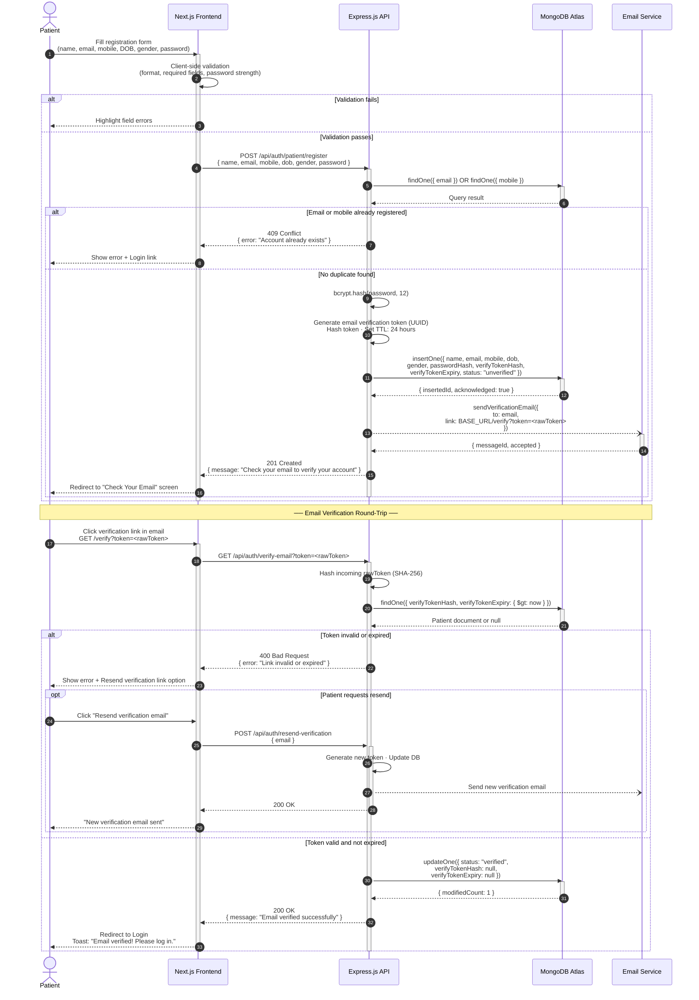
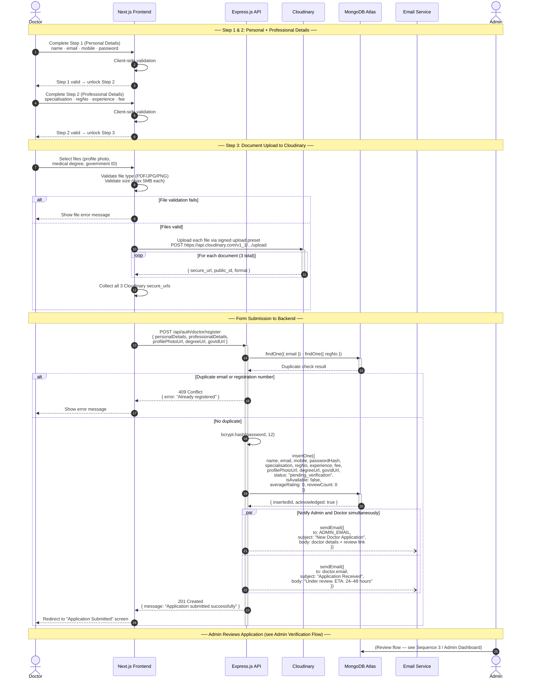
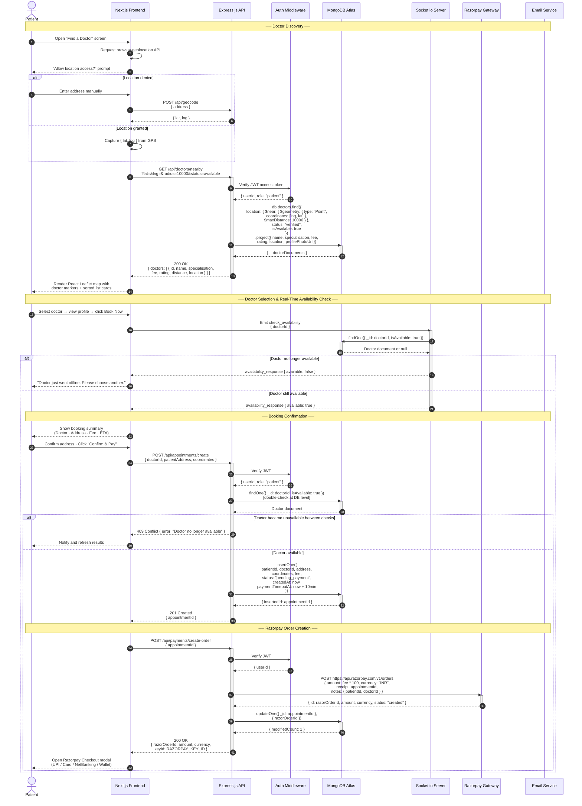
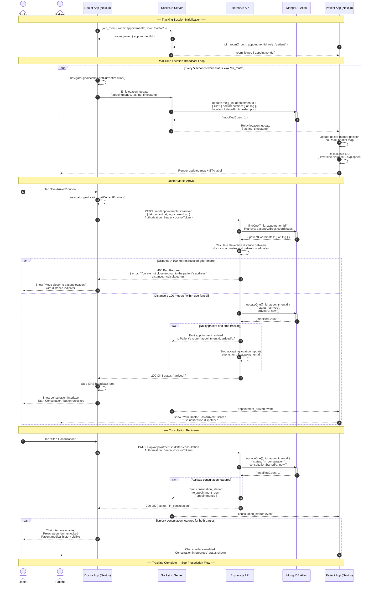
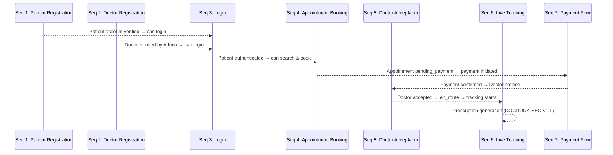

# DocDock — Sequence Diagram Specification

**Document ID:** DOCDOCK-SEQ-v1.0  
**Project Name:** DocDock  
**Tagline:** *"Knock-Knock, your doctor is here."*  
**Document Type:** Sequence Diagram Specification  
**Version:** 1.0.0  
**Status:** Draft  
**Prepared By:** Engineering Team  
**Last Updated:** June 2025  

---

## Table of Contents

1. [Introduction](#1-introduction)
2. [Notation Guide](#2-notation-guide)
3. [Participants Reference](#3-participants-reference)
4. [Sequence 1 — Patient Registration](#4-sequence-1--patient-registration)
5. [Sequence 2 — Doctor Registration](#5-sequence-2--doctor-registration)
6. [Sequence 3 — User Login (Patient & Doctor)](#6-sequence-3--user-login-patient--doctor)
7. [Sequence 4 — Appointment Booking](#7-sequence-4--appointment-booking)
8. [Sequence 5 — Doctor Acceptance](#8-sequence-5--doctor-acceptance)
9. [Sequence 6 — Live Tracking](#9-sequence-6--live-tracking)
10. [Sequence 7 — Payment Flow](#10-sequence-7--payment-flow)
11. [Inter-Sequence Dependencies](#11-inter-sequence-dependencies)

---

## 1. Introduction

This document specifies the message-level interaction sequences for the DocDock platform across all primary system flows. Each sequence diagram models the chronological exchange of messages between actors, system components, and external services using UML-compliant Mermaid sequence notation.

Sequence diagrams complement the Activity Diagrams (DOCDOCK-ACT-v1.0) by shifting focus from control flow to **message exchange and timing** — capturing precisely which component sends what message to which component, in what order, and under what conditions.

These diagrams are the primary reference for:

- **Backend engineers** designing API contracts and middleware ordering
- **Frontend engineers** understanding request/response shapes and socket event sequences
- **QA engineers** deriving integration test scenarios
- **Technical leads** reviewing architectural decisions and security boundaries

---

## 2. Notation Guide

| Notation | Meaning |
|---|---|
| `participant` | A system actor or component in the interaction |
| `->>` | Synchronous message (request / response) |
| `-->>` | Return / response message (dashed arrow) |
| `--)` | Asynchronous message (non-blocking) |
| `alt` | Alternative combined fragment (if/else branching) |
| `opt` | Optional combined fragment (executes conditionally) |
| `loop` | Loop combined fragment (repeating sequence) |
| `par` | Parallel combined fragment (concurrent execution) |
| `Note` | Annotation on the diagram |
| `activate` / `deactivate` | Lifeline activation bar (processing duration) |

---

## 3. Participants Reference

| Alias | Full Name | Type |
|---|---|---|
| `Patient` | Patient Browser / Mobile App | Actor |
| `Doctor` | Doctor Browser / Mobile App | Actor |
| `Admin` | Admin Dashboard | Actor |
| `Next` | Next.js 14 Frontend | System |
| `API` | Express.js Backend API | System |
| `Auth` | Auth Middleware (JWT Verify) | System |
| `DB` | MongoDB Atlas | Database |
| `Cloud` | Cloudinary Storage | External Service |
| `Mail` | Email Service (SMTP/Provider) | External Service |
| `Socket` | Socket.io Server | System |
| `Razor` | Razorpay Payment Gateway | External Service |

---

## 4. Sequence 1 — Patient Registration

### 4.1 Description

This sequence covers the complete patient self-registration flow: form submission from the client, server-side validation, bcrypt password hashing, MongoDB document creation, verification email dispatch, and the email token verification round-trip that activates the account.

### 4.2 Sequence Diagram



### 4.3 Key Design Notes

- The verification token is stored as a **SHA-256 hash** in the database; the raw token travels only in the email link. This prevents token theft via database compromise.
- `bcrypt.hash` is called with **12 salt rounds** — CPU-intensive by design to resist brute-force attacks.
- Email dispatch is **fire-and-forget** (`--)`) from the API perspective; the 201 response is returned without waiting for email delivery confirmation.
- Token expiry uses a database-level TTL check (`$gt: now`) to prevent race conditions from clock drift.

---

## 5. Sequence 2 — Doctor Registration

### 5.1 Description

Doctor registration extends the patient flow with a multi-step form, document uploads to Cloudinary, and an admin notification gate. The doctor account is created in a `pending_verification` state and remains locked until the Admin Verification flow completes.

### 5.2 Sequence Diagram



### 5.3 Key Design Notes

- Files are uploaded to Cloudinary **directly from the frontend** using a signed upload preset, reducing backend payload size and processing load.
- Admin and doctor email notifications are dispatched in **parallel** (`par`) to minimise total notification latency.
- The doctor's `isAvailable` flag defaults to `false` — even after verification, the doctor must explicitly go online.

---

## 6. Sequence 3 — User Login (Patient & Doctor)

### 6.1 Description

This sequence covers the authenticated login flow for both patient and doctor roles, including credential validation, role-based access enforcement, JWT access token issuance, refresh token storage in an HTTP-only cookie, and the silent token refresh sub-flow.

### 6.2 Sequence Diagram

```mermaid
sequenceDiagram
    autonumber

    actor User as User (Patient or Doctor)
    participant Next as Next.js Frontend
    participant API as Express.js API
    participant DB as MongoDB Atlas

    Note over User, DB: ── Initial Login ──

    User->>Next: Submit login form<br/>{ email, password }
    activate Next

    Next->>API: POST /api/auth/login<br/>{ email, password, role }
    activate API

    API->>DB: findOne({ email, role })<br/>Select: passwordHash, status, role, _id
    activate DB
    DB-->>API: User document or null
    deactivate DB

    alt User not found
        API-->>Next: 401 Unauthorized<br/>{ error: "Invalid credentials" }
        Next-->>User: Show "Invalid email or password"
    else User found
        API->>DB: Increment loginAttempts for user
        activate DB
        DB-->>API: Updated document
        deactivate DB

        alt loginAttempts >= 5 and lockUntil > now
            API-->>Next: 423 Locked<br/>{ error: "Account locked. Try again in X minutes." }
            Next-->>User: Show lockout message with countdown
        else Account not locked
            API->>API: bcrypt.compare(password, passwordHash)

            alt Password does not match
                API->>DB: incrementLoginAttempts()
                DB-->>API: Updated attempts count
                API-->>Next: 401 Unauthorized<br/>{ error: "Invalid credentials" }
                Next-->>User: Show error (attempt count visible after 3 failures)
            else Password matches
                alt status === "pending_verification" (Doctor only)
                    API-->>Next: 403 Forbidden<br/>{ error: "Account pending admin verification" }
                    Next-->>User: Show "Application under review" message
                else status === "suspended"
                    API-->>Next: 403 Forbidden<br/>{ error: "Account suspended. Contact support." }
                    Next-->>User: Show suspension message
                else status === "verified"
                    API->>API: Reset loginAttempts to 0
                    API->>API: Generate JWT access token<br/>{ userId, role, iat, exp: +15min }
                    API->>API: Generate refresh token (UUID)<br/>Hash refresh token · TTL: 7 days

                    API->>DB: updateOne({<br/>  refreshTokenHash,<br/>  refreshTokenExpiry,<br/>  loginAttempts: 0,<br/>  lastLogin: now<br/>})
                    activate DB
                    DB-->>API: { modifiedCount: 1 }
                    deactivate DB

                    API-->>Next: 200 OK<br/>{ accessToken, user: { id, name, role } }<br/>Set-Cookie: refreshToken=<token>; HttpOnly; Secure; SameSite=Strict; Max-Age=604800
                    Next->>Next: Store accessToken in memory (not localStorage)
                    Next-->>User: Redirect to role-specific dashboard
                end
            end
        end
    end
    deactivate API
    deactivate Next

    Note over User, DB: ── Silent Token Refresh (auto-triggered on 401) ──

    User->>Next: User action triggers API request<br/>(accessToken is expired)
    Next->>API: Original request → 401 Unauthorized
    Next->>API: POST /api/auth/refresh-token<br/>Cookie: refreshToken=<token> (sent automatically)
    activate API

    API->>API: Extract refreshToken from HttpOnly cookie
    API->>API: Hash incoming refresh token (SHA-256)

    API->>DB: findOne({ refreshTokenHash, refreshTokenExpiry: { $gt: now } })
    activate DB
    DB-->>API: User document or null
    deactivate DB

    alt Refresh token invalid or expired
        API-->>Next: 401 Unauthorized<br/>{ error: "Session expired. Please log in again." }
        API->>API: Clear cookie
        Next-->>User: Redirect to Login page
    else Refresh token valid
        API->>API: Issue new JWT access token (exp: +15min)
        API->>API: Rotate refresh token (new UUID, new hash)

        API->>DB: updateOne({ refreshTokenHash: newHash,<br/>refreshTokenExpiry: newExpiry })
        activate DB
        DB-->>API: { modifiedCount: 1 }
        deactivate DB

        API-->>Next: 200 OK<br/>{ accessToken: newToken }<br/>Set-Cookie: refreshToken=<newToken>; HttpOnly; ...
        Next->>Next: Retry original request with new accessToken
        Next-->>User: Seamless continuation (no re-login required)
    end
    deactivate API

    Note over User, DB: ── Logout ──

    User->>Next: Click Logout
    Next->>API: POST /api/auth/logout<br/>Authorization: Bearer <accessToken><br/>Cookie: refreshToken=<token>
    activate API

    API->>DB: updateOne({ refreshTokenHash: null,<br/>refreshTokenExpiry: null })
    activate DB
    DB-->>API: { modifiedCount: 1 }
    deactivate DB

    API->>API: Add accessToken JTI to in-memory blocklist<br/>(TTL = remaining token lifetime)
    API-->>Next: 200 OK<br/>Set-Cookie: refreshToken=; Max-Age=0 (clear cookie)
    Next->>Next: Clear accessToken from memory
    Next-->>User: Redirect to Landing / Login page
    deactivate API
```

### 6.3 Key Design Notes

- The **refresh token is rotated** on every use — if a stolen refresh token is used, the legitimate user's next refresh will fail, triggering re-authentication. This is the sliding-window refresh pattern.
- The **access token JTI (JWT ID) is blocklisted** on logout to prevent use of still-valid tokens by a session hijacker.
- Access tokens are stored **in-memory only** (not `localStorage`) to prevent XSS extraction. Refresh tokens use **HttpOnly cookies** to prevent JavaScript access.
- After **5 consecutive failed login attempts**, the account enters a time-locked state to resist brute-force attacks.

---

## 7. Sequence 4 — Appointment Booking

### 7.1 Description

This sequence models the complete appointment booking flow from the patient's doctor search through to booking confirmation. It covers geo-query execution, real-time availability validation via Socket.io, Razorpay order creation, and the webhook-based payment verification that commits the appointment.

### 7.2 Sequence Diagram



---

## 8. Sequence 5 — Doctor Acceptance

### 8.1 Description

This sequence begins immediately after Razorpay payment confirmation and covers the webhook-based payment verification, appointment status update, real-time doctor notification via Socket.io, and the doctor's acceptance or decline decision with its downstream effects.

### 8.2 Sequence Diagram

```mermaid
sequenceDiagram
    autonumber

    actor Patient
    actor Doctor
    participant Next as Next.js Frontend
    participant API as Express.js API
    participant DB as MongoDB Atlas
    participant Socket as Socket.io Server
    participant Razor as Razorpay Gateway
    participant Mail as Email Service

    Note over Patient, Mail: ── Payment Completion & Webhook Verification ──

    Patient->>Razor: Complete payment in checkout modal
    activate Razor
    Razor-->>Patient: Payment success callback<br/>{ razorPaymentId, razorOrderId, razorSignature }
    deactivate Razor

    Patient->>Next: Razorpay onSuccess handler fires<br/>{ razorPaymentId, razorOrderId, razorSignature }
    Next->>API: POST /api/payments/verify<br/>{ appointmentId, razorPaymentId,<br/>  razorOrderId, razorSignature }
    activate API

    API->>API: Construct verification string:<br/>"razorOrderId|razorPaymentId"
    API->>API: HMAC-SHA256(verificationString, RAZORPAY_SECRET)
    API->>API: Compare computed hash with razorSignature

    alt Signature mismatch
        API->>DB: log({ type: "PAYMENT_FRAUD_ATTEMPT",<br/>  appointmentId, timestamp })
        activate DB
        DB-->>API: Logged
        deactivate DB
        API-->>Next: 400 Bad Request<br/>{ error: "Payment verification failed" }
        Next-->>Patient: Show payment error · Retry option
    else Signature valid
        API->>DB: updateOne({ _id: appointmentId },<br/>{ status: "confirmed",<br/>  razorPaymentId,<br/>  paidAt: now })
        activate DB
        DB-->>API: { modifiedCount: 1 }
        deactivate DB

        API->>DB: insertOne(payments,<br/>{ appointmentId, razorPaymentId,<br/>  razorOrderId, amount, status: "captured",<br/>  paidAt: now })
        activate DB
        DB-->>API: { insertedId: paymentId }
        deactivate DB

        par Parallel post-payment actions
            API--)Socket: Emit new_booking_request to Doctor's room<br/>{ appointmentId, patientName, address,<br/>  medicalHistory, fee, mapRoute }
        and
            API--)Mail: sendBookingConfirmationEmail(patient)
        and
            API->>API: Start 5-minute doctor acceptance timeout
        end

        API-->>Next: 200 OK<br/>{ message: "Payment confirmed. Awaiting doctor." }
        Next-->>Patient: Show "Booking Confirmed — Awaiting Doctor Acceptance" screen
    end
    deactivate API

    Note over Patient, Mail: ── Doctor Receives Booking Notification ──

    Socket-->>Doctor: new_booking_request event<br/>{ appointmentId, patientName,<br/>  address, mapRoute, fee }
    activate Doctor
    Doctor->>Next: Doctor views booking details<br/>on their dashboard

    Note over Patient, Mail: ── Doctor Decision (5-minute window) ──

    alt Doctor accepts within 5 minutes
        Doctor->>Next: Click "Accept Appointment"
        Next->>API: PATCH /api/appointments/:id/accept<br/>Authorization: Bearer <doctorToken>
        activate API
        API->>DB: findOne({ _id: appointmentId, status: "confirmed" })
        activate DB
        DB-->>API: Appointment document
        deactivate DB

        API->>DB: updateOne({ _id: appointmentId },<br/>{ status: "en_route",<br/>  acceptedAt: now })
        activate DB
        DB-->>API: { modifiedCount: 1 }
        deactivate DB

        par Notify all parties
            API--)Socket: Emit appointment_accepted to Patient's room<br/>{ appointmentId, doctorName,<br/>  doctorLocation, eta }
        and
            API--)Mail: sendEmail(patient,<br/>"Your doctor is on the way!")
        end

        API-->>Next: 200 OK<br/>{ status: "en_route" }
        deactivate API
        Next-->>Doctor: Navigate to active consultation view<br/>Begin GPS broadcast
        deactivate Doctor

        Socket-->>Patient: appointment_accepted event
        Next-->>Patient: Navigate to Live Tracking screen

    else Doctor declines
        Doctor->>Next: Click "Decline Appointment"
        Next->>API: PATCH /api/appointments/:id/decline<br/>{ reason }
        activate API

        API->>DB: updateOne({ _id: appointmentId },<br/>{ status: "cancelled",<br/>  cancelReason: "Doctor declined",<br/>  cancelledAt: now })
        activate DB
        DB-->>API: { modifiedCount: 1 }
        deactivate DB

        API->>Razor: POST /v1/payments/:id/refund<br/>{ amount: fullAmount, notes: { reason: "Doctor declined" } }
        activate Razor
        Razor-->>API: { id: refundId, status: "initiated" }
        deactivate Razor

        API->>DB: updateOne(payments,<br/>{ refundId, refundStatus: "pending",<br/>  refundedAt: now })
        activate DB
        DB-->>API: { modifiedCount: 1 }
        deactivate DB

        par Notify patient
            API--)Socket: Emit appointment_cancelled to Patient's room<br/>{ reason: "Doctor unavailable", refundInitiated: true }
        and
            API--)Mail: sendEmail(patient,<br/>"Appointment cancelled. Full refund initiated.")
        end

        API-->>Next: 200 OK { status: "cancelled" }
        deactivate API
        Next-->>Patient: Show "Doctor Unavailable" screen<br/>+ Refund notice + Search Again button

    else 5-minute timeout expires
        API->>API: Timeout job fires (scheduler)
        activate API

        API->>DB: findOne({ _id: appointmentId, status: "confirmed" })
        activate DB
        DB-->>API: Appointment (if still confirmed)
        deactivate DB

        API->>DB: updateOne({ status: "cancelled",<br/>  cancelReason: "Doctor timeout" })
        activate DB
        DB-->>API: Updated
        deactivate DB

        API->>Razor: Initiate full refund
        activate Razor
        Razor-->>API: { refundId, status: "initiated" }
        deactivate Razor

        API--)Socket: Emit timeout_cancelled to Patient<br/>{ refundInitiated: true }
        API--)Socket: Emit booking_expired to Doctor
        API--)Mail: sendEmail(patient, "Booking expired. Full refund initiated.")
        deactivate API
    end
```



### 8.3 Key Design Notes

- **Double availability check**: the doctor's availability is verified at the Socket.io layer (soft check) and again at the MongoDB layer (hard check) before creating the Appointment document. This prevents TOCTOU (Time-of-Check-Time-of-Use) race conditions.
- The **5-minute acceptance window** is enforced by a server-side scheduler job (e.g., `node-cron` or a delayed task queue), not the client, preventing manipulation.
- **Refunds are always initiated server-side** via the Razorpay API — clients have no ability to trigger refunds directly.

---

## 9. Sequence 6 — Live Tracking

### 9.1 Description

This sequence activates once a doctor accepts an appointment (`status: en_route`). It models the bidirectional Socket.io location broadcast loop, the patient map rendering cycle, the geo-fence-gated arrival confirmation, and the transition into the active consultation state.

### 9.2 Sequence Diagram



### 9.3 Key Design Notes

- Each party **joins a dedicated Socket.io room** named by `appointmentId` on load. This scopes all real-time events to the correct appointment, preventing cross-contamination between concurrent sessions.
- The GPS broadcast loop runs entirely on the **doctor's client**, not the server — the server only relays and persists. This minimises server-side processing overhead.
- The **geo-fence validation uses Haversine distance** computed server-side — client-reported coordinates are never trusted for the arrival decision.
- Location broadcasts **automatically stop** upon the `arrived` status transition, preventing unnecessary network traffic.

---

## 10. Sequence 7 — Payment Flow

### 10.1 Description

This sequence provides a complete deep-dive into the Razorpay payment integration, covering order creation, checkout lifecycle, webhook signature verification, payment capture recording, receipt generation, and the refund initiation sub-flow. This is the definitive reference for the payments subsystem.

### 10.2 Sequence Diagram

```mermaid
sequenceDiagram
    autonumber

    actor Patient
    participant Next as Next.js Frontend
    participant API as Express.js API
    participant Auth as Auth Middleware
    participant DB as MongoDB Atlas
    participant Razor as Razorpay Gateway
    participant Mail as Email Service

    Note over Patient, Mail: ── Order Creation ──

    Patient->>Next: Confirm appointment · Click "Confirm & Pay"
    Next->>API: POST /api/payments/create-order<br/>{ appointmentId }<br/>Authorization: Bearer <accessToken>
    activate API

    API->>Auth: verifyJWT(accessToken)
    Auth-->>API: { userId, role: "patient" }

    API->>DB: findOne({ _id: appointmentId,<br/>  patientId: userId,<br/>  status: "pending_payment" })
    activate DB
    DB-->>API: Appointment { doctorId, fee, razorOrderId }
    deactivate DB

    alt Appointment not found or already paid
        API-->>Next: 404 / 409<br/>{ error: "Invalid appointment state" }
        Next-->>Patient: Show error message
    else Appointment valid
        API->>Razor: POST /v1/orders<br/>{ amount: fee * 100,<br/>  currency: "INR",<br/>  receipt: appointmentId,<br/>  payment_capture: 1,<br/>  notes: { patientId, doctorId, appointmentId } }
        activate Razor
        Razor-->>API: { id: razorOrderId,<br/>  entity: "order",<br/>  amount, currency,<br/>  status: "created" }
        deactivate Razor

        API->>DB: updateOne({ _id: appointmentId },<br/>{ razorOrderId,<br/>  orderCreatedAt: now })
        activate DB
        DB-->>API: { modifiedCount: 1 }
        deactivate DB

        API-->>Next: 200 OK<br/>{ razorOrderId, amount,<br/>  currency, keyId: RAZORPAY_KEY_ID,<br/>  prefill: { name, email, contact } }
        deactivate API
    end

    Note over Patient, Mail: ── Checkout Experience ──

    Next->>Next: Initialise Razorpay Checkout<br/>new Razorpay({ key, order_id,<br/>  amount, currency, prefill,<br/>  theme: { color: "#0EA5E9" } })
    Next-->>Patient: Razorpay modal opens<br/>(UPI / Card / NetBanking / Wallet)

    Patient->>Razor: Select payment method<br/>and complete payment
    activate Razor

    alt Payment failed (declined, timeout, cancelled)
        Razor-->>Patient: Payment failure message in modal
        Razor-->>Next: onDismiss / onError callback<br/>{ code, description }
        Next-->>Patient: Show "Payment Failed" with retry option
        Note over Patient, Mail: Appointment remains in pending_payment<br/>Patient may retry within 10-minute window
    else Payment successful
        Razor-->>Patient: Payment success screen in modal
        Razor-->>Next: onSuccess callback<br/>{ razorpay_payment_id,<br/>  razorpay_order_id,<br/>  razorpay_signature }
        deactivate Razor

        Note over Patient, Mail: ── Server-Side Signature Verification (Critical Security Step) ──

        Next->>API: POST /api/payments/verify<br/>{ appointmentId,<br/>  razorpay_payment_id,<br/>  razorpay_order_id,<br/>  razorpay_signature }
        activate API

        API->>Auth: verifyJWT(accessToken)
        Auth-->>API: { userId }

        API->>API: Construct message:<br/>`${razorpay_order_id}|${razorpay_payment_id}`
        API->>API: crypto.createHmac("sha256", RAZORPAY_SECRET)<br/>.update(message).digest("hex")
        API->>API: timingSafeEqual(computed, razorpay_signature)

        alt Signature invalid
            API->>DB: insertOne(securityLog,<br/>{ event: "PAYMENT_TAMPER_ATTEMPT",<br/>  appointmentId, userId, timestamp })
            activate DB
            DB-->>API: Logged
            deactivate DB
            API-->>Next: 400 Bad Request<br/>{ error: "Payment verification failed" }
            Next-->>Patient: "Payment could not be verified. Contact support."
        else Signature valid
            API->>DB: updateOne({ _id: appointmentId },<br/>{ status: "confirmed",<br/>  razorPaymentId: razorpay_payment_id,<br/>  paidAt: now })
            activate DB
            DB-->>API: { modifiedCount: 1 }
            deactivate DB

            API->>DB: insertOne(payments,<br/>{ appointmentId,<br/>  razorOrderId: razorpay_order_id,<br/>  razorPaymentId: razorpay_payment_id,<br/>  amount, currency,<br/>  method: "razorpay",<br/>  status: "captured",<br/>  paidAt: now })
            activate DB
            DB-->>API: { insertedId: paymentId }
            deactivate DB

            API-->>Next: 200 OK<br/>{ confirmed: true, appointmentId }
            deactivate API

            Note over Patient, Mail: ── Receipt Generation ──

            Next->>API: GET /api/payments/:appointmentId/receipt
            activate API
            API->>DB: aggregate([<br/>  { $match: { appointmentId } },<br/>  { $lookup: doctor, patient, appointment }<br/>])
            activate DB
            DB-->>API: Full receipt data
            deactivate DB

            API-->>Next: 200 OK { receiptData }
            deactivate API
            Next-->>Patient: Show digital receipt on screen

            API--)Mail: sendReceiptEmail({<br/>  to: patient.email,<br/>  appointmentId,<br/>  doctorName, amount,<br/>  razorPaymentId,<br/>  paidAt, receiptPdfUrl<br/>})
        end
    end

    Note over Patient, Mail: ── Refund Flow (Triggered on Cancellation) ──

    opt Refund required (doctor declined / patient cancelled)
        API->>DB: findOne(payments,<br/>{ appointmentId, status: "captured" })
        activate DB
        DB-->>API: Payment { razorPaymentId, amount }
        deactivate DB

        API->>API: Calculate refund amount<br/>per cancellation policy

        API->>Razor: POST /v1/payments/:razorPaymentId/refund<br/>{ amount: refundAmount * 100,<br/>  speed: "normal",<br/>  notes: { reason, appointmentId } }
        activate Razor
        Razor-->>API: { id: refundId,<br/>  payment_id,<br/>  amount, status: "initiated" }
        deactivate Razor

        API->>DB: updateOne(payments,<br/>{ refundId,<br/>  refundAmount,<br/>  refundStatus: "pending",<br/>  refundInitiatedAt: now })
        activate DB
        DB-->>API: { modifiedCount: 1 }
        deactivate DB

        API--)Mail: sendRefundEmail({<br/>  to: patient.email,<br/>  refundAmount,<br/>  refundId,<br/>  eta: "5–7 business days"<br/>})

        Note over Patient, Mail: ── Razorpay Refund Webhook (async) ──

        Razor--)API: POST /api/webhooks/razorpay<br/>X-Razorpay-Signature: <sig><br/>{ event: "refund.processed",<br/>  payload: { refund: { id, status: "processed" } } }
        activate API
        API->>API: Verify webhook signature<br/>(same HMAC process)
        API->>DB: updateOne(payments,<br/>{ refundStatus: "processed",<br/>  refundProcessedAt: now })
        activate DB
        DB-->>API: { modifiedCount: 1 }
        deactivate DB
        API-->>Razor: 200 OK (acknowledge webhook)
        deactivate API
    end
```



### 10.3 Key Design Notes

- `crypto.timingSafeEqual` is used for signature comparison to prevent **timing attacks** that could leak information about how much of the signature matched.
- **`payment_capture: 1`** in the Razorpay order creation enables auto-capture, eliminating the need for a separate capture API call after authorisation.
- The **Razorpay webhook** for refund confirmation is handled asynchronously — the `refundStatus` field transitions from `pending` to `processed` only upon webhook receipt, ensuring the database reflects Razorpay's actual refund state.
- All webhook endpoints **verify Razorpay's signature** before processing — unverified webhooks are rejected with a 400 and logged, preventing fake webhook injection.

---

## 11. Inter-Sequence Dependencies

The sequences defined in this document form a strict dependency chain. The table below maps the terminal state of each sequence to the activation condition of its successor.



### Dependency Summary Table

| Sequence | Depends On | Activates |
|---|---|---|
| Seq 1 — Patient Registration | None | Seq 3 (Login) |
| Seq 2 — Doctor Registration | None | Admin Verification → Seq 3 |
| Seq 3 — Login | Seq 1 or Seq 2 | Seq 4 (Booking) |
| Seq 4 — Appointment Booking | Seq 3 | Seq 7 (Payment) |
| Seq 7 — Payment Flow | Seq 4 | Seq 5 (Doctor Acceptance) |
| Seq 5 — Doctor Acceptance | Seq 7 | Seq 6 (Live Tracking) |
| Seq 6 — Live Tracking | Seq 5 | Prescription Generation |

### Shared Component Usage

| Component | Sequences Involved |
|---|---|
| MongoDB Atlas | All sequences |
| Auth Middleware (JWT) | Seq 3, 4, 5, 6, 7 |
| Socket.io Server | Seq 4, 5, 6 |
| Razorpay Gateway | Seq 4, 5, 7 |
| Cloudinary | Seq 2 |
| Email Service | Seq 1, 2, 4, 5, 7 |

---

*End of DocDock Sequence Diagram Specification v1.0*  
*© 2025 DocDock. All rights reserved.*
