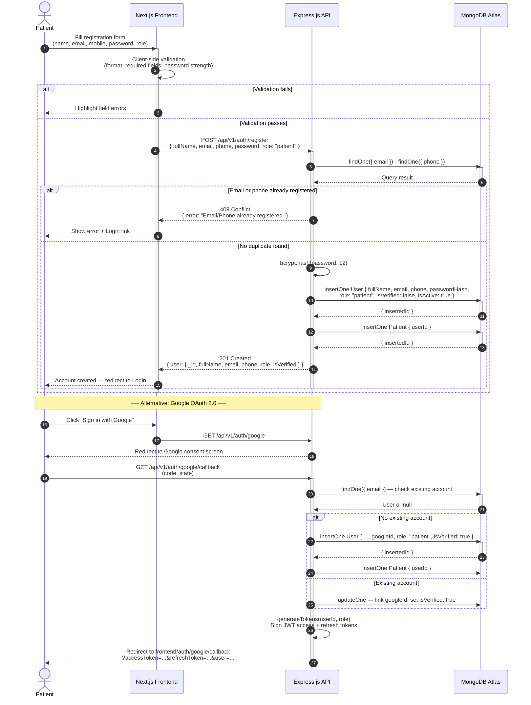
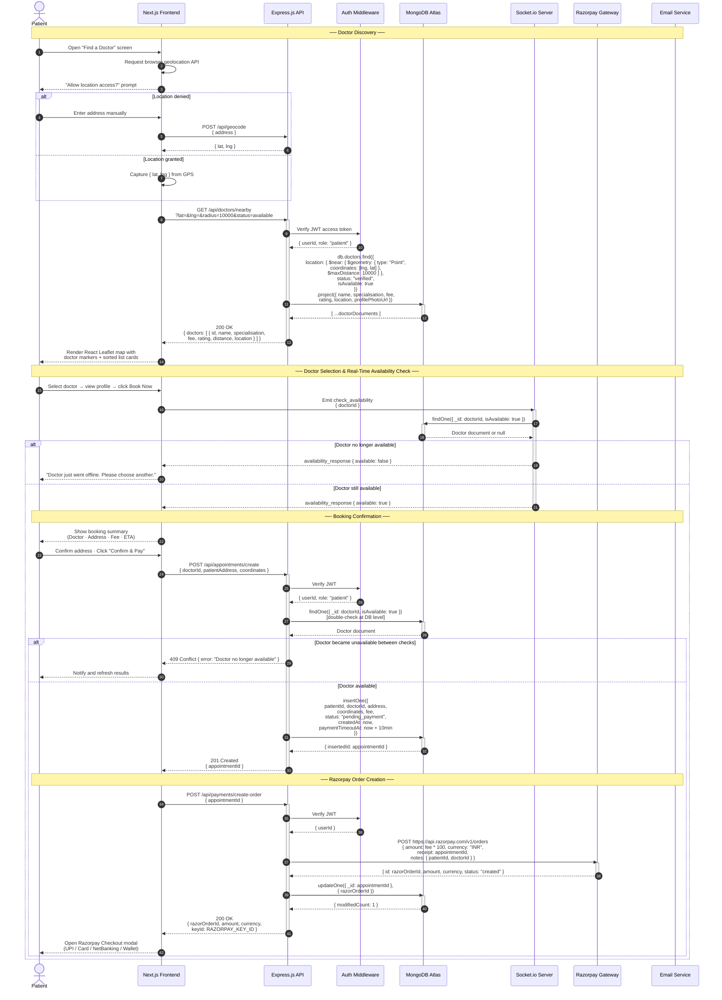
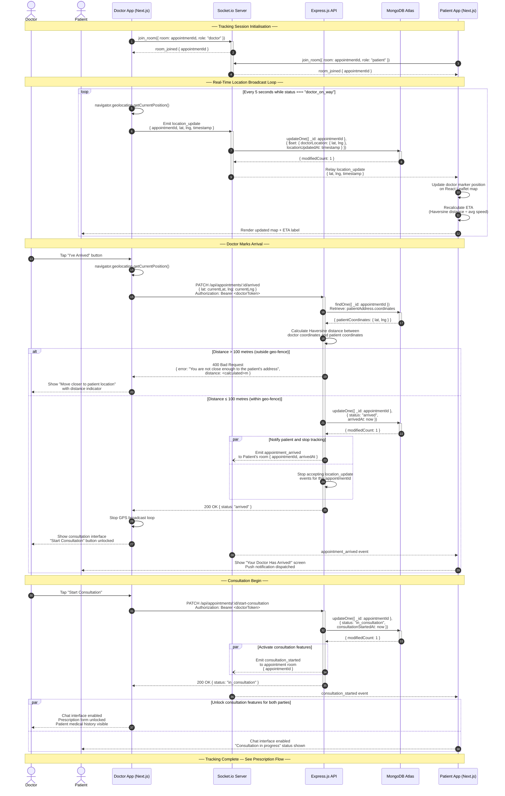
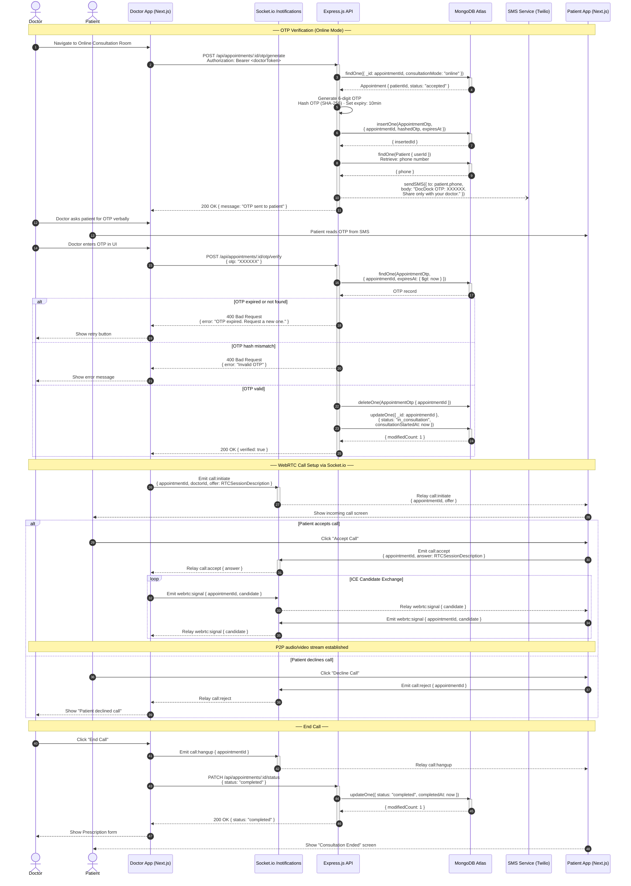
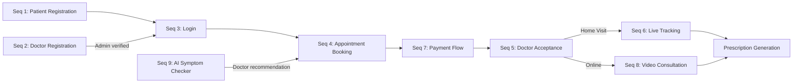

# DocDock — Sequence Diagram Specification

**Document ID:** DOCDOCK-SEQ-v2.0  
**Project Name:** DocDock  
**Tagline:** *"Knock-Knock, your doctor is here."*  
**Document Type:** Sequence Diagram Specification  
**Version:** 2.0.0  
**Status:** Final — Reflects Implemented Build  
**Prepared By:** Engineering Team  
**Last Updated:** July 2026  

---

## Table of Contents

1. [Introduction](#1-introduction)
2. [Notation Guide](#2-notation-guide)
3. [Participants Reference](#3-participants-reference)
4. [Sequence 1 — Patient Registration](#4-sequence-1--patient-registration)
5. [Sequence 2 — Doctor Registration](#5-sequence-2--doctor-registration)
6. [Sequence 3 — User Login (Patient & Doctor)](#6-sequence-3--user-login-patient--doctor)
7. [Sequence 4 — Appointment Booking](#7-sequence-4--appointment-booking)
8. [Sequence 5 — Doctor Acceptance](#8-sequence-5--doctor-acceptance)
9. [Sequence 6 — Live Tracking](#9-sequence-6--live-tracking)
10. [Sequence 7 — Payment Flow](#10-sequence-7--payment-flow)
11. [Sequence 8 — Online Video Consultation](#11-sequence-8--online-video-consultation)
12. [Sequence 9 — AI Symptom Checker](#12-sequence-9--ai-symptom-checker)
13. [Inter-Sequence Dependencies](#13-inter-sequence-dependencies)

---

## 1. Introduction

This document specifies the message-level interaction sequences for the DocDock platform across all primary system flows. Each sequence diagram models the chronological exchange of messages between actors, system components, and external services using UML-compliant Mermaid sequence notation.

Sequence diagrams complement the Activity Diagrams (DOCDOCK-ACT-v1.0) by shifting focus from control flow to **message exchange and timing** — capturing precisely which component sends what message to which component, in what order, and under what conditions.

These diagrams are the primary reference for:

- **Backend engineers** designing API contracts and middleware ordering
- **Frontend engineers** understanding request/response shapes and socket event sequences
- **QA engineers** deriving integration test scenarios
- **Technical leads** reviewing architectural decisions and security boundaries

---

## 2. Notation Guide

| Notation | Meaning |
|---|---|
| `participant` | A system actor or component in the interaction |
| `->>` | Synchronous message (request / response) |
| `-->>` | Return / response message (dashed arrow) |
| `--)` | Asynchronous message (non-blocking) |
| `alt` | Alternative combined fragment (if/else branching) |
| `opt` | Optional combined fragment (executes conditionally) |
| `loop` | Loop combined fragment (repeating sequence) |
| `par` | Parallel combined fragment (concurrent execution) |
| `Note` | Annotation on the diagram |
| `activate` / `deactivate` | Lifeline activation bar (processing duration) |

---

## 3. Participants Reference

| Alias | Full Name | Type |
|---|---|---|
| `Patient` | Patient Browser / Mobile App | Actor |
| `Doctor` | Doctor Browser / Mobile App | Actor |
| `Admin` | Admin Dashboard | Actor |
| `Next` | Next.js 14 Frontend | System |
| `API` | Express.js Backend API | System |
| `Auth` | Auth Middleware (JWT Verify) | System |
| `DB` | MongoDB Atlas | Database |
| `Cloud` | Cloudinary Storage | External Service |
| `Mail` | Email Service (SendGrid/SMTP) | External Service |
| `SMS` | SMS Service (Twilio) | External Service |
| `Socket` | Socket.io Server | System |
| `Razor` | Razorpay Payment Gateway | External Service |
| `Gemini` | Google Gemini AI API | External Service |
| `Worker` | BullMQ Background Worker | System |

---

## 4. Sequence 1 — Patient Registration

### 4.1 Description

This sequence covers the patient self-registration flow: form submission from the client, server-side validation, bcrypt password hashing, MongoDB document creation, and immediate account activation. No email verification step is required — the account is active on successful registration. An alternative Google OAuth 2.0 flow is also provided.

### 4.2 Sequence Diagram

```mermaid
sequenceDiagram
    autonumber

    actor Patient
    participant Next as Next.js Frontend
    participant API as Express.js API
    participant DB as MongoDB Atlas

    Patient->>Next: Fill registration form<br/>(name, email, mobile, password, role)
    activate Next

    Next->>Next: Client-side validation<br/>(format, required fields, password strength)

    alt Validation fails
        Next-->>Patient: Highlight field errors
    else Validation passes
        Next->>API: POST /api/v1/auth/register<br/>{ fullName, email, phone, password, role: "patient" }
        activate API

        API->>DB: findOne({ email }) · findOne({ phone })
        activate DB
        DB-->>API: Query result
        deactivate DB

        alt Email or phone already registered
            API-->>Next: 409 Conflict<br/>{ error: "Email/Phone already registered" }
            Next-->>Patient: Show error + Login link
        else No duplicate found
            API->>API: bcrypt.hash(password, 12)

            API->>DB: insertOne User { fullName, email, phone, passwordHash,<br/>role: "patient", isVerified: false, isActive: true }
            activate DB
            DB-->>API: { insertedId }
            deactivate DB

            API->>DB: insertOne Patient { userId }
            activate DB
            DB-->>API: { insertedId }
            deactivate DB

            API-->>Next: 201 Created<br/>{ user: { _id, fullName, email, phone, role, isVerified } }
            Next-->>Patient: Account created — redirect to Login
        end
        deactivate API
    end
    deactivate Next

    Note over Patient, API: ── Alternative: Google OAuth 2.0 ──

    Patient->>Next: Click "Sign in with Google"
    Next->>API: GET /api/v1/auth/google
    API-->>Patient: Redirect to Google consent screen
    Patient->>API: GET /api/v1/auth/google/callback<br/>(code, state)
    activate API
    API->>DB: findOne({ email }) — check existing account
    activate DB
    DB-->>API: User or null
    deactivate DB
    alt No existing account
        API->>DB: insertOne User { ..., googleId, role: "patient", isVerified: true }
        activate DB
        DB-->>API: { insertedId }
        deactivate DB
        API->>DB: insertOne Patient { userId }
    else Existing account
        API->>DB: updateOne — link googleId, set isVerified: true
    end
    API->>API: generateTokens(userId, role)<br/>Sign JWT access + refresh tokens
    API-->>Patient: Redirect to frontend/auth/google/callback<br/>?accessToken=...&refreshToken=...&user=...
    deactivate API
```

### 4.3 Key Design Notes

- **No email verification required** — patient accounts are immediately active on registration. The `isVerified` flag on the User document is set to `false` at creation but is not enforced as a login gate.
- `bcrypt.hash` is called with **12 salt rounds** — CPU-intensive by design to resist brute-force attacks.
- **Google OAuth** creates a patient account automatically with `isVerified: true`. Doctors and admins cannot use Google OAuth (the callback always assigns `role: "patient"`).
- JWT tokens are returned directly in the 201 response for email/password registration; for Google OAuth they are appended as URL query parameters.

---

## 5. Sequence 2 — Doctor Registration

### 5.1 Description

Doctor registration is a two-step flow: personal and professional details. The doctor account is created in a `pending` verification state and is immediately navigated to their dashboard. Document uploads (profile photo, medical license, government ID) happen separately via the Profile Settings page after registration, using Cloudinary. All admins are notified in-app of the new registration.

### 5.2 Sequence Diagram

```mermaid
sequenceDiagram
    autonumber

    actor Doctor
    participant Next as Next.js Frontend
    participant API as Express.js API
    participant DB as MongoDB Atlas
    actor Admin

    Note over Doctor, Admin: ── Step 1 & 2: Personal + Professional Details ──

    Doctor->>Next: Complete Step 1 (Personal Details)<br/>name · email · mobile · password
    Next->>Next: Client-side validation
    Next-->>Doctor: Step 1 valid → unlock Step 2

    Doctor->>Next: Complete Step 2 (Professional Details)<br/>specialisation · experience · fee
    Next->>Next: Client-side validation
    Next-->>Doctor: Step 2 valid → submit

    Note over Doctor, Admin: ── Form Submission to Backend ──

    Next->>API: POST /api/v1/auth/register<br/>{ fullName, email, phone, password, role: "doctor" }
    activate API

    API->>DB: findOne({ email }) · findOne({ phone })
    activate DB
    DB-->>API: Duplicate check result
    deactivate DB

    alt Duplicate email or phone
        API-->>Next: 409 Conflict<br/>{ error: "Already registered" }
        Next-->>Doctor: Show error message
    else No duplicate
        API->>API: bcrypt.hash(password, 12)

        API->>DB: insertOne User { fullName, email, phone,<br/>passwordHash, role: "doctor",<br/>verificationStatus: "pending" }
        activate DB
        DB-->>API: { insertedId }
        deactivate DB

        API->>DB: insertOne Doctor { userId, licenseNumber: "TEMP-{id}",<br/>specialization: "General", verificationStatus: "pending" }
        activate DB
        DB-->>API: { insertedId }
        deactivate DB

        API->>DB: Find all admin users
        API--)DB: insertMany Notifications — "New doctor registration pending"
        Note over Admin: Admins receive in-app<br/>notification of new registration

        API-->>Next: 201 Created<br/>{ user: { _id, fullName, email, role, verificationStatus } }
        Next-->>Doctor: Redirect to Doctor Dashboard<br/>(account in pending verification state)
    end
    deactivate API

    Note over Doctor, Admin: ── Document Upload (Post-Registration, via Profile Settings) ──
    Doctor->>Next: Navigate to Profile Settings<br/>Upload profile photo / medical license / govt ID
    Next->>API: PATCH /api/v1/doctors/profile<br/>{ profilePhoto, licenseUrl, govIdUrl, ... } (multipart or base64)
    activate API
    API->>DB: Upload file to Cloudinary → store URL
    API-->>Next: 200 OK — profile updated
    deactivate API
Note over Doctor, Admin: ── Admin Reviews Application (see Admin Verification Flow) ──

### 5.3 Key Design Notes

- Files are uploaded to Cloudinary **directly from the frontend** using a signed upload preset, reducing backend payload size and processing load.
- Admin and doctor email notifications are dispatched in **parallel** (`par`) to minimise total notification latency.
- The doctor's `isAvailable` flag defaults to `false` — even after verification, the doctor must explicitly go online.

---

## 6. Sequence 3 — User Login (Patient & Doctor)

### 6.1 Description

This sequence covers the authenticated login flow for both patient and doctor roles, including credential validation, role-based access enforcement, JWT access token issuance, refresh token storage in an HTTP-only cookie, and the silent token refresh sub-flow.

### 6.2 Sequence Diagram

```mermaid
sequenceDiagram
    autonumber

    actor User as User (Patient or Doctor)
    participant Next as Next.js Frontend
    participant API as Express.js API
    participant DB as MongoDB Atlas

    Note over User, DB: ── Initial Login ──

    User->>Next: Submit login form<br/>{ email, password }
    activate Next

    Next->>API: POST /api/auth/login<br/>{ email, password, role }
    activate API

    API->>DB: findOne({ email, role })<br/>Select: passwordHash, status, role, _id
    activate DB
    DB-->>API: User document or null
    deactivate DB

    alt User not found
        API-->>Next: 401 Unauthorized<br/>{ error: "Invalid credentials" }
        Next-->>User: Show "Invalid email or password"
    else User found
        API->>DB: Increment loginAttempts for user
        activate DB
        DB-->>API: Updated document
        deactivate DB

        alt loginAttempts >= 5 and lockUntil > now
            API-->>Next: 423 Locked<br/>{ error: "Account locked. Try again in X minutes." }
            Next-->>User: Show lockout message with countdown
        else Account not locked
            API->>API: bcrypt.compare(password, passwordHash)

            alt Password does not match
                API->>DB: incrementLoginAttempts()
                DB-->>API: Updated attempts count
                API-->>Next: 401 Unauthorized<br/>{ error: "Invalid credentials" }
                Next-->>User: Show error (attempt count visible after 3 failures)
            else Password matches
                alt status === "pending_verification" (Doctor only)
                    API-->>Next: 403 Forbidden<br/>{ error: "Account pending admin verification" }
                    Next-->>User: Show "Application under review" message
                else status === "suspended"
                    API-->>Next: 403 Forbidden<br/>{ error: "Account suspended. Contact support." }
                    Next-->>User: Show suspension message
                else status === "verified"
                    API->>API: Reset loginAttempts to 0
                    API->>API: Generate JWT access token<br/>{ userId, role, iat, exp: +15min }
                    API->>API: Generate refresh token (UUID)<br/>Hash refresh token · TTL: 7 days

                    API->>DB: updateOne({<br/>  refreshTokenHash,<br/>  refreshTokenExpiry,<br/>  loginAttempts: 0,<br/>  lastLogin: now<br/>})
                    activate DB
                    DB-->>API: { modifiedCount: 1 }
                    deactivate DB

                    API-->>Next: 200 OK<br/>{ accessToken, user: { id, name, role } }<br/>Set-Cookie: refreshToken=<token>; HttpOnly; Secure; SameSite=Strict; Max-Age=604800
                    Next->>Next: Store accessToken in memory (not localStorage)
                    Next-->>User: Redirect to role-specific dashboard
                end
            end
        end
    end
    deactivate API
    deactivate Next

    Note over User, DB: ── Silent Token Refresh (auto-triggered on 401) ──

    User->>Next: User action triggers API request<br/>(accessToken is expired)
    Next->>API: Original request → 401 Unauthorized
    Next->>API: POST /api/auth/refresh-token<br/>Cookie: refreshToken=<token> (sent automatically)
    activate API

    API->>API: Extract refreshToken from HttpOnly cookie
    API->>API: Hash incoming refresh token (SHA-256)

    API->>DB: findOne({ refreshTokenHash, refreshTokenExpiry: { $gt: now } })
    activate DB
    DB-->>API: User document or null
    deactivate DB

    alt Refresh token invalid or expired
        API-->>Next: 401 Unauthorized<br/>{ error: "Session expired. Please log in again." }
        API->>API: Clear cookie
        Next-->>User: Redirect to Login page
    else Refresh token valid
        API->>API: Issue new JWT access token (exp: +15min)
        API->>API: Rotate refresh token (new UUID, new hash)

        API->>DB: updateOne({ refreshTokenHash: newHash,<br/>refreshTokenExpiry: newExpiry })
        activate DB
        DB-->>API: { modifiedCount: 1 }
        deactivate DB

        API-->>Next: 200 OK<br/>{ accessToken: newToken }<br/>Set-Cookie: refreshToken=<newToken>; HttpOnly; ...
        Next->>Next: Retry original request with new accessToken
        Next-->>User: Seamless continuation (no re-login required)
    end
    deactivate API

    Note over User, DB: ── Logout ──

    User->>Next: Click Logout
    Next->>API: POST /api/auth/logout<br/>Authorization: Bearer <accessToken><br/>Cookie: refreshToken=<token>
    activate API

    API->>DB: updateOne({ refreshTokenHash: null,<br/>refreshTokenExpiry: null })
    activate DB
    DB-->>API: { modifiedCount: 1 }
    deactivate DB

    API->>API: Add accessToken JTI to in-memory blocklist<br/>(TTL = remaining token lifetime)
    API-->>Next: 200 OK<br/>Set-Cookie: refreshToken=; Max-Age=0 (clear cookie)
    Next->>Next: Clear accessToken from memory
    Next-->>User: Redirect to Landing / Login page
    deactivate API
```

### 6.3 Key Design Notes

- The **refresh token is rotated** on every use — if a stolen refresh token is used, the legitimate user's next refresh will fail, triggering re-authentication. This is the sliding-window refresh pattern.
- The **access token JTI (JWT ID) is blocklisted** on logout to prevent use of still-valid tokens by a session hijacker.
- Access tokens are stored **in-memory only** (not `localStorage`) to prevent XSS extraction. Refresh tokens use **HttpOnly cookies** to prevent JavaScript access.
- After **5 consecutive failed login attempts**, the account enters a time-locked state to resist brute-force attacks.

---

## 7. Sequence 4 — Appointment Booking

### 7.1 Description

This sequence models the complete appointment booking flow from the patient's doctor search through to booking confirmation. It covers geo-query execution, real-time availability validation via Socket.io, Razorpay order creation, and the webhook-based payment verification that commits the appointment.

### 7.2 Sequence Diagram

```mermaid
sequenceDiagram
    autonumber

    actor Patient
    participant Next as Next.js Frontend
    participant API as Express.js API
    participant Auth as Auth Middleware
    participant DB as MongoDB Atlas
    participant Socket as Socket.io Server
    participant Razor as Razorpay Gateway
    participant Mail as Email Service

    Note over Patient, Mail: ── Doctor Discovery ──

    Patient->>Next: Open "Find a Doctor" screen
    Next->>Next: Request browser geolocation API
    Next-->>Patient: "Allow location access?" prompt

    alt Location denied
        Patient->>Next: Enter address manually
        Next->>API: POST /api/geocode<br/>{ address }
        API-->>Next: { lat, lng }
    else Location granted
        Next->>Next: Capture { lat, lng } from GPS
    end

    Next->>API: GET /api/doctors/nearby<br/>?lat=&lng=&radius=10000&status=available
    activate API
    API->>Auth: Verify JWT access token
    Auth-->>API: { userId, role: "patient" }

    API->>DB: db.doctors.find({<br/>  location: { $near: { $geometry: { type: "Point",<br/>    coordinates: [lng, lat] },<br/>    $maxDistance: 10000 } },<br/>  status: "verified",<br/>  isAvailable: true<br/>})<br/>.project({ name, specialisation, fee,<br/>  rating, location, profilePhotoUrl })
    activate DB
    DB-->>API: [ ...doctorDocuments ]
    deactivate DB

    API-->>Next: 200 OK<br/>{ doctors: [ { id, name, specialisation,<br/>  fee, rating, distance, location } ] }
    deactivate API

    Next-->>Patient: Render React Leaflet map with<br/>doctor markers + sorted list cards

    Note over Patient, Mail: ── Doctor Selection & Real-Time Availability Check ──

    Patient->>Next: Select doctor → view profile → click Book Now
    Next->>Socket: Emit check_availability<br/>{ doctorId }
    activate Socket
    Socket->>DB: findOne({ _id: doctorId, isAvailable: true })
    activate DB
    DB-->>Socket: Doctor document or null
    deactivate DB

    alt Doctor no longer available
        Socket-->>Next: availability_response { available: false }
        Next-->>Patient: "Doctor just went offline. Please choose another."
    else Doctor still available
        Socket-->>Next: availability_response { available: true }
        deactivate Socket

        Note over Patient, Mail: ── Booking Confirmation ──

        Next-->>Patient: Show booking summary<br/>(Doctor · Address · Fee · ETA)
        Patient->>Next: Confirm address · Click "Confirm & Pay"

        Next->>API: POST /api/appointments/create<br/>{ doctorId, patientAddress, coordinates }
        activate API
        API->>Auth: Verify JWT
        Auth-->>API: { userId, role: "patient" }

        API->>DB: findOne({ _id: doctorId, isAvailable: true })<br/>[double-check at DB level]
        activate DB
        DB-->>API: Doctor document
        deactivate DB

        alt Doctor became unavailable between checks
            API-->>Next: 409 Conflict { error: "Doctor no longer available" }
            Next-->>Patient: Notify and refresh results
        else Doctor available
            API->>DB: insertOne({<br/>  patientId, doctorId, address,<br/>  coordinates, fee,<br/>  status: "pending_payment",<br/>  createdAt: now,<br/>  paymentTimeoutAt: now + 10min<br/>})
            activate DB
            DB-->>API: { insertedId: appointmentId }
            deactivate DB

            API-->>Next: 201 Created<br/>{ appointmentId }
            deactivate API

            Note over Patient, Mail: ── Razorpay Order Creation ──

            Next->>API: POST /api/payments/create-order<br/>{ appointmentId }
            activate API
            API->>Auth: Verify JWT
            Auth-->>API: { userId }

            API->>Razor: POST https://api.razorpay.com/v1/orders<br/>{ amount: fee * 100, currency: "INR",<br/>  receipt: appointmentId,<br/>  notes: { patientId, doctorId } }
            activate Razor
            Razor-->>API: { id: razorOrderId, amount, currency, status: "created" }
            deactivate Razor

            API->>DB: updateOne({ _id: appointmentId },<br/>{ razorOrderId })
            activate DB
            DB-->>API: { modifiedCount: 1 }
            deactivate DB

            API-->>Next: 200 OK<br/>{ razorOrderId, amount, currency,<br/>  keyId: RAZORPAY_KEY_ID }
            deactivate API

            Next-->>Patient: Open Razorpay Checkout modal<br/>(UPI / Card / NetBanking / Wallet)
        end
    end
```

---

## 8. Sequence 5 — Doctor Acceptance

### 8.1 Description

This sequence begins immediately after Razorpay payment confirmation and covers the webhook-based payment verification, appointment status update, real-time doctor notification via Socket.io, and the doctor's acceptance or decline decision with its downstream effects.

### 8.2 Sequence Diagram

```mermaid
sequenceDiagram
    autonumber

    actor Patient
    actor Doctor
    participant Next as Next.js Frontend
    participant API as Express.js API
    participant DB as MongoDB Atlas
    participant Socket as Socket.io Server
    participant Razor as Razorpay Gateway
    participant Mail as Email Service

    Note over Patient, Mail: ── Payment Completion & Webhook Verification ──

    Patient->>Razor: Complete payment in checkout modal
    activate Razor
    Razor-->>Patient: Payment success callback<br/>{ razorPaymentId, razorOrderId, razorSignature }
    deactivate Razor

    Patient->>Next: Razorpay onSuccess handler fires<br/>{ razorPaymentId, razorOrderId, razorSignature }
    Next->>API: POST /api/payments/verify<br/>{ appointmentId, razorPaymentId,<br/>  razorOrderId, razorSignature }
    activate API

    API->>API: Construct verification string:<br/>"razorOrderId|razorPaymentId"
    API->>API: HMAC-SHA256(verificationString, RAZORPAY_SECRET)
    API->>API: Compare computed hash with razorSignature

    alt Signature mismatch
        API->>DB: log({ type: "PAYMENT_FRAUD_ATTEMPT",<br/>  appointmentId, timestamp })
        activate DB
        DB-->>API: Logged
        deactivate DB
        API-->>Next: 400 Bad Request<br/>{ error: "Payment verification failed" }
        Next-->>Patient: Show payment error · Retry option
    else Signature valid
        API->>DB: updateOne({ _id: appointmentId },<br/>{ status: "pending",<br/>  razorPaymentId,<br/>  paidAt: now })
        activate DB
        DB-->>API: { modifiedCount: 1 }
        deactivate DB

        API->>DB: insertOne(payments,<br/>{ appointmentId, razorPaymentId,<br/>  razorOrderId, amount, status: "captured",<br/>  paidAt: now })
        activate DB
        DB-->>API: { insertedId: paymentId }
        deactivate DB

        par Parallel post-payment actions
            API--)Socket: Emit new_booking_request to Doctor's room<br/>{ appointmentId, patientName, address,<br/>  medicalHistory, fee, mapRoute }
        and
            API--)Mail: sendBookingConfirmationEmail(patient)
        and
            API->>API: Start 5-minute doctor acceptance timeout
        end

        API-->>Next: 200 OK<br/>{ message: "Payment confirmed. Awaiting doctor." }
        Next-->>Patient: Show "Booking Confirmed — Awaiting Doctor Acceptance" screen
    end
    deactivate API

    Note over Patient, Mail: ── Doctor Receives Booking Notification ──

    Socket-->>Doctor: new_booking_request event<br/>{ appointmentId, patientName,<br/>  address, mapRoute, fee }
    activate Doctor
    Doctor->>Next: Doctor views booking details<br/>on their dashboard

    Note over Patient, Mail: ── Doctor Decision (5-minute window) ──

    alt Doctor accepts within 5 minutes
        Doctor->>Next: Click "Accept Appointment"
        Next->>API: PATCH /api/appointments/:id/accept<br/>Authorization: Bearer <doctorToken>
        activate API
        API->>DB: findOne({ _id: appointmentId, status: "pending" })
        activate DB
        DB-->>API: Appointment document
        deactivate DB

        API->>DB: updateOne({ _id: appointmentId },<br/>{ status: "accepted",<br/>  acceptedAt: now })
        activate DB
        DB-->>API: { modifiedCount: 1 }
        deactivate DB

        par Notify all parties
            API--)Socket: Emit appointment_accepted to Patient's room<br/>{ appointmentId, doctorName,<br/>  doctorLocation, eta }
        and
            API--)Mail: sendEmail(patient,<br/>"Your doctor is on the way!")
        end

        API-->>Next: 200 OK<br/>{ status: "accepted" }
        deactivate API
        Next-->>Doctor: Navigate to active consultation view<br/>Begin GPS broadcast
        deactivate Doctor

        Socket-->>Patient: appointment_accepted event
        Next-->>Patient: Navigate to Live Tracking screen

    else Doctor declines
        Doctor->>Next: Click "Decline Appointment"
        Next->>API: PATCH /api/appointments/:id/decline<br/>{ reason }
        activate API

        API->>DB: updateOne({ _id: appointmentId },<br/>{ status: "rejected",<br/>  rejectionReason: reason,<br/>  updatedAt: now })
        activate DB
        DB-->>API: { modifiedCount: 1 }
        deactivate DB

        API->>Razor: POST /v1/payments/:id/refund<br/>{ amount: fullAmount, notes: { reason: "Doctor declined" } }
        activate Razor
        Razor-->>API: { id: refundId, status: "initiated" }
        deactivate Razor

        API->>DB: updateOne(payments,<br/>{ refundId, refundStatus: "pending",<br/>  refundedAt: now })
        activate DB
        DB-->>API: { modifiedCount: 1 }
        deactivate DB

        par Notify patient
            API--)Socket: Emit appointment_cancelled to Patient's room<br/>{ reason: "Doctor unavailable", refundInitiated: true }
        and
            API--)Mail: sendEmail(patient,<br/>"Appointment cancelled. Full refund initiated.")
        end

        API-->>Next: 200 OK { status: "cancelled" }
        deactivate API
        Next-->>Patient: Show "Doctor Unavailable" screen<br/>+ Refund notice + Search Again button

    else 5-minute timeout expires
        API->>API: Timeout job fires (scheduler)
        activate API

        API->>DB: findOne({ _id: appointmentId, status: "confirmed" })
        activate DB
        DB-->>API: Appointment (if still confirmed)
        deactivate DB

        API->>DB: updateOne({ status: "cancelled",<br/>  cancelReason: "Doctor timeout" })
        activate DB
        DB-->>API: Updated
        deactivate DB

        API->>Razor: Initiate full refund
        activate Razor
        Razor-->>API: { refundId, status: "initiated" }
        deactivate Razor

        API--)Socket: Emit timeout_cancelled to Patient<br/>{ refundInitiated: true }
        API--)Socket: Emit booking_expired to Doctor
        API--)Mail: sendEmail(patient, "Booking expired. Full refund initiated.")
        deactivate API
    end
```

### 8.3 Key Design Notes

- **Double availability check**: the doctor's availability is verified at the Socket.io layer (soft check) and again at the MongoDB layer (hard check) before creating the Appointment document. This prevents TOCTOU (Time-of-Check-Time-of-Use) race conditions.
- The **5-minute acceptance window** is enforced by a server-side scheduler job (e.g., `node-cron` or a delayed task queue), not the client, preventing manipulation.
- **Refunds are always initiated server-side** via the Razorpay API — clients have no ability to trigger refunds directly.

---

## 9. Sequence 6 — Live Tracking

### 9.1 Description

This sequence activates once a doctor accepts an appointment and marks themselves On The Way (`status: doctor_on_way`). It models the bidirectional Socket.io location broadcast loop, the patient map rendering cycle, the arrival confirmation, and the transition into the active consultation state.

### 9.2 Sequence Diagram

```mermaid
sequenceDiagram
    autonumber

    actor Doctor
    actor Patient
    participant DoctorApp as Doctor App (Next.js)
    participant Socket as Socket.io Server
    participant API as Express.js API
    participant DB as MongoDB Atlas
    participant PatientApp as Patient App (Next.js)

    Note over Doctor, PatientApp: ── Tracking Session Initialisation ──

    DoctorApp->>Socket: join_room({ room: appointmentId, role: "doctor" })
    activate Socket
    Socket-->>DoctorApp: room_joined { appointmentId }

    PatientApp->>Socket: join_room({ room: appointmentId, role: "patient" })
    Socket-->>PatientApp: room_joined { appointmentId }
    deactivate Socket

    Note over Doctor, PatientApp: ── Real-Time Location Broadcast Loop ──

    loop Every 5 seconds while status === "doctor_on_way"
        DoctorApp->>DoctorApp: navigator.geolocation.getCurrentPosition()
        DoctorApp->>Socket: Emit location_update<br/>{ appointmentId, lat, lng, timestamp }
        activate Socket

        Socket->>DB: updateOne({ _id: appointmentId },<br/>{ $set: { doctorLocation: { lat, lng },<br/>  locationUpdatedAt: timestamp } })
        activate DB
        DB-->>Socket: { modifiedCount: 1 }
        deactivate DB

        Socket-->>PatientApp: Relay location_update<br/>{ lat, lng, timestamp }
        deactivate Socket

        PatientApp->>PatientApp: Update doctor marker position<br/>on React Leaflet map
        PatientApp->>PatientApp: Recalculate ETA<br/>(Haversine distance ÷ avg speed)
        PatientApp-->>Patient: Render updated map + ETA label
    end

    Note over Doctor, PatientApp: ── Doctor Marks Arrival ──

    Doctor->>DoctorApp: Tap "I've Arrived" button
    DoctorApp->>DoctorApp: navigator.geolocation.getCurrentPosition()
    DoctorApp->>API: PATCH /api/appointments/:id/arrived<br/>{ lat: currentLat, lng: currentLng }<br/>Authorization: Bearer <doctorToken>
    activate API

    API->>DB: findOne({ _id: appointmentId })<br/>Retrieve: patientAddress.coordinates
    activate DB
    DB-->>API: { patientCoordinates: { lat, lng } }
    deactivate DB

    API->>API: Calculate Haversine distance between<br/>doctor coordinates and patient coordinates

    alt Distance > 100 metres (outside geo-fence)
        API-->>DoctorApp: 400 Bad Request<br/>{ error: "You are not close enough to the patient's address",<br/>  distance: <calculated>m }
        DoctorApp-->>Doctor: Show "Move closer to patient location"<br/>with distance indicator
    else Distance ≤ 100 metres (within geo-fence)
        API->>DB: updateOne({ _id: appointmentId },<br/>{ status: "arrived",<br/>  arrivedAt: now })
        activate DB
        DB-->>API: { modifiedCount: 1 }
        deactivate DB

        par Notify patient and stop tracking
            API--)Socket: Emit appointment_arrived<br/>to Patient's room { appointmentId, arrivedAt }
        and
            API->>API: Stop accepting location_update<br/>events for this appointmentId
        end

        API-->>DoctorApp: 200 OK { status: "arrived" }
        deactivate API

        DoctorApp->>DoctorApp: Stop GPS broadcast loop
        DoctorApp-->>Doctor: Show consultation interface<br/>"Start Consultation" button unlocked

        Socket-->>PatientApp: appointment_arrived event
        PatientApp-->>Patient: Show "Your Doctor Has Arrived!" screen<br/>Push notification dispatched
    end

    Note over Doctor, PatientApp: ── Consultation Begin ──

    Doctor->>DoctorApp: Tap "Start Consultation"
    DoctorApp->>API: PATCH /api/appointments/:id/start-consultation<br/>Authorization: Bearer <doctorToken>
    activate API

    API->>DB: updateOne({ _id: appointmentId },<br/>{ status: "in_consultation",<br/>  consultationStartedAt: now })
    activate DB
    DB-->>API: { modifiedCount: 1 }
    deactivate DB

    par Activate consultation features
        API--)Socket: Emit consultation_started<br/>to appointment room<br/>{ appointmentId }
    end

    API-->>DoctorApp: 200 OK { status: "in_consultation" }
    deactivate API

    Socket-->>PatientApp: consultation_started event

    par Unlock consultation features for both parties
        DoctorApp-->>Doctor: Chat interface enabled<br/>Prescription form unlocked<br/>Patient medical history visible
    and
        PatientApp-->>Patient: Chat interface enabled<br/>"Consultation in progress" status shown
    end

    Note over Doctor, PatientApp: ── Tracking Complete — See Prescription Flow ──
```

### 9.3 Key Design Notes

- Each party **joins a dedicated Socket.io room** named by `appointmentId` on load. This scopes all real-time events to the correct appointment, preventing cross-contamination between concurrent sessions.
- The GPS broadcast loop runs entirely on the **doctor's client**, not the server — the server only relays and persists. This minimises server-side processing overhead.
- The **geo-fence validation uses Haversine distance** computed server-side — client-reported coordinates are never trusted for the arrival decision.
- Location broadcasts **automatically stop** upon the `arrived` status transition, preventing unnecessary network traffic.

---

## 10. Sequence 7 — Payment Flow

### 10.1 Description

This sequence provides a complete deep-dive into the Razorpay payment integration, covering order creation, checkout lifecycle, webhook signature verification, payment capture recording, receipt generation, and the refund initiation sub-flow. This is the definitive reference for the payments subsystem.

### 10.2 Sequence Diagram

```mermaid
sequenceDiagram
    autonumber

    actor Patient
    participant Next as Next.js Frontend
    participant API as Express.js API
    participant Auth as Auth Middleware
    participant DB as MongoDB Atlas
    participant Razor as Razorpay Gateway
    participant Mail as Email Service

    Note over Patient, Mail: ── Order Creation ──

    Patient->>Next: Confirm appointment · Click "Confirm & Pay"
    Next->>API: POST /api/payments/create-order<br/>{ appointmentId }<br/>Authorization: Bearer <accessToken>
    activate API

    API->>Auth: verifyJWT(accessToken)
    Auth-->>API: { userId, role: "patient" }

    API->>DB: findOne({ _id: appointmentId,<br/>  patientId: userId,<br/>  status: "pending_payment" })
    activate DB
    DB-->>API: Appointment { doctorId, fee, razorOrderId }
    deactivate DB

    alt Appointment not found or already paid
        API-->>Next: 404 / 409<br/>{ error: "Invalid appointment state" }
        Next-->>Patient: Show error message
    else Appointment valid
        API->>Razor: POST /v1/orders<br/>{ amount: fee * 100,<br/>  currency: "INR",<br/>  receipt: appointmentId,<br/>  payment_capture: 1,<br/>  notes: { patientId, doctorId, appointmentId } }
        activate Razor
        Razor-->>API: { id: razorOrderId,<br/>  entity: "order",<br/>  amount, currency,<br/>  status: "created" }
        deactivate Razor

        API->>DB: updateOne({ _id: appointmentId },<br/>{ razorOrderId,<br/>  orderCreatedAt: now })
        activate DB
        DB-->>API: { modifiedCount: 1 }
        deactivate DB

        API-->>Next: 200 OK<br/>{ razorOrderId, amount,<br/>  currency, keyId: RAZORPAY_KEY_ID,<br/>  prefill: { name, email, contact } }
        deactivate API
    end

    Note over Patient, Mail: ── Checkout Experience ──

    Next->>Next: Initialise Razorpay Checkout<br/>new Razorpay({ key, order_id,<br/>  amount, currency, prefill,<br/>  theme: { color: "#0EA5E9" } })
    Next-->>Patient: Razorpay modal opens<br/>(UPI / Card / NetBanking / Wallet)

    Patient->>Razor: Select payment method<br/>and complete payment
    activate Razor

    alt Payment failed (declined, timeout, cancelled)
        Razor-->>Patient: Payment failure message in modal
        Razor-->>Next: onDismiss / onError callback<br/>{ code, description }
        Next-->>Patient: Show "Payment Failed" with retry option
        Note over Patient, Mail: Appointment remains in pending_payment<br/>Patient may retry within 10-minute window
    else Payment successful
        Razor-->>Patient: Payment success screen in modal
        Razor-->>Next: onSuccess callback<br/>{ razorpay_payment_id,<br/>  razorpay_order_id,<br/>  razorpay_signature }
        deactivate Razor

        Note over Patient, Mail: ── Server-Side Signature Verification (Critical Security Step) ──

        Next->>API: POST /api/payments/verify<br/>{ appointmentId,<br/>  razorpay_payment_id,<br/>  razorpay_order_id,<br/>  razorpay_signature }
        activate API

        API->>Auth: verifyJWT(accessToken)
        Auth-->>API: { userId }

        API->>API: Construct message:<br/>`${razorpay_order_id}|${razorpay_payment_id}`
        API->>API: crypto.createHmac("sha256", RAZORPAY_SECRET)<br/>.update(message).digest("hex")
        API->>API: timingSafeEqual(computed, razorpay_signature)

        alt Signature invalid
            API->>DB: insertOne(securityLog,<br/>{ event: "PAYMENT_TAMPER_ATTEMPT",<br/>  appointmentId, userId, timestamp })
            activate DB
            DB-->>API: Logged
            deactivate DB
            API-->>Next: 400 Bad Request<br/>{ error: "Payment verification failed" }
            Next-->>Patient: "Payment could not be verified. Contact support."
        else Signature valid
            API->>DB: updateOne({ _id: appointmentId },<br/>{ status: "confirmed",<br/>  razorPaymentId: razorpay_payment_id,<br/>  paidAt: now })
            activate DB
            DB-->>API: { modifiedCount: 1 }
            deactivate DB

            API->>DB: insertOne(payments,<br/>{ appointmentId,<br/>  razorOrderId: razorpay_order_id,<br/>  razorPaymentId: razorpay_payment_id,<br/>  amount, currency,<br/>  method: "razorpay",<br/>  status: "captured",<br/>  paidAt: now })
            activate DB
            DB-->>API: { insertedId: paymentId }
            deactivate DB

            API-->>Next: 200 OK<br/>{ confirmed: true, appointmentId }
            deactivate API

            Note over Patient, Mail: ── Receipt Generation ──

            Next->>API: GET /api/payments/:appointmentId/receipt
            activate API
            API->>DB: aggregate([<br/>  { $match: { appointmentId } },<br/>  { $lookup: doctor, patient, appointment }<br/>])
            activate DB
            DB-->>API: Full receipt data
            deactivate DB

            API-->>Next: 200 OK { receiptData }
            deactivate API
            Next-->>Patient: Show digital receipt on screen

            API--)Mail: sendReceiptEmail({<br/>  to: patient.email,<br/>  appointmentId,<br/>  doctorName, amount,<br/>  razorPaymentId,<br/>  paidAt, receiptPdfUrl<br/>})
        end
    end

    Note over Patient, Mail: ── Refund Flow (Triggered on Cancellation) ──

    opt Refund required (doctor declined / patient cancelled)
        API->>DB: findOne(payments,<br/>{ appointmentId, status: "captured" })
        activate DB
        DB-->>API: Payment { razorPaymentId, amount }
        deactivate DB

        API->>API: Calculate refund amount<br/>per cancellation policy

        API->>Razor: POST /v1/payments/:razorPaymentId/refund<br/>{ amount: refundAmount * 100,<br/>  speed: "normal",<br/>  notes: { reason, appointmentId } }
        activate Razor
        Razor-->>API: { id: refundId,<br/>  payment_id,<br/>  amount, status: "initiated" }
        deactivate Razor

        API->>DB: updateOne(payments,<br/>{ refundId,<br/>  refundAmount,<br/>  refundStatus: "pending",<br/>  refundInitiatedAt: now })
        activate DB
        DB-->>API: { modifiedCount: 1 }
        deactivate DB

        API--)Mail: sendRefundEmail({<br/>  to: patient.email,<br/>  refundAmount,<br/>  refundId,<br/>  eta: "5–7 business days"<br/>})

        Note over Patient, Mail: ── Razorpay Refund Webhook (async) ──

        Razor--)API: POST /api/webhooks/razorpay<br/>X-Razorpay-Signature: <sig><br/>{ event: "refund.processed",<br/>  payload: { refund: { id, status: "processed" } } }
        activate API
        API->>API: Verify webhook signature<br/>(same HMAC process)
        API->>DB: updateOne(payments,<br/>{ refundStatus: "processed",<br/>  refundProcessedAt: now })
        activate DB
        DB-->>API: { modifiedCount: 1 }
        deactivate DB
        API-->>Razor: 200 OK (acknowledge webhook)
        deactivate API
    end
```

### 10.3 Key Design Notes

- `crypto.timingSafeEqual` is used for signature comparison to prevent **timing attacks** that could leak information about how much of the signature matched.
- **`payment_capture: 1`** in the Razorpay order creation enables auto-capture, eliminating the need for a separate capture API call after authorisation.
- The **Razorpay webhook** for refund confirmation is handled asynchronously — the `refundStatus` field transitions from `pending` to `processed` only upon webhook receipt, ensuring the database reflects Razorpay's actual refund state.
- All webhook endpoints **verify Razorpay's signature** before processing — unverified webhooks are rejected with a 400 and logged, preventing fake webhook injection.

---

## 11. Sequence 8 — Online Video Consultation

### 11.1 Description

This sequence models the WebRTC-based peer-to-peer video/audio consultation flow for **Online** appointment mode. It covers OTP verification at session start, WebRTC signalling via Socket.io `/notifications` namespace, call lifecycle events, and the status transitions through to completion.

### 11.2 Sequence Diagram

```mermaid
sequenceDiagram
    autonumber

    actor Doctor
    actor Patient
    participant DoctorApp as Doctor App (Next.js)
    participant Socket as Socket.io /notifications
    participant API as Express.js API
    participant DB as MongoDB Atlas
    participant SMS as SMS Service (Twilio)
    participant PatientApp as Patient App (Next.js)

    Note over Doctor, PatientApp: ── OTP Verification (Online Mode) ──

    Doctor->>DoctorApp: Navigate to Online Consultation Room
    DoctorApp->>API: POST /api/appointments/:id/otp/generate<br/>Authorization: Bearer <doctorToken>
    activate API
    API->>DB: findOne({ _id: appointmentId, consultationMode: "online" })
    activate DB
    DB-->>API: Appointment { patientId, status: "accepted" }
    deactivate DB

    API->>API: Generate 6-digit OTP<br/>Hash OTP (SHA-256) · Set expiry: 10min
    API->>DB: insertOne(AppointmentOtp,<br/>{ appointmentId, hashedOtp, expiresAt })
    activate DB
    DB-->>API: { insertedId }
    deactivate DB

    API->>DB: findOne(Patient { userId })<br/>Retrieve: phone number
    activate DB
    DB-->>API: { phone }
    deactivate DB

    API--)SMS: sendSMS({ to: patient.phone,<br/>  body: "DocDock OTP: XXXXXX.<br/>  Share only with your doctor." })
    API-->>DoctorApp: 200 OK { message: "OTP sent to patient" }
    deactivate API

    Doctor->>DoctorApp: Doctor asks patient for OTP verbally
    Patient->>PatientApp: Patient reads OTP from SMS
    Doctor->>DoctorApp: Doctor enters OTP in UI
    DoctorApp->>API: POST /api/appointments/:id/otp/verify<br/>{ otp: "XXXXXX" }
    activate API

    API->>DB: findOne(AppointmentOtp,<br/>{ appointmentId, expiresAt: { $gt: now } })
    activate DB
    DB-->>API: OTP record
    deactivate DB

    alt OTP expired or not found
        API-->>DoctorApp: 400 Bad Request<br/>{ error: "OTP expired. Request a new one." }
        DoctorApp-->>Doctor: Show retry button
    else OTP hash mismatch
        API-->>DoctorApp: 400 Bad Request<br/>{ error: "Invalid OTP" }
        DoctorApp-->>Doctor: Show error message
    else OTP valid
        API->>DB: deleteOne(AppointmentOtp { appointmentId })
        API->>DB: updateOne({ _id: appointmentId },<br/>{ status: "in_consultation",<br/>  consultationStartedAt: now })
        activate DB
        DB-->>API: { modifiedCount: 1 }
        deactivate DB
        API-->>DoctorApp: 200 OK { verified: true }
        deactivate API
    end

    Note over Doctor, PatientApp: ── WebRTC Call Setup via Socket.io ──

    DoctorApp->>Socket: Emit call:initiate<br/>{ appointmentId, doctorId, offer: RTCSessionDescription }
    activate Socket
    Socket-->>PatientApp: Relay call:initiate<br/>{ appointmentId, offer }
    deactivate Socket

    PatientApp-->>Patient: Show incoming call screen

    alt Patient accepts call
        Patient->>PatientApp: Click "Accept Call"
        PatientApp->>Socket: Emit call:accept<br/>{ appointmentId, answer: RTCSessionDescription }
        activate Socket
        Socket-->>DoctorApp: Relay call:accept { answer }
        deactivate Socket

        loop ICE Candidate Exchange
            DoctorApp->>Socket: Emit webrtc:signal { appointmentId, candidate }
            Socket-->>PatientApp: Relay webrtc:signal { candidate }
            PatientApp->>Socket: Emit webrtc:signal { appointmentId, candidate }
            Socket-->>DoctorApp: Relay webrtc:signal { candidate }
        end

        Note over Doctor, PatientApp: P2P audio/video stream established

    else Patient declines call
        Patient->>PatientApp: Click "Decline Call"
        PatientApp->>Socket: Emit call:reject { appointmentId }
        Socket-->>DoctorApp: Relay call:reject
        DoctorApp-->>Doctor: Show "Patient declined call"
    end

    Note over Doctor, PatientApp: ── End Call ──

    Doctor->>DoctorApp: Click "End Call"
    DoctorApp->>Socket: Emit call:hangup { appointmentId }
    activate Socket
    Socket-->>PatientApp: Relay call:hangup
    deactivate Socket

    DoctorApp->>API: PATCH /api/appointments/:id/status<br/>{ status: "completed" }
    activate API
    API->>DB: updateOne({ status: "completed", completedAt: now })
    activate DB
    DB-->>API: { modifiedCount: 1 }
    deactivate DB
    API-->>DoctorApp: 200 OK { status: "completed" }
    deactivate API
    DoctorApp-->>Doctor: Show Prescription form
    PatientApp-->>Patient: Show "Consultation Ended" screen
```

### 11.3 Key Design Notes

- **OTP verification** is mandatory for online consultation mode. The 6-digit OTP is delivered via SMS to the patient, and entered by the doctor — ensuring both parties are present and consenting before the session begins.
- **WebRTC signalling is relayed entirely through Socket.io** (`/notifications` namespace). DocDock servers never process the actual audio/video streams — only SDP offer/answer and ICE candidates are relayed, keeping media peer-to-peer.
- **ICE candidate exchange** continues in a loop until a suitable network path is found between peers. STUN servers handle NAT traversal for direct P2P connections.
- Call log is persisted in the `call_logs` collection via `CallLogModel`, recording start time, end time, and participants.

---

## 12. Sequence 9 — AI Symptom Checker

### 12.1 Description

This sequence covers the AI Symptom Checker flow, powered by the Google Gemini API. It models the patient's symptom input, backend prompt construction, Gemini API streaming response, rule-based fallback when Gemini is unavailable, and the optional handoff to the appointment booking flow.

### 12.2 Sequence Diagram

```mermaid
sequenceDiagram
    autonumber

    actor Patient
    participant PatientApp as Patient App (Next.js)
    participant API as Express.js API
    participant Auth as Auth Middleware
    participant Gemini as Google Gemini API
    participant DB as MongoDB Atlas

    Note over Patient, DB: ── Symptom Input ──

    Patient->>PatientApp: Open AI Symptom Checker
    PatientApp->>PatientApp: Render streaming chat UI

    Patient->>PatientApp: Type symptom description
    PatientApp->>API: POST /api/v1/ai/symptom-check<br/>{ symptoms: "..." }<br/>Authorization: Bearer <accessToken>
    activate API

    API->>Auth: verifyJWT(accessToken)
    Auth-->>API: { userId, role: "patient" }

    API->>API: Construct medical context prompt:<br/>SystemPrompt + PatientSymptoms<br/>Include: "Respond as a helpful medical AI.
    Do not diagnose. Suggest specialist type."

    Note over API, Gemini: ── Gemini API Available ──

    alt Gemini API key configured and reachable
        API->>Gemini: generateContentStream({ contents: [prompt] })
        activate Gemini

        loop Streaming response chunks
            Gemini-->>API: Stream text chunk
            API-->>PatientApp: SSE: data: { chunk: "..." }
            PatientApp-->>Patient: Append chunk to chat bubble in real time
        end

        Gemini-->>API: Stream complete
        deactivate Gemini

        API->>API: Parse final response<br/>Extract: conditions, specialist recommendation, urgency
        API-->>PatientApp: SSE: data: { done: true, recommendation: { specialist, urgency } }
        deactivate API

        PatientApp-->>Patient: Show complete response
        opt Specialist recommendation present
            PatientApp-->>Patient: Show "Find a [Specialist] Doctor" shortcut button
            Patient->>PatientApp: Click specialist shortcut
            PatientApp->>PatientApp: Navigate to /find-doctors<br/>?specialization=<type>
        end

    else Gemini API unavailable or key missing
        API->>API: Activate rule-based fallback engine<br/>Keyword matching on symptom text
        API-->>PatientApp: 200 OK<br/>{ response: fallbackText,<br/>  source: "fallback",<br/>  disclaimer: "AI unavailable. General guidance only." }
        deactivate API
        PatientApp-->>Patient: Show fallback response with disclaimer
    end

    Note over Patient, DB: ── Multi-Turn Chat ──

    opt Patient has follow-up question
        Patient->>PatientApp: Type follow-up question
        PatientApp->>API: POST /api/v1/ai/chat<br/>{ messages: [history], newMessage: "..." }
        activate API
        API->>Auth: verifyJWT(accessToken)
        Auth-->>API: { userId }
        API->>Gemini: generateContentStream({ contents: [history + newMessage] })
        activate Gemini
        loop Streaming follow-up response
            Gemini-->>API: Stream chunk
            API-->>PatientApp: SSE chunk
            PatientApp-->>Patient: Append to chat
        end
        Gemini-->>API: Stream complete
        deactivate Gemini
        API-->>PatientApp: SSE: { done: true }
        deactivate API
    end
```

### 12.3 Key Design Notes

- The AI controller is **lazily initialised** — the Gemini client is only created when a request arrives, not at server startup. This means the server starts cleanly even when the Gemini API key is not configured.
- **Streaming responses** use Server-Sent Events (SSE) from the backend to the frontend. The `generateContentStream` API from `@google/generative-ai` SDK provides token-level streaming.
- The **rule-based fallback** activates when: (a) the `GEMINI_API_KEY` environment variable is absent, (b) the Gemini API call fails or times out. This ensures the feature never shows an error to the patient.
- The AI responses always include a **medical disclaimer** — the system prompt instructs Gemini not to provide definitive diagnoses, only to suggest specialist types and urgency levels.

---

## 13. Inter-Sequence Dependencies

The sequences defined in this document form a strict dependency chain. The table below maps the terminal state of each sequence to the activation condition of its successor.

```mermaid
flowchart LR
    S1[Seq 1: Patient Registration] --> S3[Seq 3: Login]
    S2[Seq 2: Doctor Registration] -->|Admin verified| S3
    S3 --> S4[Seq 4: Appointment Booking]
    S4 --> S7[Seq 7: Payment Flow]
    S7 --> S5[Seq 5: Doctor Acceptance]
    S5 -->|Home Visit| S6[Seq 6: Live Tracking]
    S5 -->|Online| S8[Seq 8: Video Consultation]
    S6 --> PRESC[Prescription Generation]
    S8 --> PRESC
    S9[Seq 9: AI Symptom Checker] -->|Doctor recommendation| S4
```

### Dependency Summary Table

| Sequence | Depends On | Activates |
|---|---|---|
| Seq 1 — Patient Registration | None | Seq 3 (Login) |
| Seq 2 — Doctor Registration | None | Admin Verification → Seq 3 |
| Seq 3 — Login | Seq 1 or Seq 2 | Seq 4 (Booking) |
| Seq 4 — Appointment Booking | Seq 3 | Seq 7 (Payment) |
| Seq 7 — Payment Flow | Seq 4 | Seq 5 (Doctor Acceptance) |
| Seq 5 — Doctor Acceptance | Seq 7 | Seq 6 (Home) or Seq 8 (Online) |
| Seq 6 — Live Tracking | Seq 5 (Home) | Prescription Generation |
| Seq 8 — Video Consultation | Seq 5 (Online) | Prescription Generation |
| Seq 9 — AI Symptom Checker | Seq 3 (Patient login) | Seq 4 (Booking via recommendation) |

### Shared Component Usage

| Component | Sequences Involved |
|---|---|
| MongoDB Atlas | All sequences |
| Auth Middleware (JWT) | Seq 3, 4, 5, 6, 7, 8, 9 |
| Socket.io Server | Seq 4, 5, 6, 8 |
| Razorpay Gateway | Seq 4, 5, 7 |
| Cloudinary | Seq 2 |
| Email Service (SendGrid) | Seq 1, 2, 4, 5, 7 |
| SMS Service (Twilio) | Seq 8 — OTP delivery |
| Google Gemini API | Seq 9 |
| BullMQ Worker | Seq 4 — timeout/reminder jobs |

---

*End of DocDock Sequence Diagram Specification v2.0*  
*© 2026 DocDock. All rights reserved.*
