# DocDock — Use Case Documentation

### *"Knock-Knock, your doctor is here."*

**Document Type:** Use Case Specification
**Version:** 1.0
**Status:** Approved — Baseline
**Classification:** Internal — Product & Engineering
**Last Updated:** June 2025

---

## Table of Contents

1. [Actor Definitions](#1-actor-definitions)
2. [Use Case Overview](#2-use-case-overview)
3. [Use Case Diagram (Mermaid)](#3-use-case-diagram)
4. [Patient Use Cases](#4-patient-use-cases)
   - UC-P01: Register Account
   - UC-P02: Login
   - UC-P03: Search Nearby Doctors
   - UC-P04: View Doctor Profile
   - UC-P05: Book Appointment
   - UC-P06: Make Payment
   - UC-P07: Track Doctor in Real Time
   - UC-P08: Chat with Doctor
   - UC-P09: View Prescription
   - UC-P10: Rate and Review Doctor
   - UC-P11: View Appointment History
5. [Doctor Use Cases](#5-doctor-use-cases)
   - UC-D01: Register as Doctor
   - UC-D02: Login
   - UC-D03: Toggle Availability
   - UC-D04: Manage Appointment Requests
   - UC-D05: Share Live Location
   - UC-D06: Chat with Patient
   - UC-D07: Generate Prescription
   - UC-D08: View Patient History
   - UC-D09: Update Profile
6. [Admin Use Cases](#6-admin-use-cases)
   - UC-A01: Login to Admin Panel
   - UC-A02: Verify Doctor
   - UC-A03: Reject Doctor Registration
   - UC-A04: Suspend User Account
   - UC-A05: View Platform Analytics
   - UC-A06: Manage Users

---

## 1. Actor Definitions

| Actor | Type | Description |
|---|---|---|
| **Patient** | Primary — External | Registered user who searches for, books, and receives home medical consultations via DocDock |
| **Doctor** | Primary — External | Verified, licensed practitioner who accepts appointments, visits patients, and generates prescriptions via DocDock |
| **Admin** | Primary — Internal | Platform operator who verifies doctor credentials, manages users, and monitors platform health |
| **Razorpay** | Secondary — External System | Payment gateway that processes patient payments; interacts with booking flow |
| **Notification Service** | Secondary — External System | Email/in-app notification system triggered by platform events (booking confirmed, doctor en route, etc.) |
| **Cloudinary** | Secondary — External System | Media storage service used during doctor onboarding and profile management |

---

## 2. Use Case Overview

### Patient Use Cases

| ID | Use Case | Priority |
|---|---|---|
| UC-P01 | Register Account | P0 |
| UC-P02 | Login | P0 |
| UC-P03 | Search Nearby Doctors | P0 |
| UC-P04 | View Doctor Profile | P0 |
| UC-P05 | Book Appointment | P0 |
| UC-P06 | Make Payment | P0 |
| UC-P07 | Track Doctor in Real Time | P1 |
| UC-P08 | Chat with Doctor | P1 |
| UC-P09 | View Prescription | P1 |
| UC-P10 | Rate and Review Doctor | P1 |
| UC-P11 | View Appointment History | P1 |

### Doctor Use Cases

| ID | Use Case | Priority |
|---|---|---|
| UC-D01 | Register as Doctor | P0 |
| UC-D02 | Login | P0 |
| UC-D03 | Toggle Availability | P0 |
| UC-D04 | Manage Appointment Requests | P0 |
| UC-D05 | Share Live Location | P1 |
| UC-D06 | Chat with Patient | P1 |
| UC-D07 | Generate Prescription | P1 |
| UC-D08 | View Patient History | P1 |
| UC-D09 | Update Profile | P1 |

### Admin Use Cases

| ID | Use Case | Priority |
|---|---|---|
| UC-A01 | Login to Admin Panel | P0 |
| UC-A02 | Verify Doctor | P0 |
| UC-A03 | Reject Doctor Registration | P0 |
| UC-A04 | Suspend User Account | P1 |
| UC-A05 | View Platform Analytics | P1 |
| UC-A06 | Manage Users | P1 |

---

## 3. Use Case Diagram

```mermaid
graph TD
    subgraph Actors
        P([👤 Patient])
        D([👨‍⚕️ Doctor])
        A([🛡️ Admin])
        R([💳 Razorpay])
        N([🔔 Notification Service])
        C([☁️ Cloudinary])
    end

    subgraph Patient Use Cases
        UCP01[UC-P01: Register Account]
        UCP02[UC-P02: Login]
        UCP03[UC-P03: Search Nearby Doctors]
        UCP04[UC-P04: View Doctor Profile]
        UCP05[UC-P05: Book Appointment]
        UCP06[UC-P06: Make Payment]
        UCP07[UC-P07: Track Doctor in Real Time]
        UCP08[UC-P08: Chat with Doctor]
        UCP09[UC-P09: View Prescription]
        UCP10[UC-P10: Rate and Review Doctor]
        UCP11[UC-P11: View Appointment History]
    end

    subgraph Doctor Use Cases
        UCD01[UC-D01: Register as Doctor]
        UCD02[UC-D02: Login]
        UCD03[UC-D03: Toggle Availability]
        UCD04[UC-D04: Manage Appointment Requests]
        UCD05[UC-D05: Share Live Location]
        UCD06[UC-D06: Chat with Patient]
        UCD07[UC-D07: Generate Prescription]
        UCD08[UC-D08: View Patient History]
        UCD09[UC-D09: Update Profile]
    end

    subgraph Admin Use Cases
        UCA01[UC-A01: Login to Admin Panel]
        UCA02[UC-A02: Verify Doctor]
        UCA03[UC-A03: Reject Doctor Registration]
        UCA04[UC-A04: Suspend User Account]
        UCA05[UC-A05: View Platform Analytics]
        UCA06[UC-A06: Manage Users]
    end

    %% Patient associations
    P --> UCP01
    P --> UCP02
    P --> UCP03
    P --> UCP04
    P --> UCP05
    P --> UCP06
    P --> UCP07
    P --> UCP08
    P --> UCP09
    P --> UCP10
    P --> UCP11

    %% Doctor associations
    D --> UCD01
    D --> UCD02
    D --> UCD03
    D --> UCD04
    D --> UCD05
    D --> UCD06
    D --> UCD07
    D --> UCD08
    D --> UCD09

    %% Admin associations
    A --> UCA01
    A --> UCA02
    A --> UCA03
    A --> UCA04
    A --> UCA05
    A --> UCA06

    %% External system associations
    R --> UCP06
    N --> UCP05
    N --> UCD04
    C --> UCD01
    C --> UCD09

    %% Include / Extend relationships
    UCP05 -->|includes| UCP06
    UCP05 -->|triggers| UCD04
    UCP07 -->|depends on| UCD05
    UCP08 -->|paired with| UCD06
    UCP09 -->|depends on| UCD07
    UCD01 -->|requires| UCA02
```

---

## 4. Patient Use Cases

---

### UC-P01: Register Account

| Field | Detail |
|---|---|
| **Use Case ID** | UC-P01 |
| **Name** | Register Account |
| **Actor** | Patient |
| **Description** | A new user creates a patient account on DocDock by providing personal details and setting up credentials |
| **Priority** | P0 — Critical |

**Preconditions**
- User does not have an existing DocDock account
- User has a valid email address and phone number
- User has access to a web browser

**Main Flow**

| Step | Actor | Action |
|---|---|---|
| 1 | Patient | Navigates to DocDock and clicks "Register" |
| 2 | System | Displays registration form (name, email, phone, password, role: Patient) |
| 3 | Patient | Fills in all required fields and submits |
| 4 | System | Validates inputs (email format, password strength, phone format) |
| 5 | System | Checks that email is not already registered |
| 6 | System | Hashes password using bcrypt |
| 7 | System | Creates patient record in MongoDB |
| 8 | System | Issues JWT access and refresh tokens |
| 9 | System | Sends welcome email via Notification Service |
| 10 | System | Redirects patient to the patient dashboard |

**Alternate Flows**

| ID | Condition | Steps |
|---|---|---|
| AF-1 | Email already registered | At Step 5, system returns error: "An account with this email already exists." Form highlights email field. Registration halts. |
| AF-2 | Invalid input format | At Step 4, system highlights invalid fields with inline error messages. Patient must correct and resubmit. |
| AF-3 | Password too weak | At Step 4, system displays password strength requirements. Registration blocked until met. |
| AF-4 | Network failure on submit | System displays "Unable to register. Please try again." No partial record created. |

**Postconditions**
- Patient account exists in the `users` collection with role: `patient`
- Patient is authenticated with valid JWT tokens
- Patient is redirected to dashboard
- Welcome notification dispatched

---

### UC-P02: Login

| Field | Detail |
|---|---|
| **Use Case ID** | UC-P02 |
| **Name** | Login |
| **Actor** | Patient |
| **Description** | A registered patient authenticates into DocDock using email and password |
| **Priority** | P0 — Critical |

**Preconditions**
- Patient has a registered and active DocDock account
- Patient knows their email and password

**Main Flow**

| Step | Actor | Action |
|---|---|---|
| 1 | Patient | Navigates to login page |
| 2 | System | Displays login form (email, password) |
| 3 | Patient | Enters credentials and submits |
| 4 | System | Validates input format |
| 5 | System | Looks up account by email |
| 6 | System | Compares submitted password against bcrypt hash |
| 7 | System | Issues JWT access token (short-lived) and refresh token (long-lived) |
| 8 | System | Stores refresh token securely (HttpOnly cookie or Redis) |
| 9 | System | Redirects patient to dashboard |

**Alternate Flows**

| ID | Condition | Steps |
|---|---|---|
| AF-1 | Email not found | At Step 5, system returns: "Invalid email or password." (Generic — no enumeration of existence) |
| AF-2 | Incorrect password | At Step 6, bcrypt comparison fails. System returns same generic error as AF-1. |
| AF-3 | Account suspended | At Step 5, system detects suspended flag. Returns: "Your account has been suspended. Contact support." |
| AF-4 | Too many failed attempts | After 5 consecutive failures, system rate-limits login attempts for 15 minutes. |

**Postconditions**
- Patient holds a valid JWT access token
- Patient session is active
- Patient is on the dashboard

---

### UC-P03: Search Nearby Doctors

| Field | Detail |
|---|---|
| **Use Case ID** | UC-P03 |
| **Name** | Search Nearby Doctors |
| **Actor** | Patient |
| **Description** | Authenticated patient uses geolocation to discover verified, available doctors within a chosen radius on an interactive map |
| **Priority** | P0 — Critical |

**Preconditions**
- Patient is authenticated (valid JWT)
- Patient's browser supports Geolocation API
- At least one verified, available doctor exists within the system

**Main Flow**

| Step | Actor | Action |
|---|---|---|
| 1 | Patient | Navigates to the Map / Search page |
| 2 | System | Requests browser geolocation permission |
| 3 | Patient | Grants location permission |
| 4 | System | Captures patient's current GPS coordinates |
| 5 | Patient | Optionally adjusts radius slider (default: 5 km) and specialty filter |
| 6 | System | Sends `GET /api/nearby-doctors?lat=&lng=&radius=` with auth token |
| 7 | System | Executes MongoDB 2dsphere `$nearSphere` geo query |
| 8 | System | Filters results to `isAvailable: true` and `isVerified: true` |
| 9 | System | Returns list of matching doctors with distance, name, specialty, rating |
| 10 | System | Renders doctor pins on React Leaflet map |
| 11 | Patient | Views doctors on map; can click a pin to see a summary card |

**Alternate Flows**

| ID | Condition | Steps |
|---|---|---|
| AF-1 | Location permission denied | At Step 3, system prompts patient to enter location manually. Manual address geocoded to coordinates. |
| AF-2 | No doctors found in radius | At Step 9, system returns empty list. UI displays: "No available doctors found nearby. Try increasing your search radius." |
| AF-3 | Geolocation API timeout | System retries once. On second failure, falls back to manual location entry. |
| AF-4 | Patient not authenticated | System redirects to login page before displaying search results. |

**Postconditions**
- Patient sees a live map with verified, available doctor pins within their radius
- Each pin links to the respective doctor's profile (UC-P04)

---

### UC-P04: View Doctor Profile

| Field | Detail |
|---|---|
| **Use Case ID** | UC-P04 |
| **Name** | View Doctor Profile |
| **Actor** | Patient |
| **Description** | Patient views a doctor's full profile including credentials, specialty, fee, rating, and reviews before deciding to book |
| **Priority** | P0 — Critical |

**Preconditions**
- Patient is authenticated
- Doctor exists, is verified, and is available
- Patient accessed profile from map pin or search result

**Main Flow**

| Step | Actor | Action |
|---|---|---|
| 1 | Patient | Clicks a doctor pin on the map or a doctor card in search results |
| 2 | System | Sends `GET /api/doctors/:id` |
| 3 | System | Returns doctor profile: name, photo, specialization, experience, license number, consultation fee, rating, review count, distance from patient |
| 4 | System | Renders profile page with all details |
| 5 | Patient | Reads profile, browses reviews |
| 6 | Patient | Clicks "Book Now" or "Back to Map" |

**Alternate Flows**

| ID | Condition | Steps |
|---|---|---|
| AF-1 | Doctor became unavailable after patient clicked pin | At Step 3, `isAvailable: false`. System displays: "This doctor is no longer available. Return to map to find another." Book button hidden. |
| AF-2 | Doctor profile data missing (incomplete onboarding) | System shows available fields; missing fields shown as "Not provided." |

**Postconditions**
- Patient has full information to make an informed booking decision
- Patient proceeds to UC-P05 or returns to search

---

### UC-P05: Book Appointment

| Field | Detail |
|---|---|
| **Use Case ID** | UC-P05 |
| **Name** | Book Appointment |
| **Actor** | Patient |
| **Description** | Patient books a home-visit appointment with a chosen doctor — either instant (on-demand) or scheduled |
| **Priority** | P0 — Critical |

**Preconditions**
- Patient is authenticated
- Patient has viewed the doctor's profile (UC-P04)
- Doctor is verified and currently available
- Patient has a valid payment method

**Main Flow**

| Step | Actor | Action |
|---|---|---|
| 1 | Patient | Clicks "Book Now" on doctor profile |
| 2 | System | Displays booking modal: booking type (Instant / Scheduled), patient address, reason for visit, consultation fee summary |
| 3 | Patient | Selects booking type, confirms address, adds reason, and clicks "Proceed to Payment" |
| 4 | System | Initiates Razorpay payment flow (UC-P06) |
| 5 | System | On payment success, creates appointment record with status: `pending` |
| 6 | System | Emits Socket.io event to doctor's dashboard — new appointment request |
| 7 | System | Sends booking confirmation notification (email + in-app) to patient |
| 8 | Patient | Sees booking confirmation screen: "Waiting for doctor to accept" |

**Alternate Flows**

| ID | Condition | Steps |
|---|---|---|
| AF-1 | Payment fails | At Step 4, Razorpay returns failure. No appointment record created. Patient shown: "Payment failed. Please try again." |
| AF-2 | Doctor goes offline between profile view and booking submit | At Step 5, system detects `isAvailable: false`. Payment refunded automatically. Patient shown: "Doctor is no longer available. Your payment has been refunded." |
| AF-3 | Doctor does not respond within 5 minutes | System auto-cancels appointment. Payment refunded. Patient notified and returned to search. |
| AF-4 | Patient cancels before payment | Booking modal closes. No record created. No charge. |

**Postconditions**
- Appointment record created in `appointments` collection with status: `pending`
- Doctor receives real-time notification via Socket.io
- Patient is in waiting state, expecting doctor acceptance

---

### UC-P06: Make Payment

| Field | Detail |
|---|---|
| **Use Case ID** | UC-P06 |
| **Name** | Make Payment |
| **Actor** | Patient, Razorpay (external system) |
| **Description** | Patient completes consultation fee payment via Razorpay as part of the appointment booking flow |
| **Priority** | P0 — Critical |

**Preconditions**
- Patient is proceeding through appointment booking (UC-P05 Step 4)
- Consultation fee is set on the doctor's profile
- Razorpay API keys are configured

**Main Flow**

| Step | Actor | Action |
|---|---|---|
| 1 | System | Calls `POST /api/payments/initiate` — creates Razorpay order with amount and currency (INR) |
| 2 | System | Returns `order_id` to frontend |
| 3 | System | Opens Razorpay checkout modal in browser |
| 4 | Patient | Selects payment method (UPI / Card / Net Banking / Wallet) and completes payment |
| 5 | Razorpay | Returns `payment_id`, `order_id`, `signature` to frontend |
| 6 | System | Sends `POST /api/payments/verify` with Razorpay response |
| 7 | System | Verifies HMAC signature using Razorpay secret key |
| 8 | System | On verification success, marks payment as `success` in `payments` collection |
| 9 | System | Returns payment confirmation to booking flow |

**Alternate Flows**

| ID | Condition | Steps |
|---|---|---|
| AF-1 | Patient closes Razorpay modal without paying | At Step 4, modal dismissed. No order created. Booking flow returns to Step 2. |
| AF-2 | Payment fails (insufficient funds, card declined) | At Step 5, Razorpay returns error code. System displays failure reason. Patient can retry or change payment method. |
| AF-3 | Signature verification fails | At Step 7, HMAC mismatch detected. Payment flagged as suspicious. Appointment not created. Admin notified. |
| AF-4 | Razorpay API unreachable | System displays: "Payment service temporarily unavailable. Please try again." Booking not proceeded. |

**Postconditions**
- Payment record created in `payments` collection with status: `success`
- Booking flow (UC-P05) proceeds to appointment creation
- Digital receipt available in patient's appointment history

---

### UC-P07: Track Doctor in Real Time

| Field | Detail |
|---|---|
| **Use Case ID** | UC-P07 |
| **Name** | Track Doctor in Real Time |
| **Actor** | Patient |
| **Description** | After appointment is accepted, patient watches the doctor's live location on an interactive map as the doctor travels to their home |
| **Priority** | P1 — High |

**Preconditions**
- Appointment exists with status: `accepted` or `on_way`
- Doctor has accepted the appointment (UC-D04)
- Doctor is actively sharing live location (UC-D05)
- Patient is on the appointment tracking page

**Main Flow**

| Step | Actor | Action |
|---|---|---|
| 1 | Patient | Opens appointment detail page after receiving "Doctor Accepted" notification |
| 2 | System | Renders tracking map (React Leaflet) centered on patient's address |
| 3 | System | Patient's browser connects to Socket.io room: `appointment_<id>` |
| 4 | Doctor | (In parallel) Shares live GPS location — emits `location:update` Socket.io events |
| 5 | System | Receives `location:update` event; broadcasts to appointment room |
| 6 | System | Updates doctor's map marker position in real time (< 1s latency) |
| 7 | Patient | Watches doctor's pin move across the map toward their location |
| 8 | System | When appointment status changes to `in_progress`, tracking map updates with status banner |

**Alternate Flows**

| ID | Condition | Steps |
|---|---|---|
| AF-1 | Doctor stops sharing location (GPS off or app backgrounded) | Map marker stops moving. System shows last known position with timestamp. Warning: "Doctor location temporarily unavailable." |
| AF-2 | Patient loses internet connection | Socket.io disconnects. Map freezes on last position. Auto-reconnects when connection restored. |
| AF-3 | Appointment cancelled while tracking | System emits `appointment:cancelled` event. Tracking page replaced with cancellation notice and refund information. |

**Postconditions**
- Patient received live, near-real-time visibility of doctor's location
- Appointment status transitions to `in_progress` when doctor marks arrival

---

### UC-P08: Chat with Doctor

| Field | Detail |
|---|---|
| **Use Case ID** | UC-P08 |
| **Name** | Chat with Doctor |
| **Actor** | Patient |
| **Description** | Patient sends and receives real-time text messages with the assigned doctor within the context of an active appointment |
| **Priority** | P1 — High |

**Preconditions**
- Appointment exists with status: `accepted`, `on_way`, or `in_progress`
- Both patient and doctor are authenticated
- Socket.io connection is active

**Main Flow**

| Step | Actor | Action |
|---|---|---|
| 1 | Patient | Opens chat panel within appointment detail page |
| 2 | System | Loads message history for this appointment from MongoDB |
| 3 | System | Patient's socket joins room: `chat_<appointment_id>` |
| 4 | Patient | Types a message and hits send |
| 5 | System | Emits `message:send` event to Socket.io room |
| 6 | System | Persists message to `messages` collection (appointmentId, senderId, content, timestamp) |
| 7 | System | Broadcasts message to doctor's connected socket |
| 8 | Doctor | Sees new message appear in real time |
| 9 | Doctor | Replies — same flow in reverse |

**Alternate Flows**

| ID | Condition | Steps |
|---|---|---|
| AF-1 | Doctor is offline when patient sends message | Message persisted in DB. Doctor sees it when they next open the chat. No real-time delivery until reconnection. |
| AF-2 | Patient sends empty message | System blocks submission. "Message cannot be empty" shown inline. |
| AF-3 | Appointment completed — chat attempted | Chat is read-only post-completion. New messages blocked. Historical messages still viewable. |

**Postconditions**
- Messages persisted in `messages` collection linked to appointment
- Both parties have full chat history available in appointment detail

---

### UC-P09: View Prescription

| Field | Detail |
|---|---|
| **Use Case ID** | UC-P09 |
| **Name** | View Prescription |
| **Actor** | Patient |
| **Description** | Patient views and downloads the digital prescription issued by the doctor after a completed consultation |
| **Priority** | P1 — High |

**Preconditions**
- Appointment status is `completed`
- Doctor has generated a prescription for this appointment (UC-D07)
- Prescription PDF has been generated and stored

**Main Flow**

| Step | Actor | Action |
|---|---|---|
| 1 | Patient | Opens appointment history and selects a completed appointment |
| 2 | System | Displays appointment summary; shows "View Prescription" button if prescription exists |
| 3 | Patient | Clicks "View Prescription" |
| 4 | System | Sends `GET /api/prescriptions/:id` |
| 5 | System | Returns prescription data and PDF URL (Cloudinary or signed URL) |
| 6 | System | Renders prescription details: doctor info, diagnosis, medicines, dosage, notes, date |
| 7 | Patient | Reads prescription in browser |
| 8 | Patient | Clicks "Download PDF" |
| 9 | System | Triggers file download of prescription PDF |

**Alternate Flows**

| ID | Condition | Steps |
|---|---|---|
| AF-1 | Doctor has not yet generated prescription | At Step 2, "View Prescription" button is disabled with tooltip: "Prescription not yet issued." Patient receives notification when it is ready. |
| AF-2 | PDF generation failed server-side | At Step 5, system returns error. Shows prescription data as structured HTML. Download button disabled with message: "PDF temporarily unavailable." |

**Postconditions**
- Patient can view and download their prescription
- Prescription is stored in patient's health history permanently

---

### UC-P10: Rate and Review Doctor

| Field | Detail |
|---|---|
| **Use Case ID** | UC-P10 |
| **Name** | Rate and Review Doctor |
| **Actor** | Patient |
| **Description** | Patient submits a star rating and optional written review for a doctor after a completed consultation |
| **Priority** | P1 — High |

**Preconditions**
- Appointment status is `completed`
- Patient has not already submitted a review for this appointment
- Review window is open (within 7 days of completion)

**Main Flow**

| Step | Actor | Action |
|---|---|---|
| 1 | Patient | Opens completed appointment; sees "Rate Your Doctor" prompt |
| 2 | System | Displays review form: 1–5 star selector and optional text field |
| 3 | Patient | Selects star rating (required) and optionally writes a review |
| 4 | Patient | Submits review |
| 5 | System | Validates: rating between 1–5, text within character limit |
| 6 | System | Saves review to `reviews` collection (patientId, doctorId, appointmentId, rating, comment) |
| 7 | System | Recalculates doctor's aggregate rating (running average update on `doctors` collection) |
| 8 | System | Displays confirmation: "Thank you for your feedback." |

**Alternate Flows**

| ID | Condition | Steps |
|---|---|---|
| AF-1 | Patient attempts to review same appointment twice | At Step 5, system detects existing review for this appointmentId. Returns: "You have already reviewed this appointment." |
| AF-2 | Review submitted after 7-day window | System blocks submission: "Review period for this appointment has closed." |
| AF-3 | Rating not selected | At Step 5, validation fails. "Please select a star rating." Text review alone cannot be submitted. |

**Postconditions**
- Review stored in `reviews` collection
- Doctor's aggregate rating updated on their profile
- Review visible to future patients viewing the doctor's profile

---

### UC-P11: View Appointment History

| Field | Detail |
|---|---|
| **Use Case ID** | UC-P11 |
| **Name** | View Appointment History |
| **Actor** | Patient |
| **Description** | Patient browses their full appointment history — past, upcoming, and cancelled — with access to prescriptions and receipts |
| **Priority** | P1 — High |

**Preconditions**
- Patient is authenticated

**Main Flow**

| Step | Actor | Action |
|---|---|---|
| 1 | Patient | Navigates to "My Appointments" in the dashboard |
| 2 | System | Fetches `GET /api/appointments?patientId=<id>` |
| 3 | System | Returns appointments sorted by date (newest first), with status badges |
| 4 | Patient | Browses appointment list; filters by status (All / Upcoming / Completed / Cancelled) |
| 5 | Patient | Clicks any appointment to view full detail |
| 6 | System | Shows: doctor info, date/time, status, payment receipt, prescription link (if available), chat log link |

**Alternate Flows**

| ID | Condition | Steps |
|---|---|---|
| AF-1 | No appointments yet | System shows empty state: "No appointments found. Book your first consultation." with CTA to search. |

**Postconditions**
- Patient has full visibility of their consultation history
- Each appointment links to prescriptions, receipts, and chat logs

---

## 5. Doctor Use Cases

---

### UC-D01: Register as Doctor

| Field | Detail |
|---|---|
| **Use Case ID** | UC-D01 |
| **Name** | Register as Doctor |
| **Actor** | Doctor |
| **Description** | A licensed medical practitioner creates a DocDock account by submitting their professional credentials and personal details for admin verification |
| **Priority** | P0 — Critical |

**Preconditions**
- Doctor has a valid MCI/NMC registration number
- Doctor has a profile photo and credential documents ready
- Doctor does not have an existing DocDock account

**Main Flow**

| Step | Actor | Action |
|---|---|---|
| 1 | Doctor | Navigates to DocDock and selects "Register as Doctor" |
| 2 | System | Displays doctor registration form |
| 3 | Doctor | Fills in: full name, email, phone, password, specialization, years of experience, consultation fee, MCI/NMC license number |
| 4 | Doctor | Uploads profile photo and credential document (via Cloudinary) |
| 5 | Doctor | Submits form |
| 6 | System | Validates all inputs; checks email uniqueness |
| 7 | System | Uploads media to Cloudinary; stores URLs |
| 8 | System | Creates doctor record in `users` + `doctors` collections with `isVerified: false` |
| 9 | System | Notifies admin of new verification request via Notification Service |
| 10 | System | Displays message to doctor: "Registration submitted. Your profile is under review. You will be notified within 24 hours." |

**Alternate Flows**

| ID | Condition | Steps |
|---|---|---|
| AF-1 | Email already registered | At Step 6, system returns: "An account with this email already exists." |
| AF-2 | Cloudinary upload fails | At Step 7, system retries once. On second failure, displays: "File upload failed. Please try again." Form data preserved. |
| AF-3 | Invalid license number format | At Step 6, license number field fails regex validation. Inline error shown. |

**Postconditions**
- Doctor record created with `isVerified: false`
- Admin receives verification task
- Doctor cannot appear in patient search until verified

---

### UC-D02: Login

| Field | Detail |
|---|---|
| **Use Case ID** | UC-D02 |
| **Name** | Login |
| **Actor** | Doctor |
| **Description** | A registered doctor authenticates into DocDock to access their dashboard |
| **Priority** | P0 — Critical |

**Preconditions**
- Doctor has a registered DocDock account
- Doctor's account has been verified by admin (`isVerified: true`)

**Main Flow**
*(Identical flow to UC-P02 — Login — with role: doctor)*

| Step | Actor | Action |
|---|---|---|
| 1 | Doctor | Navigates to login page |
| 2–6 | System | Standard authentication flow (email lookup, bcrypt comparison, JWT issuance) |
| 7 | System | Redirects to Doctor Dashboard |

**Alternate Flows**

| ID | Condition | Steps |
|---|---|---|
| AF-1 | Account not yet verified | At Step 5, `isVerified: false` detected. System displays: "Your account is pending admin verification. You will be notified by email once approved." |
| AF-2 | Account rejected by admin | System displays: "Your registration was not approved. [Reason if provided]. Contact support for assistance." |
| AF-3 | Account suspended | System displays: "Your account has been suspended. Contact support." |

**Postconditions**
- Doctor authenticated; JWT tokens issued
- Doctor is on the Doctor Dashboard

---

### UC-D03: Toggle Availability

| Field | Detail |
|---|---|
| **Use Case ID** | UC-D03 |
| **Name** | Toggle Availability |
| **Actor** | Doctor |
| **Description** | Doctor switches their availability status ON or OFF — controlling whether they appear in patient searches and can receive appointment requests |
| **Priority** | P0 — Critical |

**Preconditions**
- Doctor is authenticated
- Doctor's account is verified (`isVerified: true`)

**Main Flow**

| Step | Actor | Action |
|---|---|---|
| 1 | Doctor | Navigates to Dashboard |
| 2 | System | Displays availability toggle (current state shown clearly) |
| 3 | Doctor | Clicks toggle to go Available |
| 4 | System | Sends `PUT /api/doctors/:id/availability` with `isAvailable: true` |
| 5 | System | Updates `doctors` collection |
| 6 | System | Doctor's location begins transmitting via Socket.io to the platform |
| 7 | System | Doctor's pin appears on patient-facing map |
| 8 | Doctor | Is now visible and open to receive bookings |

**Alternate Flows**

| ID | Condition | Steps |
|---|---|---|
| AF-1 | Doctor toggles OFF | At Step 3, doctor clicks to go offline. `isAvailable: false`. Pin removed from patient map. If there are pending appointments, system warns: "You have a pending appointment. Going offline will cancel it." Requires confirmation. |
| AF-2 | Doctor has active appointment and attempts to go offline | System prevents toggle with warning until active appointment is marked complete. |
| AF-3 | Location permission denied on device | System prompts doctor to enable GPS. Without GPS, availability cannot be toggled on (location is required for discovery). |

**Postconditions**
- Doctor's `isAvailable` status updated in DB
- Doctor appears on / disappears from patient-facing map accordingly
- Location tracking starts/stops in sync with availability

---

### UC-D04: Manage Appointment Requests

| Field | Detail |
|---|---|
| **Use Case ID** | UC-D04 |
| **Name** | Manage Appointment Requests |
| **Actor** | Doctor |
| **Description** | Doctor views incoming appointment requests and accepts or rejects them from the dashboard |
| **Priority** | P0 — Critical |

**Preconditions**
- Doctor is authenticated, verified, and available
- At least one patient has submitted a booking request (UC-P05)

**Main Flow**

| Step | Actor | Action |
|---|---|---|
| 1 | System | Emits `appointment:new` Socket.io event to doctor; in-app notification appears |
| 2 | Doctor | Views new appointment request on dashboard: patient name, address, reason, fee |
| 3 | Doctor | Reviews request details |
| 4 | Doctor | Clicks "Accept" |
| 5 | System | Sends `PUT /api/appointments/:id/status` with `status: accepted` |
| 6 | System | Updates appointment record in DB |
| 7 | System | Emits `appointment:accepted` Socket.io event to patient |
| 8 | System | Sends notification to patient (email + in-app): "Your doctor is on the way." |
| 9 | Doctor | Begins traveling to patient's address; shares live location (UC-D05) |
| 10 | Doctor | Marks status as `on_way`, then `in_progress` on arrival, then `completed` after consultation |

**Alternate Flows**

| ID | Condition | Steps |
|---|---|---|
| AF-1 | Doctor rejects request | At Step 4, doctor clicks "Reject" and optionally provides a reason. Appointment status set to `rejected`. Payment refunded. Patient notified. |
| AF-2 | Doctor does not respond within 5 minutes | System auto-cancels appointment. Payment refunded. Patient notified and returned to search. Doctor's no-response count incremented. |
| AF-3 | Multiple requests arrive simultaneously | Queue shown in order of arrival time. Doctor handles one at a time; remaining requests wait. |

**Postconditions**
- Appointment status updated to `accepted` or `rejected`
- Patient notified of outcome
- If accepted: tracking and chat become active for both parties

---

### UC-D05: Share Live Location

| Field | Detail |
|---|---|
| **Use Case ID** | UC-D05 |
| **Name** | Share Live Location |
| **Actor** | Doctor |
| **Description** | Doctor's device continuously emits GPS coordinates to the DocDock platform while traveling to the patient, enabling real-time tracking |
| **Priority** | P1 — High |

**Preconditions**
- Doctor has accepted an appointment (status: `accepted`)
- Doctor has granted location permission to the browser
- Doctor's device has active GPS

**Main Flow**

| Step | Actor | Action |
|---|---|---|
| 1 | Doctor | Clicks "Start Navigation" / "I'm on my way" on appointment detail page |
| 2 | System | Sets appointment status to `on_way` |
| 3 | System | Starts `setInterval` calling browser Geolocation API every 3 seconds |
| 4 | System | Each location reading emits `location:update` event via Socket.io to room `appointment_<id>` |
| 5 | System | Simultaneously sends `PUT /api/doctors/:id/location` to persist latest coordinates in DB |
| 6 | System | Patient's map (UC-P07) receives event and updates doctor pin in real time |
| 7 | Doctor | Arrives at patient location; clicks "I've Arrived" |
| 8 | System | Sets appointment status to `in_progress`; location sharing can stop or continue |

**Alternate Flows**

| ID | Condition | Steps |
|---|---|---|
| AF-1 | GPS signal lost temporarily | Location interval continues polling; emits last known valid coordinates with a staleness flag. Patient map shows "Location updating..." |
| AF-2 | Doctor closes browser mid-travel | Socket.io emits `disconnect` event. Server marks location as stale. Patient notified: "Doctor location temporarily unavailable." |

**Postconditions**
- Patient has received real-time location updates throughout the doctor's journey
- Doctor's last known location is stored in DB
- Appointment status progressed to `in_progress`

---

### UC-D06: Chat with Patient

| Field | Detail |
|---|---|
| **Use Case ID** | UC-D06 |
| **Name** | Chat with Patient |
| **Actor** | Doctor |
| **Description** | Doctor sends and receives real-time messages with the patient within an active appointment context |
| **Priority** | P1 — High |

**Preconditions**
- Appointment status is `accepted`, `on_way`, or `in_progress`
- Both parties are authenticated and connected via Socket.io

**Main Flow**
*(Mirror of UC-P08 from the doctor's perspective)*

| Step | Actor | Action |
|---|---|---|
| 1 | Doctor | Opens chat panel in appointment detail |
| 2 | System | Loads message history for appointment |
| 3 | Doctor | Types message and sends |
| 4 | System | Emits `message:send` to Socket.io room; persists to DB |
| 5 | Patient | Receives message in real time |

**Alternate Flows**
*(Same as UC-P08 alternate flows)*

**Postconditions**
- Messages persisted; both parties have shared communication history

---

### UC-D07: Generate Prescription

| Field | Detail |
|---|---|
| **Use Case ID** | UC-D07 |
| **Name** | Generate Prescription |
| **Actor** | Doctor |
| **Description** | Doctor issues a digital prescription after completing a consultation, specifying diagnosis, medicines, dosage, and notes; the system generates a downloadable PDF |
| **Priority** | P1 — High |

**Preconditions**
- Appointment status is `in_progress` or `completed`
- Doctor is authenticated and is the assigned doctor for this appointment
- Doctor's account is verified (only verified doctors can issue prescriptions)

**Main Flow**

| Step | Actor | Action |
|---|---|---|
| 1 | Doctor | Navigates to "Generate Prescription" within appointment detail |
| 2 | System | Displays prescription form pre-filled with patient name, doctor name, date |
| 3 | Doctor | Enters: diagnosis, one or more medicines (name, dosage, frequency, duration), general notes |
| 4 | Doctor | Reviews and submits |
| 5 | System | Validates all required fields |
| 6 | System | Saves prescription data to `prescriptions` collection |
| 7 | System | Triggers PDF generation (Puppeteer / PDFKit) — renders prescription as formatted PDF |
| 8 | System | Stores PDF on Cloudinary; saves URL to prescription record |
| 9 | System | Notifies patient: "Your prescription is ready." (in-app + email) |
| 10 | Doctor | Sees confirmation: "Prescription issued successfully." |

**Alternate Flows**

| ID | Condition | Steps |
|---|---|---|
| AF-1 | Required fields missing | At Step 5, validation fails. Inline errors shown. Submission blocked. |
| AF-2 | PDF generation fails | At Step 7, system saves prescription data to DB but marks PDF as `pending_generation`. Retries asynchronously via BullMQ. Patient notified when PDF is ready. |
| AF-3 | Doctor attempts to issue prescription for another doctor's appointment | At Step 5, system checks `doctorId` match. Returns 403 Forbidden. |

**Postconditions**
- Prescription saved in `prescriptions` collection linked to appointment
- PDF generated and stored on Cloudinary
- Patient notified and can access prescription via UC-P09

---

### UC-D08: View Patient History

| Field | Detail |
|---|---|
| **Use Case ID** | UC-D08 |
| **Name** | View Patient History |
| **Actor** | Doctor |
| **Description** | Doctor views a list of their past consultations and can access individual appointment records for context before or during a consultation |
| **Priority** | P1 — High |

**Preconditions**
- Doctor is authenticated
- Doctor has at least one completed appointment

**Main Flow**

| Step | Actor | Action |
|---|---|---|
| 1 | Doctor | Navigates to "Patients" or "History" section in dashboard |
| 2 | System | Fetches `GET /api/appointments?doctorId=<id>&status=completed` |
| 3 | System | Returns list of completed appointments with patient names, dates, diagnoses |
| 4 | Doctor | Clicks an appointment to view full detail: patient info, consultation notes, prescription issued |

**Alternate Flows**

| ID | Condition | Steps |
|---|---|---|
| AF-1 | Doctor has no completed appointments | Empty state shown: "No consultation history yet." |

**Postconditions**
- Doctor has access to full consultation history for reference and continuity of care

---

### UC-D09: Update Profile

| Field | Detail |
|---|---|
| **Use Case ID** | UC-D09 |
| **Name** | Update Profile |
| **Actor** | Doctor |
| **Description** | Doctor updates their professional profile — including photo, specialization, consultation fee, and availability area |
| **Priority** | P1 — High |

**Preconditions**
- Doctor is authenticated and verified

**Main Flow**

| Step | Actor | Action |
|---|---|---|
| 1 | Doctor | Navigates to Profile Settings |
| 2 | System | Displays editable profile form pre-filled with current data |
| 3 | Doctor | Edits desired fields (photo, fee, specialization, experience, bio) |
| 4 | Doctor | If updating photo, new image uploaded to Cloudinary |
| 5 | Doctor | Submits changes |
| 6 | System | Validates inputs |
| 7 | System | Sends `PUT /api/doctors/:id` |
| 8 | System | Updates `doctors` collection; confirms success |

**Alternate Flows**

| ID | Condition | Steps |
|---|---|---|
| AF-1 | Cloudinary upload fails | System retries once; on failure, keeps existing photo. Notifies doctor. |
| AF-2 | Doctor attempts to change MCI license number | System disallows this field post-verification. Displays: "License number cannot be changed after verification. Contact support." |

**Postconditions**
- Doctor profile updated in DB
- Updated details visible to patients immediately

---

## 6. Admin Use Cases

---

### UC-A01: Login to Admin Panel

| Field | Detail |
|---|---|
| **Use Case ID** | UC-A01 |
| **Name** | Login to Admin Panel |
| **Actor** | Admin |
| **Description** | An authorized admin logs into the DocDock admin panel to perform platform management tasks |
| **Priority** | P0 — Critical |

**Preconditions**
- Admin account exists with role: `admin` in the `users` collection
- Admin has valid credentials

**Main Flow**

| Step | Actor | Action |
|---|---|---|
| 1 | Admin | Navigates to `/admin/login` |
| 2 | System | Displays admin login form |
| 3 | Admin | Enters email and password |
| 4 | System | Validates credentials; checks role is `admin` |
| 5 | System | Issues JWT access token with `role: admin` claim |
| 6 | System | Redirects to admin dashboard |

**Alternate Flows**

| ID | Condition | Steps |
|---|---|---|
| AF-1 | Non-admin user attempts to access `/admin` | JWT role check fails. Returns 403 Forbidden. Redirected to patient/doctor dashboard. |
| AF-2 | Credentials incorrect | Generic error: "Invalid email or password." Rate limiting applied after 5 failures. |

**Postconditions**
- Admin authenticated with `admin`-role JWT
- Admin has access to all admin-only API endpoints and UI

---

### UC-A02: Verify Doctor

| Field | Detail |
|---|---|
| **Use Case ID** | UC-A02 |
| **Name** | Verify Doctor |
| **Actor** | Admin |
| **Description** | Admin reviews a pending doctor registration, validates their credentials, and approves their profile — making them visible on the platform |
| **Priority** | P0 — Critical |

**Preconditions**
- Admin is authenticated with admin privileges
- At least one doctor registration is pending (`isVerified: false`, status: `pending_review`)

**Main Flow**

| Step | Actor | Action |
|---|---|---|
| 1 | Admin | Opens Admin Dashboard; sees pending verification queue |
| 2 | Admin | Clicks on a pending doctor registration |
| 3 | System | Displays full doctor profile: name, photo, specialization, MCI/NMC number, submitted documents |
| 4 | Admin | Cross-checks MCI/NMC number against registry (manual or linked lookup) |
| 5 | Admin | Reviews profile photo and credentials for completeness |
| 6 | Admin | Clicks "Verify & Approve" |
| 7 | System | Sends `PUT /api/admin/doctors/:id/verify` with `isVerified: true` |
| 8 | System | Updates `doctors` collection: `isVerified: true`, `verifiedAt: <timestamp>`, `verifiedBy: <adminId>` |
| 9 | System | Sends notification to doctor: "Congratulations! Your DocDock profile has been verified. You can now go live." |
| 10 | Admin | Doctor disappears from pending queue; appears in verified doctors list |

**Alternate Flows**

| ID | Condition | Steps |
|---|---|---|
| AF-1 | Admin needs more information before deciding | Admin can leave the profile in `pending_review` status and use internal notes. No action sent to doctor yet. |
| AF-2 | Admin accidentally approves wrong profile | System provides a short undo window (30 seconds). After that, admin must use account suspension (UC-A04) and re-review. |

**Postconditions**
- Doctor's `isVerified` set to `true`
- Audit log entry created: adminId, doctorId, action: `verified`, timestamp
- Doctor can now log in, toggle availability, and appear in patient searches

---

### UC-A03: Reject Doctor Registration

| Field | Detail |
|---|---|
| **Use Case ID** | UC-A03 |
| **Name** | Reject Doctor Registration |
| **Actor** | Admin |
| **Description** | Admin rejects a doctor registration due to invalid credentials, incomplete information, or policy violation |
| **Priority** | P0 — Critical |

**Preconditions**
- Admin is authenticated
- Doctor registration is in pending review state

**Main Flow**

| Step | Actor | Action |
|---|---|---|
| 1 | Admin | Reviews doctor profile in verification queue (same as UC-A02 Steps 1–5) |
| 2 | Admin | Identifies issue: invalid license, blurry documents, suspicious information |
| 3 | Admin | Clicks "Reject" |
| 4 | System | Displays rejection reason form (required field) |
| 5 | Admin | Selects reason category and adds a specific note |
| 6 | Admin | Confirms rejection |
| 7 | System | Sets doctor account to `isVerified: false`, status: `rejected` |
| 8 | System | Notifies doctor via email: "Your DocDock registration was not approved. Reason: [reason]. You may reapply with corrected information." |
| 9 | System | Creates audit log entry |

**Alternate Flows**

| ID | Condition | Steps |
|---|---|---|
| AF-1 | Admin rejects without providing a reason | At Step 5, system requires reason. "Rejection reason is required." |
| AF-2 | Doctor disputes rejection | Doctor contacts support email. Admin reviews at their discretion. No automated re-review flow in Phase 1. |

**Postconditions**
- Doctor account marked as `rejected`
- Doctor notified with reason
- Audit log entry created

---

### UC-A04: Suspend User Account

| Field | Detail |
|---|---|
| **Use Case ID** | UC-A04 |
| **Name** | Suspend User Account |
| **Actor** | Admin |
| **Description** | Admin suspends a patient or doctor account due to reported abuse, policy violation, or suspicious activity |
| **Priority** | P1 — High |

**Preconditions**
- Admin is authenticated
- Target user account is active
- Sufficient reason exists for suspension (report, investigation finding, or manual review)

**Main Flow**

| Step | Actor | Action |
|---|---|---|
| 1 | Admin | Locates user via Admin User Management (`GET /api/admin/users`) |
| 2 | Admin | Opens user detail: account info, activity log, any filed complaints |
| 3 | Admin | Clicks "Suspend Account" |
| 4 | System | Prompts admin for suspension reason and duration (temporary / permanent) |
| 5 | Admin | Enters reason, selects duration, confirms |
| 6 | System | Sets user `status: suspended`, records `suspendedAt`, `suspendedBy`, `suspensionReason` |
| 7 | System | Invalidates all active JWT tokens for this user (via Redis blacklist or token version increment) |
| 8 | System | Notifies user: "Your account has been suspended. Reason: [reason]. Contact support to appeal." |
| 9 | System | If doctor: sets `isAvailable: false`, removes from patient-facing map immediately |

**Alternate Flows**

| ID | Condition | Steps |
|---|---|---|
| AF-1 | User has active appointment at time of suspension | System cancels active appointment. Patients refunded. Both parties notified. |
| AF-2 | Admin lifts suspension | Admin sets `status: active`. User re-notified. Doctor must manually re-toggle availability. |

**Postconditions**
- User account suspended; all sessions invalidated immediately
- Audit log entry created

---

### UC-A05: View Platform Analytics

| Field | Detail |
|---|---|
| **Use Case ID** | UC-A05 |
| **Name** | View Platform Analytics |
| **Actor** | Admin |
| **Description** | Admin views a real-time analytics dashboard showing platform health metrics: active users, bookings, revenue, doctor availability, and more |
| **Priority** | P1 — High |

**Preconditions**
- Admin is authenticated
- Platform has sufficient data to display meaningful analytics

**Main Flow**

| Step | Actor | Action |
|---|---|---|
| 1 | Admin | Navigates to Analytics section in admin panel |
| 2 | System | Fetches aggregated metrics from `GET /api/admin/analytics` |
| 3 | System | Displays dashboard with metrics panels: |
| | | — Total registered patients / doctors / admins |
| | | — Total appointments (today / this week / all time) |
| | | — Appointment completion rate |
| | | — Pending verification count |
| | | — Total revenue processed via Razorpay |
| | | — Active doctors on map (live count) |
| | | — Doctor availability heatmap |
| 4 | Admin | Filters by date range or geography |
| 5 | Admin | Identifies anomalies, reviews trends |

**Alternate Flows**

| ID | Condition | Steps |
|---|---|---|
| AF-1 | Insufficient data (new platform) | Charts show empty state with "No data for selected range." KPI cards show 0 with "—" indicators. |
| AF-2 | Analytics API timeout | Dashboard shows cached last-known values with a staleness timestamp. |

**Postconditions**
- Admin has current view of platform health
- Admin can make informed decisions on verification priorities, supply issues, or moderation needs

---

### UC-A06: Manage Users

| Field | Detail |
|---|---|
| **Use Case ID** | UC-A06 |
| **Name** | Manage Users |
| **Actor** | Admin |
| **Description** | Admin searches, filters, and views all platform users (patients and doctors) — accessing individual profiles, activity logs, and account status |
| **Priority** | P1 — High |

**Preconditions**
- Admin is authenticated

**Main Flow**

| Step | Actor | Action |
|---|---|---|
| 1 | Admin | Navigates to "Users" section in admin panel |
| 2 | System | Loads paginated user list: name, role, status, registration date, last active |
| 3 | Admin | Searches by name or email; filters by role (patient / doctor) or status (active / suspended / pending) |
| 4 | Admin | Clicks a user to view full profile |
| 5 | System | Displays: account info, appointment count, payment history, any flags or reports |
| 6 | Admin | Takes action if needed: suspend (UC-A04), or triggers re-verification for a doctor |

**Alternate Flows**

| ID | Condition | Steps |
|---|---|---|
| AF-1 | Search returns no results | System shows: "No users match your search criteria." |
| AF-2 | Admin bulk-exports user list | System generates CSV of filtered user data for offline review. |

**Postconditions**
- Admin has full visibility of platform user base
- Admin can take targeted moderation actions on any user account

---

## Document Control

| Version | Date | Author | Changes |
|---|---|---|---|
| 1.0 | June 2025 | Product & Engineering Team | Initial baseline — all use cases defined |

---

*DocDock — Knock-Knock, your doctor is here.*

---
*Confidential — Internal Product Documentation | DocDock v1.0*
