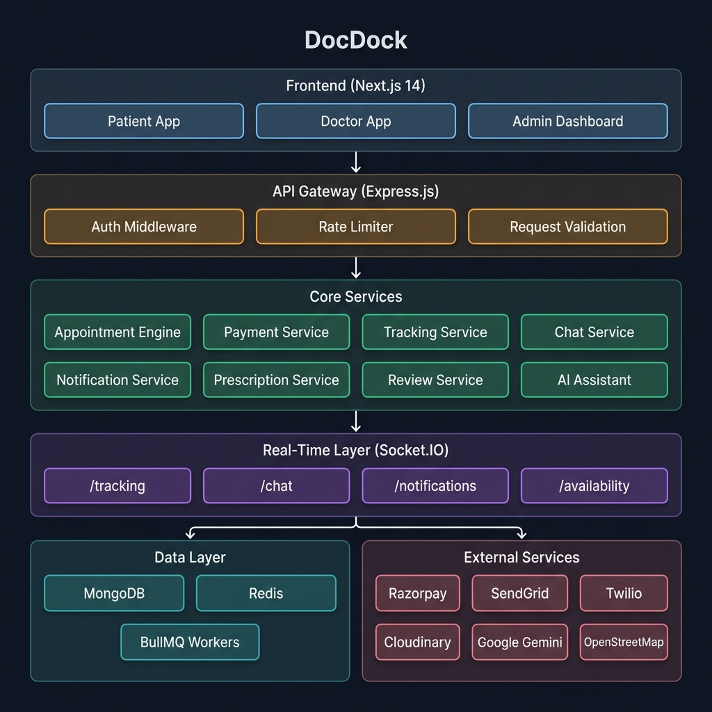
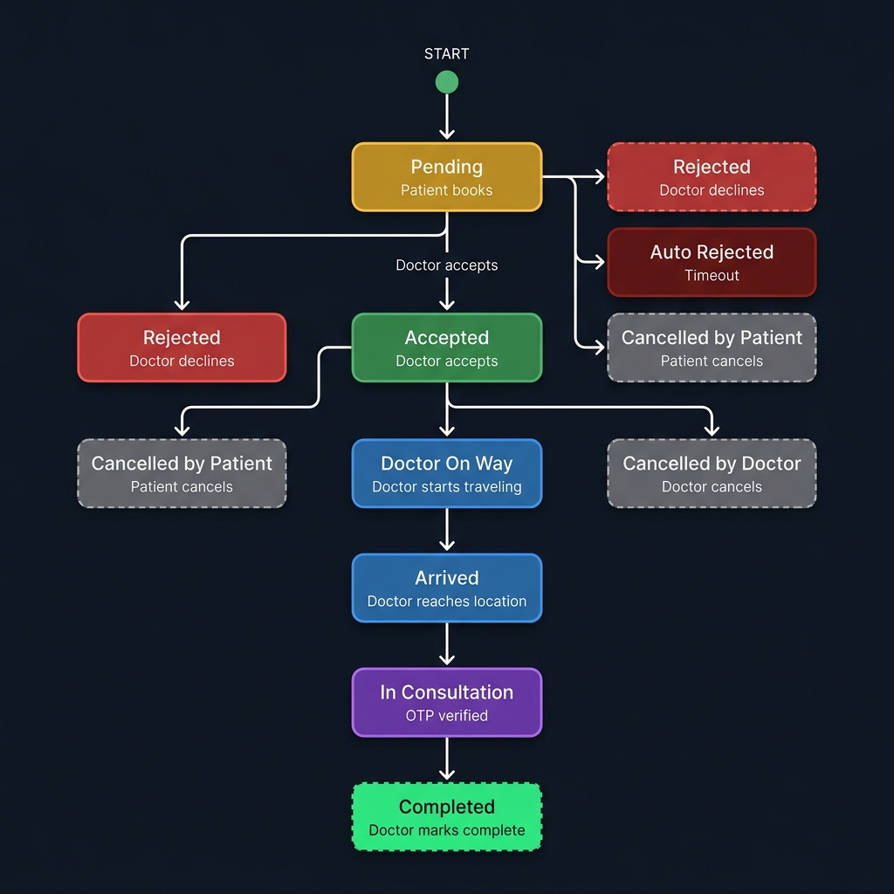
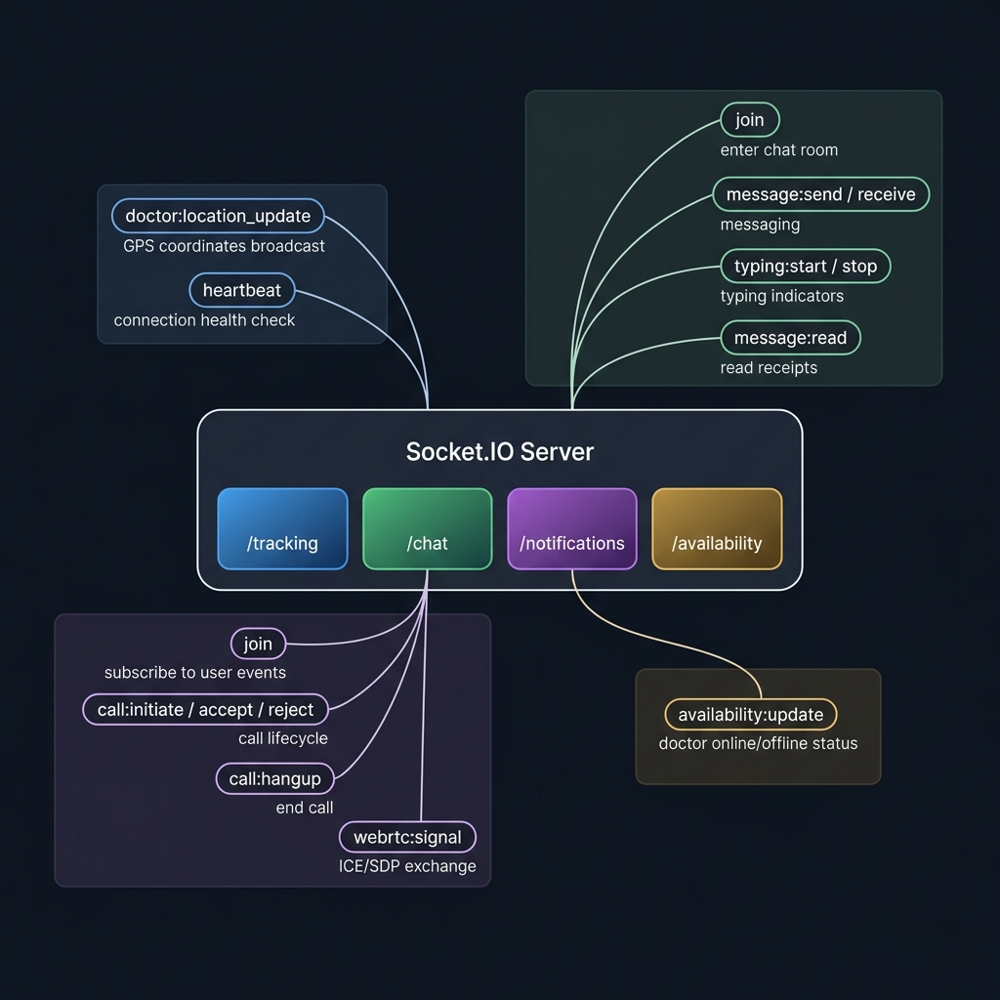

<div align="center">


# DocDock

### Knock-Knock, your doctor is here.

[](https://nodejs.org/)
[](https://www.typescriptlang.org/)
[](https://nextjs.org/)
[](https://expressjs.com/)
[](https://www.mongodb.com/)
[](https://redis.io/)
[](https://socket.io/)
[](https://razorpay.com/)
[](https://ai.google.dev/)

---

**A full-stack, real-time doctor-on-demand platform that brings verified medical professionals to your doorstep.**

[Live Demo](#) -- [API Docs](#api-documentation) -- [Getting Started](#getting-started) -- [Architecture](#system-architecture)

</div>

---

## The Problem We Solve

In India, millions of patients -- especially the elderly, parents with young children, and people with mobility challenges -- struggle to visit a clinic when they are sick. Getting dressed, traveling through traffic, and waiting in a crowded waiting room while already feeling unwell is an experience that discourages people from seeking timely medical care.

Meanwhile, thousands of qualified doctors sit idle between appointments with no efficient way to offer their services outside of a physical clinic.

**DocDock bridges this gap.** It is a doctor-on-demand platform that works like Uber -- but for healthcare. Patients open the app, find verified doctors near them on a live map, book a home visit (or clinic/online consultation), track the doctor's arrival in real-time, consult securely with OTP verification, receive a digital prescription, and pay seamlessly -- all within a single platform.

> This is not a concept or a mockup. DocDock is a fully functional, production-grade platform with 12 backend modules, real-time WebSocket infrastructure, integrated payment processing, AI-powered medical assistance, and a responsive multi-role frontend -- built entirely from scratch.

---

## What Makes This Project Significant

<table>
<tr>
<td width="50%">

### For Patients
- Search for nearby verified doctors using geo-location
- View live GPS tracking of the doctor traveling to their home
- Book home visits, clinic appointments, or online video consultations
- Secure consultations verified through SMS-based OTP
- Receive and download digital prescriptions as PDF
- Chat in real-time with their assigned doctor
- AI-powered symptom checker and medical assistant
- Transparent payments with full receipt tracking and refund support

</td>
<td width="50%">

### For Doctors
- Accept or decline appointment requests in real-time
- Manage per-day availability schedules with break times and slot durations
- Navigate to patient locations with live tracking updates
- Write and issue digital prescriptions post-consultation
- Track earnings, payouts, and appointment history
- Receive real-time notifications for every appointment event
- Vacation mode toggle for extended unavailability

</td>
</tr>
<tr>
<td colspan="2">

### For Administrators
- Verify doctor credentials (medical license, identity documents, clinic photos) before platform approval
- Monitor all appointments, payments, and disputes across the platform
- Access system audit logs and platform performance metrics
- Manage user accounts and handle escalations

</td>
</tr>
</table>

---

## System Architecture



---

## Appointment Lifecycle

Every appointment in DocDock follows a carefully designed state machine with validated transitions. Below is the complete lifecycle for a **home visit** consultation:



DocDock supports **three consultation modes**, each with its own tailored workflow:

| Mode | Flow | Key Mechanism |
| :--- | :--- | :--- |
| **Home Visit** | Pending > Accepted > Doctor On Way > Arrived > In Consultation > Completed | Live GPS tracking + OTP verification at doorstep |
| **Clinic Visit** | Pending > Accepted > Appointment Slip Generated > In Consultation > Completed | Downloadable appointment slip with QR code |
| **Online / Video** | Pending > Accepted > Waiting for Doctor > Video Consultation > Completed | WebRTC peer-to-peer video with signaling via Socket.IO |

---

## Technology Stack -- Deep Dive

### Frontend

| Technology | Version | Role in DocDock |
| :--- | :--- | :--- |
| **Next.js** | 14.2 | App Router-based SSR/CSR hybrid framework. Handles routing for patient, doctor, admin, and public pages. Server-side rendering for SEO-critical pages like the landing page and doctor discovery. |
| **React** | 18.3 | Component architecture with hooks for state management. Every dashboard, form, and interactive element is a composable React component. |
| **TailwindCSS** | 3.4 | Utility-first CSS framework powering the entire design system -- dark mode support, responsive layouts, micro-animations, and glassmorphism effects. |
| **React Query (TanStack)** | 5.x | Server-state management for all API calls. Handles caching, background refetching, optimistic updates, and request deduplication across the app. |
| **React Hook Form + Zod** | Latest | Form handling with schema-based validation. Every input form (registration, booking, prescription creation) uses Zod schemas for type-safe validation. |
| **Leaflet + React-Leaflet** | 1.9 / 4.2 | Interactive map rendering for doctor discovery, live tracking visualization, and clinic/patient location display using OpenStreetMap tiles. |
| **Socket.IO Client** | 4.8 | Real-time event consumption for live tracking updates, chat messages, typing indicators, notification delivery, and video call signaling. |
| **Lucide React** | Latest | Icon library providing consistent, lightweight SVG icons throughout the interface. |
| **jsPDF + html2canvas** | Latest | Client-side PDF generation for downloadable prescriptions and appointment slips. |

### Backend

| Technology | Version | Role in DocDock |
| :--- | :--- | :--- |
| **Express.js** | 4.21 | HTTP server framework. All 12 domain modules expose RESTful endpoints through Express routers with layered middleware for auth, validation, and error handling. |
| **TypeScript** | 5.6 | Strict type safety across the entire backend. Every service, controller, model, and middleware is fully typed with interfaces and generics. |
| **MongoDB + Mongoose** | 7.5 | Primary datastore. Mongoose ODM provides schemas with validation, indexing (including `2dsphere` geo-spatial indexes for location queries), virtuals, and middleware hooks. |
| **Redis + ioredis** | Latest | In-memory data store for session caching, rate-limit counters, real-time location data, and BullMQ job queue backing. |
| **Socket.IO** | 4.8 | WebSocket server with four dedicated namespaces: `/tracking` (doctor GPS), `/chat` (messaging), `/notifications` (push events + WebRTC signaling), `/availability` (doctor status). |
| **BullMQ** | 5.34 | Distributed job queue system. Three dedicated workers handle appointment reminders, notification dispatch, and data cleanup tasks on Redis-backed queues. |
| **Razorpay SDK** | 2.9 | Payment gateway integration. Handles order creation, payment verification via HMAC signature validation, and programmatic refund initiation. |
| **Google Gemini AI** | 0.24 | AI inference via `@google/generative-ai` SDK. Powers the AI medical assistant and symptom checker with contextual medical knowledge. |
| **Passport.js** | 0.7 | Authentication middleware supporting local JWT strategy and Google OAuth 2.0 for social login. |
| **JWT (jsonwebtoken)** | 9.x | Token-based authentication. Issues short-lived access tokens (15 min) and long-lived refresh tokens (7 days) with secure HTTP-only cookie transport. |
| **SendGrid** | 8.x | Transactional email delivery for appointment confirmations, OTP codes, password reset flows, and doctor verification status updates. |
| **Twilio** | Latest | SMS and voice call delivery for OTP verification at the point of consultation, appointment reminders, and emergency contact features. |
| **Cloudinary** | 2.5 | Cloud media management for doctor profile photos, medical license uploads, clinic images, and prescription attachments. |
| **Helmet + CORS + Rate Limiting** | Latest | Security hardening. Helmet sets HTTP headers, CORS controls origin access, and `express-rate-limit` with Redis backing prevents API abuse. |
| **Joi + Zod** | Latest | Dual validation layer. Joi validates incoming request bodies/params at the middleware level; Zod provides shared schema definitions across frontend and backend. |
| **Swagger (OpenAPI)** | Latest | Auto-generated API documentation accessible at `/api/v1/docs`. |

### Infrastructure & DevOps

| Component | Purpose |
| :--- | :--- |
| **npm Workspaces** | Monorepo management linking `apps/api`, `apps/web`, and `packages/shared` under a single dependency tree. |
| **Concurrently** | Parallel process orchestration for running API and Web dev servers simultaneously with a single command. |
| **ts-node-dev** | Backend hot-reload development server with transpilation-only mode for fast iteration. |
| **Jest + Supertest** | Testing framework for unit and integration tests across backend service modules. |
| **ESLint + Prettier** | Code quality enforcement with TypeScript-aware linting rules and consistent formatting. |

---

## Real-Time Communication Architecture

DocDock's real-time infrastructure is built on **Socket.IO** with four isolated namespaces, each handling a distinct domain of live communication:



Chat rooms are keyed as `appointmentId:patientId:doctorId`, ensuring strict isolation between conversations. Read receipts are persisted to MongoDB in real-time. The notification namespace doubles as a **WebRTC signaling channel** for video consultations, handling the complete call lifecycle from initiation through ICE candidate exchange to hangup.

---

## Project Structure

```
DocDock/
|
|-- apps/
|   |-- api/                          # Backend API Server
|   |   |-- src/
|   |   |   |-- common/               # Config, errors, middleware, utilities
|   |   |   |-- modules/
|   |   |   |   |-- admin/            # Doctor verification, platform management
|   |   |   |   |-- ai/               # Gemini AI medical assistant & symptom checker
|   |   |   |   |-- appointment/      # Booking, state machine, OTP, slot generation
|   |   |   |   |-- auth/             # JWT auth, Google OAuth, password reset
|   |   |   |   |-- chat/             # Message persistence, read receipts
|   |   |   |   |-- doctor/           # Profile, availability, geo-search
|   |   |   |   |-- notification/     # Multi-channel alert dispatch
|   |   |   |   |-- patient/          # Profile, addresses, medical history, allergies
|   |   |   |   |-- payment/          # Razorpay orders, verification, refunds
|   |   |   |   |-- prescription/     # Digital Rx creation, PDF generation
|   |   |   |   |-- review/           # Ratings and reviews
|   |   |   |   |-- tracking/         # GPS location updates, geo-queries
|   |   |   |-- services/             # Email, SMS, voice, Cloudinary
|   |   |   |-- sockets/              # Socket.IO gateway with 4 namespaces
|   |   |   |-- jobs/                 # BullMQ workers (reminder, notification, cleanup)
|   |   |   |-- swagger/              # OpenAPI specification
|   |   |   |-- server.ts             # Application entry point
|   |
|   |-- web/                          # Frontend Web Application
|       |-- app/
|       |   |-- auth/                 # Login, register, OAuth, password reset
|       |   |-- patient/              # Dashboard, appointments, AI assistant, addresses
|       |   |-- doctor/               # Dashboard, availability, earnings, prescriptions
|       |   |-- admin/                # Verification queue, system management
|       |   |-- find-doctors/         # Public doctor discovery with map
|       |   |-- doctors/[id]          # Public doctor profile pages
|       |-- components/
|       |   |-- ai/                   # AI assistant chat, symptom checker UI
|       |   |-- map/                  # Leaflet map, location picker, geocoding
|       |   |-- doctor-discovery/     # Search filters, doctor cards
|       |   |-- ChatSection.tsx       # In-appointment messaging
|       |   |-- VideoConsultation.tsx  # WebRTC video call interface
|       |   |-- CallOverlay.tsx       # Incoming/outgoing call UI
|       |   |-- NotificationBell.tsx  # Real-time notification dropdown
|       |-- lib/                      # API client, utilities, hooks
|       |-- types/                    # Shared TypeScript interfaces
|
|-- packages/
|   |-- shared/                       # Monorepo shared types and constants
|
|-- postman/                          # API test collections
|-- Documents/                        # Project documentation
```

---

## Getting Started

### Prerequisites

| Requirement | Minimum Version |
| :--- | :--- |
| Node.js | 18.x |
| npm | 9.x |
| MongoDB | 7.x (local or Atlas) |
| Redis | 7.x (local or cloud) |

### Setup

```bash
# 1. Clone the repository
git clone https://github.com/Vansh-Vaishnani/DocDock.git
cd DocDock

# 2. Copy environment variables
cp .env.example .env

# 3. Install all workspace dependencies
npm install

# 4. Start both API and Web in development mode
npm run dev
```

### Available Commands

| Command | What It Does |
| :--- | :--- |
| `npm run dev` | Starts API server (port 4000) and Next.js web app (port 3000) concurrently |
| `npm run dev:api` | Starts only the backend API with hot-reload |
| `npm run dev:web` | Starts only the Next.js frontend |
| `npm run build` | Production build for shared package, API, and web app |
| `npm run test` | Runs Jest test suites across backend modules |
| `npm run lint` | Runs ESLint across the entire codebase |
| `npm run create-admin` | Seeds an admin account into the database |

### Environment Variables

<details>
<summary>Click to expand the full environment configuration</summary>

| Variable | Required | Description |
| :--- | :---: | :--- |
| `MONGODB_URI` | Yes | MongoDB connection string |
| `REDIS_URL` | Yes | Redis connection URL |
| `JWT_ACCESS_SECRET` | Yes | Secret for signing access tokens |
| `JWT_REFRESH_SECRET` | Yes | Secret for signing refresh tokens |
| `RAZORPAY_KEY_ID` | No | Razorpay API key (payments disabled without this) |
| `RAZORPAY_KEY_SECRET` | No | Razorpay secret key |
| `SENDGRID_API_KEY` | No | SendGrid key for transactional emails |
| `TWILIO_ACCOUNT_SID` | No | Twilio SID for SMS/voice |
| `TWILIO_AUTH_TOKEN` | No | Twilio authentication token |
| `CLOUDINARY_CLOUD_NAME` | No | Cloudinary cloud name for media uploads |
| `CLOUDINARY_API_KEY` | No | Cloudinary API key |
| `CLOUDINARY_API_SECRET` | No | Cloudinary API secret |
| `GOOGLE_CLIENT_ID` | No | Google OAuth client ID |
| `GOOGLE_CLIENT_SECRET` | No | Google OAuth secret |
| `GEMINI_API_KEY` | No | Google Gemini API key for AI features |

</details>

---

## API Documentation

The API is fully documented with Swagger/OpenAPI and serves 15 route groups:

| Endpoint Prefix | Auth Required | Description |
| :--- | :---: | :--- |
| `/api/v1/auth` | No | Registration, login, OAuth, token refresh, password reset |
| `/api/v1/doctors` | No | Public doctor search, profiles, geo-location queries |
| `/api/v1/patients` | Yes | Patient profile, addresses, medical history, allergies |
| `/api/v1/appointments` | Yes | Booking, status transitions, OTP, slot availability |
| `/api/v1/payments` | Yes | Order creation, payment verification, refunds |
| `/api/v1/tracking` | Yes | GPS location updates and retrieval |
| `/api/v1/chat` | Yes | Message history, send messages, read receipts |
| `/api/v1/notifications` | Yes | Notification list, mark read, preferences |
| `/api/v1/reviews` | Partial | Submit and retrieve doctor reviews |
| `/api/v1/prescriptions` | Yes | Create, view, and manage digital prescriptions |
| `/api/v1/ai` | Partial | AI medical assistant and symptom analysis |
| `/api/v1/admin` | Yes | Doctor verification, platform management |
| `/api/v1/health` | No | Service health check (MongoDB, Redis, payments, email, OAuth) |
| `/api/v1/docs` | No | Swagger JSON specification |
| `/api/v1/maps` | No | Geocoding proxy (forward and reverse via OpenStreetMap Nominatim) |

---

## Security

| Layer | Implementation |
| :--- | :--- |
| **Authentication** | JWT access/refresh token pair with HTTP-only secure cookies |
| **Authorization** | Role-based access control (RBAC) with `requireRole` middleware across patient, doctor, and admin scopes |
| **Input Validation** | All endpoints validated with Joi/Zod schemas before reaching controllers |
| **Rate Limiting** | Redis-backed rate limiting with `express-rate-limit` and `rate-limit-redis` |
| **HTTP Security** | Helmet.js for security headers (CSP, HSTS, X-Frame-Options, etc.) |
| **OTP Verification** | SHA-256 hashed OTPs for consultation start verification |
| **Payment Security** | Razorpay webhook signature verification via HMAC-SHA256 |
| **CORS** | Configurable origin whitelist for cross-origin request control |

---

## License

This project is proprietary software. Unauthorized distribution, reproduction, or commercial use without explicit permission is strictly prohibited.

---

<div align="center">

**Built with conviction that healthcare should come to you, not the other way around.**

[](#)
[](#)
[](#)
[](#)
[](#)

</div>
